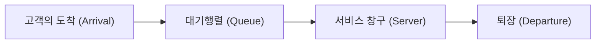

# 시작하며: 왜 옆 계산대는 항상 빠를까?

슈퍼마켓이나 편의점에서 계산을 위해 줄을 설 때, 자신이 선택한 줄보다 옆 줄이 더 빨리 줄어드는 것처럼 느낀 적이 없으신가요? 이는 단순한 심리적 착각(머피의 법칙)으로 치부되기 쉽지만, 사실 수학적인 근거가 존재합니다.

자신이 서 있지 않은 줄이 더 많기 때문에, 확률적으로 '자신이 서 있지 않은 다른 줄 중 하나가 자신의 줄보다 더 빨리 줄어들' 가능성은 매우 높습니다. 이처럼 직관과 확률·통계의 괴리를 명확히 하고, 시스템 전체의 효율을 최적화하기 위한 수학적 접근이 바로 '대기행렬 이론(Queuing Theory)'입니다. 본 기사에서는 대기행렬 이론의 역사부터 켄달의 기호, 리틀의 법칙 증명, Python을 이용한 시뮬레이션, 그리고 현대 IT 인프라로의 응용까지 철저하게 해설합니다.

## 1. 대기행렬 이론의 역사적 배경: A.K. 얼랑의 도전

대기행렬 이론은 1909년 덴마크의 수학자이자 엔지니어였던 <strong>아그너 크라루프 얼랑(Agner Krarup Erlang)</strong>에 의해 창시되었습니다. 그는 코펜하겐 전화국에서 근무하며 "전화국의 교환기는 어느 정도의 회선을 준비해야 고객을 기다리게 하지 않고 통화를 제공할 수 있을까?"라는 현실적인 문제에 직면해 있었습니다.

당시의 전화는 교환원이 수동으로 플러그를 꽂아 회선을 연결했습니다. 회선 수가 너무 적으면 '통화 중'일 확률이 높아져 고객 만족도가 떨어집니다. 반면 회선 수를 쓸데없이 많이 늘리면 비용이 방대해집니다. 얼랑은 이 트레이드오프를 해결하기 위해 포아송 분포와 지수 분포를 사용하여 전화 호(콜)의 도착과 통화 시간을 모델링하고, 얼랑 공식(Erlang B formula / Erlang C formula)을 도출해 냈습니다. 이것이 대기행렬 이론의 탄생입니다.

## 2. 대기행렬의 기본 개념

대기행렬 시스템은 다음 세 가지 주요 요소로 구성됩니다.



1. **도착 과정 (Arrival Process)**: 고객(또는 작업, 패킷 등)이 시스템에 도착하는 간격. 대부분의 경우 포아송 과정(도착 간격이 지수 분포를 따름)으로 모델링됩니다.
2. **서비스 과정 (Service Process)**: 서비스를 제공하는 데 걸리는 시간. 이 역시 지수 분포나 일반 분포를 사용하여 모델링됩니다.
3. **창구의 수 (Number of Servers)**: 고객을 처리하는 계산대나 서버의 수.

### 켄달의 기호 (Kendall's Notation)

대기행렬 모델을 분류하기 위해 1953년 데이비드 켄달이 제창한 표기법이 '켄달의 기호'입니다. 일반적으로 `A/B/C/K/N/D` 형식을 취하지만, 생략하여 `A/B/C`로 표기되는 경우가 많습니다.

- **A (Arrival)**: 도착 간격의 확률 분포 (예: M = 마르코프적/지수 분포, D = 일정, G = 일반 분포)
- **B (Service)**: 서비스 시간의 확률 분포 (예: M, D, G)
- **C (Servers)**: 창구(서버)의 수
- **K (Capacity)**: 시스템의 최대 수용 인원 (생략 시 무한대 $\infty$)
- **N (Population)**: 모집단의 크기 (생략 시 무한대 $\infty$)
- **D (Discipline)**: 서비스 규율 (예: FCFS = 선입선출, LCFS = 후입선출, 생략 시 FCFS)

가장 기본적이고 유명한 모델은 **M/M/1** 모델입니다. 이는 "도착 간격이 지수 분포(M)", "서비스 시간이 지수 분포(M)", "창구가 1개(1)"임을 의미합니다.

## 3. M/M/1 모델의 수학적 해석

M/M/1 대기행렬 시스템을 수식으로 풀어봅시다.

### 파라미터 정의

- $\lambda$ (람다): **평균 도착률**. 단위 시간당 도착하는 평균 고객 수.
- $\mu$ (뮤): **평균 서비스률**. 단위 시간당 처리할 수 있는 평균 고객 수.
- $\rho$ (로): **트래픽 밀도 (이용률)**. $\rho = \lambda / \mu$.

시스템이 안정적으로 가동되기 위해서는 반드시 **$\rho < 1$**(즉 $\lambda < \mu$)이어야 합니다. 만약 $\rho \ge 1$인 경우, 고객의 도착이 처리 능력을 초과하여 대기열은 무한히 길어지게 됩니다.

### 주요 공식

M/M/1 모델이 정상 상태에 있을 때, 다음과 같은 중요한 지표를 도출할 수 있습니다.

1. **시스템 내의 평균 고객 수 ($L$)**: 대기열에 서 있는 사람과 서비스를 받고 있는 사람의 합계.
   $$ L = \frac{\rho}{1 - \rho} = \frac{\lambda}{\mu - \lambda} $$

2. **시스템 내의 평균 체류 시간 ($W$)**: 고객이 도착해서 서비스를 마치고 퇴장할 때까지의 시간.
   $$ W = \frac{L}{\lambda} = \frac{1}{\mu - \lambda} $$

3. **대기행렬의 평균 길이 ($L_q$)**: 실제로 줄을 서서 기다리고 있는 인원의 평균.
   $$ L_q = L - \rho = \frac{\rho^2}{1 - \rho} $$

4. **평균 대기 시간 ($W_q$)**: 고객이 줄을 서서 서비스를 받기 시작할 때까지의 시간.
   $$ W_q = \frac{L_q}{\lambda} = \frac{\rho}{\mu - \lambda} $$

### 이용률의 함정: 왜 갑자기 행렬이 길어질까

공식 $L = \rho / (1 - \rho)$에 주목해 주세요.
- $\rho = 0.5$ (가동률 50%) 일 때, $L = 1$ 명.
- $\rho = 0.8$ (가동률 80%) 일 때, $L = 4$ 명.
- $\rho = 0.9$ (가동률 90%) 일 때, $L = 9$ 명.
- $\rho = 0.95$ (가동률 95%) 일 때, $L = 19$ 명.

가동률이 90%를 넘으면 약간의 도착률 증가가 행렬의 길이를 폭발적으로 증가시킵니다. 이는 서버나 시스템의 부하 테스트에서 "CPU 사용률을 항상 95%로 유지하는 것은 위험하다"는 IT 인프라의 철칙을 수학적으로 증명합니다. 여유(버퍼)를 두는 것이 안정적인 가동에 필수적인 것입니다.

## 4. 리틀의 법칙 (Little's Law)

대기행렬 이론에서 가장 강력하고 보편적인 정리 중 하나가 '리틀의 법칙'입니다. 존 리틀에 의해 1961년에 증명되었습니다.

**법칙의 서술:**
정상 상태에 있는 시스템에서, 시스템 내의 평균 고객 수 ($L$)는 도착률 ($\lambda$)과 고객의 평균 체류 시간 ($W$)의 곱과 같다.

$$ L = \lambda \times W $$

### 왜 이 법칙이 경이로운가?

리틀의 법칙의 대단함은 **시스템의 내부 구조나 확률 분포에 전혀 의존하지 않는다**는 점에 있습니다. M/M/1이든, G/G/k이든, 선입선출(FCFS)이든, 후입선출(LCFS)이든, 시스템이 정상 상태에 있기만 하면 반드시 성립합니다.

**구체적인 예: 커피숍**
어떤 카페에 1시간당 평균 60명의 손님이 방문한다고 가정합시다 ($\lambda = 60 \text{ 명/시간} = 1 \text{ 명/분}$). 손님은 평균적으로 매장 내에 20분 머뭅니다 ($W = 20 \text{ 분}$).
이때, 매장 내에 있는 평균 손님 수 $L$은:
$L = 1 \text{ 명/분} \times 20 \text{ 분} = 20 \text{ 명}$
이 되며, 항상 약 20석이 차 있다고 예측할 수 있습니다. 이처럼 블랙박스인 시스템이라도 외부에서 관측 가능한 지표로 내부 상태를 추정할 수 있는 것입니다.

## 5. Python을 이용한 대기행렬 시뮬레이션

이론뿐만 아니라 실제로 프로그램을 실행하여 확인해 봅시다. Python의 이벤트 기반 시뮬레이션 라이브러리인 `simpy`를 사용하여 M/M/1 대기행렬을 시뮬레이트합니다.

```python
import simpy
import random
import statistics

# 파라미터 설정
ARRIVAL_RATE = 2.0      # 도착률 (lambda) : 1분당 2명
SERVICE_RATE = 2.5      # 서비스률 (mu) : 1분당 2.5명 처리 가능
SIM_TIME = 10000        # 시뮬레이션 시간 (분)

wait_times = []

def customer(env, name, server):
    """고객의 행동을 정의"""
    arrival_time = env.now
    
    # 서버를 요청
    with server.request() as request:
        yield request
        
        # 대기 시간을 기록
        wait_time = env.now - arrival_time
        wait_times.append(wait_time)
        
        # 서비스를 받음 (지수 분포)
        service_time = random.expovariate(SERVICE_RATE)
        yield env.timeout(service_time)

def setup(env):
    """시스템의 셋업과 고객의 생성"""
    server = simpy.Resource(env, capacity=1) # M/M/1 의 창구는 1개
    
    i = 0
    while True:
        # 다음 고객의 도착까지의 시간 (지수 분포)
        yield env.timeout(random.expovariate(ARRIVAL_RATE))
        i += 1
        env.process(customer(env, f'Customer {i}', server))

# 시뮬레이션의 실행
print("시뮬레이션을 시작합니다...")
random.seed(42)
env = simpy.Environment()
env.process(setup(env))
env.run(until=SIM_TIME)

# 결과 계산과 이론값과의 비교
avg_wait_sim = statistics.mean(wait_times)

# 이론값 계산
rho = ARRIVAL_RATE / SERVICE_RATE
l_q = (rho ** 2) / (1 - rho)
w_q_theory = l_q / ARRIVAL_RATE

print(f"--- 결과 ---")
print(f"시뮬레이션 상의 평균 대기 시간: {avg_wait_sim:.4f} 분")
print(f"이론 상의 평균 대기 시간 (W_q)      : {w_q_theory:.4f} 분")
```

이 코드를 실행하면 시뮬레이션 결과가 이론값 $W_q$에 매우 가까운 값으로 수렴하는 것을 확인할 수 있습니다. 시스템이 복잡해져서 해석적으로 풀기 어려운 M/G/1이나 다중 서버 모델에서도, 이처럼 시뮬레이션을 사용하여 퍼포먼스를 예측할 수 있습니다.

## 6. IT 인프라로의 응용

대기행렬 이론은 현대 컴퓨터 과학이나 IT 인프라 설계에 있어 빼놓을 수 없는 개념입니다.

### 1. Web 서버의 로드 밸런싱
Web 요청(HTTP 요청)의 도착은 전형적인 대기행렬 모델입니다. 1대의 서버(M/M/1)로 처리할 수 없는 경우, 로드 밸런서를 도입하여 여러 대의 서버에 요청을 분산시킵니다. 이는 M/M/c 모델로 분석되며, 몇 대의 서버를 가동해야 평균 응답 시간을 목표치 이하로 억제할 수 있을지를 계산할 수 있습니다.

### 2. 네트워크 라우팅과 패킷 손실
인터넷의 라우터 내에는 버퍼(메모리)가 있어, 전송 대기 중인 패킷이 저장됩니다. 이는 용량이 유한한 대기행렬(M/M/1/K)로 간주할 수 있습니다. 버퍼가 꽉 찼을 때 도착한 패킷은 파기(드롭)됩니다. 대기행렬 이론을 사용하면 허용되는 패킷 손실률을 충족하기 위해 필요한 버퍼 크기를 결정할 수 있습니다.

### 3. 클라우드 컴퓨팅의 오토 스케일링
AWS나 GCP 등의 클라우드 환경에서는 트래픽에 따라 자동으로 서버를 증감시키는 오토 스케일링이 이용됩니다. 이용률 $\rho$가 일정한 임계값(예: 70%)을 넘으면 서버를 추가한다는 규칙은, 대기행렬의 '이용률이 1에 가까워지면 대기 시간이 발산한다'는 성질에 기초하고 있습니다.

## 맺음말: 일상의 짜증을 수식으로 극복하기

"왜 옆 계산대만 빨리 줄어들까?"에서 시작된 의문은 통신 네트워크, 교통 체증, 병원 대기실, 그리고 최첨단 클라우드 서버의 최적화까지, 전 세계의 모든 '대기'를 지배하는 보편적인 법칙으로 이어져 있었습니다.

우리가 일상생활에서 짜증을 느끼는 '대기 시간'도 시스템 전체의 시점에서 보면 리틀의 법칙이나 포아송 분포를 따라 질서정연하게 행동하는 수학적 현상에 불과합니다. 다음에 긴 줄에 섰을 때는 짜증내는 대신 "현재의 도착률 $\lambda$는 어느 정도일까?", "이용률 $\rho$가 한계에 가깝구나" 하고 관찰해 보는 것은 어떨까요? 조금은 대기 시간이 풍요롭게 느껴질지도 모릅니다.
