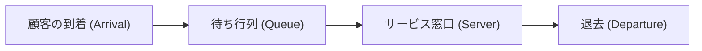

# はじめに：なぜ隣のレジはいつも速いのか？

スーパーマーケットやコンビニエンスストアでレジに並ぶとき、自分が選んだ列よりも隣の列の方が速く進んでいるように感じたことはありませんか？これは単なる心理的な錯覚（マーフィーの法則）と片付けられがちですが、実は数学的な裏付けが存在します。

自分が並んでいない列の方が多く存在するため、確率的に「自分以外のどれかの列が自分の列よりも速く進む」可能性は非常に高くなります。このように、直感と確率・統計のズレを明確にし、システム全体の効率を最適化するための数学的アプローチが「待ち行列理論（Queuing Theory）」です。本記事では、待ち行列理論の歴史から、ケンドールの記号、リトルの法則の証明、Pythonによるシミュレーション、そして現代のITインフラへの応用までを徹底的に解説します。

## 1. 待ち行列理論の歴史的背景：A.K.アーランの挑戦

待ち行列理論は、1909年にデンマークの数学者でありエンジニアでもあった **アグナー・クラルプ・アーラン (Agner Krarup Erlang)** によって創始されました。彼はコペンハーゲン電話会社に勤務しており、「電話局の交換機はどのくらいの回線を用意すれば、顧客を待たせずに通話を提供できるか？」という現実的な問題に直面していました。

当時の電話は、オペレーターが手動でプラグを差し込んで回線を接続していました。回線数が少なすぎると「話し中」の確率が高くなり顧客満足度が低下します。一方で回線数を無駄に多くするとコストが膨大になります。アーランはこのトレードオフを解決するため、ポアソン分布と指数分布を用いて電話の呼（コール）の到着と通話時間をモデル化し、アーラン式（Erlang B formula / Erlang C formula）を導き出しました。これが待ち行列理論の誕生です。

## 2. 待ち行列の基本概念

待ち行列システムは、以下の3つの主要な要素で構成されます。



1. **到着過程 (Arrival Process)**: 顧客（またはタスク、パケットなど）がシステムにやってくる間隔。多くの場合、ポアソン過程（到着間隔が指数分布に従う）としてモデル化されます。
2. **サービス過程 (Service Process)**: サービスを提供するのにかかる時間。これも指数分布や一般分布を用いてモデル化されます。
3. **窓口の数 (Number of Servers)**: 顧客を処理するレジやサーバーの数。

### ケンドールの記号 (Kendall's Notation)

待ち行列のモデルを分類するために、1953年にデビッド・ケンドールが提唱した記法が「ケンドールの記号」です。一般に `A/B/C/K/N/D` の形式を取りますが、省略して `A/B/C` と表記されることが多いです。

- **A (Arrival)**: 到着間隔の確率分布（例：M = マルコフ的/指数分布、D = 一定、G = 一般分布）
- **B (Service)**: サービス時間の確率分布（例：M, D, G）
- **C (Servers)**: 窓口（サーバー）の数
- **K (Capacity)**: システムの最大収容人数（省略時は無限大 $\infty$）
- **N (Population)**: 母集団のサイズ（省略時は無限大 $\infty$）
- **D (Discipline)**: サービス規律（例：FCFS = 先着順、LCFS = 後着順、省略時はFCFS）

最も基本的で有名なモデルは **M/M/1** モデルです。これは「到着間隔が指数分布 (M)」「サービス時間が指数分布 (M)」「窓口が1つ (1)」であることを意味します。

## 3. M/M/1 モデルの数学的解析

M/M/1 待ち行列システムを数式で紐解いてみましょう。

### パラメータの定義

- $\lambda$ (ラムダ): **平均到着率**。単位時間あたりに到着する平均顧客数。
- $\mu$ (ミュー): **平均サービス率**。単位時間あたりに処理できる平均顧客数。
- $\rho$ (ロー): **トラフィック密度 (利用率)**。$\rho = \lambda / \mu$。

システムが安定して稼働するためには、必ず **$\rho < 1$**（すなわち $\lambda < \mu$）でなければなりません。もし $\rho \ge 1$ の場合、顧客の到着が処理能力を上回り、行列は無限に長くなってしまいます。

### 主要な公式

M/M/1 モデルが定常状態にあるとき、以下の重要な指標を導出できます。

1. **システム内の平均顧客数 ($L$)**: 待ち行列に並んでいる人と、サービスを受けている人の合計。
   $$ L = \frac{\rho}{1 - \rho} = \frac{\lambda}{\mu - \lambda} $$

2. **システム内の平均滞在時間 ($W$)**: 顧客が到着してからサービスを終えて退去するまでの時間。
   $$ W = \frac{L}{\lambda} = \frac{1}{\mu - \lambda} $$

3. **待ち行列の平均長さ ($L_q$)**: 実際に並んで待っている人数の平均。
   $$ L_q = L - \rho = \frac{\rho^2}{1 - \rho} $$

4. **平均待ち時間 ($W_q$)**: 顧客が列に並んでからサービスを受け始めるまでの時間。
   $$ W_q = \frac{L_q}{\lambda} = \frac{\rho}{\mu - \lambda} $$

### 利用率の罠：なぜ急に行列が伸びるのか

公式 $L = \rho / (1 - \rho)$ に注目してください。
- $\rho = 0.5$ (稼働率50%) のとき、 $L = 1$ 人。
- $\rho = 0.8$ (稼働率80%) のとき、 $L = 4$ 人。
- $\rho = 0.9$ (稼働率90%) のとき、 $L = 9$ 人。
- $\rho = 0.95$ (稼働率95%) のとき、$L = 19$ 人。

稼働率が90%を超えると、わずかな到着率の増加が行列の長さを爆発的に増加させます。これは、サーバーやシステムの負荷テストにおいて「CPU使用率を常に95%に保つのは危険である」というITインフラの鉄則を数学的に証明しています。余裕（バッファ）を持たせることが、安定稼働において不可欠なのです。

## 4. リトルの法則 (Little's Law)

待ち行列理論における最も強力で普遍的な定理の一つが「リトルの法則」です。ジョン・リトルによって1961年に証明されました。

**法則のステートメント:**
定常状態にあるシステムにおいて、システム内の平均顧客数 ($L$) は、到着率 ($\lambda$) と顧客の平均滞在時間 ($W$) の積に等しい。

$$ L = \lambda \times W $$

### なぜこの法則が驚異的なのか？

リトルの法則の凄さは、**システムの内部構造や確率分布に一切依存しない**という点にあります。M/M/1であろうが、G/G/kであろうが、先着順(FCFS)であろうが、後着順(LCFS)であろうが、システムが定常状態にさえあれば必ず成立します。

**具体例：コーヒーショップ**
あるカフェに1時間あたり平均60人の客が来店するとします（$\lambda = 60 \text{ 人/時間} = 1 \text{ 人/分}$）。客は平均して店内に20分滞在します（$W = 20 \text{ 分}$）。
このとき、店内にいる平均客数 $L$ は：
$L = 1 \text{ 人/分} \times 20 \text{ 分} = 20 \text{ 人}$
となり、常に約20席が埋まっていると予測できます。このように、ブラックボックスのシステムでも外部から観測可能な指標で内部状態を推定できるのです。

## 5. Pythonによる待ち行列シミュレーション

理論だけでなく、実際にプログラムを動かして確認してみましょう。Pythonのイベント駆動型シミュレーションライブラリである `simpy` を用いて、M/M/1 待ち行列をシミュレートします。

```python
import simpy
import random
import statistics

# パラメータ設定
ARRIVAL_RATE = 2.0      # 到着率 (lambda) : 1分あたり2人
SERVICE_RATE = 2.5      # サービス率 (mu) : 1分あたり2.5人処理可能
SIM_TIME = 10000        # シミュレーション時間 (分)

wait_times = []

def customer(env, name, server):
    """顧客の振る舞いを定義"""
    arrival_time = env.now
    
    # サーバーをリクエスト
    with server.request() as request:
        yield request
        
        # 待ち時間を記録
        wait_time = env.now - arrival_time
        wait_times.append(wait_time)
        
        # サービスを受ける（指数分布）
        service_time = random.expovariate(SERVICE_RATE)
        yield env.timeout(service_time)

def setup(env):
    """システムのセットアップと顧客の生成"""
    server = simpy.Resource(env, capacity=1) # M/M/1 の窓口は1つ
    
    i = 0
    while True:
        # 次の顧客の到着までの時間（指数分布）
        yield env.timeout(random.expovariate(ARRIVAL_RATE))
        i += 1
        env.process(customer(env, f'Customer {i}', server))

# シミュレーションの実行
print("シミュレーションを開始します...")
random.seed(42)
env = simpy.Environment()
env.process(setup(env))
env.run(until=SIM_TIME)

# 結果の計算と理論値との比較
avg_wait_sim = statistics.mean(wait_times)

# 理論値の計算
rho = ARRIVAL_RATE / SERVICE_RATE
l_q = (rho ** 2) / (1 - rho)
w_q_theory = l_q / ARRIVAL_RATE

print(f"--- 結果 ---")
print(f"シミュレーション上の平均待ち時間: {avg_wait_sim:.4f} 分")
print(f"理論上の平均待ち時間 (W_q)      : {w_q_theory:.4f} 分")
```

このコードを実行すると、シミュレーション結果が理論値 $W_q$ に非常に近い値に収束することが確認できます。システムが複雑になり、解析的に解くのが難しいM/G/1や複数サーバーのモデルでも、このようにシミュレーションを用いることでパフォーマンスを予測できます。

## 6. ITインフラストラクチャへの応用

待ち行列理論は、現代のコンピュータサイエンスやITインフラの設計において欠かせない概念です。

### 1. Webサーバーのロードバランシング
Webリクエスト（HTTPリクエスト）の到着は、典型的な待ち行列モデルです。1台のサーバー（M/M/1）で処理しきれない場合、ロードバランサを導入して複数台のサーバーにリクエストを分散させます。これは M/M/c モデルとして分析され、何台のサーバーを稼働させれば平均応答時間を目標値以下に抑えられるかを計算できます。

### 2. ネットワークルーティングとパケットロス
インターネットのルーター内にはバッファ（メモリ）があり、送信待ちのパケットが格納されます。これは容量有限の待ち行列（M/M/1/K）と見なせます。バッファが一杯の時に到着したパケットは破棄（ドロップ）されます。待ち行列理論を用いることで、許容されるパケットロス率を満たすために必要なバッファサイズを決定できます。

### 3. クラウドコンピューティングのオートスケーリング
AWSやGCPなどのクラウド環境では、トラフィックに応じて自動的にサーバーを増減させるオートスケーリングが利用されます。利用率 $\rho$ が一定の閾値（例: 70%）を超えたらサーバーを追加するというルールは、待ち行列の「利用率が1に近づくと待ち時間が発散する」という性質に基づいています。

## 結び：日常のイライラを数式で乗り越える

「なぜ隣のレジばかり速く見えるのか？」から始まった疑問は、通信ネットワーク、交通渋滞、病院の待合室、そして最先端のクラウドサーバーの最適化まで、世界中のあらゆる「待ち」を支配する普遍的な法則へと繋がっていました。

私たちが日常生活でイライラする「待ち時間」も、システム全体の視点から見れば、リトルの法則やポアソン分布に従って整然と振る舞う数学的現象にすぎません。次に長蛇の列に並んだときは、イライラする代わりに「現在の到着率 $\lambda$ はどのくらいだろうか？」「利用率 $\rho$ が限界に近いな」と観察してみてはいかがでしょうか。少しだけ、待ち時間が豊かに感じられるかもしれません。
