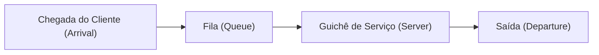

# Introdução: Por que a fila do lado é sempre mais rápida?

Quando você está na fila de um supermercado ou loja de conveniência, já sentiu que a fila ao lado da que você escolheu está andando mais rápido? Isso costuma ser descartado como uma mera ilusão psicológica (Lei de Murphy), mas na verdade existe uma base matemática para isso.

Como existem mais filas nas quais você não está, é muito provável probabilisticamente que "alguma fila além da sua avance mais rápido do que a sua fila". Dessa forma, a abordagem matemática para esclarecer a lacuna entre a intuição e a probabilidade/estatística, e otimizar a eficiência de todo o sistema é a "Teoria das Filas" (Queuing Theory). Neste artigo, explicaremos de forma abrangente desde a história da Teoria das Filas, a Notação de Kendall, a prova da Lei de Little, a simulação em Python e sua aplicação na infraestrutura de TI moderna.

## 1. Contexto Histórico da Teoria das Filas: O Desafio de A.K. Erlang

A Teoria das Filas foi fundada em 1909 por **Agner Krarup Erlang**, um matemático e engenheiro dinamarquês. Ele trabalhava na Companhia Telefônica de Copenhague e enfrentava um problema prático: "quantas linhas as centrais telefônicas devem ter preparadas para poder oferecer chamadas sem fazer os clientes esperarem?".

Os telefones da época eram conectados por operadores inserindo manualmente os plugues para conectar as linhas. Se o número de linhas fosse muito baixo, a probabilidade de "ocupado" aumentava e a satisfação do cliente caía. Por outro lado, desperdiçar dinheiro e aumentar excessivamente o número de linhas resultaria em custos enormes. Para resolver essa troca (trade-off), Erlang modelou a chegada de chamadas (calls) de telefone e a duração da chamada usando a distribuição de Poisson e a distribuição exponencial, e derivou as fórmulas de Erlang (fórmula Erlang B / fórmula Erlang C). Este foi o nascimento da Teoria das Filas.

## 2. Conceitos Básicos de Filas

Um sistema de filas consiste em três componentes principais:



1. **Processo de Chegada (Arrival Process)**: O intervalo no qual os clientes (ou tarefas, pacotes, etc.) chegam ao sistema. Frequentemente modelado como um processo de Poisson (intervalos de chegada seguem uma distribuição exponencial).
2. **Processo de Serviço (Service Process)**: O tempo necessário para fornecer o serviço. Isso também é modelado usando uma distribuição exponencial ou distribuição geral.
3. **Número de Servidores (Number of Servers)**: O número de caixas registradoras ou servidores que processam clientes.

### Notação de Kendall (Kendall's Notation)

Para classificar modelos de filas, a notação proposta por David Kendall em 1953 é a "Notação de Kendall". Geralmente assume a forma `A/B/C/K/N/D`, mas muitas vezes é abreviada para `A/B/C`.

- **A (Arrival)**: Distribuição de probabilidade dos intervalos de chegada (ex: M = Markoviano/distribuição exponencial, D = determinístico, G = distribuição geral)
- **B (Service)**: Distribuição de probabilidade do tempo de serviço (ex: M, D, G)
- **C (Servers)**: Número de guichês (servidores)
- **K (Capacity)**: Capacidade máxima do sistema (quando omitido, infinito $\infty$)
- **N (Population)**: Tamanho da população (quando omitido, infinito $\infty$)
- **D (Discipline)**: Disciplina de serviço (ex: FCFS = primeiro a chegar, primeiro a ser servido, LCFS = último a chegar, primeiro a ser servido, quando omitido, FCFS)

O modelo mais básico e famoso é o modelo **M/M/1**. Isso significa "o intervalo de chegada é uma distribuição exponencial (M)", "o tempo de serviço é uma distribuição exponencial (M)" e "há 1 guichê (1)".

## 3. Análise Matemática do Modelo M/M/1

Vamos desvendar o sistema de filas M/M/1 matematicamente.

### Definição de Parâmetros

- $\lambda$ (Lambda): **Taxa média de chegada**. O número médio de clientes que chegam por unidade de tempo.
- $\mu$ (Mu): **Taxa média de serviço**. O número médio de clientes que podem ser processados por unidade de tempo.
- $\rho$ (Rho): **Densidade de tráfego (taxa de utilização)**. $\rho = \lambda / \mu$.

Para que o sistema opere de forma estável, ele deve ser **$\rho < 1$** (ou seja, $\lambda < \mu$). Se $\rho \ge 1$, a chegada de clientes excede a capacidade de processamento, e a fila se tornará infinitamente longa.

### Fórmulas Principais

Quando o modelo M/M/1 está em estado estacionário, as seguintes métricas importantes podem ser derivadas.

1. **Número médio de clientes no sistema ($L$)**: A soma do número de pessoas esperando na fila e aquelas que estão sendo atendidas.
   $$ L = \frac{\rho}{1 - \rho} = \frac{\lambda}{\mu - \lambda} $$

2. **Tempo médio gasto no sistema ($W$)**: O tempo desde o momento em que o cliente chega até terminar de ser atendido e sair.
   $$ W = \frac{L}{\lambda} = \frac{1}{\mu - \lambda} $$

3. **Comprimento médio da fila ($L_q$)**: A média do número de pessoas realmente esperando na fila.
   $$ L_q = L - \rho = \frac{\rho^2}{1 - \rho} $$

4. **Tempo médio de espera ($W_q$)**: O tempo desde quando um cliente entra na fila até começar a ser atendido.
   $$ W_q = \frac{L_q}{\lambda} = \frac{\rho}{\mu - \lambda} $$

### A Armadilha da Taxa de Utilização: Por que a fila cresce de repente

Observe a fórmula $L = \rho / (1 - \rho)$.
- Quando $\rho = 0.5$ (50% de utilização), $L = 1$ pessoa.
- Quando $\rho = 0.8$ (80% de utilização), $L = 4$ pessoas.
- Quando $\rho = 0.9$ (90% de utilização), $L = 9$ pessoas.
- Quando $\rho = 0.95$ (95% de utilização), $L = 19$ pessoas.

Quando a taxa de utilização excede 90%, um ligeiro aumento na taxa de chegada faz com que o comprimento da fila aumente explosivamente. Isso prova matematicamente a regra de ferro da infraestrutura de TI em testes de carga de servidores e sistemas: "é perigoso manter a utilização da CPU constantemente em 95%". Ter uma folga (buffer) é essencial para uma operação estável.

## 4. Lei de Little (Little's Law)

Um dos teoremas mais poderosos e universais na teoria das filas é a "Lei de Little". Foi provada por John Little em 1961.

**Declaração da Lei:**
Em um sistema em estado estacionário, o número médio de clientes no sistema ($L$) é igual ao produto da taxa de chegada ($\lambda$) pelo tempo médio gasto pelo cliente ($W$).

$$ L = \lambda \times W $$

### Por que esta lei é incrível?

A grandeza da Lei de Little é que ela **não depende de forma alguma da estrutura interna ou da distribuição de probabilidade do sistema**. Seja M/M/1, G/G/k, FCFS ou LCFS, contanto que o sistema esteja em estado estacionário, a lei sempre se aplica.

**Exemplo Específico: Cafeteria**
Suponha que uma média de 60 clientes venham a um café por hora ($\lambda = 60 \text{ pessoas/hora} = 1 \text{ pessoa/minuto}$). Os clientes passam em média 20 minutos na loja ($W = 20 \text{ minutos}$).
Neste caso, o número médio de clientes na loja $L$ é:
$L = 1 \text{ pessoa/minuto} \times 20 \text{ minutos} = 20 \text{ pessoas}$
Assim, podemos prever que sempre haverá cerca de 20 assentos ocupados. Desta forma, mesmo em um sistema caixa-preta, o estado interno pode ser estimado com métricas observáveis do exterior.

## 5. Simulação de Filas com Python

Além da teoria, vamos realmente rodar um programa para verificar. Usaremos a biblioteca de simulação orientada a eventos em Python, `simpy`, para simular uma fila M/M/1.

```python
import simpy
import random
import statistics

# Configurações de parâmetros
ARRIVAL_RATE = 2.0      # Taxa de chegada (lambda): 2 pessoas por minuto
SERVICE_RATE = 2.5      # Taxa de serviço (mu): pode processar 2,5 pessoas por minuto
SIM_TIME = 10000        # Tempo de simulação (minutos)

wait_times = []

def customer(env, name, server):
    """Define o comportamento do cliente"""
    arrival_time = env.now
    
    # Solicita um servidor
    with server.request() as request:
        yield request
        
        # Registra o tempo de espera
        wait_time = env.now - arrival_time
        wait_times.append(wait_time)
        
        # Recebe serviço (distribuição exponencial)
        service_time = random.expovariate(SERVICE_RATE)
        yield env.timeout(service_time)

def setup(env):
    """Configura o sistema e gera clientes"""
    server = simpy.Resource(env, capacity=1) # M/M/1 tem 1 guichê
    
    i = 0
    while True:
        # Tempo até a chegada do próximo cliente (distribuição exponencial)
        yield env.timeout(random.expovariate(ARRIVAL_RATE))
        i += 1
        env.process(customer(env, f'Customer {i}', server))

# Executa a simulação
print("Iniciando simulação...")
random.seed(42)
env = simpy.Environment()
env.process(setup(env))
env.run(until=SIM_TIME)

# Cálculo dos resultados e comparação com valores teóricos
avg_wait_sim = statistics.mean(wait_times)

# Cálculo do valor teórico
rho = ARRIVAL_RATE / SERVICE_RATE
l_q = (rho ** 2) / (1 - rho)
w_q_theory = l_q / ARRIVAL_RATE

print(f"--- Resultados ---")
print(f"Tempo médio de espera na simulação: {avg_wait_sim:.4f} min")
print(f"Tempo médio de espera teórico (W_q) : {w_q_theory:.4f} min")
```

Quando você executa este código, pode confirmar que o resultado da simulação converge para um valor muito próximo do valor teórico $W_q$. Mesmo em sistemas complexos que são difíceis de resolver analiticamente, como M/G/1 ou modelos com vários servidores, você pode prever o desempenho usando simulações como esta.

## 6. Aplicação em Infraestrutura de TI

A Teoria das Filas é um conceito indispensável no design moderno de ciência da computação e infraestrutura de TI.

### 1. Balanceamento de Carga em Servidores Web
A chegada de requisições web (requisições HTTP) é um modelo típico de fila. Se não puder ser processado por um único servidor (M/M/1), um balanceador de carga é introduzido para distribuir requisições por múltiplos servidores. Isso é analisado como um modelo M/M/c, e é possível calcular quantos servidores precisam ser operados para manter o tempo médio de resposta abaixo do valor desejado.

### 2. Roteamento de Rede e Perda de Pacotes
Dentro dos roteadores de internet, há um buffer (memória) onde os pacotes esperando para serem enviados são armazenados. Isso pode ser visto como uma fila de capacidade finita (M/M/1/K). Pacotes que chegam quando o buffer está cheio são descartados (dropped). Usando a teoria das filas, você pode determinar o tamanho de buffer necessário para atender à taxa de perda de pacotes permitida.

### 3. Escalonamento Automático na Computação em Nuvem
Em ambientes em nuvem como AWS e GCP, o escalonamento automático (auto-scaling) é usado para aumentar ou diminuir automaticamente os servidores de acordo com o tráfego. A regra de adicionar um servidor quando a taxa de utilização $\rho$ excede um certo limite (ex: 70%) é baseada na propriedade de filas de que "o tempo de espera diverge conforme a utilização se aproxima de 1".

## Conclusão: Superando a Frustração Diária com Matemática

A questão que começou com "Por que a fila do lado sempre parece mais rápida?" levou a uma lei universal que governa todo tipo de "espera" no mundo inteiro, desde redes de comunicação, congestionamentos de trânsito, salas de espera de hospitais, até a otimização de servidores em nuvem de ponta.

O "tempo de espera" que nos frustra na vida diária nada mais é do que um fenômeno matemático que se comporta de forma ordenada segundo a Lei de Little e a distribuição de Poisson quando visto da perspectiva do sistema como um todo. Da próxima vez que você se alinhar em uma longa fila, em vez de ficar frustrado, que tal observar e se perguntar: "Qual será a taxa atual de chegada $\lambda$?" ou "A taxa de utilização $\rho$ deve estar perto do limite". Assim, talvez o tempo de espera pareça um pouco mais enriquecedor.
