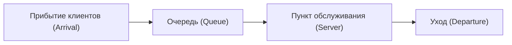

# Введение: почему соседняя очередь всегда быстрее?

Когда вы стоите в очереди в супермаркете или круглосуточном магазине, не казалось ли вам, что соседняя очередь движется быстрее вашей? Это часто списывают на простую психологическую иллюзию (закон Мерфи), но на самом деле этому есть математическое обоснование.

Поскольку очередей, в которых вы не стоите, больше, вероятность того, что «какая-либо другая очередь движется быстрее вашей», статистически очень высока. Этот математический подход, который проясняет разрыв между интуицией и вероятностно-статистическими данными, а также оптимизирует эффективность системы в целом, называется «Теорией массового обслуживания (Queuing Theory)». В этой статье мы подробно разберем историю теории очередей, нотацию Кендалла, доказательство формулы Литтла, симуляцию на Python и применение в современной ИТ-инфраструктуре.

## 1. Историческая справка: вызов А.К. Эрланга

Теория массового обслуживания была основана в 1909 году датским математиком и инженером **Агнером Крарупом Эрлангом (Agner Krarup Erlang)**. Он работал в Копенгагенской телефонной компании и столкнулся с практической проблемой: «Сколько линий должно быть на телефонном коммутаторе, чтобы обслуживать клиентов без ожидания?»

Телефоны того времени соединялись вручную оператором, который вставлял штекеры. Если линий слишком мало, возрастает вероятность сигнала «занято», и удовлетворенность клиентов падает. С другой стороны, если линий слишком много, затраты становятся огромными. Чтобы решить этот компромисс, Эрланг использовал распределение Пуассона и экспоненциальное распределение для моделирования поступления телефонных вызовов и продолжительности разговора, выведя формулы Эрланга (Erlang B / Erlang C). Это стало рождением теории массового обслуживания.

## 2. Основные концепции очередей

Система массового обслуживания состоит из трех основных элементов:



1. **Процесс прибытия (Arrival Process)**: Интервал, с которым клиенты (или задачи, пакеты и т.д.) прибывают в систему. Чаще всего моделируется как пуассоновский процесс (интервалы прибытия подчиняются экспоненциальному распределению).
2. **Процесс обслуживания (Service Process)**: Время, необходимое для предоставления услуги. Оно также моделируется с использованием экспоненциального или общего распределения.
3. **Количество пунктов обслуживания (Number of Servers)**: Количество касс или серверов, обрабатывающих клиентов.

### Нотация Кендалла (Kendall's Notation)

Для классификации моделей очередей в 1953 году Дэвид Кендалл предложил систему обозначений, известную как «нотация Кендалла». Обычно она имеет формат `A/B/C/K/N/D`, но часто сокращается до `A/B/C`.

- **A (Arrival)**: Распределение вероятностей времени между прибытиями (например, M = марковское/экспоненциальное, D = детерминированное, G = общее)
- **B (Service)**: Распределение вероятностей времени обслуживания (например, M, D, G)
- **C (Servers)**: Количество пунктов обслуживания (серверов)
- **K (Capacity)**: Максимальная вместимость системы (по умолчанию бесконечность $\infty$)
- **N (Population)**: Размер популяции (по умолчанию бесконечность $\infty$)
- **D (Discipline)**: Дисциплина обслуживания (например, FCFS = первым пришел - первым обслужен, LCFS = последним пришел - первым обслужен, по умолчанию FCFS)

Самая базовая и известная модель — это модель **M/M/1**. Это означает «интервал прибытия имеет экспоненциальное распределение (M)», «время обслуживания имеет экспоненциальное распределение (M)» и «один пункт обслуживания (1)».

## 3. Математический анализ модели M/M/1

Давайте разберем систему массового обслуживания M/M/1 с помощью формул.

### Определение параметров

- $\lambda$ (лямбда): **Средняя интенсивность поступления**. Среднее количество клиентов, прибывающих в единицу времени.
- $\mu$ (мю): **Средняя интенсивность обслуживания**. Среднее количество клиентов, которое может быть обслужено в единицу времени.
- $\rho$ (ро): **Интенсивность нагрузки (коэффициент использования)**. $\rho = \lambda / \mu$.

Для стабильной работы системы обязательно должно выполняться условие **$\rho < 1$** (т.е. $\lambda < \mu$). Если $\rho \ge 1$, поток прибывающих клиентов превышает пропускную способность, и очередь становится бесконечной.

### Основные формулы

Когда модель M/M/1 находится в стационарном состоянии, можно вывести следующие важные показатели:

1. **Среднее количество клиентов в системе ($L$)**: Сумма людей, стоящих в очереди и тех, кто обслуживается.
   $$ L = \frac{\rho}{1 - \rho} = \frac{\lambda}{\mu - \lambda} $$

2. **Среднее время пребывания в системе ($W$)**: Время с момента прибытия клиента до завершения обслуживания и ухода.
   $$ W = \frac{L}{\lambda} = \frac{1}{\mu - \lambda} $$

3. **Средняя длина очереди ($L_q$)**: Среднее количество людей, фактически стоящих в очереди.
   $$ L_q = L - \rho = \frac{\rho^2}{1 - \rho} $$

4. **Среднее время ожидания ($W_q$)**: Время с момента, когда клиент встал в очередь, до начала обслуживания.
   $$ W_q = \frac{L_q}{\lambda} = \frac{\rho}{\mu - \lambda} $$

### Ловушка коэффициента использования: почему очередь внезапно растет

Обратите внимание на формулу $L = \rho / (1 - \rho)$.
- При $\rho = 0.5$ (загрузка 50%), $L = 1$ человек.
- При $\rho = 0.8$ (загрузка 80%), $L = 4$ человека.
- При $\rho = 0.9$ (загрузка 90%), $L = 9$ человек.
- При $\rho = 0.95$ (загрузка 95%), $L = 19$ человек.

Когда коэффициент загрузки превышает 90%, малейшее увеличение интенсивности поступления приводит к взрывному росту длины очереди. Это математически доказывает железное правило ИТ-инфраструктуры в нагрузочном тестировании серверов или систем: «постоянно поддерживать загрузку CPU на уровне 95% — опасно». Для стабильной работы необходим запас (буфер).

## 4. Закон Литтла (Little's Law)

Одной из самых мощных и универсальных теорем в теории очередей является «Закон Литтла». Он был доказан Джоном Литтлом в 1961 году.

**Формулировка закона:**
В системе, находящейся в стационарном состоянии, среднее количество клиентов в системе ($L$) равно произведению интенсивности поступления ($\lambda$) и среднего времени пребывания клиента в системе ($W$).

$$ L = \lambda \times W $$

### Почему этот закон удивителен?

Сила закона Литтла заключается в том, что он **абсолютно не зависит от внутренней структуры системы или распределения вероятностей**. Будь то M/M/1, G/G/k, FCFS или LCFS — если система находится в стационарном состоянии, он всегда выполняется.

**Конкретный пример: Кофейня**
Предположим, что в кафе приходит в среднем 60 посетителей в час ($\lambda = 60 \text{ чел/час} = 1 \text{ чел/мин}$). Посетитель проводит в заведении в среднем 20 минут ($W = 20 \text{ мин}$).
Тогда среднее количество посетителей в заведении $L$ составит:
$L = 1 \text{ чел/мин} \times 20 \text{ мин} = 20 \text{ чел}$
Таким образом, можно прогнозировать, что всегда будет занято около 20 мест. Так, даже для системы типа "черный ящик", ее внутреннее состояние можно оценить с помощью внешне наблюдаемых показателей.

## 5. Симуляция очереди на Python

Давайте проверим теорию не только на бумаге, но и запустив программу. Мы будем моделировать очередь M/M/1, используя библиотеку `simpy` для событийно-управляемой симуляции на Python.

```python
import simpy
import random
import statistics

# Настройка параметров
ARRIVAL_RATE = 2.0      # Интенсивность поступления (lambda): 2 человека в минуту
SERVICE_RATE = 2.5      # Интенсивность обслуживания (mu): можно обслужить 2.5 человека в минуту
SIM_TIME = 10000        # Время симуляции (минуты)

wait_times = []

def customer(env, name, server):
    """Определение поведения клиента"""
    arrival_time = env.now
    
    # Запрос сервера
    with server.request() as request:
        yield request
        
        # Запись времени ожидания
        wait_time = env.now - arrival_time
        wait_times.append(wait_time)
        
        # Получение услуги (экспоненциальное распределение)
        service_time = random.expovariate(SERVICE_RATE)
        yield env.timeout(service_time)

def setup(env):
    """Настройка системы и генерация клиентов"""
    server = simpy.Resource(env, capacity=1) # Один пункт обслуживания для M/M/1
    
    i = 0
    while True:
        # Время до прибытия следующего клиента (экспоненциальное распределение)
        yield env.timeout(random.expovariate(ARRIVAL_RATE))
        i += 1
        env.process(customer(env, f'Customer {i}', server))

# Запуск симуляции
print("Начинаем симуляцию...")
random.seed(42)
env = simpy.Environment()
env.process(setup(env))
env.run(until=SIM_TIME)

# Расчет результатов и сравнение с теоретическим значением
avg_wait_sim = statistics.mean(wait_times)

# Расчет теоретического значения
rho = ARRIVAL_RATE / SERVICE_RATE
l_q = (rho ** 2) / (1 - rho)
w_q_theory = l_q / ARRIVAL_RATE

print(f"--- Результаты ---")
print(f"Среднее время ожидания в симуляции: {avg_wait_sim:.4f} мин")
print(f"Теоретическое среднее время ожидания (W_q): {w_q_theory:.4f} мин")
```

При запуске этого кода вы увидите, что результаты симуляции сходятся к значению, очень близкому к теоретическому $W_q$. Даже для сложных систем, таких как M/G/1 или многосерверных моделей, которые трудно решить аналитически, производительность можно предсказать с помощью симуляции.

## 6. Применение в ИТ-инфраструктуре

Теория очередей является важной концепцией в современной информатике и проектировании ИТ-инфраструктуры.

### 1. Балансировка нагрузки веб-серверов
Поступление веб-запросов (HTTP-запросов) — это типичная модель очередей. Если один сервер (M/M/1) не справляется, внедряется балансировщик нагрузки для распределения запросов по нескольким серверам. Это анализируется как модель M/M/c, и можно рассчитать, сколько серверов нужно запустить, чтобы удержать среднее время отклика ниже целевого значения.

### 2. Маршрутизация сети и потеря пакетов
Маршрутизаторы интернета имеют буферы (память), в которых хранятся пакеты, ожидающие отправки. Это можно рассматривать как очередь с ограниченной емкостью (M/M/1/K). Пакеты, прибывающие при полном буфере, отбрасываются (drop). Используя теорию очередей, можно определить размер буфера, необходимый для соблюдения допустимого уровня потери пакетов.

### 3. Автомасштабирование в облачных вычислениях
Облачные среды, такие как AWS и GCP, используют автомасштабирование для автоматического увеличения или уменьшения количества серверов в зависимости от трафика. Правило добавления серверов, когда коэффициент использования $\rho$ превышает определенный порог (например, 70%), основано на свойстве очереди, согласно которому «приближение использования к 1 приводит к расходимости времени ожидания».

## Заключение: преодоление повседневного раздражения с помощью формул

Вопрос «Почему соседняя очередь всегда кажется быстрее?» привел нас к универсальным законам, которые управляют любым «ожиданием» в мире — от сетей связи и пробок до залов ожидания больниц и оптимизации современных облачных серверов.

«Время ожидания», которое раздражает нас в повседневной жизни, с точки зрения всей системы является не более чем математическим явлением, которое упорядоченно подчиняется закону Литтла и распределению Пуассона. В следующий раз, когда вы окажетесь в длинной очереди, вместо того чтобы злиться, почему бы не понаблюдать за ситуацией: «Какова текущая интенсивность поступления $\lambda$?» или «Коэффициент использования $\rho$ близок к пределу». Возможно, время ожидания покажется вам чуть более насыщенным.
