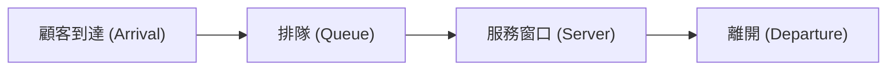

# 前言：為什麼隔壁的結帳隊伍總是比較快？

在超市或便利商店排隊結帳時，您是否曾覺得自己選的隊伍總是比隔壁的隊伍前進得慢？這往往被當作純粹的心理錯覺（墨菲定律）一笑置之，但實際上這背後有著數學依據。

因為您沒有排的隊伍佔多數，從機率上來說，「除了自己之外的其他隊伍中，有某個隊伍比自己的隊伍前進得快」的可能性非常高。像這樣將直覺與機率、統計的落差明確化，並為了最佳化整體系統效率的數學方法，就是「排隊理論（Queuing Theory）」。本篇文章將從排隊理論的歷史、肯德爾記號（Kendall's Notation）、利特爾法則（Little's Law）的證明、使用 Python 進行模擬，到現代 IT 基礎架構的應用，為您進行徹底的解說。

## 1. 排隊理論的歷史背景：A.K. 愛爾朗的挑戰

排隊理論由丹麥數學家兼工程師 **阿格納·克拉魯普·愛爾朗 (Agner Krarup Erlang)** 於 1909 年創立。他當時任職於哥本哈根電話公司，面臨著一個現實的問題：「電話局的交換機需要準備多少線路，才能在不讓顧客等待的情況下提供通話服務？」

當時的電話是由接線生手動插入插頭來連接線路的。如果線路數量太少，「通話中」的機率就會變高，導致顧客滿意度下降。另一方面，如果不必要地增加線路數量，成本將會變得非常龐大。為了尋求這個權衡的解決方案，愛爾朗利用卜瓦松分佈（Poisson distribution）和指數分佈（Exponential distribution）來模擬電話呼叫（Call）的到達與通話時間，並推導出了愛爾朗公式（Erlang B formula / Erlang C formula）。這就是排隊理論的誕生。

## 2. 排隊系統的基本概念

排隊系統主要由以下三個元素組成。



1. **到達過程 (Arrival Process)**: 顧客（或任務、封包等）來到系統的間隔時間。在大多數情況下，會被建模為卜瓦松過程（到達間隔服從指數分佈）。
2. **服務過程 (Service Process)**: 提供服務所需的時間。這也常使用指數分佈或一般分佈來建模。
3. **窗口數量 (Number of Servers)**: 處理顧客的收銀台或伺服器數量。

### 肯德爾記號 (Kendall's Notation)

為了解決排隊模型的分類問題，大衛·肯德爾於 1953 年提出了「肯德爾記號」。一般採用 `A/B/C/K/N/D` 的格式，但通常省略為 `A/B/C`。

- **A (Arrival)**: 到達間隔的機率分佈（例如：M = 馬可夫/指數分佈，D = 固定，G = 一般分佈）
- **B (Service)**: 服務時間的機率分佈（例如：M, D, G）
- **C (Servers)**: 窗口（伺服器）的數量
- **K (Capacity)**: 系統的最大容納人數（省略時為無限大 $\infty$）
- **N (Population)**: 母體規模（省略時為無限大 $\infty$）
- **D (Discipline)**: 服務規則（例如：FCFS = 先到先服務，LCFS = 後到先服務，省略時為 FCFS）

最基本且最著名的模型是 **M/M/1** 模型。這代表「到達間隔為指數分佈 (M)」、「服務時間為指數分佈 (M)」以及「窗口數量為 1 個 (1)」。

## 3. M/M/1 模型的數學分析

讓我們用數學公式來解析 M/M/1 排隊系統。

### 參數定義

- $\lambda$ (Lambda): **平均到達率**。單位時間內到達的平均顧客數。
- $\mu$ (Mu): **平均服務率**。單位時間內能處理的平均顧客數。
- $\rho$ (Rho): **流量密度 (使用率)**。$\rho = \lambda / \mu$。

為了使系統穩定運作，必須滿足 **$\rho < 1$**（即 $\lambda < \mu$）。如果 $\rho \ge 1$，顧客的到達速度將超過處理能力，隊伍將會無限延長。

### 重要公式

當 M/M/1 模型處於穩定狀態時，可以導出以下重要的指標。

1. **系統內的平均顧客數 ($L$)**: 正在排隊以及正在接受服務的人數總和。
   $$ L = \frac{\rho}{1 - \rho} = \frac{\lambda}{\mu - \lambda} $$

2. **系統內的平均逗留時間 ($W$)**: 顧客從到達開始，到完成服務並離開為止的時間。
   $$ W = \frac{L}{\lambda} = \frac{1}{\mu - \lambda} $$

3. **隊伍的平均長度 ($L_q$)**: 實際正在排隊等待的人數平均值。
   $$ L_q = L - \rho = \frac{\rho^2}{1 - \rho} $$

4. **平均等待時間 ($W_q$)**: 顧客從排進隊伍開始，到開始接受服務為止的時間。
   $$ W_q = \frac{L_q}{\lambda} = \frac{\rho}{\mu - \lambda} $$

### 使用率的陷阱：為什麼隊伍會突然變長？

請注意公式 $L = \rho / (1 - \rho)$。
- 當 $\rho = 0.5$ (使用率 50%) 時， $L = 1$ 人。
- 當 $\rho = 0.8$ (使用率 80%) 時， $L = 4$ 人。
- 當 $\rho = 0.9$ (使用率 90%) 時， $L = 9$ 人。
- 當 $\rho = 0.95$ (使用率 95%) 時，$L = 19$ 人。

當使用率超過 90% 時，到達率只要有微小的增加，隊伍的長度就會爆炸性地增長。這在數學上證明了伺服器或系統壓力測試中「讓 CPU 使用率一直保持在 95% 是很危險的」這項 IT 基礎架構的鐵則。預留餘裕（緩衝）對於穩定運作是不可或缺的。

## 4. 利特爾法則 (Little's Law)

排隊理論中最強大且最普遍的定理之一就是「利特爾法則」。由約翰·利特爾於 1961 年證明。

**法則陳述：**
在一個處於穩定狀態的系統中，系統內的平均顧客數 ($L$) 等於到達率 ($\lambda$) 與顧客平均逗留時間 ($W$) 的乘積。

$$ L = \lambda \times W $$

### 為什麼這個法則如此驚人？

利特爾法則的強大之處在於，它**完全不依賴系統的內部結構或機率分佈**。無論是 M/M/1 還是 G/G/k，無論是先到先服務 (FCFS) 還是後到先服務 (LCFS)，只要系統處於穩定狀態，這個法則就必定成立。

**具體範例：咖啡廳**
假設某間咖啡廳平均每小時有 60 位客人光顧（$\lambda = 60 \text{ 人/小時} = 1 \text{ 人/分鐘}$）。客人平均在店內逗留 20 分鐘（$W = 20 \text{ 分鐘}$）。
這時，店內的平均客數 $L$ 為：
$L = 1 \text{ 人/分鐘} \times 20 \text{ 分鐘} = 20 \text{ 人}$
因此可以預測，店內隨時都會有大約 20 個座位被佔用。像這樣，即使是黑盒子系統，也能透過外部可觀察的指標來推算內部狀態。

## 5. 使用 Python 進行排隊模擬

除了理論之外，讓我們實際運行程式來確認。我們將使用 Python 的事件驅動模擬套件 `simpy` 來模擬 M/M/1 排隊系統。

```python
import simpy
import random
import statistics

# 參數設定
ARRIVAL_RATE = 2.0      # 到達率 (lambda) : 每分鐘 2 人
SERVICE_RATE = 2.5      # 服務率 (mu) : 每分鐘可處理 2.5 人
SIM_TIME = 10000        # 模擬時間 (分鐘)

wait_times = []

def customer(env, name, server):
    """定義顧客的行為"""
    arrival_time = env.now
    
    # 請求伺服器
    with server.request() as request:
        yield request
        
        # 記錄等待時間
        wait_time = env.now - arrival_time
        wait_times.append(wait_time)
        
        # 接受服務（指數分佈）
        service_time = random.expovariate(SERVICE_RATE)
        yield env.timeout(service_time)

def setup(env):
    """系統設定與顧客生成"""
    server = simpy.Resource(env, capacity=1) # M/M/1 的窗口為 1 個
    
    i = 0
    while True:
        # 距離下一位顧客到達的時間（指數分佈）
        yield env.timeout(random.expovariate(ARRIVAL_RATE))
        i += 1
        env.process(customer(env, f'Customer {i}', server))

# 執行模擬
print("開始模擬...")
random.seed(42)
env = simpy.Environment()
env.process(setup(env))
env.run(until=SIM_TIME)

# 計算結果並與理論值進行比較
avg_wait_sim = statistics.mean(wait_times)

# 理論值計算
rho = ARRIVAL_RATE / SERVICE_RATE
l_q = (rho ** 2) / (1 - rho)
w_q_theory = l_q / ARRIVAL_RATE

print(f"--- 結果 ---")
print(f"模擬的平均等待時間: {avg_wait_sim:.4f} 分鐘")
print(f"理論的平均等待時間 (W_q)      : {w_q_theory:.4f} 分鐘")
```

執行這段程式碼後，您可以確認模擬結果會收斂到非常接近理論值 $W_q$ 的數字。即使是系統變得複雜、難以用解析方式求解的 M/G/1 或多伺服器模型，也能像這樣透過模擬來預測效能。

## 6. 在 IT 基礎架構中的應用

排隊理論在現代電腦科學與 IT 基礎架構的設計中，是不可或缺的概念。

### 1. Web 伺服器的負載平衡 (Load Balancing)
Web 請求（HTTP 請求）的到達是典型的排隊模型。當 1 台伺服器（M/M/1）無法處理時，就會導入負載平衡器，將請求分散到多台伺服器上。這可以作為 M/M/c 模型來分析，並能計算出需要運行多少台伺服器，才能將平均回應時間控制在目標值以下。

### 2. 網路路由與封包遺失 (Packet Loss)
網際網路的路由器內部有緩衝區（記憶體），用來存放等待發送的封包。這可以視為容量有限的排隊系統（M/M/1/K）。在緩衝區客滿時到達的封包將會被丟棄（Drop）。透過排隊理論，可以決定為滿足容許的封包遺失率所需要的緩衝區大小。

### 3. 雲端運算的自動擴展 (Auto Scaling)
在 AWS 或 GCP 等雲端環境中，會利用自動擴展來根據流量自動增減伺服器。當使用率 $\rho$ 超過一定的閾值（例如：70%）就新增伺服器，這個規則就是基於排隊理論中「使用率接近 1 時，等待時間會發散」的特性。

## 結語：用數學公式克服日常的煩躁

從「為什麼隔壁的結帳隊伍總是看起來比較快？」這個疑問開始，我們連結到了支配全世界所有「等待」的普遍法則，涵蓋了通訊網路、交通堵塞、醫院候診室，甚至最先進的雲端伺服器最佳化。

我們在日常生活中感到煩躁的「等待時間」，從整體系統的角度來看，也不過是遵循著利特爾法則或卜瓦松分佈、井然有序的數學現象罷了。下次當您排在長長的人龍中時，與其感到煩躁，不妨試著觀察一下：「現在的到達率 $\lambda$ 大概是多少呢？」「使用率 $\rho$ 好像快到極限了」。也許，這能讓您的等待時間感覺稍微充實一點。
