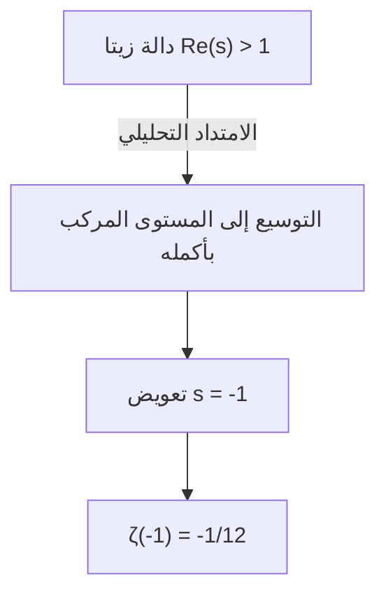
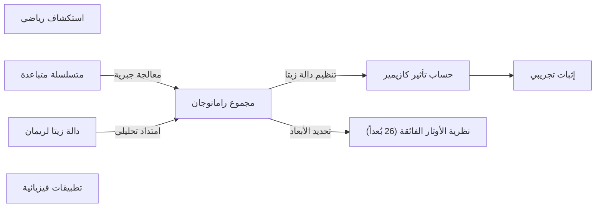

## 1. مقدمة: العجيبة في جمع المالانهاية

في إدراكنا اليومي، إذا واصلنا جمع الأرقام الموجبة، فإن المجموع سيكبر بلا حدود. بعبارة أخرى، من الطبيعي أن نعتقد أن الاستمرار في حساب " $1 + 2 + 3 + 4 + \dots$ " إلى ما لا نهاية سيؤدي إلى نتيجة **ما لا نهاية ( $\infty$ )** . هذا يُعرف رياضياً بـ "التباعد".

ومع ذلك، في عالم الرياضيات المتقدمة مثل الفيزياء النظرية والتحليل المركب، قد يتم تخصيص قيمة غريبة جداً لهذا الجمع اللانهائي. هذه هي المعادلة التالية.

$$
1 + 2 + 3 + 4 + \dots = -\frac{1}{12}
$$

على الرغم من أننا نجمع أعداداً صحيحة موجبة إلى ما لا نهاية، إلا أن النتيجة لسبب ما تصبح **كسراً سالباً** . أصبحت هذه النتيجة المتعارضة مع الحدس شهيرة بعد أن ذكرها عالم الرياضيات الهندي العبقري [سرينيفاسا رامانوجان](https://kenji.blog/ar/p/ramanujan/) ([Srinivasa Ramanujan](https://kenji.blog/ar/p/ramanujan/)) في رسالة وجهها إلى عالم الرياضيات البريطاني جي. إتش. هاردي (G.H. Hardy).

في هذا المقال، سنشرح الطريقة المعروفة باسم "[مجموع رامانوجان (Ramanujan Summation)](https://kenji.blog/p/ramanujan-summation/)"، وكيف يتم استنتاج هذه القيمة الغريبة، وكيف ترتبط بالظواهر الفيزيائية في العالم الحقيقي.

---

## 2. المتسلسلات المتباعدة وإعادة تعريف "المجموع"

### متسلسلة غراندي (Grandi's series)

كخطوة أولى لفهم مجموع رامانوجان، دعونا ننظر إلى متسلسلة لانهائية أخرى أبسط قليلاً. وهي المتسلسلة " $1 - 1 + 1 - 1 + \dots$ ". تُسمى هذه بـ **متسلسلة غراندي** نسبة إلى مكتشفها.

$$
S_1 = 1 - 1 + 1 - 1 + 1 - 1 + \dots
$$

ما هو مجموع هذه المتسلسلة؟ إذا قمنا بتغيير ترتيب الجمع ووضعنا الأقواس، سنحصل على نتائج مختلفة.

1. إذا جعلناها **(1 - 1) + (1 - 1) + ...** فإن $0 + 0 + \dots = 0$
2. إذا جعلناها **1 - (1 - 1) - (1 - 1) - ...** فإن $1 - 0 - 0 - \dots = 1$

بهذه الطريقة، واعتماداً على كيفية الحساب، تصبح النتيجة إما $0$ أو $1$. وفقاً للتعريفات الرياضية العادية، مثل هذه المتسلسلة "تتباعد" ولا تستقر على قيمة واحدة. ومع ذلك، باستخدام حيلة جبرية، يمكن استنتاج قيمة مثيرة للاهتمام.

دعونا نطرح $S_1$ من 1.

$$
1 - S_1 = 1 - (1 - 1 + 1 - 1 + \dots)
$$
$$
1 - S_1 = 1 - 1 + 1 - 1 + \dots = S_1
$$

وبالتالي، يصبح لدينا $1 - S_1 = S_1$ ، وبحل هذه المعادلة نحصل على **$S_1 = \frac{1}{2}$** .
نظراً لأن الحالة تتأرجح بين $0$ و $1$ ، فإن تخصيص المتوسط $\frac{1}{2}$ قد يبدو منطقياً وبديهياً إلى حد ما.

### متسلسلة أخرى: المتسلسلة المتناوبة

بعد ذلك، نعتبر المتسلسلة التالية $S_2$ .

$$
S_2 = 1 - 2 + 3 - 4 + 5 - \dots
$$

سنفكر في عملية جمع اثنتين منها. النقطة المهمة هي إزاحتها قليلاً عند الجمع.

$$
\begin{array}{rcrrrrrl}
S_2 & = & 1 & -2 & +3 & -4 & +5 & -\dots \\
{}+S_2 & = & & +1 & -2 & +3 & -4 & +\dots \\
\hline
2S_2 & = & 1 & -1 & +1 & -1 & +1 & -\dots
\end{array}
$$

كما تلاحظ، أصبح الطرف الأيمن هو متسلسلة غراندي $S_1$ السابقة. وبالتالي،

$$
2S_2 = S_1 = \frac{1}{2}
$$

وبحل هذه المعادلة، نحصل على **$S_2 = \frac{1}{4}$** .

### أخيراً نحو مجموع رامانوجان

نحن الآن مستعدون. دعونا نفكر في الموضوع الرئيسي، وهو مجموع كل الأعداد الطبيعية $S$ .

$$
S = 1 + 2 + 3 + 4 + 5 + 6 + \dots
$$

الآن سنطرح منها $S_2$ السابقة.

$$
S - S_2 = (1 + 2 + 3 + 4 + 5 + 6 + \dots) - (1 - 2 + 3 - 4 + 5 - 6 + \dots)
$$

عند إجراء الطرح لكل حد، ستلغى الحدود الفردية، وستتضاعف الحدود الزوجية.

$$
S - S_2 = 0 + 4 + 0 + 8 + 0 + 12 + \dots = 4 + 8 + 12 + \dots
$$

يمكننا أخذ عامل مشترك $4$ في الطرف الأيمن.

$$
S - S_2 = 4(1 + 2 + 3 + \dots) = 4S
$$

وبالتالي، نحصل على المعادلة $S - S_2 = 4S$ . بإعادة ترتيبها،

$$
-3S = S_2
$$

بما أننا وجدنا سابقاً أن $S_2 = \frac{1}{4}$ ، سنقوم بتعويضها.

$$
-3S = \frac{1}{4}
$$
$$
S = -\frac{1}{12}
$$

وهكذا، تم استنتاج المتطابقة المذهلة **$1 + 2 + 3 + 4 + \dots = -\frac{1}{12}$** .

---

## 3. الامتداد التحليلي ودالة زيتا لريمان

العمليات الجبرية المذكورة أعلاه قد تبدو للوهلة الأولى كمجرد حيل أو مغالطات. إن تطبيق العمليات الحسابية الأربع بلا شروط على متسلسلة متباعدة غير مسموح به في الرياضيات الصارمة.

ومع ذلك، هذه النتيجة ليست بلا معنى على الإطلاق. في الرياضيات الحديثة، يمكن إثبات ذلك باستخدام مفهوم صارم يُسمى **الامتداد التحليلي (Analytic Continuation)** .

### دالة زيتا لريمان

لشرح الامتداد التحليلي، سنقدم **دالة زيتا لريمان** $\zeta(s)$ . تُعرّف دالة زيتا على النحو التالي:

$$
\zeta(s) = 1^{-s} + 2^{-s} + 3^{-s} + 4^{-s} + \dots = \sum_{n=1}^{\infty} \frac{1}{n^s}
$$

هنا $s$ هو عدد مركب. تتقارب هذه المتسلسلة ويكون لها قيمة محدودة فقط عندما يكون الجزء الحقيقي من $s$ أكبر من 1 ( $\text{Re}(s) > 1$ ).

على سبيل المثال، عندما $s = 2$ ، تصبح هذه معضلة بازل الشهيرة، ويُعرف أنها تتقارب إلى $\zeta(2) = \frac{\pi^2}{6}$ .

### التوسيع بواسطة الامتداد التحليلي

إذن، ماذا يحدث إذا عوضنا بـ $s = -1$ ؟

$$
\zeta(-1) = 1^1 + 2^1 + 3^1 + 4^1 + \dots = 1 + 2 + 3 + 4 + \dots
$$

هذا هو بالضبط مجموع كل الأعداد الطبيعية الذي نبحث عنه. ولكن، في التعريف الأصلي لدالة زيتا، يقع $s = -1$ خارج نطاق التقارب، لذلك لا يمكن حسابه مباشرة.

لذلك، يستخدم علماء الرياضيات تقنية تسمى **الامتداد التحليلي** . هذه التقنية هي طريقة لتوسيع دالة سلسة محددة في منطقة معينة، مع الحفاظ على خصائصها (مثل قابلية الاشتقاق)، إلى منطقة أوسع لم تكن محددة فيها في الأصل.

أثبت ريمان أن دالة زيتا يمكن توسيعها بشكل فريد لتشمل المستوى المركب بأكمله (باستثناء القطب عند $s=1$ ). عند حساب قيمة $s = -1$ في دالة زيتا الموسعة، نجد أنها تساوي ببراعة **$-\frac{1}{12}$** .

بعبارة أخرى، المعادلة " $1+2+3+... = -1/12$ " لا تُبرر كـ "مجموع بالمعنى المعتاد"، بل كـ "قيمة بالمعنى الممتد تحليلياً عبر دالة زيتا".

---

## 4. أمثلة عملية في الفيزياء: تأثير كازيمير ونظرية الأوتار الفائقة

هذه القيمة $-\frac{1}{12}$ لا تقتصر على كونها مجرد لغز رياضي. والمثير للدهشة أن هذه القيمة تظهر أيضاً في العالم الفيزيائي الحقيقي، وقد تم رصد تأثيرها من خلال التجارب.

### تأثير كازيمير

في عالم ميكانيكا الكم، حتى في الفراغ التام، لا تكون الطاقة صفراً. هناك طاقة متذبذبة باستمرار تُعرف باسم "طاقة نقطة الصفر".

في عام 1948، تنبأ الفيزيائي الهولندي هندريك كازيمير بأنه إذا تم وضع لوحين معدنيين متوازيين في الفراغ مع وجود فجوة صغيرة جداً بينهما، فستنشأ قوة جذب بين اللوحين. يُسمى هذا بـ **تأثير كازيمير** .

عند حساب قوة الجذب هذه، من الضروري جمع كل طاقات أنماط (ترددات) الموجات الكهرومغناطيسية التي لا تعد ولا تحصى والموجودة بين اللوحين. في معادلة الحساب هذه، تظهر بالضبط المتسلسلة المتباعدة $\sum_{n=1}^{\infty} n = 1 + 2 + 3 + \dots$ .

استخدم الفيزيائيون تنظيم دالة زيتا (كجزء من تقنية إعادة التطبيع) للتعامل مع هذه المالانهاية، وعندما استبدلوا هذا المجموع بـ $-\frac{1}{12}$ ، تم استنتاج نتيجة الحساب كقوة محدودة. والأهم من ذلك هو حقيقة أن **نتيجة الحساب هذه تتطابق تماماً مع القيم المقاسة في التجارب الفعلية** .

### نظرية الأوتار البوزونية

علاوة على ذلك، تلعب هذه القيمة دوراً مهماً في النموذج المبكر لنظرية الأوتار الفائقة (نظرية الأوتار البوزونية)، والتي تتعامل مع جميع المواد في الكون كـ "أوتار" أحادية البعد.

لكي تكون نظرية الأوتار البوزونية متسقة رياضياً، يجب أن يستوفي عدد أبعاد الزمكان $D$ شرطاً معيناً. في عملية جمع طاقات أنماط اهتزاز الوتر، يظهر أيضاً المجموع اللانهائي $1 + 2 + 3 + \dots$ ، وإذا اعتبرنا أن هذا يساوي $-\frac{1}{12}$ ، فإن المعادلة تصبح كما يلي:

$$
\frac{D - 2}{2} \times \left(-\frac{1}{12}\right) + 1 = 0
$$

بحل هذه المعادلة، نحصل على $D = 26$ . بعبارة أخرى، يتم استنتاج أن نظرية الأوتار البوزونية لا يمكن أن تكون صحيحة إلا في **زمكان ذي 26 بُعداً** . (في نظرية الأوتار الفائقة التي تضمنت الفرميونات لاحقاً، يصبح العدد 10 أبعاد، لكن البنية الرياضية الكامنة وراءها مشابهة.)

---

## 5. الخلاصة

المعادلة " $1 + 2 + 3 + 4 + \dots = -\frac{1}{12}$ " قد تبدو خطأً واضحاً أو مغالطة لأي شخص يراها لأول مرة. في الواقع، وفقاً لتعريف "الجمع" الذي نستخدمه في حياتنا اليومية، فإن هذه المتسلسلة تتباعد إلى ما لا نهاية.

ومع ذلك، عندما وسّعت الرياضيات مفهوم الدوال باستخدام أداة "الامتداد التحليلي"، ظهر مشهد جديد هناك. والأمر الأكثر إثارة للدهشة هو أن المفهوم المجرد الذي استكشفه علماء الرياضيات بدافع الفضول الفكري البحت، أصبح لاحقاً قطعة أحجية أساسية لكشف بنية الكون في أحدث مجالات الفيزياء مثل ميكانيكا الكم ونظرية الأوتار.

يمكن القول إن مجموع رامانوجان هو واحد من أجمل الأمثلة التي تعلمنا عمق الرياضيات، والروابط الغامضة الموجودة بين الرياضيات والفيزياء.

