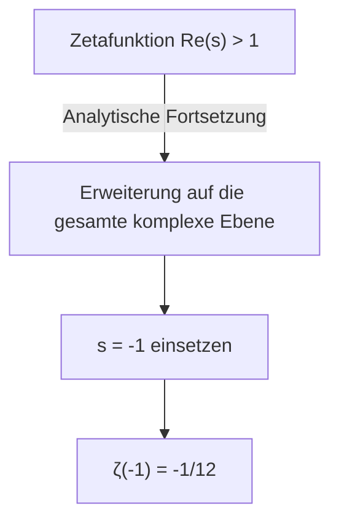
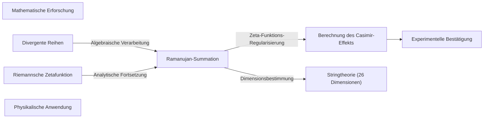

## 1. Einleitung: Das Rätsel der unendlichen Addition

In unserem alltäglichen Verständnis wird eine Summe positiver Zahlen immer größer, je mehr Zahlen wir addieren. Die Berechnung „ $1 + 2 + 3 + 4 + \dots$ " sollte also bei unendlicher Fortsetzung **unendlich groß ( $\infty$ )** werden. Mathematisch nennt man dies „divergent".

Doch in der theoretischen Physik und der komplexen Analysis – einem fortgeschrittenen Gebiet der Mathematik – wird dieser unendlichen Summe ein höchst seltsamer Wert zugewiesen:

$$
1 + 2 + 3 + 4 + \dots = -\frac{1}{12}
$$

Obwohl wir positive ganze Zahlen unendlich addieren, erhalten wir einen **negativen Bruch**. Dieses kontraintuitive Ergebnis wurde berühmt, als der indische Mathematikgenie [Srinivasa Ramanujan](https://kenji.blog/de/p/ramanujan/) es in einem Brief an den britischen Mathematiker G.H. Hardy erwähnte.

Dieser Artikel erklärt die „Ramanujan-Summation" genannte Methode: Wie kommt man zu diesem seltsamen Wert und wie hängt er mit realen physikalischen Phänomenen zusammen?

---

## 2. Divergente Reihen und die Neudefinition der „Summe"

### Die Grandi-Reihe

Als ersten Schritt zum Verständnis der Ramanujan-Summation betrachten wir eine einfachere unendliche Reihe: „ $1 - 1 + 1 - 1 + \dots$ ". Diese wird nach ihrem Entdecker **Grandi-Reihe** genannt.

$$
S_1 = 1 - 1 + 1 - 1 + 1 - 1 + \dots
$$

Was ist die Summe dieser Reihe? Durch unterschiedliche Klammerung erhält man verschiedene Ergebnisse:

1. **(1 - 1) + (1 - 1) + ...** ergibt $0 + 0 + \dots = 0$
2. **1 - (1 - 1) - (1 - 1) - ...** ergibt $1 - 0 - 0 - \dots = 1$

Je nach Berechnungsweise ist das Ergebnis $0$ oder $1$. In der Standard-Mathematik gilt diese Reihe als „divergent" ohne eindeutigen Wert. Doch mit einem algebraischen Trick lässt sich ein interessanter Wert ableiten.

Ziehen wir $S_1$ von der Gesamtheit ab:

$$
1 - S_1 = 1 - (1 - 1 + 1 - 1 + \dots)
$$
$$
1 - S_1 = 1 - 1 + 1 - 1 + \dots = S_1
$$

Somit ist $1 - S_1 = S_1$, und aufgelöst ergibt sich **$S_1 = \frac{1}{2}$**.
Da der Zustand zwischen $0$ und $1$ hin und her springt, ist der Durchschnitt $\frac{1}{2}$ auf gewisse Weise intuitiv nachvollziehbar.

### Eine weitere Reihe: Die alternierende Reihe

Betrachten wir nun die folgende Reihe $S_2$:

$$
S_2 = 1 - 2 + 3 - 4 + 5 - \dots
$$

Wir addieren zwei Kopien davon, wobei wir die zweite um eine Position verschieben:

$$
\begin{array}{rcrrrrrl}
S_2 & = & 1 & -2 & +3 & -4 & +5 & -\dots \\
{}+S_2 & = & & +1 & -2 & +3 & -4 & +\dots \\
\hline
2S_2 & = & 1 & -1 & +1 & -1 & +1 & -\dots
\end{array}
$$

Die rechte Seite ist genau die Grandi-Reihe $S_1$. Somit:

$$
2S_2 = S_1 = \frac{1}{2}
$$

Aufgelöst ergibt sich **$S_2 = \frac{1}{4}$**.

### Nun zur Ramanujan-Summation

Die Vorbereitungen sind abgeschlossen. Betrachten wir nun die Summe aller natürlichen Zahlen $S$:

$$
S = 1 + 2 + 3 + 4 + 5 + 6 + \dots
$$

Ziehen wir $S_2$ davon ab:

$$
S - S_2 = (1 + 2 + 3 + 4 + 5 + 6 + \dots) - (1 - 2 + 3 - 4 + 5 - 6 + \dots)
$$

Bei gliedweiser Subtraktion heben sich die ungeraden Glieder auf und die geraden verdoppeln sich:

$$
S - S_2 = 0 + 4 + 0 + 8 + 0 + 12 + \dots = 4 + 8 + 12 + \dots
$$

Die rechte Seite lässt sich durch $4$ ausklammern:

$$
S - S_2 = 4(1 + 2 + 3 + \dots) = 4S
$$

Daraus folgt die Gleichung $S - S_2 = 4S$. Umgestellt:

$$
-3S = S_2
$$

Da wir zuvor $S_2 = \frac{1}{4}$ ermittelt haben, setzen wir ein:

$$
-3S = \frac{1}{4}
$$
$$
S = -\frac{1}{12}
$$

So wird die erstaunliche Gleichung **$1 + 2 + 3 + 4 + \dots = -\frac{1}{12}$** hergeleitet.

---

## 3. Analytische Fortsetzung und die [Riemann](https://kenji.blog/de/p/riemann/)sche Zetafunktion

Die obigen algebraischen Manipulationen mögen auf den ersten Blick wie bloße Tricks oder Sophismen wirken. Tatsächlich ist es in der strengen Mathematik nicht erlaubt, gewöhnliche Rechenoperationen bedenkenlos auf divergente Reihen anzuwenden.

Doch dieses Ergebnis ist keineswegs bedeutungslos. In der modernen Mathematik lässt es sich durch das strenge Konzept der **analytischen Fortsetzung** untermauern.

### Die [Riemann](https://kenji.blog/de/p/riemann/)sche Zetafunktion

Um die analytische Fortsetzung zu erklären, führen wir die **[Riemann](https://kenji.blog/de/p/riemann/)sche Zetafunktion** $\zeta(s)$ ein. Sie ist wie folgt definiert:

$$
\zeta(s) = 1^{-s} + 2^{-s} + 3^{-s} + 4^{-s} + \dots = \sum_{n=1}^{\infty} \frac{1}{n^s}
$$

Hierbei ist $s$ eine komplexe Zahl. Die Reihe konvergiert nur dann, wenn der Realteil von $s$ größer als $1$ ist ( $\text{Re}(s) > 1$ ).

Für $s = 2$ ergibt sich das berühmte Basler Problem: $\zeta(2) = \frac{\pi^2}{6}$.

### Erweiterung durch analytische Fortsetzung

Was passiert, wenn wir $s = -1$ einsetzen?

$$
\zeta(-1) = 1^1 + 2^1 + 3^1 + 4^1 + \dots = 1 + 2 + 3 + 4 + \dots
$$

Das ist genau die gesuchte Summe aller natürlichen Zahlen. Allerdings liegt $s = -1$ außerhalb des Konvergenzbereichs der ursprünglichen Definition und kann nicht direkt berechnet werden.

Hier verwenden Mathematiker die **analytische Fortsetzung** – eine Technik, die eine in einem bestimmten Bereich definierte glatte Funktion unter Beibehaltung ihrer Eigenschaften (wie Differenzierbarkeit) auf einen größeren Bereich erweitert.

[Riemann](https://kenji.blog/de/p/riemann/) bewies, dass die Zetafunktion eindeutig auf die gesamte komplexe Ebene (mit Ausnahme des Pols bei $s=1$) fortgesetzt werden kann. Der Wert der fortgesetzten Funktion bei $s = -1$ ergibt tatsächlich **$-\frac{1}{12}$**.

Das bedeutet: Die Gleichung „ $1+2+3+... = -1/12$ " ist nicht im gewöhnlichen Sinne einer Summe zu verstehen, sondern als Wert, der „durch analytische Fortsetzung der Zetafunktion gerechtfertigt" wird.

---

## 4. Anwendungen in der Physik: Der Casimir-Effekt und die Stringtheorie

Der Wert $-\frac{1}{12}$ ist nicht nur ein mathematisches Kuriosum. Erstaunlicherweise taucht er in der realen physikalischen Welt auf und seine Auswirkungen wurden experimentell beobachtet.

### Der Casimir-Effekt

In der Quantenmechanik ist die Energie selbst im perfekten Vakuum nicht null. Die sogenannte „Nullpunktsenergie" fluktuiert ständig.

1948 sagte der niederländische Physiker Hendrik Casimir voraus, dass zwischen zwei parallelen Metallplatten im Vakuum eine Anziehungskraft wirkt, wenn der Abstand zwischen ihnen extrem klein ist. Dies wird als **Casimir-Effekt** bezeichnet.

Bei der Berechnung dieser Kraft müssen die Energien unzähliger elektromagnetischer Moden (Frequenzen) zwischen den Platten summiert werden. In dieser Berechnung taucht genau die divergente Reihe $\sum_{n=1}^{\infty} n = 1 + 2 + 3 + \dots$ auf.

Wenn Physiker diese Unendlichkeit mit Hilfe der Zeta-Funktions-Regularisierung (als Teil der Renormierung) behandeln und die Summe durch $-\frac{1}{12}$ ersetzen, ergibt sich eine endliche Kraft. Entscheidend ist: **Dieses Berechnungsergebnis stimmt hervorragend mit den experimentellen Messwerten überein.**

### Bosonische Stringtheorie

Auch in der Superstring-Theorie – dem Frühmodell, das alle Materie als eindimensionale „Fäden (Strings)" behandelt – spielt dieser Wert eine wichtige Rolle.

Damit die bosonische Stringtheorie mathematisch widerspruchsfrei ist, muss die Anzahl der Raumzeit-Dimensionen $D$ eine bestimmte Bedingung erfüllen. Bei der Aufsummierung der Schwingungsmoden der Strings tritt erneut die unendliche Summe $1 + 2 + 3 + \dots$ auf. Setzt man diese gleich $-\frac{1}{12}$, ergibt sich die Gleichung:

$$
\frac{D - 2}{2} \times \left(-\frac{1}{12}\right) + 1 = 0
$$

Aufgelöst ergibt sich $D = 26$. Die bosonische Stringtheorie funktioniert also nur in einer **26-dimensionalen Raumzeit**. (Die spätere Superstring-Theorie mit Fermionen ergibt 10 Dimensionen, wobei die zugrunde liegende mathematische Struktur ähnlich ist.)

---

## 5. Zusammenfassung

Die Gleichung „ $1 + 2 + 3 + 4 + \dots = -\frac{1}{12}$ " wirkt beim ersten Kontakt wie ein offensichtlicher Fehler oder ein Trugschluss. Tatsächlich divergiert diese Reihe in unserer alltäglichen Definition der Addition gegen Unendlich.

Doch als die Mathematik mit dem Werkzeug der „analytischen Fortsetzung" den Funktionsbegriff erweiterte, eröffneten sich neue Horizonte. Und noch erstaunlicher ist die Tatsache, dass dieses abstrakte Konzept, das Mathematiker aus reiner intellektueller Neugier erforschten, später in der Quantenmechanik und der Stringtheorie zu einem unverzichtbaren Puzzlestück bei der Entschlüsselung der Struktur des Universums wurde.

Die Ramanujan-Summation ist eines der schönsten Beispiele für die Tiefe der Mathematik und die geheimnisvolle Verbindung zwischen Mathematik und Physik.

