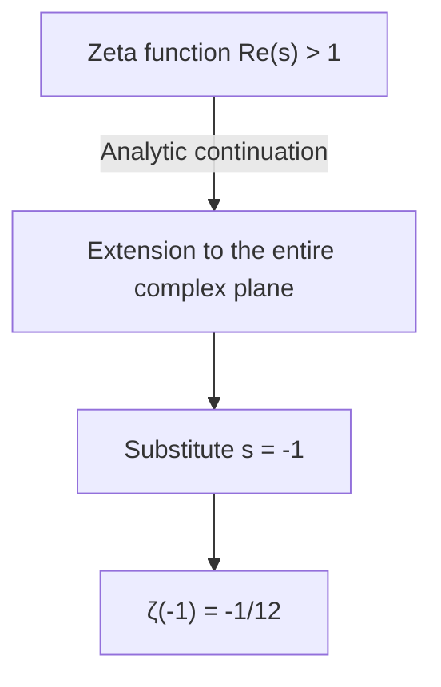
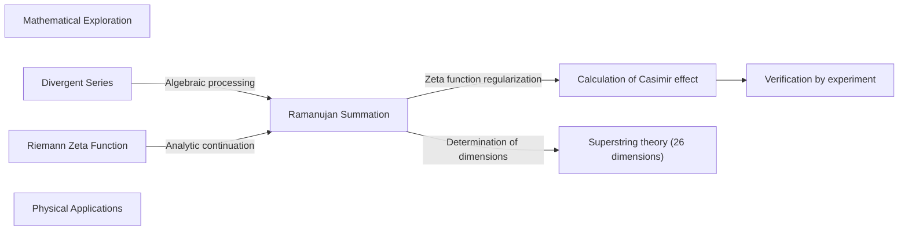

## 1. Introduction: The Wonder of Adding Infinity

In our everyday sense, if we keep adding positive numbers, the sum will grow indefinitely. In other words, if we continue the calculation of $1 + 2 + 3 + 4 + \dots$ infinitely, it is natural to think that the result will be **infinity ($\infty$)**. This is mathematically said to "diverge".

However, in the highly advanced mathematical worlds of theoretical physics and complex analysis, a very strange value is sometimes assigned to this infinite addition. That is the following formula:

$$
1 + 2 + 3 + 4 + \dots = -\frac{1}{12}
$$

Even though we are adding positive integers infinitely, for some reason it becomes a **negative fraction**. This counterintuitive result became famous when the genius Indian mathematician [Srinivasa Ramanujan](https://kenji.blog/en/p/ramanujan/) mentioned it in a letter to the British mathematician G.H. Hardy.

In this article, we will explain this technique called "[Ramanujan Summation](https://kenji.blog/en/p/ramanujan-summation/)", how this strange value is derived, and how it is connected to physical phenomena in the real world.

---

## 2. Divergent Series and Redefining the "Sum"

### Grandi's series

As a first step to understanding Ramanujan summation, let's look at another, simpler infinite series. That is the series $1 - 1 + 1 - 1 + \dots$. This is called **Grandi's series**, named after its discoverer.

$$
S_1 = 1 - 1 + 1 - 1 + 1 - 1 + \dots
$$

What happens to the sum of this series? If we change the order of addition and put parentheses, we get different results.

1. If we do **(1 - 1) + (1 - 1) + ...**, then $0 + 0 + \dots = 0$
2. If we do **1 - (1 - 1) - (1 - 1) - ...**, then $1 - 0 - 0 - \dots = 1$

In this way, the result can be $0$ or $1$ depending on how it is calculated. In normal mathematical definitions, such a series is said to "diverge" and does not settle on a single value. However, by using an algebraic trick, an interesting value can be derived.

Let's subtract $S_1$ from 1.

$$
1 - S_1 = 1 - (1 - 1 + 1 - 1 + \dots)
$$
$$
1 - S_1 = 1 - 1 + 1 - 1 + \dots = S_1
$$

Therefore, $1 - S_1 = S_1$, and solving this gives **$S_1 = \frac{1}{2}$**.
Since the state fluctuates between $0$ and $1$, it might be somewhat intuitively understandable that the average of $\frac{1}{2}$ is assigned.

### Another Series: Alternating Series

Next, we consider the following series $S_2$.

$$
S_2 = 1 - 2 + 3 - 4 + 5 - \dots
$$

Consider the operation of adding two of these together. The key is to shift it slightly when adding.

$$
\begin{array}{rcrrrrrl}
S_2 & = & 1 & -2 & +3 & -4 & +5 & -\dots \\
{}+S_2 & = & & +1 & -2 & +3 & -4 & +\dots \\
\hline
2S_2 & = & 1 & -1 & +1 & -1 & +1 & -\dots
\end{array}
$$

As you might have noticed, the right side has become Grandi's series $S_1$ from earlier. Therefore,

$$
2S_2 = S_1 = \frac{1}{2}
$$

Solving this gives **$S_2 = \frac{1}{4}$**.

### Finally to [Ramanujan Summation](https://kenji.blog/en/p/ramanujan-summation/)

The preparations are complete. Let's consider our main topic, the sum of all natural numbers, $S$.

$$
S = 1 + 2 + 3 + 4 + 5 + 6 + \dots
$$

Let's subtract the previous $S_2$ from this.

$$
S - S_2 = (1 + 2 + 3 + 4 + 5 + 6 + \dots) - (1 - 2 + 3 - 4 + 5 - 6 + \dots)
$$

If we subtract term by term, the odd-numbered terms cancel out, and the even-numbered terms are doubled.

$$
S - S_2 = 0 + 4 + 0 + 8 + 0 + 12 + \dots = 4 + 8 + 12 + \dots
$$

We can factor out a $4$ from the right side.

$$
S - S_2 = 4(1 + 2 + 3 + \dots) = 4S
$$

Therefore, we obtain the equation $S - S_2 = 4S$. Rearranging this gives,

$$
-3S = S_2
$$

Since $S_2 = \frac{1}{4}$ as we calculated earlier, we substitute this in.

$$
-3S = \frac{1}{4}
$$
$$
S = -\frac{1}{12}
$$

Thus, the surprising equation **$1 + 2 + 3 + 4 + \dots = -\frac{1}{12}$** has been derived.

---

## 3. Analytic Continuation and the [Riemann](https://kenji.blog/en/p/riemann/) Zeta Function

The algebraic operations like the above may at first glance seem like mere tricks or sophistry. Applying normal arithmetic operations unconditionally to a divergent series is not allowed in rigorous mathematics.

However, this result is by no means meaningless. In modern mathematics, this can be supported using a rigorous concept called **Analytic Continuation**.

### The [Riemann](https://kenji.blog/en/p/riemann/) Zeta Function

To explain analytic continuation, we introduce the **[Riemann](https://kenji.blog/en/p/riemann/) zeta function** $\zeta(s)$. The zeta function is defined as follows:

$$
\zeta(s) = 1^{-s} + 2^{-s} + 3^{-s} + 4^{-s} + \dots = \sum_{n=1}^{\infty} \frac{1}{n^s}
$$

Here, $s$ is a complex number. This series converges and has a finite value only when the real part of $s$ is greater than $1$ ($\text{Re}(s) > 1$).

For example, when $s = 2$, this becomes the famous Basel problem, and it is known to converge to $\zeta(2) = \frac{\pi^2}{6}$.

### Extension via Analytic Continuation

So, what happens if we substitute $s = -1$?

$$
\zeta(-1) = 1^1 + 2^1 + 3^1 + 4^1 + \dots = 1 + 2 + 3 + 4 + \dots
$$

This is exactly the sum of all natural numbers we are looking for. However, under the original definition of the zeta function, $s = -1$ is outside the domain of convergence, so it cannot be calculated directly.

Therefore, mathematicians use a technique called **Analytic Continuation**. This is a method of extending a smooth function defined in a certain region to a wider region where it was not originally defined, while preserving its properties (such as differentiability).

[Riemann](https://kenji.blog/en/p/riemann/) proved that the zeta function can be uniquely extended to the entire complex plane (except for the pole at $s=1$). If we calculate the value at $s = -1$ in the extended zeta function, we beautifully find that it is **$-\frac{1}{12}$**.

In other words, the equation "$1+2+3+... = -1/12$" is justified not as a "sum in the usual sense", but as a "value in the sense of being analytically continued through the zeta function".

---

## 4. Practical Examples in Physics: The Casimir Effect and Superstring Theory

This value of $-\frac{1}{12}$ is not just a mathematical puzzle. Surprisingly, this value also appears in the physical world of reality, and its effects have been observed in experiments.

### The Casimir Effect

In the world of quantum mechanics, even a perfect vacuum does not have zero energy. Energy known as "zero-point energy" is constantly fluctuating.

In 1948, the Dutch physicist Hendrik Casimir predicted that if two metal plates are placed parallel to each other with a very small gap in a vacuum, an attractive force will act between the metal plates. This is called the **Casimir effect**.

When calculating this attractive force, it is necessary to sum up the energies of countless electromagnetic wave modes (frequencies) existing between the metal plates. Within this calculation formula, the divergent series $\sum_{n=1}^{\infty} n = 1 + 2 + 3 + \dots$ appears exactly.

When physicists use zeta function regularization (as part of a technique called renormalization) to process this infinity and replace this sum with $-\frac{1}{12}$, the calculation result is derived as a finite force. And what is important is the fact that **this calculation result matches the measured values in actual experiments beautifully**.

### Bosonic String Theory

Furthermore, this value plays an important role even in the early model of superstring theory (bosonic string theory), which treats all matter in the universe as one-dimensional "strings".

For bosonic string theory to hold without mathematical contradictions, the number of spacetime dimensions $D$ must satisfy certain conditions. In the process of summing up the energies of the vibrational modes of the string, the infinite sum $1 + 2 + 3 + \dots$ again appears, and if this is taken as $-\frac{1}{12}$, the equation becomes as follows:

$$
\frac{D - 2}{2} \times \left(-\frac{1}{12}\right) + 1 = 0
$$

Solving this gives $D = 26$. In other words, the result derived is that bosonic string theory only holds in a **26-dimensional spacetime**. (In the superstring theory incorporating fermions later on, it becomes 10 dimensions, but the mathematical structure behind it is similar.)

---

## 5. Conclusion

To anyone seeing the equation "$1 + 2 + 3 + 4 + \dots = -\frac{1}{12}$" for the first time, it might feel like an obvious mistake or sophistry. In fact, in the definition of "addition" that we use in everyday life, this series diverges to infinity.

However, when mathematics extended the concept of functions using a tool called "analytic continuation", a new landscape opened up there. And what is even more amazing is that the abstract concept explored by mathematicians out of pure intellectual curiosity later became an essential puzzle piece for unraveling the structure of the universe in cutting-edge physics like quantum mechanics and string theory.

Ramanujan summation can be said to be one of the most beautiful examples that teaches us the depth of mathematics and the mysterious connection that exists between mathematics and physics.

