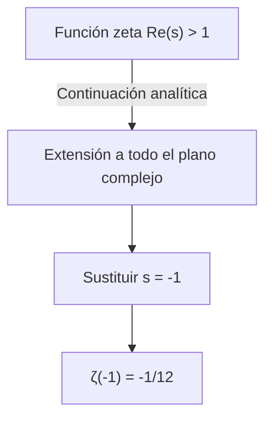
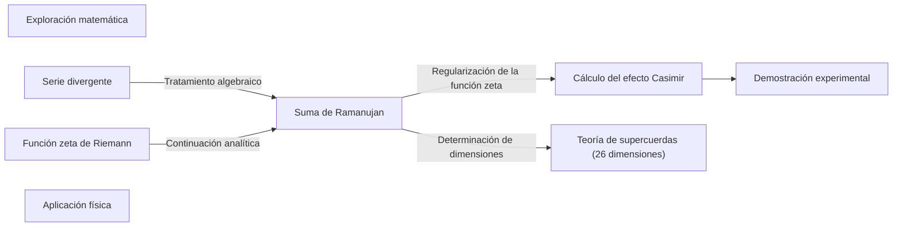

## 1. Introducción: El misterio de sumar el infinito

En nuestro sentido común cotidiano, si seguimos sumando números positivos, la suma crece indefinidamente. Es decir, es natural pensar que si continuamos infinitamente el cálculo de « $1 + 2 + 3 + 4 + \dots$ », el resultado será **infinito ( $\infty$ )**. Esto se dice matemáticamente que «diverge».

Sin embargo, en el mundo de la matemática avanzada, como la física teórica y el análisis complejo, a esta suma infinita a veces se le asigna un valor muy extraño. Esa es la siguiente fórmula.

$$
1 + 2 + 3 + 4 + \dots = -\frac{1}{12}
$$

Aunque estamos sumando números enteros positivos infinitamente, por alguna razón se convierte en una **fracción negativa**. Este resultado contraintuitivo se hizo famoso cuando el genio matemático indio [Srinivasa Ramanujan](https://kenji.blog/es/p/ramanujan/) lo mencionó en una carta dirigida al matemático británico G.H. Hardy.

En este artículo, explicaremos este método llamado «[Suma de Ramanujan ([Ramanujan Summation](https://kenji.blog/es/p/ramanujan-summation/))](https://kenji.blog/p/ramanujan-summation/)», cómo se deriva este extraño valor y cómo se conecta con los fenómenos físicos del mundo real.

---

## 2. Series divergentes y la redefinición de la «suma»

### La serie de Grandi (Grandi's series)

Como primer paso para entender la suma de Ramanujan, veamos otra serie infinita un poco más sencilla. Es la serie « $1 - 1 + 1 - 1 + \dots$ ». Ésta se llama **serie de Grandi**, tomando el nombre de su descubridor.

$$
S_1 = 1 - 1 + 1 - 1 + 1 - 1 + \dots
$$

¿Cuál será la suma de esta serie? Si cambiamos el orden de la suma y usamos paréntesis, obtenemos resultados diferentes.

1. Si hacemos **(1 - 1) + (1 - 1) + ...**, entonces $0 + 0 + \dots = 0$
2. Si hacemos **1 - (1 - 1) - (1 - 1) - ...**, entonces $1 - 0 - 0 - \dots = 1$

De esta manera, dependiendo de cómo se calcule, el resultado puede ser $0$ o $1$. Según las definiciones matemáticas normales, tal serie «diverge» y no se establece en un solo valor. Sin embargo, usando un truco algebraico, se puede derivar un valor interesante.

Restemos $S_1$ del total (de 1).

$$
1 - S_1 = 1 - (1 - 1 + 1 - 1 + \dots)
$$
$$
1 - S_1 = 1 - 1 + 1 - 1 + \dots = S_1
$$

Por lo tanto, $1 - S_1 = S_1$, y al resolver esto obtenemos **$S_1 = \frac{1}{2}$**.
Como el estado oscila entre $0$ y $1$, el hecho de que se le asigne su promedio, $\frac{1}{2}$, puede tener sentido intuitivamente de alguna manera.

### Otra serie: La serie alternada

A continuación, consideremos la siguiente serie $S_2$.

$$
S_2 = 1 - 2 + 3 - 4 + 5 - \dots
$$

Pensemos en la operación de sumar esto consigo mismo ($S_2 + S_2$). El truco es sumarlo desplazándolo un poco.

$$
\begin{array}{rcrrrrrl}
S_2 & = & 1 & -2 & +3 & -4 & +5 & -\dots \\
{}+S_2 & = & & +1 & -2 & +3 & -4 & +\dots \\
\hline
2S_2 & = & 1 & -1 & +1 & -1 & +1 & -\dots
\end{array}
$$

Como te habrás dado cuenta, el lado derecho se convirtió en la serie de Grandi $S_1$ de antes. Por lo tanto,

$$
2S_2 = S_1 = \frac{1}{2}
$$

Resolviendo esto, obtenemos **$S_2 = \frac{1}{4}$**.

### Por fin, a la suma de Ramanujan

La preparación está lista. Consideremos el tema principal, la suma $S$ de todos los números naturales.

$$
S = 1 + 2 + 3 + 4 + 5 + 6 + \dots
$$

Restemos de esto la $S_2$ anterior.

$$
S - S_2 = (1 + 2 + 3 + 4 + 5 + 6 + \dots) - (1 - 2 + 3 - 4 + 5 - 6 + \dots)
$$

Al hacer la resta término a término, los términos en posiciones impares se anulan, y los términos en posiciones pares se duplican.

$$
S - S_2 = 0 + 4 + 0 + 8 + 0 + 12 + \dots = 4 + 8 + 12 + \dots
$$

El lado derecho se puede factorizar por $4$.

$$
S - S_2 = 4(1 + 2 + 3 + \dots) = 4S
$$

Por lo tanto, obtenemos la ecuación $S - S_2 = 4S$. Transformando esto,

$$
-3S = S_2
$$

Como encontramos antes que $S_2 = \frac{1}{4}$, lo sustituimos.

$$
-3S = \frac{1}{4}
$$
$$
S = -\frac{1}{12}
$$

Así, se ha derivado la asombrosa igualdad de **$1 + 2 + 3 + 4 + \dots = -\frac{1}{12}$**.

---

## 3. Continuación analítica y la función zeta de [Riemann](https://kenji.blog/es/p/riemann/)

Las operaciones algebraicas anteriores pueden parecer a simple vista meros trucos o sofismas. Aplicar incondicionalmente las operaciones aritméticas normales a series divergentes no está permitido en matemáticas rigurosas.

Sin embargo, este resultado no carece de sentido en absoluto. En las matemáticas modernas, se puede respaldar usando un concepto riguroso llamado **continuación analítica (Analytic Continuation)**.

### La función zeta de [Riemann](https://kenji.blog/es/p/riemann/)

Para explicar la continuación analítica, introduciremos la **función zeta de [Riemann](https://kenji.blog/es/p/riemann/)** $\zeta(s)$. La función zeta se define de la siguiente manera.

$$
\zeta(s) = 1^{-s} + 2^{-s} + 3^{-s} + 4^{-s} + \dots = \sum_{n=1}^{\infty} \frac{1}{n^s}
$$

Aquí $s$ es un número complejo. Esta serie solo converge y tiene un valor finito cuando la parte real de $s$ es mayor que $1$ ( $\text{Re}(s) > 1$ ).

Por ejemplo, cuando $s = 2$, esto se convierte en el famoso problema de Basilea, y se sabe que converge a $\zeta(2) = \frac{\pi^2}{6}$.

### Extensión por continuación analítica

Entonces, ¿qué pasa si sustituimos $s = -1$?

$$
\zeta(-1) = 1^1 + 2^1 + 3^1 + 4^1 + \dots = 1 + 2 + 3 + 4 + \dots
$$

Esta es exactamente la suma de todos los números naturales que estamos buscando. Sin embargo, en la definición original de la función zeta, $s = -1$ está fuera del dominio de convergencia, por lo que no se puede calcular directamente.

Por lo tanto, los matemáticos utilizan la técnica de la **continuación analítica**. Es un método para extender una función suave definida en una cierta región a una región más amplia donde originalmente no estaba definida, manteniendo sus propiedades (como la diferenciabilidad).

[Riemann](https://kenji.blog/es/p/riemann/) demostró que la función zeta puede extenderse de manera única a todo el plano complejo (excepto el polo en $s=1$). Si calculamos el valor para $s = -1$ en la función zeta extendida, descubrimos que resulta brillantemente ser **$-\frac{1}{12}$**.

En otras palabras, la fórmula « $1+2+3+... = -1/12$ » se justifica no como un «valor en el sentido usual de la suma», sino como un «valor en el sentido de la continuación analítica a través de la función zeta».

---

## 4. Ejemplos de aplicación en física: Efecto Casimir y teoría de supercuerdas

Este valor de $-\frac{1}{12}$ no es solo un rompecabezas matemático. Sorprendentemente, este valor también aparece en el mundo físico real, y sus efectos han sido observados experimentalmente.

### Efecto Casimir

En el mundo de la mecánica cuántica, incluso en un vacío perfecto, la energía no es cero. Una energía llamada «energía del punto cero» está fluctuando constantemente.

En 1948, el físico holandés Hendrik Casimir predijo que si se colocan dos placas de metal paralelas con un espacio muy pequeño entre ellas en el vacío, actúa una fuerza de atracción entre las placas de metal. A esto se le llama **efecto Casimir**.

Al calcular esta fuerza de atracción, es necesario sumar las energías de un número infinito de modos (frecuencias) de ondas electromagnéticas que existen entre las placas de metal. Dentro de esta fórmula de cálculo, aparece precisamente la serie divergente $\sum_{n=1}^{\infty} n = 1 + 2 + 3 + \dots$.

Cuando los físicos utilizan la regularización de la función zeta (como parte de una técnica llamada renormalización) para tratar este infinito y sustituyen esta suma por $-\frac{1}{12}$, el resultado del cálculo se deriva como una fuerza finita. Y lo importante es el hecho de que **este resultado del cálculo coincide brillantemente con el valor medido en experimentos reales**.

### Teoría de cuerdas bosónicas

Además, en el modelo inicial de la teoría de supercuerdas (teoría de cuerdas bosónicas), que trata toda la materia del universo como «cuerdas» unidimensionales, este valor juega un papel importante.

Para que la teoría de cuerdas bosónicas sea matemáticamente consistente, el número de dimensiones del espacio-tiempo $D$ debe satisfacer ciertas condiciones. En el proceso de sumar las energías de los modos de vibración de la cuerda, aparece nuevamente la suma infinita de $1 + 2 + 3 + \dots$, y si hacemos que sea $-\frac{1}{12}$, la ecuación queda así:

$$
\frac{D - 2}{2} \times \left(-\frac{1}{12}\right) + 1 = 0
$$

Al resolver esto, obtenemos $D = 26$. En otras palabras, se deriva el resultado de que la teoría de cuerdas bosónicas solo es válida en un **espacio-tiempo de 26 dimensiones**. (Más tarde, en la teoría de supercuerdas que incorpora fermiones, esto se convierte en 10 dimensiones, pero la estructura matemática subyacente es similar).

---

## 5. Conclusión

La ecuación « $1 + 2 + 3 + 4 + \dots = -\frac{1}{12}$ », para alguien que la ve por primera vez, parecerá un error evidente o un sofisma. De hecho, bajo la definición de «suma» que usamos en la vida cotidiana, esta serie diverge hacia el infinito.

Sin embargo, cuando las matemáticas expandieron el concepto de funciones utilizando la herramienta de la «continuación analítica», se reveló un nuevo panorama. Y aún más asombroso es el hecho de que este concepto abstracto, explorado por los matemáticos por pura curiosidad intelectual, se convirtió más tarde en una pieza de rompecabezas esencial para desentrañar la estructura del universo en la física de vanguardia, como la mecánica cuántica y la teoría de cuerdas.

La suma de Ramanujan puede considerarse uno de los ejemplos más bellos que nos enseña la profundidad de las matemáticas y la misteriosa conexión que existe entre las matemáticas y la física.

