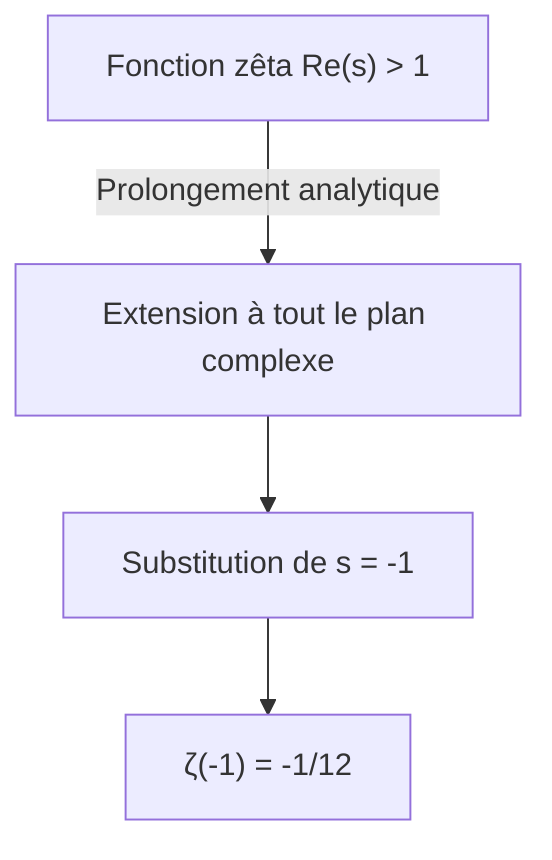
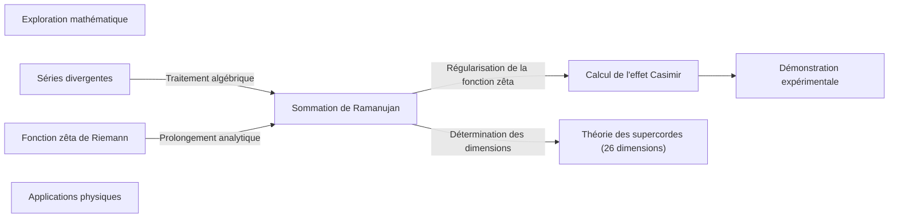

## 1. Introduction : L'étrangeté de l'addition à l'infini

Dans notre intuition quotidienne, si nous additionnons des nombres positifs indéfiniment, la somme augmentera sans limite. En d'autres termes, il est naturel de penser que si nous continuons le calcul de « $1 + 2 + 3 + 4 + \dots$ » à l'infini, le résultat sera **l'infini ( $\infty$ )**. Mathématiquement, on dit que la série « diverge ».

Cependant, dans le monde des mathématiques avancées, telles que la physique théorique et l'analyse complexe, une valeur très étrange peut être attribuée à cette addition infinie. Voici la formule :

$$
1 + 2 + 3 + 4 + \dots = -\frac{1}{12}
$$

Bien que nous additionnions des entiers positifs à l'infini, la somme devient inexplicablement une **fraction négative**. Ce résultat contre-intuitif est devenu célèbre lorsque le génie des mathématiques indien [Srinivasa Ramanujan](https://kenji.blog/fr/p/ramanujan/) l'a mentionné dans une lettre adressée au mathématicien britannique G. H. Hardy.

Dans cet article, nous expliquerons la méthode appelée « sommation de Ramanujan » ([Ramanujan Summation](https://kenji.blog/fr/p/ramanujan-summation/)), comment cette valeur étrange est dérivée, et comment elle est liée aux phénomènes physiques du monde réel.

---

## 2. Séries divergentes et redéfinition de la « somme »

### Série de Grandi (Grandi's series)

Pour comprendre la sommation de Ramanujan, examinons d'abord une autre série infinie un peu plus simple. Il s'agit de la série « $1 - 1 + 1 - 1 + \dots$ ». Elle est appelée la **série de Grandi**, d'après le nom de celui qui l'a découverte.

$$
S_1 = 1 - 1 + 1 - 1 + 1 - 1 + \dots
$$

Quelle est la somme de cette série ? Si nous changeons l'ordre d'addition et ajoutons des parenthèses, nous obtenons des résultats différents.

1. Si **(1 - 1) + (1 - 1) + ...** on obtient $0 + 0 + \dots = 0$
2. Si **1 - (1 - 1) - (1 - 1) - ...** on obtient $1 - 0 - 0 - \dots = 1$

Ainsi, selon la façon de calculer, le résultat peut être $0$ ou $1$. Selon les définitions mathématiques standard, une telle série « diverge » et n'a pas de valeur définie. Cependant, en utilisant une astuce algébrique, une valeur intéressante peut être dérivée.

Soustrayons $S_1$ du nombre entier 1 :

$$
1 - S_1 = 1 - (1 - 1 + 1 - 1 + \dots)
$$
$$
1 - S_1 = 1 - 1 + 1 - 1 + \dots = S_1
$$

Par conséquent, nous obtenons $1 - S_1 = S_1$, et en résolvant ceci, nous trouvons **$S_1 = \frac{1}{2}$**.
Puisque l'état oscille entre $0$ et $1$, il peut sembler intuitivement acceptable de lui attribuer leur moyenne, soit $\frac{1}{2}$.

### Une autre série : La série alternée

Considérons ensuite la série $S_2$ suivante :

$$
S_2 = 1 - 2 + 3 - 4 + 5 - \dots
$$

Imaginons l'opération consistant à l'additionner à elle-même. Le point clé est de décaler un peu l'addition.

$$
\begin{array}{rcrrrrrl}
S_2 & = & 1 & -2 & +3 & -4 & +5 & -\dots \\
{}+S_2 & = & & +1 & -2 & +3 & -4 & +\dots \\
\hline
2S_2 & = & 1 & -1 & +1 & -1 & +1 & -\dots
\end{array}
$$

Comme vous l'avez peut-être remarqué, le côté droit correspond à la série de Grandi $S_1$ vue précédemment. Par conséquent,

$$
2S_2 = S_1 = \frac{1}{2}
$$

En résolvant ceci, nous obtenons **$S_2 = \frac{1}{4}$**.

### Enfin, vers la sommation de Ramanujan

Nous sommes maintenant prêts. Considérons le sujet principal, la somme de tous les nombres entiers naturels, $S$.

$$
S = 1 + 2 + 3 + 4 + 5 + 6 + \dots
$$

Soustrayons le $S_2$ précédent de ceci.

$$
S - S_2 = (1 + 2 + 3 + 4 + 5 + 6 + \dots) - (1 - 2 + 3 - 4 + 5 - 6 + \dots)
$$

En effectuant la soustraction terme à terme, les termes impairs s'annulent et les termes pairs doublent.

$$
S - S_2 = 0 + 4 + 0 + 8 + 0 + 12 + \dots = 4 + 8 + 12 + \dots
$$

Le côté droit peut être factorisé par $4$.

$$
S - S_2 = 4(1 + 2 + 3 + \dots) = 4S
$$

Nous obtenons ainsi l'équation $S - S_2 = 4S$. En réorganisant les termes, on a :

$$
-3S = S_2
$$

Comme nous avons trouvé précédemment que $S_2 = \frac{1}{4}$, nous pouvons substituer cette valeur.

$$
-3S = \frac{1}{4}
$$
$$
S = -\frac{1}{12}
$$

C'est ainsi qu'a été dérivée l'étonnante équation **$1 + 2 + 3 + 4 + \dots = -\frac{1}{12}$**.

---

## 3. Prolongement analytique et fonction zêta de [Riemann](https://kenji.blog/fr/p/riemann/)

De telles opérations algébriques peuvent sembler, à première vue, n'être qu'un simple tour de passe-passe ou un sophisme. Appliquer sans condition les opérations arithmétiques habituelles aux séries divergentes n'est pas permis dans les mathématiques rigoureuses.

Cependant, ce résultat n'est en aucun cas dénué de sens. Dans les mathématiques modernes, cela peut être corroboré en utilisant le concept rigoureux de **prolongement analytique (Analytic Continuation)**.

### La fonction zêta de [Riemann](https://kenji.blog/fr/p/riemann/)

Pour expliquer le prolongement analytique, nous introduisons la **fonction zêta de [Riemann](https://kenji.blog/fr/p/riemann/)** $\zeta(s)$. La fonction zêta est définie comme suit :

$$
\zeta(s) = 1^{-s} + 2^{-s} + 3^{-s} + 4^{-s} + \dots = \sum_{n=1}^{\infty} \frac{1}{n^s}
$$

Ici, $s$ est un nombre complexe. Cette série ne converge et n'a une valeur finie que lorsque la partie réelle de $s$ est supérieure à $1$ ( $\text{Re}(s) > 1$ ).

Par exemple, lorsque $s = 2$, cela devient le célèbre problème de Bâle, et il est connu qu'elle converge vers $\zeta(2) = \frac{\pi^2}{6}$.

### Extension par prolongement analytique

Alors, que se passe-t-il si l'on remplace $s$ par $-1$ ?

$$
\zeta(-1) = 1^1 + 2^1 + 3^1 + 4^1 + \dots = 1 + 2 + 3 + 4 + \dots
$$

C'est exactement la somme de tous les entiers naturels que nous recherchons. Cependant, comme $s = -1$ est en dehors du domaine de convergence dans la définition originale de la fonction zêta, elle ne peut pas être calculée directement.

Les mathématiciens utilisent alors une technique appelée **prolongement analytique**. Il s'agit d'une méthode pour étendre une fonction lisse définie dans un certain domaine vers un domaine plus vaste où elle n'était pas définie à l'origine, tout en conservant ses propriétés (telles que la dérivabilité).

[Riemann](https://kenji.blog/fr/p/riemann/) a prouvé que la fonction zêta peut être étendue de manière unique à l'ensemble du plan complexe (à l'exception du pôle en $s=1$). Si l'on calcule la valeur pour $s = -1$ dans la fonction zêta étendue, on découvre remarquablement que le résultat est **$-\frac{1}{12}$**.

En d'autres termes, l'équation « $1+2+3+... = -1/12$ » n'est pas justifiée comme une « somme au sens habituel », mais comme une « valeur au sens du prolongement analytique via la fonction zêta ».

---

## 4. Exemples pratiques en physique : Effet Casimir et théorie des supercordes

Cette valeur de $-\frac{1}{12}$ ne se limite pas à un simple puzzle mathématique. Étonnamment, cette valeur apparaît également dans le monde physique réel, et ses effets ont été observés par des expériences.

### Effet Casimir

Dans le monde de la mécanique quantique, même dans un vide parfait, l'énergie n'est pas nulle. Une énergie appelée « énergie du point zéro » fluctue constamment.

En 1948, le physicien néerlandais Hendrik Casimir a prédit que si deux plaques métalliques sont placées parallèlement avec un très petit espace dans le vide, une force d'attraction s'exercerait entre elles. C'est ce qu'on appelle **l'effet Casimir**.

Lors du calcul de cette force d'attraction, il est nécessaire d'additionner les énergies d'une infinité de modes (fréquences) d'ondes électromagnétiques existant entre les plaques métalliques. Dans cette formule, c'est précisément la série divergente $\sum_{n=1}^{\infty} n = 1 + 2 + 3 + \dots$ qui apparaît.

Pour traiter cet infini, les physiciens utilisent la régularisation de la fonction zêta (dans le cadre d'une méthode de renormalisation), et en remplaçant cette somme par $-\frac{1}{12}$, le résultat du calcul dérive une force finie. De plus, ce qui est important, c'est que **le résultat de ce calcul correspond parfaitement aux mesures réelles expérimentales**.

### Théorie des cordes bosoniques

De plus, cette valeur joue un rôle important dans le modèle initial de la théorie des supercordes (théorie des cordes bosoniques), qui traite toute la matière de l'univers comme des « cordes » unidimensionnelles.

Pour que la théorie des cordes bosoniques soit mathématiquement cohérente, le nombre de dimensions de l'espace-temps, $D$, doit remplir certaines conditions. Lors du processus d'addition des énergies des modes de vibration de la corde, la somme infinie $1 + 2 + 3 + \dots$ apparaît de nouveau, et si elle est définie à $-\frac{1}{12}$, l'équation devient la suivante :

$$
\frac{D - 2}{2} \times \left(-\frac{1}{12}\right) + 1 = 0
$$

En résolvant ceci, nous obtenons $D = 26$. Cela signifie que l'on en déduit que la théorie des cordes bosoniques ne peut exister que dans un **espace-temps à 26 dimensions**. (Plus tard, dans la théorie des supercordes incluant les fermions, cela devient 10 dimensions, mais la structure mathématique sous-jacente est similaire.)

---

## 5. Conclusion

Pour quiconque voit l'équation « $1 + 2 + 3 + 4 + \dots = -\frac{1}{12}$ » pour la première fois, elle peut sembler être une erreur flagrante ou un sophisme. En effet, selon la définition de « l'addition » que nous utilisons quotidiennement, cette série diverge vers l'infini.

Cependant, lorsque les mathématiques ont utilisé l'outil du « prolongement analytique » pour étendre le concept de fonction, un nouveau paysage s'est ouvert. Plus étonnant encore, ce concept abstrait, exploré par les mathématiciens par pure curiosité intellectuelle, est devenu plus tard une pièce de puzzle essentielle pour percer les mystères de la structure de l'univers dans la physique de pointe, telle que la mécanique quantique et la théorie des cordes.

La sommation de Ramanujan est l'un des exemples les plus beaux de la profondeur des mathématiques et des connexions mystérieuses qui existent entre les mathématiques et la physique.

