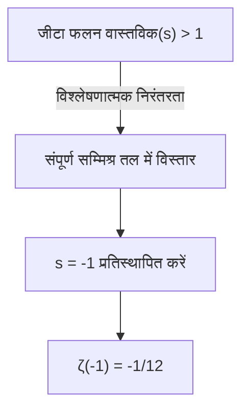
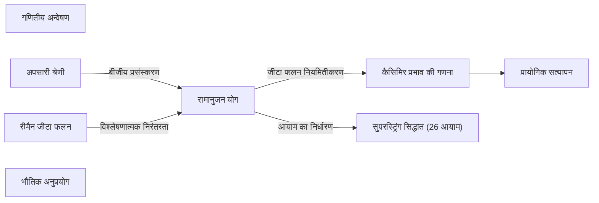

## 1. परिचय: अनंत को जोड़ने का रहस्य

हमारी रोजमर्रा की समझ में, यदि हम धनात्मक संख्याओं को जोड़ते जाते हैं, तो योग असीमित रूप से बड़ा हो जाता है। अर्थात्, यदि हम " $1 + 2 + 3 + 4 + \dots$ " की गणना अनंत तक जारी रखते हैं, तो यह सोचना स्वाभाविक है कि परिणाम **अनंत ( $\infty$ )** होगा। इसे गणितीय रूप से "अपसारी (divergent)" कहा जाता है।

हालाँकि, सैद्धांतिक भौतिकी और जटिल विश्लेषण (complex analysis) जैसे उन्नत गणित की दुनिया में, इस अनंत योग के लिए एक बहुत ही अजीब मान निर्धारित किया जा सकता है। वह निम्न समीकरण है।

$$
1 + 2 + 3 + 4 + \dots = -\frac{1}{12}
$$

भले ही हम धनात्मक पूर्णांकों को अनंत तक जोड़ रहे हैं, किसी तरह यह एक **ऋणात्मक भिन्न** बन जाता है। यह सहज ज्ञान के विपरीत परिणाम तब प्रसिद्ध हुआ जब भारतीय प्रतिभाशाली गणितज्ञ [श्रीनिवास रामानुजन](https://kenji.blog/p/ramanujan/) ([Srinivasa Ramanujan](https://kenji.blog/p/ramanujan/)) ने ब्रिटिश गणितज्ञ जी.एच. हार्डी (G.H. Hardy) को लिखे एक पत्र में इसका उल्लेख किया।

इस लेख में, हम "[रामानुजन योग ([Ramanujan Summation](https://kenji.blog/p/ramanujan-summation/))](https://kenji.blog/p/ramanujan-summation/)" नामक इस पद्धति के बारे में बताएंगे कि यह अजीब मान कैसे प्राप्त होता है, और यह वास्तविक दुनिया की भौतिक घटनाओं से कैसे जुड़ा है।

---

## 2. अपसारी श्रेणी और "योग" की पुनर्परिभाषा

### ग्रांडी की श्रेणी (Grandi's series)

रामानुजन योग को समझने के पहले चरण के रूप में, आइए एक और सरल अनंत श्रेणी देखें। यह " $1 - 1 + 1 - 1 + \dots$ " की श्रेणी है। इसके खोजकर्ता के नाम पर इसे **ग्रांडी की श्रेणी** कहा जाता है।

$$
S_1 = 1 - 1 + 1 - 1 + 1 - 1 + \dots
$$

इस श्रेणी का योग क्या होगा? यदि आप जोड़ने का क्रम बदलते हैं और कोष्ठक लगाते हैं, तो आपको अलग-अलग परिणाम मिलते हैं।

1. **(1 - 1) + (1 - 1) + ...** करने पर $0 + 0 + \dots = 0$
2. **1 - (1 - 1) - (1 - 1) - ...** करने पर $1 - 0 - 0 - \dots = 1$

इस प्रकार, गणना के तरीके के आधार पर परिणाम $0$ या $1$ होता है। सामान्य गणितीय परिभाषाओं में, ऐसी श्रेणी "अपसारी" होती है और इसका कोई एक निश्चित मान नहीं होता है। हालाँकि, बीजीय तरकीबों (algebraic tricks) का उपयोग करके दिलचस्प मान निकाले जा सकते हैं।

आइए संपूर्ण में से $S_1$ को घटाएं।

$$
1 - S_1 = 1 - (1 - 1 + 1 - 1 + \dots)
$$
$$
1 - S_1 = 1 - 1 + 1 - 1 + \dots = S_1
$$

इसलिए, $1 - S_1 = S_1$ प्राप्त होता है, और इसे हल करने पर **$S_1 = \frac{1}{2}$** प्राप्त होता है।
चूंकि अवस्था $0$ और $1$ के बीच आगे-पीछे जा रही है, यह तथ्य कि इसका औसत $\frac{1}{2}$ दिया गया है, एक तरह से सहज रूप से समझ में आ सकता है।

### एक और श्रेणी: एकांतर श्रेणी (Alternating series)

आगे, हम निम्नलिखित श्रेणी $S_2$ पर विचार करेंगे।

$$
S_2 = 1 - 2 + 3 - 4 + 5 - \dots
$$

आइए इनमें से $2$ को एक साथ जोड़ने के संचालन पर विचार करें। मुख्य बात यह है कि इसे थोड़ा खिसका कर जोड़ा जाए।

$$
\begin{array}{rcrrrrrl}
S_2 & = & 1 & -2 & +3 & -4 & +5 & -\dots \\
{}+S_2 & = & & +1 & -2 & +3 & -4 & +\dots \\
\hline
2S_2 & = & 1 & -1 & +1 & -1 & +1 & -\dots
\end{array}
$$

जैसा कि आपने देखा होगा, दाहिना पक्ष पहले वाली ग्रांडी की श्रेणी $S_1$ बन गया है। इसलिए,

$$
2S_2 = S_1 = \frac{1}{2}
$$

इसे हल करने पर, **$S_2 = \frac{1}{4}$** प्राप्त होता है।

### अंततः रामानुजन योग की ओर

हम तैयार हैं। आइए मुख्य विषय, सभी प्राकृत संख्याओं के योग $S$ पर विचार करें।

$$
S = 1 + 2 + 3 + 4 + 5 + 6 + \dots
$$

यहाँ से हम पहले वाले $S_2$ को घटाते हैं।

$$
S - S_2 = (1 + 2 + 3 + 4 + 5 + 6 + \dots) - (1 - 2 + 3 - 4 + 5 - 6 + \dots)
$$

पद-दर-पद घटाने पर, विषम पद रद्द हो जाते हैं और सम पद दोगुने हो जाते हैं।

$$
S - S_2 = 0 + 4 + 0 + 8 + 0 + 12 + \dots = 4 + 8 + 12 + \dots
$$

दाहिने पक्ष को $4$ के साथ कोष्ठक में रखा जा सकता है।

$$
S - S_2 = 4(1 + 2 + 3 + \dots) = 4S
$$

इसलिए, हमें $S - S_2 = 4S$ समीकरण प्राप्त होता है। इसे रूपांतरित करने पर,

$$
-3S = S_2
$$

चूंकि हमने पहले $S_2 = \frac{1}{4}$ पाया था, इसलिए हम इसे प्रतिस्थापित करते हैं।

$$
-3S = \frac{1}{4}
$$
$$
S = -\frac{1}{12}
$$

इस प्रकार, **$1 + 2 + 3 + 4 + \dots = -\frac{1}{12}$** का आश्चर्यजनक समीकरण प्राप्त होता है।

---

## 3. विश्लेषणात्मक निरंतरता (Analytic Continuation) और रीमैन जीटा फलन (Riemann Zeta function)

उपरोक्त जैसे बीजीय संचालन पहली नज़र में केवल एक चाल या कुतर्क की तरह लग सकते हैं। अपसारी श्रेणी के लिए सामान्य अंकगणितीय संक्रियाओं को बिना शर्त लागू करने की सख्त गणित में अनुमति नहीं है।

हालाँकि, यह परिणाम कभी भी अर्थहीन नहीं है। आधुनिक गणित में, इसे **विश्लेषणात्मक निरंतरता (Analytic Continuation)** नामक एक सख्त अवधारणा का उपयोग करके समर्थित किया जा सकता है।

### रीमैन जीटा फलन

विश्लेषणात्मक निरंतरता को समझाने के लिए, हम **रीमैन जीटा फलन** $\zeta(s)$ का परिचय देते हैं। जीटा फलन को इस प्रकार परिभाषित किया गया है।

$$
\zeta(s) = 1^{-s} + 2^{-s} + 3^{-s} + 4^{-s} + \dots = \sum_{n=1}^{\infty} \frac{1}{n^s}
$$

यहाँ $s$ एक सम्मिश्र संख्या (complex number) है। यह श्रेणी केवल तभी अभिसरित (converge) होती है और इसका एक सीमित मान होता है जब $s$ का वास्तविक भाग $1$ से बड़ा होता है ( $\text{वास्तविक}(s) > 1$ )।

उदाहरण के लिए, जब $s = 2$ होता है, तो यह प्रसिद्ध बेसल समस्या (Basel problem) बन जाती है, और यह ज्ञात है कि यह $\zeta(2) = \frac{\pi^2}{6}$ पर अभिसरित होती है।

### विश्लेषणात्मक निरंतरता द्वारा विस्तार

तो, अगर हम $s = -1$ प्रतिस्थापित करें तो क्या होगा?

$$
\zeta(-1) = 1^1 + 2^1 + 3^1 + 4^1 + \dots = 1 + 2 + 3 + 4 + \dots
$$

यह बिल्कुल सभी प्राकृत संख्याओं का योग है जिसकी हमें तलाश है। हालाँकि, मूल जीटा फलन की परिभाषा में, $s = -1$ अभिसरण क्षेत्र के बाहर है, इसलिए इसकी सीधे गणना नहीं की जा सकती है।

इसलिए, गणितज्ञ **विश्लेषणात्मक निरंतरता** नामक तकनीक का उपयोग करते हैं। यह एक ऐसी विधि है जो एक निश्चित क्षेत्र में परिभाषित सुचारू फलन (smooth function) का विस्तार करके एक व्यापक क्षेत्र में ले जाती है जहाँ इसे मूल रूप से इसके गुणों (जैसे अवकलनीयता (differentiability)) को बनाए रखते हुए परिभाषित नहीं किया गया था।

रीमैन ने साबित किया कि जीटा फलन को पूरे सम्मिश्र तल ( $s=1$ के पोल को छोड़कर) में विशिष्ट रूप से विस्तारित किया जा सकता है। जब हम विस्तारित जीटा फलन में $s = -1$ के मान की गणना करते हैं, तो हम पाते हैं कि यह शानदार ढंग से **$-\frac{1}{12}$** बन जाता है।

दूसरे शब्दों में, समीकरण " $1+2+3+... = -1/12$ " को "सामान्य अर्थों में योग" के रूप में नहीं, बल्कि "जीटा फलन के माध्यम से विश्लेषणात्मक रूप से निरंतर अर्थ में मान" के रूप में उचित ठहराया गया है।

---

## 4. भौतिकी में व्यावहारिक उदाहरण: कैसिमिर प्रभाव (Casimir effect) और स्ट्रिंग सिद्धांत (String theory)

यह **$-\frac{1}{12}$** का मान केवल एक गणितीय पहेली तक सीमित नहीं है। आश्चर्यजनक रूप से, यह मान वास्तविक भौतिक दुनिया में भी प्रकट होता है, और प्रयोगों द्वारा इसके प्रभावों का अवलोकन किया गया है।

### कैसिमिर प्रभाव

क्वांटम यांत्रिकी (Quantum mechanics) की दुनिया में, एक पूर्ण निर्वात में भी ऊर्जा शून्य नहीं होती है। "शून्य-बिंदु ऊर्जा (Zero-point energy)" नामक ऊर्जा हमेशा उतार-चढ़ाव में रहती है।

1948 में, डच भौतिक विज्ञानी हेंड्रिक कैसिमिर (Hendrik Casimir) ने भविष्यवाणी की थी कि यदि दो धातु की प्लेटों को निर्वात में बहुत कम गैप के साथ समानांतर में रखा जाए, तो धातु की प्लेटों के बीच एक आकर्षक बल (attractive force) कार्य करेगा। इसे **कैसिमिर प्रभाव** कहा जाता है।

इस आकर्षक बल की गणना करते समय, धातु की प्लेटों के बीच मौजूद अनगिनत विद्युत चुम्बकीय तरंग मोड (आवृत्ति) की ऊर्जा को जोड़ना आवश्यक है। इस गणना सूत्र में, वास्तव में अपसारी श्रेणी $\sum_{n=1}^{\infty} n = 1 + 2 + 3 + \dots$ दिखाई देती है।

जब भौतिक विज्ञानी इस अनंत को संभालने के लिए (पुनर्सामान्यीकरण (renormalization) नामक तकनीक के एक भाग के रूप में) जीटा फलन नियमितीकरण (Zeta function regularization) का उपयोग करते हैं और इस योग को $-\frac{1}{12}$ से बदल देते हैं, तो गणना का परिणाम एक सीमित बल के रूप में प्राप्त होता है। और महत्वपूर्ण बात यह है कि **यह गणना परिणाम वास्तविक प्रयोगों में मापे गए मानों के साथ पूरी तरह से मेल खाता है** ।

### बोसोनिक स्ट्रिंग सिद्धांत (Bosonic string theory)

इसके अलावा, सुपरस्ट्रिंग सिद्धांत के प्रारंभिक मॉडल (बोसोनिक स्ट्रिंग सिद्धांत), जो ब्रह्मांड के सभी पदार्थों को 1-आयामी "स्ट्रिंग (तार)" के रूप में मानता है, उसमें भी यह मान एक महत्वपूर्ण भूमिका निभाता है।

बोसोनिक स्ट्रिंग सिद्धांत को गणितीय रूप से सुसंगत बनाने के लिए, स्पेसटाइम (spacetime) के आयामों की संख्या $D$ को कुछ शर्तों को पूरा करना होगा। स्ट्रिंग के कंपन मोड की ऊर्जा को जोड़ने की प्रक्रिया में, अनंत योग $1 + 2 + 3 + \dots$ फिर से प्रकट होता है, और यदि हम इसे $-\frac{1}{12}$ मानते हैं, तो समीकरण निम्नानुसार हो जाता है:

$$
\frac{D - 2}{2} \times \left(-\frac{1}{12}\right) + 1 = 0
$$

इसे हल करने पर, हमें $D = 26$ प्राप्त होता है। दूसरे शब्दों में, परिणाम यह है कि बोसोनिक स्ट्रिंग सिद्धांत केवल **26-आयामी स्पेसटाइम** में ही सत्य है। (सुपरस्ट्रिंग सिद्धांत में, जो बाद में फर्मियन (fermions) को शामिल करता है, यह 10 आयाम हो जाता है, लेकिन इसके पीछे की गणितीय संरचना समान है।)

---

## 5. निष्कर्ष

" $1 + 2 + 3 + 4 + \dots = -\frac{1}{12}$ " समीकरण, पहली बार इसे देखने वाले किसी भी व्यक्ति के लिए एक स्पष्ट गलती या कुतर्क लग सकता है। वास्तव में, "जोड़ (addition)" की परिभाषा में जिसका उपयोग हम रोजमर्रा की जिंदगी में करते हैं, यह श्रेणी अनंत तक अपसरित होती है।

हालाँकि, जब गणित ने "विश्लेषणात्मक निरंतरता" नामक उपकरण का उपयोग करके फलन की अवधारणा का विस्तार किया, तो एक नया परिदृश्य सामने आया। और इससे भी अधिक आश्चर्यजनक बात यह है कि गणितज्ञों द्वारा शुद्ध बौद्धिक जिज्ञासा से खोजी गई अमूर्त अवधारणा, बाद में क्वांटम यांत्रिकी और स्ट्रिंग सिद्धांत जैसे अत्याधुनिक भौतिकी में ब्रह्मांड की संरचना को उजागर करने के लिए एक आवश्यक पहेली का टुकड़ा बन गई।

रामानुजन योग गणित की गहराई और गणित और भौतिकी के बीच मौजूद रहस्यमय संबंध को सिखाने वाले सबसे खूबसूरत उदाहरणों में से एक है।

