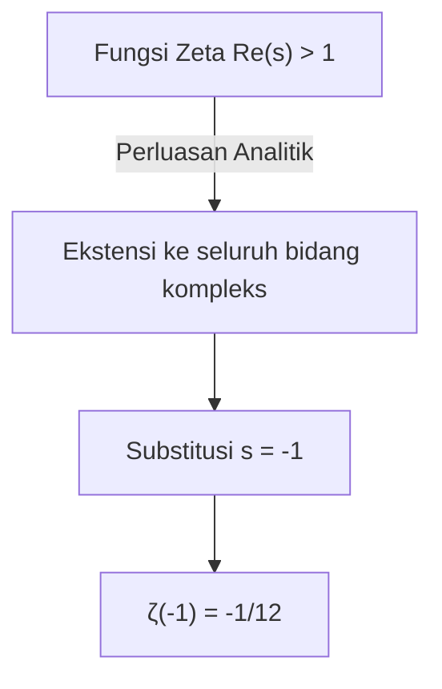
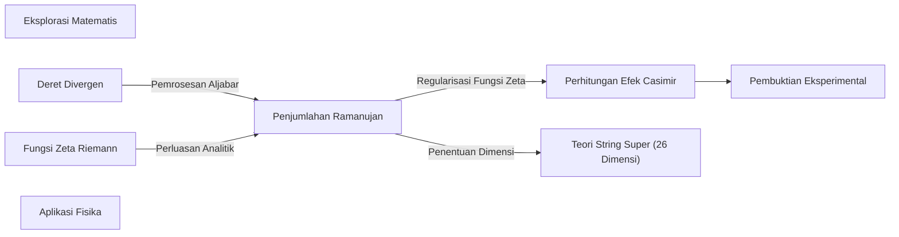

## 1. Pendahuluan: Keajaiban Menjumlahkan Tak Terhingga

Dalam pemahaman kita sehari-hari, jika kita terus-menerus menambahkan bilangan positif, jumlahnya akan bertambah besar tanpa batas. Dengan kata lain, wajar untuk berpikir bahwa jika kita melanjutkan perhitungan "$1 + 2 + 3 + 4 + \dots$" tanpa henti, hasilnya akan menjadi **tak terhingga ($\infty$)**. Secara matematis, ini disebut "divergen" (menyimpang).

Namun, dalam dunia matematika tingkat lanjut seperti fisika teoretis dan analisis kompleks, penjumlahan tak terhingga ini terkadang diberi nilai yang sangat aneh. Itulah persamaan berikut:

$$
1 + 2 + 3 + 4 + \dots = -\frac{1}{12}
$$

Meskipun bilangan bulat positif ditambahkan tanpa henti, entah bagaimana hasilnya menjadi **pecahan negatif**. Hasil yang berlawanan dengan intuisi ini menjadi terkenal ketika ahli matematika jenius asal India, Srinivasa Ramanujan, menyebutkannya dalam sebuah surat kepada ahli matematika Inggris G.H. Hardy.

Dalam artikel ini, kami akan menjelaskan teknik yang disebut "Penjumlahan Ramanujan (Ramanujan Summation)" ini, bagaimana nilai aneh ini diperoleh, dan bagaimana hal itu berkaitan dengan fenomena fisika di dunia nyata.

---

## 2. Deret Divergen dan Definisi Ulang "Penjumlahan"

### Deret Grandi (Grandi's series)

Sebagai langkah pertama untuk memahami Penjumlahan Ramanujan, mari kita lihat deret tak terhingga lain yang sedikit lebih sederhana. Yaitu deret "$1 - 1 + 1 - 1 + \dots$". Ini disebut **Deret Grandi**, diambil dari nama penemunya.

$$
S_1 = 1 - 1 + 1 - 1 + 1 - 1 + \dots
$$

Berapa jumlah deret ini? Jika kita mengubah urutan penambahan dan meletakkan tanda kurung, kita mendapatkan hasil yang berbeda.

1. Jika **(1 - 1) + (1 - 1) + ...** maka $0 + 0 + \dots = 0$
2. Jika **1 - (1 - 1) - (1 - 1) - ...** maka $1 - 0 - 0 - \dots = 1$

Dengan cara ini, hasilnya bisa menjadi $0$ atau $1$ tergantung cara Anda menghitungnya. Dalam definisi matematis standar, deret seperti itu dianggap "divergen" dan tidak memiliki nilai tunggal yang pasti. Namun, dengan menggunakan trik aljabar, nilai yang menarik dapat diturunkan.

Mari kita kurangi $S_1$ dari keseluruhan:

$$
1 - S_1 = 1 - (1 - 1 + 1 - 1 + \dots)
$$
$$
1 - S_1 = 1 - 1 + 1 - 1 + \dots = S_1
$$

Jadi, $1 - S_1 = S_1$, dan jika kita memecahkannya, kita mendapatkan **$S_1 = \frac{1}{2}$**.
Karena kondisinya berfluktuasi antara $0$ dan $1$, mungkin secara intuitif masuk akal bahwa nilai rata-ratanya, yaitu $\frac{1}{2}$, diberikan.

### Deret Lain: Deret Selang-seling

Selanjutnya, pertimbangkan deret $S_2$ berikut.

$$
S_2 = 1 - 2 + 3 - 4 + 5 - \dots
$$

Pertimbangkan operasi menjumlahkan $2$ deret ini. Kuncinya adalah menjumlahkannya dengan sedikit pergeseran.

$$
S_2 = 1 - 2 + 3 - 4 + 5 - \dots
$$
$$
+ S_2 = \quad 1 - 2 + 3 - 4 + \dots
$$
$$
-------------------------
$$
$$
2S_2 = 1 - 1 + 1 - 1 + 1 - \dots
$$

Seperti yang Anda perhatikan, ruas kanan telah menjadi deret Grandi $S_1$ dari sebelumnya. Oleh karena itu,

$$
2S_2 = S_1 = \frac{1}{2}
$$

Jika kita menyelesaikan ini, kita mendapatkan **$S_2 = \frac{1}{4}$**.

### Akhirnya Menuju Penjumlahan Ramanujan

Persiapan telah selesai. Mari kita pertimbangkan topik utamanya, yaitu jumlah seluruh bilangan asli $S$.

$$
S = 1 + 2 + 3 + 4 + 5 + 6 + \dots
$$

Dari sini, mari kita kurangi $S_2$ sebelumnya.

$$
S - S_2 = (1 + 2 + 3 + 4 + 5 + 6 + \dots) - (1 - 2 + 3 - 4 + 5 - 6 + \dots)
$$

Saat kita melakukan pengurangan demi suku, suku ganjil akan saling meniadakan, dan suku genap akan berlipat ganda.

$$
S - S_2 = 0 + 4 + 0 + 8 + 0 + 12 + \dots = 4 + 8 + 12 + \dots
$$

Sisi kanan dapat difaktorkan dengan $4$.

$$
S - S_2 = 4(1 + 2 + 3 + \dots) = 4S
$$

Oleh karena itu, diperoleh persamaan $S - S_2 = 4S$. Dengan memanipulasi ini,

$$
-3S = S_2
$$

Karena $S_2 = \frac{1}{4}$ seperti yang kita hitung sebelumnya, kita mensubstitusikan ini.

$$
-3S = \frac{1}{4}
$$
$$
S = -\frac{1}{12}
$$

Dengan demikian, persamaan mengejutkan **$1 + 2 + 3 + 4 + \dots = -\frac{1}{12}$** dapat diturunkan.

---

## 3. Perluasan Analitik dan Fungsi Zeta Riemann

Operasi aljabar seperti di atas mungkin pada pandangan pertama terlihat seperti sekadar trik atau sofisme. Menerapkan operasi aritmetika standar tanpa syarat pada deret yang divergen secara tegas tidak diizinkan dalam matematika yang ketat.

Namun, hasil ini tidak sama sekali tidak berarti. Dalam matematika modern, hal ini dapat didukung menggunakan konsep ketat yang disebut **Perluasan Analitik (Analytic Continuation)**.

### Fungsi Zeta Riemann

Untuk menjelaskan perluasan analitik, kami akan memperkenalkan **Fungsi Zeta Riemann** $\zeta(s)$. Fungsi zeta didefinisikan sebagai berikut.

$$
\zeta(s) = 1^{-s} + 2^{-s} + 3^{-s} + 4^{-s} + \dots = \sum_{n=1}^{\infty} \frac{1}{n^s}
$$

Di sini, $s$ adalah bilangan kompleks. Deret ini menyatu dan memiliki nilai berhingga hanya ketika bagian nyata dari $s$ lebih besar dari $1$ ($\text{Re}(s) > 1$).

Misalnya, bila $s = 2$, ini menjadi Masalah Basel yang terkenal, dan diketahui menyatu ke $\zeta(2) = \frac{\pi^2}{6}$.

### Ekstensi dengan Perluasan Analitik

Lalu, apa yang terjadi jika kita memasukkan $s = -1$?

$$
\zeta(-1) = 1^1 + 2^1 + 3^1 + 4^1 + \dots = 1 + 2 + 3 + 4 + \dots
$$

Ini persis jumlah semua bilangan asli yang kita cari. Namun, berdasarkan definisi fungsi zeta yang asli, $s = -1$ berada di luar wilayah konvergensi, sehingga tidak dapat dihitung secara langsung.

Oleh karena itu, para ahli matematika menggunakan teknik yang disebut **perluasan analitik**. Ini adalah metode untuk memperluas fungsi halus yang didefinisikan dalam domain tertentu ke domain yang lebih luas di mana fungsi tersebut aslinya tidak didefinisikan, sambil mempertahankan propertinya (seperti diferensiabilitas).

Riemann membuktikan bahwa fungsi zeta dapat diperluas secara unik ke seluruh bidang kompleks (tidak termasuk kutub pada $s=1$). Jika kita menghitung nilai untuk $s = -1$ dalam fungsi zeta yang diperluas ini, kita menemukan bahwa nilainya menjadi **$-\frac{1}{12}$** dengan luar biasa.

Dengan kata lain, ekspresi "$1+2+3+... = -1/12$" dibenarkan bukan sebagai "penjumlahan dalam arti biasa," tetapi sebagai "nilai dalam pengertian perluasan analitik melalui fungsi zeta".

---

## 4. Contoh Praktis dalam Fisika: Efek Casimir dan Teori String Super

Nilai $-\frac{1}{12}$ ini bukan hanya teka-teki matematika. Hebatnya, nilai ini juga muncul di dunia fisik nyata, dan efeknya telah diamati melalui eksperimen.

### Efek Casimir

Dalam dunia mekanika kuantum, energi tidak pernah nol, bahkan dalam ruang hampa yang sempurna. Selalu ada fluktuasi energi yang disebut "energi titik nol".

Pada tahun 1948, fisikawan Belanda Hendrik Casimir meramalkan bahwa jika dua pelat logam ditempatkan sejajar dengan celah yang sangat kecil dalam ruang hampa, gaya tarik-menarik akan bekerja di antara pelat-pelat tersebut. Ini disebut **Efek Casimir**.

Saat menghitung gaya tarik-menarik ini, perlu untuk menjumlahkan semua energi dari berbagai mode gelombang elektromagnetik (frekuensi) yang tak terhitung jumlahnya yang ada di antara pelat logam. Dalam rumus perhitungan ini, deret divergen $\sum_{n=1}^{\infty} n = 1 + 2 + 3 + \dots$ benar-benar muncul.

Ketika fisikawan menggunakan regularisasi fungsi zeta (sebagai bagian dari teknik yang disebut renormalisasi) untuk menangani ketakterhinggaan ini, dan mengganti penjumlahan ini dengan $-\frac{1}{12}$, hasil perhitungan diturunkan sebagai gaya yang terbatas. Dan yang terpenting adalah kenyataan bahwa **hasil perhitungan ini sangat cocok dengan nilai terukur dalam eksperimen aktual**.

### Teori String Bosonik

Selanjutnya, nilai ini juga memainkan peran penting dalam model awal teori string super (teori string bosonik), yang memperlakukan semua materi di alam semesta sebagai "tali (string)" 1 dimensi.

Agar teori string bosonik dapat bertahan secara logis tanpa kontradiksi matematika, jumlah dimensi ruang-waktu $D$ harus memenuhi kondisi tertentu. Dalam proses penjumlahan energi mode vibrasi dari string, jumlah tak terhingga $1 + 2 + 3 + \dots$ kembali muncul, dan jika kita tetapkan ini menjadi $-\frac{1}{12}$, persamaannya menjadi sebagai berikut.

$$
\frac{D - 2}{2} \times \left(-\frac{1}{12}\right) + 1 = 0
$$

Dengan menyelesaikan ini, kita mendapatkan $D = 26$. Dengan kata lain, hasil yang diturunkan adalah bahwa teori string bosonik hanya valid dalam **ruang-waktu 26 dimensi**. (Meskipun teori string super yang belakangan menggabungkan fermion memiliki 10 dimensi, struktur matematika di baliknya serupa.)

---

## 5. Kesimpulan

Bagi mereka yang melihatnya pertama kali, persamaan "$1 + 2 + 3 + 4 + \dots = -\frac{1}{12}$" mungkin tampak seperti kesalahan yang jelas atau sebuah sofisme. Faktanya, dalam definisi "penjumlahan" yang kita gunakan sehari-hari, deret ini memang menyimpang menuju tak terhingga.

Namun, ketika matematika memperluas konsep fungsi menggunakan alat "perluasan analitik", sebuah lanskap baru pun terbentang di sana. Dan yang lebih mengejutkan adalah bahwa konsep abstrak yang dieksplorasi oleh para matematikawan murni karena rasa ingin tahu intelektual, belakangan menjadi potongan teka-teki yang esensial untuk mengungkap struktur alam semesta dalam fisika mutakhir seperti mekanika kuantum dan teori string.

Penjumlahan Ramanujan dapat dikatakan sebagai salah satu contoh terindah yang mengajarkan kita tentang kedalaman matematika dan hubungan mistis yang ada di antara matematika dan fisika.

