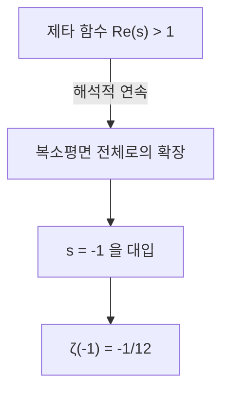
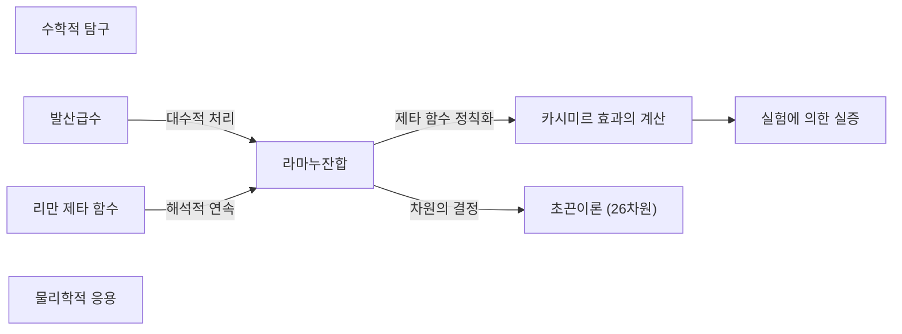

## 1. 서론: 무한을 더한다는 것의 신비함

우리의 일상적인 감각으로는 양수를 계속 더해나가면 그 합은 끝없이 커집니다. 즉, 「 $1 + 2 + 3 + 4 + \dots$ 」라는 계산을 무한히 계속하면, 결과는 **무한대( $\infty$ )** 가 된다고 생각하는 것이 자연스럽습니다. 이는 수학적으로 「발산한다」고 말합니다.

그러나 이론물리학이나 복소해석이라는 고도의 수학 세계에서는 이 무한의 덧셈에 대해 매우 기묘한 값이 할당되는 경우가 있습니다. 그것이 다음 식입니다.

$$
1 + 2 + 3 + 4 + \dots = -\frac{1}{12}
$$

양의 정수를 무한히 더하고 있는데 어째서인지 **음의 분수** 가 되어버리는 것입니다. 이 직관에 반하는 결과는 인도의 천재 수학자 [스리니바사 라마누잔](https://kenji.blog/ko/p/ramanujan/)([Srinivasa Ramanujan](https://kenji.blog/ko/p/ramanujan/))이 영국의 수학자 G.H. 하디에게 보낸 편지에서 언급한 것으로 유명해졌습니다.

이 기사에서는 이 「[라마누잔합 (Ramanujan Summation)](https://kenji.blog/ko/p/ramanujan-summation/)」이라고 불리는 기법에 대해, 어떻게 해서 이 기묘한 값이 도출되는지, 그리고 그것이 현실 세계의 물리 현상과 어떻게 연결되어 있는지 해설합니다.

---

## 2. 발산급수와 「합」의 재정의

### 그란디 급수 (Grandi's series)

라마누잔합을 이해하기 위한 첫걸음으로 조금 더 간단한 다른 무한급수를 살펴보겠습니다. 그것은 「 $1 - 1 + 1 - 1 + \dots$ 」라는 급수입니다. 이것은 발견자의 이름을 따서 **그란디 급수** 라고 불립니다.

$$
S_1 = 1 - 1 + 1 - 1 + 1 - 1 + \dots
$$

이 급수의 합은 어떻게 될까요? 더하는 순서를 바꾸고 괄호를 묶어보면 다른 결과를 얻을 수 있습니다.

1. **(1 - 1) + (1 - 1) + ...** 으로 하면 $0 + 0 + \dots = 0$
2. **1 - (1 - 1) - (1 - 1) - ...** 으로 하면 $1 - 0 - 0 - \dots = 1$

이처럼 계산하는 방법에 따라 결과가 $0$ 이 되기도 하고 $1$ 이 되기도 합니다. 일반적인 수학의 정의에서는 이러한 급수는 「발산」하며 하나의 값으로 정해지지 않는다고 합니다. 그러나 대수적인 트릭을 사용하면 흥미로운 값이 도출됩니다.

$S_1$ 을 전체에서 빼 봅시다.

$$
1 - S_1 = 1 - (1 - 1 + 1 - 1 + \dots)
$$
$$
1 - S_1 = 1 - 1 + 1 - 1 + \dots = S_1
$$

따라서 $1 - S_1 = S_1$ 이 되며, 이를 풀면 **$S_1 = \frac{1}{2}$** 이 됩니다.
상태가 $0$ 과 $1$ 사이를 오가고 있기 때문에, 그 평균인 $\frac{1}{2}$ 이 할당된다는 것은 어떤 의미에서는 직관적으로 납득할 수 있을지도 모릅니다.

### 또 다른 급수: 교대급수

다음으로 아래의 급수 $S_2$ 를 생각합니다.

$$
S_2 = 1 - 2 + 3 - 4 + 5 - \dots
$$

이것을 $2$ 개 더하는 조작을 생각합니다. 조금 엇갈리게 더하는 것이 포인트입니다.

$$
\begin{array}{rcrrrrrl}
S_2 & = & 1 & -2 & +3 & -4 & +5 & -\dots \\
{}+S_2 & = & & +1 & -2 & +3 & -4 & +\dots \\
\hline
2S_2 & = & 1 & -1 & +1 & -1 & +1 & -\dots
\end{array}
$$

눈치채셨겠지만, 우변은 앞서 본 그란디 급수 $S_1$ 이 되었습니다. 따라서,

$$
2S_2 = S_1 = \frac{1}{2}
$$

이를 풀면 **$S_2 = \frac{1}{4}$** 이 됩니다.

### 드디어 라마누잔합으로

준비가 끝났습니다. 본론인 모든 자연수의 합 $S$ 를 생각해 봅시다.

$$
S = 1 + 2 + 3 + 4 + 5 + 6 + \dots
$$

여기서 앞서 구한 $S_2$ 를 빼 봅니다.

$$
S - S_2 = (1 + 2 + 3 + 4 + 5 + 6 + \dots) - (1 - 2 + 3 - 4 + 5 - 6 + \dots)
$$

항별로 뺄셈을 하면 홀수 번째 항은 상쇄되고 짝수 번째 항은 두 배가 됩니다.

$$
S - S_2 = 0 + 4 + 0 + 8 + 0 + 12 + \dots = 4 + 8 + 12 + \dots
$$

우변은 $4$ 로 묶을 수 있습니다.

$$
S - S_2 = 4(1 + 2 + 3 + \dots) = 4S
$$

따라서 $S - S_2 = 4S$ 라는 방정식이 얻어집니다. 이를 변형하면,

$$
-3S = S_2
$$

앞서 구한 대로 $S_2 = \frac{1}{4}$ 이므로, 이를 대입합니다.

$$
-3S = \frac{1}{4}
$$
$$
S = -\frac{1}{12}
$$

이렇게 해서 **$1 + 2 + 3 + 4 + \dots = -\frac{1}{12}$** 이라는 놀라운 등식이 도출되었습니다.

---

## 3. 해석적 연속과 리만 제타 함수

위와 같은 대수적인 조작은 언뜻 보면 단순한 트릭이나 궤변처럼 보일지도 모릅니다. 발산하는 급수에 대해 일반적인 사칙연산을 무조건적으로 적용하는 것은 엄밀한 수학에서는 허용되지 않습니다.

그러나 이 결과는 결코 무의미한 것이 아닙니다. 현대 수학에서는 이를 **해석적 연속 (Analytic Continuation)** 이라는 엄밀한 개념을 이용하여 뒷받침할 수 있습니다.

### 리만 제타 함수

해석적 연속을 설명하기 위해 **리만 제타 함수** $\zeta(s)$ 를 도입합니다. 제타 함수는 다음과 같이 정의됩니다.

$$
\zeta(s) = 1^{-s} + 2^{-s} + 3^{-s} + 4^{-s} + \dots = \sum_{n=1}^{\infty} \frac{1}{n^s}
$$

여기서 $s$ 는 복소수입니다. 이 급수는 $s$ 의 실수부가 $1$ 보다 큰 ( $\text{Re}(s) > 1$ ) 경우에만 수렴하며 유한한 값을 갖습니다.

예를 들어 $s = 2$ 일 때, 이것은 유명한 바젤 문제가 되어 $\zeta(2) = \frac{\pi^2}{6}$ 에 수렴하는 것으로 알려져 있습니다.

### 해석적 연속에 의한 확장

그럼 $s = -1$ 을 대입하면 어떻게 될까요?

$$
\zeta(-1) = 1^1 + 2^1 + 3^1 + 4^1 + \dots = 1 + 2 + 3 + 4 + \dots
$$

이것은 바로 우리가 구하고자 하는 모든 자연수의 합입니다. 그러나 원래 제타 함수의 정의에서는 $s = -1$ 이 수렴 영역 밖이므로 직접 계산할 수는 없습니다.

그래서 수학자들은 **해석적 연속** 이라는 테크닉을 사용합니다. 이것은 어떤 영역에서 정의된 매끄러운 함수를 그 성질(미분 가능성 등)을 유지한 채 본래 정의되지 않았던 넓은 영역으로 확장하는 기법입니다.

리만은 제타 함수가 복소평면 전체 ( $s=1$ 의 극을 제외하고 ) 로 유일하게 확장될 수 있음을 증명했습니다. 확장된 제타 함수에서 $s = -1$ 의 값을 계산하면 훌륭하게 **$-\frac{1}{12}$** 이 됨을 알 수 있습니다.

즉, 「 $1+2+3+... = -1/12$ 」라는 식은 「일반적인 의미의 합」이 아니라 「제타 함수를 통해 해석적 연속된 의미에서의 값」으로서 정당화되는 것입니다.

---

## 4. 물리학에서의 실용예: 카시미르 효과와 초끈이론

이 $-\frac{1}{12}$ 이라는 값은 단순한 수학 퍼즐에 머무르지 않습니다. 놀랍게도 현실의 물리 세계에서도 이 값이 등장하며, 실험을 통해 그 영향이 관측되고 있습니다.

### 카시미르 효과

양자역학의 세계에서는 완전한 진공이라 하더라도 에너지가 영이 아닙니다. 「영점 에너지」라고 불리는 에너지가 항상 요동치고 있습니다.

1948년, 네덜란드의 물리학자 헨드릭 카시미르는 진공 속에 아주 약간의 틈을 두고 2장의 금속판을 평행하게 놓으면, 금속판 사이에 인력이 작용할 것을 예언했습니다. 이를 **카시미르 효과** 라고 부릅니다.

이 인력을 계산할 때 금속판 사이에 존재하는 무수한 전자기파 모드(주파수)의 에너지를 모두 더할 필요가 있습니다. 이 계산식 속에는 정확히 $\sum_{n=1}^{\infty} n = 1 + 2 + 3 + \dots$ 이라는 발산급수가 나타납니다.

물리학자들이 이 무한대를 처리하기 위해 (재규격화라는 기법의 일환으로) 제타 함수 정칙화를 사용하여 이 합을 $-\frac{1}{12}$ 로 치환하면, 계산 결과는 유한한 힘으로 도출됩니다. 그리고 중요한 것은 **이 계산 결과가 실제 실험에서의 측정값과 훌륭하게 일치한다** 는 사실입니다.

### 보손 끈 이론

더 나아가 우주의 모든 물질을 1차원의 「끈」으로 다루는 초끈이론의 초기 모델(보손 끈 이론)에서도 이 값은 중요한 역할을 합니다.

보손 끈 이론이 수학적으로 모순 없이 성립하기 위해서는 시공간의 차원 수 $D$ 가 특정 조건을 만족해야 합니다. 끈의 진동 모드의 에너지를 더해가는 과정에서 역시 $1 + 2 + 3 + \dots$ 이라는 무한합이 나타나고, 이를 $-\frac{1}{12}$ 로 하면 방정식은 다음과 같아집니다.

$$
\frac{D - 2}{2} \times \left(-\frac{1}{12}\right) + 1 = 0
$$

이를 풀면 $D = 26$ 이 됩니다. 즉, 보손 끈 이론은 **26차원의 시공간** 에서만 성립한다는 결과가 도출되는 것입니다. (나중에 페르미온을 도입한 초끈이론에서는 10차원이 되지만, 그 배후에 있는 수학적 구조는 비슷합니다.)

---

## 5. 결론

「 $1 + 2 + 3 + 4 + \dots = -\frac{1}{12}$ 」라는 식은 처음 본 사람에게는 명백한 오류나 궤변으로 느껴질 것입니다. 실제로 우리가 일상에서 사용하는 「덧셈」의 정의에서 이 급수는 무한대로 발산합니다.

그러나 수학이 「해석적 연속」이라는 도구를 사용하여 함수의 개념을 확장했을 때, 거기에는 새로운 풍경이 펼쳐져 있었습니다. 그리고 더 경이로운 것은 수학자들이 순수한 지적 호기심에서 탐구한 그 추상적인 개념이 나중에 양자역학이나 끈 이론과 같은 최첨단 물리학에서 우주의 구조를 해명하기 위한 필수 퍼즐 조각이 되었다는 것입니다.

라마누잔합은 수학의 심오함과 수학과 물리학 사이에 존재하는 신비한 연결고리를 알려주는 가장 아름다운 예 중 하나라고 할 수 있을 것입니다.

