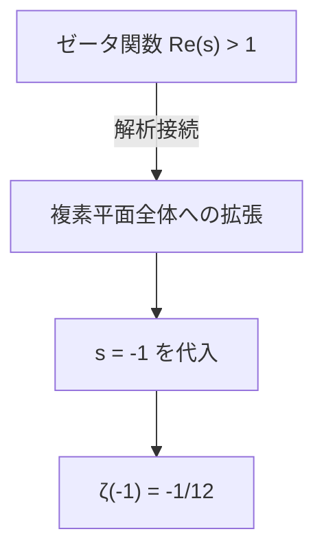
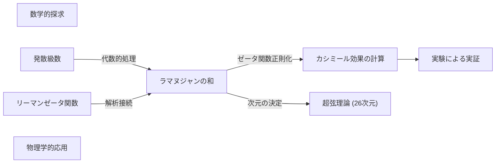

## 1. はじめに：無限を足し合わせるという不思議

私たちの日常的な感覚では、正の数をどんどん足していけば、その和は際限なく大きくなります。つまり、「 $1 + 2 + 3 + 4 + \dots$ 」という計算を無限に続けると、結果は **無限大（ $\infty$ ）** になると考えるのが自然です。これは数学的に「発散する」と言われます。

しかし、理論物理学や複素解析という高度な数学の世界では、この無限の足し算に対して非常に奇妙な値が割り当てられることがあります。それが以下の式です。

$$
1 + 2 + 3 + 4 + \dots = -\frac{1}{12}
$$

正の整数を無限に足し合わせているのに、なぜか **負の分数** になってしまうのです。この直感に反する結果は、インドの天才数学者シュリニヴァーサ・ラマヌジャン（Srinivasa Ramanujan）がイギリスの数学者G.H.ハーディに宛てた手紙の中で言及したことで有名になりました。

この記事では、この「ラマヌジャンの和（Ramanujan Summation）」と呼ばれる手法について、どのようにしてこの奇妙な値が導き出されるのか、そしてそれが現実世界の物理現象とどう結びついているのかを解説します。

---

## 2. 発散級数と「和」の再定義

### グランディ級数（Grandi's series）

ラマヌジャンの和を理解するための第一歩として、もう少し簡単な別の無限級数を見てみましょう。それは「 $1 - 1 + 1 - 1 + \dots$ 」という級数です。これは発見者の名を取って **グランディ級数** と呼ばれます。

$$
S_1 = 1 - 1 + 1 - 1 + 1 - 1 + \dots
$$

この級数の和はどうなるでしょうか？ 足す順番を変えて括弧をつけてみると、異なる結果が得られます。

1. **(1 - 1) + (1 - 1) + ...** とすると $0 + 0 + \dots = 0$
2. **1 - (1 - 1) - (1 - 1) - ...** とすると $1 - 0 - 0 - \dots = 1$

このように、計算の仕方によって結果が $0$ になったり $1$ になったりします。通常の数学の定義では、このような級数は「発散」し、一つの値に定まらないとされます。しかし、代数的なトリックを使うと、面白い値が導き出せます。

$S_1$ を全体から引いてみましょう。

$$
1 - S_1 = 1 - (1 - 1 + 1 - 1 + \dots)
$$
$$
1 - S_1 = 1 - 1 + 1 - 1 + \dots = S_1
$$

したがって、 $1 - S_1 = S_1$ となり、これを解くと **$S_1 = \frac{1}{2}$** となります。
状態が $0$ と $1$ の間を行き来しているため、その平均である $\frac{1}{2}$ が割り当てられるというのは、ある意味で直感的に納得できるかもしれません。

### もう一つの級数：交替級数

次に、以下の級数 $S_2$ を考えます。

$$
S_2 = 1 - 2 + 3 - 4 + 5 - \dots
$$

これを $2$ つ足し合わせる操作を考えます。少しずらして足すのがポイントです。

$$
\begin{array}{rcrrrrrl}
S_2 & = & 1 & -2 & +3 & -4 & +5 & -\dots \\
{}+S_2 & = & & +1 & -2 & +3 & -4 & +\dots \\
\hline
2S_2 & = & 1 & -1 & +1 & -1 & +1 & -\dots
\end{array}
$$

お気付きのように、右辺は先ほどのグランディ級数 $S_1$ になりました。したがって、

$$
2S_2 = S_1 = \frac{1}{2}
$$

これを解くと、 **$S_2 = \frac{1}{4}$** となります。

### いよいよラマヌジャンの和へ

準備が整いました。本題である全ての自然数の和 $S$ を考えましょう。

$$
S = 1 + 2 + 3 + 4 + 5 + 6 + \dots
$$

ここから先ほどの $S_2$ を引いてみます。

$$
S - S_2 = (1 + 2 + 3 + 4 + 5 + 6 + \dots) - (1 - 2 + 3 - 4 + 5 - 6 + \dots)
$$

項ごとに引き算を行うと、奇数番目の項は相殺され、偶数番目の項は倍になります。

$$
S - S_2 = 0 + 4 + 0 + 8 + 0 + 12 + \dots = 4 + 8 + 12 + \dots
$$

右辺は $4$ で括ることができます。

$$
S - S_2 = 4(1 + 2 + 3 + \dots) = 4S
$$

したがって、 $S - S_2 = 4S$ という方程式が得られます。これを変形すると、

$$
-3S = S_2
$$

先ほど求めたように $S_2 = \frac{1}{4}$ ですから、これを代入します。

$$
-3S = \frac{1}{4}
$$
$$
S = -\frac{1}{12}
$$

こうして、 **$1 + 2 + 3 + 4 + \dots = -\frac{1}{12}$** という驚くべき等式が導き出されました。

---

## 3. 解析接続とリーマンゼータ関数

上記のような代数的な操作は、一見すると単なるトリックや詭弁のように見えるかもしれません。発散する級数に対して通常の四則演算を無条件に適用することは、厳密な数学では許されていません。

しかし、この結果は決して無意味なものではありません。現代数学においては、これを **解析接続（Analytic Continuation）** という厳密な概念を用いて裏付けることができます。

### リーマンゼータ関数

解析接続を説明するために、 **リーマンゼータ関数** $\zeta(s)$ を導入します。ゼータ関数は以下のように定義されます。

$$
\zeta(s) = 1^{-s} + 2^{-s} + 3^{-s} + 4^{-s} + \dots = \sum_{n=1}^{\infty} \frac{1}{n^s}
$$

ここで $s$ は複素数です。この級数は、 $s$ の実部が $1$ より大きい（ $\text{Re}(s) > 1$ ）場合にのみ収束し、有限の値を持ちます。

例えば $s = 2$ のとき、これは有名なバーゼル問題となり、 $\zeta(2) = \frac{\pi^2}{6}$ に収束することが知られています。

### 解析接続による拡張

では、 $s = -1$ を代入したらどうなるでしょうか？

$$
\zeta(-1) = 1^1 + 2^1 + 3^1 + 4^1 + \dots = 1 + 2 + 3 + 4 + \dots
$$

これはまさに我々が求めている全ての自然数の和です。しかし、元のゼータ関数の定義では $s = -1$ は収束域外であるため、直接計算することはできません。

そこで数学者たちは **解析接続** というテクニックを使います。これは、ある領域で定義された滑らかな関数を、その性質（微分可能性など）を保ったまま、本来定義されていなかった広い領域へと拡張する手法です。

リーマンは、ゼータ関数が複素平面全体（ $s=1$ の極を除く）に一意に拡張できることを証明しました。拡張されたゼータ関数において $s = -1$ の値を計算すると、見事に **$-\frac{1}{12}$** となることがわかります。

つまり、「 $1+2+3+... = -1/12$ 」という式は、「通常の意味での和」ではなく、「ゼータ関数を通じて解析接続された意味での値」として正当化されるのです。

---

## 4. 物理学における実用例：カシミール効果と超弦理論

この $-\frac{1}{12}$ という値は、単なる数学のパズルにとどまりません。驚くべきことに、現実の物理世界でもこの値が登場し、実験によってその影響が観測されています。

### カシミール効果

量子力学の世界では、完全な真空であってもエネルギーがゼロではありません。「零点エネルギー」と呼ばれるエネルギーが常に揺らいでいます。

1948年、オランダの物理学者ヘンドリック・カシミールは、真空中にごくわずかな隙間を空けて2枚の金属板を平行に置くと、金属板の間に引力が働くことを予言しました。これを **カシミール効果** と呼びます。

この引力を計算する際、金属板の間に存在する無数の電磁波のモード（周波数）のエネルギーを全て足し合わせる必要があります。この計算式の中には、まさに $\sum_{n=1}^{\infty} n = 1 + 2 + 3 + \dots$ という発散級数が現れます。

物理学者たちがこの無限大を処理するために（繰り込みという手法の一環として）ゼータ関数正則化を用い、この和を $-\frac{1}{12}$ に置き換えると、計算結果は有限の力として導出されます。そして重要なのは、 **この計算結果が実際の実験における測定値と見事に一致する** という事実です。

### ボソン弦理論

さらに、宇宙のすべての物質を1次元の「ひも（弦）」として扱う超弦理論の初期モデル（ボソン弦理論）においても、この値は重要な役割を果たします。

ボソン弦理論が数学的に矛盾なく成立するためには、時空の次元数 $D$ が特定の条件を満たす必要があります。弦の振動モードのエネルギーを足し合わせる過程で、やはり $1 + 2 + 3 + \dots$ という無限和が現れ、これを $-\frac{1}{12}$ とすると、方程式は以下のようになります。

$$
\frac{D - 2}{2} \times \left(-\frac{1}{12}\right) + 1 = 0
$$

これを解くと、 $D = 26$ となります。つまり、ボソン弦理論は **26次元の時空** でしか成立しないという結果が導き出されるのです。（後にフェルミオンを取り入れた超弦理論では10次元となりますが、その背後にある数学的構造は似ています。）

---

## 5. まとめ

「 $1 + 2 + 3 + 4 + \dots = -\frac{1}{12}$ 」という式は、初めて見た人にとっては明らかな間違いや詭弁に感じられるでしょう。実際、私たちが日常で使う「足し算」の定義においては、この級数は無限大に発散します。

しかし、数学が「解析接続」という道具を使って関数の概念を拡張したとき、そこには新しい風景が広がっていました。そしてさらに驚異的なのは、数学者たちが純粋な知的好奇心から探求したその抽象的な概念が、後に量子力学や弦理論といった最先端の物理学において、宇宙の構造を解き明かすための必須のパズルピースとなったことです。

ラマヌジャンの和は、数学の奥深さと、数学と物理学の間に存在する神秘的なつながりを教えてくれる、最も美しい例の一つと言えるでしょう。

