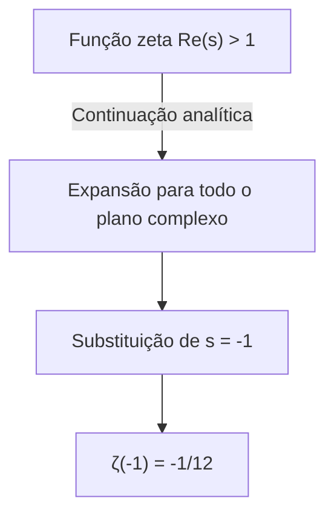
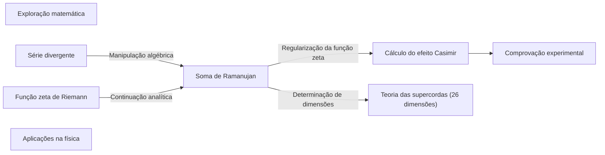

## 1. Introdução: O mistério de somar o infinito

No nosso senso comum diário, se continuarmos a somar números positivos, a soma aumentará sem limites. Em outras palavras, é natural pensar que se continuarmos o cálculo " $1 + 2 + 3 + 4 + \dots$ " infinitamente, o resultado será o **infinito ( $\infty$ )** . Matematicamente, diz-se que isso "diverge".

No entanto, no mundo avançado da matemática, como a física teórica e a análise complexa, valores muito estranhos às vezes são atribuídos a essas adições infinitas. Essa é a seguinte equação:

$$
1 + 2 + 3 + 4 + \dots = -\frac{1}{12}
$$

Apesar de somarmos infinitamente inteiros positivos, por algum motivo o resultado se torna uma **fração negativa** . Este resultado contraintuitivo tornou-se famoso quando o gênio matemático indiano [Srinivasa Ramanujan](https://kenji.blog/p/ramanujan/) mencionou isso em uma carta ao matemático britânico G.H. Hardy.

Neste artigo, explicaremos esse método chamado "[Soma de Ramanujan ([Ramanujan Summation](https://kenji.blog/p/ramanujan-summation/))](https://kenji.blog/p/ramanujan-summation/)", como esse valor bizarro é derivado e como ele está conectado aos fenômenos físicos do mundo real.

---

## 2. Séries divergentes e a redefinição de "soma"

### Série de Grandi (Grandi's series)

Como um primeiro passo para entender a Soma de Ramanujan, vejamos outra série infinita um pouco mais simples. É a série " $1 - 1 + 1 - 1 + \dots$ ". Isso é chamado de **série de Grandi** , em homenagem ao seu descobridor.

$$
S_1 = 1 - 1 + 1 - 1 + 1 - 1 + \dots
$$

Qual será a soma desta série? Se mudarmos a ordem de adição e usarmos parênteses, obteremos resultados diferentes.

1. Se fizermos **(1 - 1) + (1 - 1) + ...** teremos $0 + 0 + \dots = 0$
2. Se fizermos **1 - (1 - 1) - (1 - 1) - ...** teremos $1 - 0 - 0 - \dots = 1$

Dessa forma, dependendo de como calculamos, o resultado pode ser $0$ ou $1$ . De acordo com a definição padrão da matemática, essas séries "divergem" e não são fixadas em um único valor. No entanto, usando um truque algébrico, um valor interessante pode ser derivado.

Vamos subtrair $S_1$ de 1.

$$
1 - S_1 = 1 - (1 - 1 + 1 - 1 + \dots)
$$
$$
1 - S_1 = 1 - 1 + 1 - 1 + \dots = S_1
$$

Portanto, temos $1 - S_1 = S_1$ , e resolvendo isso obtemos **$S_1 = \frac{1}{2}$** .
Como o estado alterna entre $0$ e $1$ , atribuir a média de $\frac{1}{2}$ pode, de certa forma, fazer sentido intuitivamente.

### Outra série: Série alternada

Em seguida, consideraremos a seguinte série $S_2$ .

$$
S_2 = 1 - 2 + 3 - 4 + 5 - \dots
$$

Considere a operação de somar isso duas vezes. O truque é deslocá-lo um pouco antes de somar.

$$
\begin{array}{rcrrrrrl}
S_2 & = & 1 & -2 & +3 & -4 & +5 & -\dots \\
{}+S_2 & = & & +1 & -2 & +3 & -4 & +\dots \\
\hline
2S_2 & = & 1 & -1 & +1 & -1 & +1 & -\dots
\end{array}
$$

Como você deve ter notado, o lado direito se tornou a série de Grandi $S_1$ mencionada anteriormente. Portanto,

$$
2S_2 = S_1 = \frac{1}{2}
$$

Resolvendo isso, obtemos **$S_2 = \frac{1}{4}$** .

### Finalmente, rumo à Soma de Ramanujan

A preparação está completa. Vamos considerar o nosso tópico principal, a soma de todos os números naturais $S$ .

$$
S = 1 + 2 + 3 + 4 + 5 + 6 + \dots
$$

A partir disso, subtrairemos o $S_2$ anterior.

$$
S - S_2 = (1 + 2 + 3 + 4 + 5 + 6 + \dots) - (1 - 2 + 3 - 4 + 5 - 6 + \dots)
$$

Quando subtraímos termo a termo, os termos de ordem ímpar se cancelam e os termos de ordem par são dobrados.

$$
S - S_2 = 0 + 4 + 0 + 8 + 0 + 12 + \dots = 4 + 8 + 12 + \dots
$$

O lado direito pode ser fatorado por $4$ .

$$
S - S_2 = 4(1 + 2 + 3 + \dots) = 4S
$$

Portanto, obtemos a equação $S - S_2 = 4S$ . Reorganizando isso,

$$
-3S = S_2
$$

Como encontramos anteriormente que $S_2 = \frac{1}{4}$ , substituímos isso.

$$
-3S = \frac{1}{4}
$$
$$
S = -\frac{1}{12}
$$

Assim, derivamos a surpreendente igualdade de que **$1 + 2 + 3 + 4 + \dots = -\frac{1}{12}$** .

---

## 3. Continuação analítica e a função zeta de Riemann

Operações algébricas como as acima podem, à primeira vista, parecer meros truques ou sofismas. A aplicação incondicional da aritmética normal a séries divergentes não é permitida na matemática rigorosa.

No entanto, este resultado não é de forma alguma sem sentido. Na matemática moderna, isso pode ser justificado usando um conceito rigoroso chamado **continuação analítica (Analytic Continuation)** .

### Função zeta de Riemann

Para explicar a continuação analítica, introduzimos a **função zeta de Riemann** $\zeta(s)$ . A função zeta é definida da seguinte forma:

$$
\zeta(s) = 1^{-s} + 2^{-s} + 3^{-s} + 4^{-s} + \dots = \sum_{n=1}^{\infty} \frac{1}{n^s}
$$

Aqui $s$ é um número complexo. Esta série converge e tem um valor finito apenas se a parte real de $s$ for maior que $1$ ( $\text{Re}(s) > 1$ ).

Por exemplo, quando $s = 2$ , isso se torna o famoso problema de Basileia, e é conhecido por convergir para $\zeta(2) = \frac{\pi^2}{6}$ .

### Expansão por continuação analítica

Então, o que acontece se substituirmos $s = -1$ ?

$$
\zeta(-1) = 1^1 + 2^1 + 3^1 + 4^1 + \dots = 1 + 2 + 3 + 4 + \dots
$$

Isso é exatamente a soma de todos os números naturais que estamos procurando. No entanto, na definição original da função zeta, $s = -1$ está fora do domínio de convergência, portanto não pode ser calculado diretamente.

Assim, os matemáticos usam a técnica da **continuação analítica** . Este é um método de estender uma função suave definida em uma certa região para uma região mais ampla onde não foi originalmente definida, mantendo suas propriedades (como a diferenciabilidade).

Riemann provou que a função zeta pode ser estendida de forma única para todo o plano complexo (exceto pelo polo em $s=1$ ). Se calcularmos o valor em $s = -1$ usando a função zeta estendida, vemos que resulta brilhantemente em **$-\frac{1}{12}$** .

Em outras palavras, a equação " $1+2+3+... = -1/12$ " é justificada não como uma "soma no sentido normal", mas como um "valor no sentido da continuação analítica através da função zeta".

---

## 4. Aplicações práticas na física: Efeito Casimir e teoria das supercordas

Este valor de $-\frac{1}{12}$ não se limita a ser apenas um quebra-cabeça matemático. Surpreendentemente, este valor também aparece no mundo físico real, e seus efeitos foram observados através de experimentos.

### Efeito Casimir

No mundo da mecânica quântica, mesmo em um vácuo perfeito, a energia não é zero. A energia chamada "energia de ponto zero" está constantemente flutuando.

Em 1948, o físico holandês Hendrik Casimir previu que se duas placas de metal fossem colocadas paralelamente com um espaço muito pequeno em um vácuo, uma força de atração atuaria entre as placas. Isso é chamado de **efeito Casimir** .

Ao calcular essa força de atração, é necessário somar as energias dos inúmeros modos (frequências) de ondas eletromagnéticas existentes entre as placas de metal. Nesta equação de cálculo, aparece exatamente a série divergente $\sum_{n=1}^{\infty} n = 1 + 2 + 3 + \dots$ .

Quando os físicos usam a regularização da função zeta para lidar com esse infinito (como parte de uma técnica chamada renormalização) e substituem essa soma por $-\frac{1}{12}$ , o resultado do cálculo é derivado como uma força finita. E o que é importante é o fato de que **este resultado de cálculo concorda perfeitamente com os valores medidos em experimentos reais** .

### Teoria das cordas bosônicas

Além disso, no modelo inicial da teoria das supercordas (teoria das cordas bosônicas), que trata toda a matéria do universo como "cordas" unidimensionais, este valor desempenha um papel importante.

Para que a teoria das cordas bosônicas seja matematicamente consistente, o número de dimensões do espaço-tempo $D$ deve satisfazer condições específicas. No processo de somar as energias dos modos vibracionais da corda, a soma infinita $1 + 2 + 3 + \dots$ também aparece, e quando isso é definido como $-\frac{1}{12}$ , a equação se torna:

$$
\frac{D - 2}{2} \times \left(-\frac{1}{12}\right) + 1 = 0
$$

Resolvendo isso, obtemos $D = 26$ . Ou seja, conclui-se que a teoria das cordas bosônicas só é válida em um **espaço-tempo de 26 dimensões** . (Mais tarde, na teoria das supercordas que incorpora férmions, torna-se 10 dimensões, mas a estrutura matemática subjacente é semelhante.)

---

## 5. Conclusão

A equação " $1 + 2 + 3 + 4 + \dots = -\frac{1}{12}$ " pode parecer um erro óbvio ou um sofisma para quem a vê pela primeira vez. Na verdade, na definição de "adição" que usamos diariamente, esta série diverge para o infinito.

No entanto, quando a matemática usou a ferramenta da "continuação analítica" para expandir o conceito de funções, uma nova paisagem se abriu. E ainda mais surpreendente é que esses conceitos abstratos explorados pelos matemáticos por pura curiosidade intelectual mais tarde se tornaram peças essenciais do quebra-cabeça para desvendar a estrutura do universo na física de ponta, como a mecânica quântica e a teoria das cordas.

A Soma de Ramanujan pode ser dita como um dos exemplos mais belos que nos ensinam sobre a profundidade da matemática e a conexão mística que existe entre a matemática e a física.

