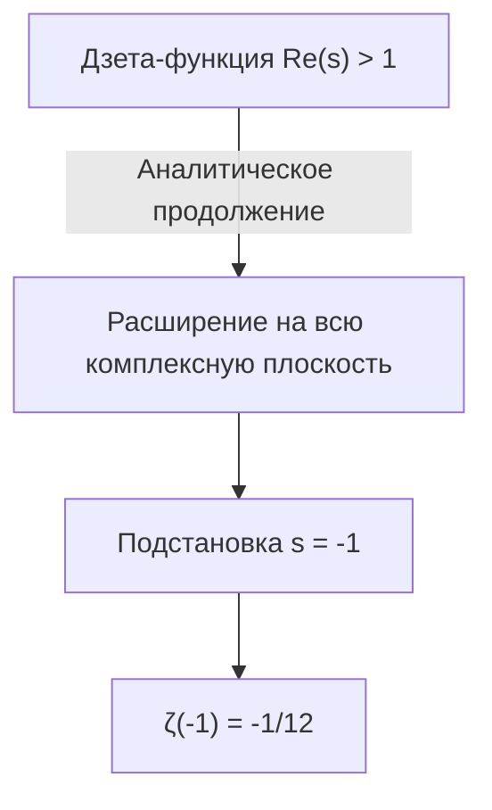
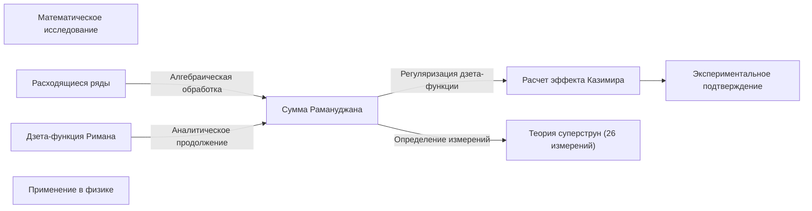

## 1. Введение: Чудо сложения бесконечности

В нашем повседневном понимании, если мы продолжим складывать положительные числа, их сумма будет бесконечно увеличиваться. То есть естественно полагать, что если продолжать вычисление « $1 + 2 + 3 + 4 + \dots$ » до бесконечности, то результат будет **бесконечностью ( $\infty$ )** . В математике это называется «расходимостью».

Однако в мире продвинутой математики, такой как теоретическая физика и комплексный анализ, этой бесконечной сумме иногда приписывается очень странное значение. Вот эта формула:

$$
1 + 2 + 3 + 4 + \dots = -\frac{1}{12}
$$

Несмотря на то, что мы бесконечно складываем положительные целые числа, почему-то получается **отрицательная дробь** . Этот контринтуитивный результат стал известен благодаря письму индийского математика-гения Шринивасы Рамануджана ([Srinivasa Ramanujan](https://kenji.blog/ru/p/ramanujan/)) британскому математику Г.Х. Харди.

В этой статье объясняется метод, называемый «сумму Рамануджана» ([Ramanujan Summation](https://kenji.blog/ru/p/ramanujan-summation/)), как выводится это странное значение и как оно связано с физическими явлениями в реальном мире.

---

## 2. Расходящиеся ряды и переопределение «суммы»

### Ряд Гранди (Grandi's series)

В качестве первого шага к пониманию суммы Рамануджана давайте рассмотрим другой, немного более простой бесконечный ряд. Это ряд « $1 - 1 + 1 - 1 + \dots$ ». Он называется **рядом Гранди** в честь своего открывателя.

$$
S_1 = 1 - 1 + 1 - 1 + 1 - 1 + \dots
$$

Какова сумма этого ряда? Если мы изменим порядок сложения и расставим скобки, то получим разные результаты:

1. Если **(1 - 1) + (1 - 1) + ...** , то $0 + 0 + \dots = 0$
2. Если **1 - (1 - 1) - (1 - 1) - ...** , то $1 - 0 - 0 - \dots = 1$

Таким образом, в зависимости от метода вычисления результат может быть $0$ или $1$. Согласно стандартным математическим определениям, такой ряд «расходится» и не имеет определенного значения. Однако, используя алгебраические трюки, можно получить интересное значение.

Давайте вычтем $S_1$ из единицы.

$$
1 - S_1 = 1 - (1 - 1 + 1 - 1 + \dots)
$$
$$
1 - S_1 = 1 - 1 + 1 - 1 + \dots = S_1
$$

Следовательно, $1 - S_1 = S_1$, и если мы решим это уравнение, то получим **$S_1 = \frac{1}{2}$** .
Поскольку состояние колеблется между $0$ и $1$, то, в некотором смысле, интуитивно понятно, что ему приписывается среднее значение $\frac{1}{2}$.

### Еще один ряд: знакочередующийся ряд

Далее рассмотрим следующий ряд $S_2$.

$$
S_2 = 1 - 2 + 3 - 4 + 5 - \dots
$$

Рассмотрим операцию сложения двух таких рядов. Секрет в том, чтобы сложить их с небольшим сдвигом.

$$
\begin{array}{rcrrrrrl}
S_2 & = & 1 & -2 & +3 & -4 & +5 & -\dots \\
{}+S_2 & = & & +1 & -2 & +3 & -4 & +\dots \\
\hline
2S_2 & = & 1 & -1 & +1 & -1 & +1 & -\dots
\end{array}
$$

Как вы могли заметить, правая часть стала ранее упомянутым рядом Гранди $S_1$. Следовательно,

$$
2S_2 = S_1 = \frac{1}{2}
$$

Решая это уравнение, получаем **$S_2 = \frac{1}{4}$** .

### Наконец, переходим к сумме Рамануджана

Подготовка завершена. Давайте рассмотрим основную тему — сумму всех натуральных чисел $S$.

$$
S = 1 + 2 + 3 + 4 + 5 + 6 + \dots
$$

Теперь вычтем из нее наш $S_2$.

$$
S - S_2 = (1 + 2 + 3 + 4 + 5 + 6 + \dots) - (1 - 2 + 3 - 4 + 5 - 6 + \dots)
$$

При почленном вычитании нечетные члены сокращаются, а четные удваиваются.

$$
S - S_2 = 0 + 4 + 0 + 8 + 0 + 12 + \dots = 4 + 8 + 12 + \dots
$$

Правую часть можно вынести за скобки с множителем $4$.

$$
S - S_2 = 4(1 + 2 + 3 + \dots) = 4S
$$

Таким образом, мы получаем уравнение $S - S_2 = 4S$. Преобразуя его, получим:

$$
-3S = S_2
$$

Как мы нашли ранее, $S_2 = \frac{1}{4}$, поэтому мы подставляем это значение:

$$
-3S = \frac{1}{4}
$$
$$
S = -\frac{1}{12}
$$

Таким образом, было выведено это удивительное равенство **$1 + 2 + 3 + 4 + \dots = -\frac{1}{12}$** .

---

## 3. Аналитическое продолжение и дзета-функция Римана

Вышеприведенные алгебраические операции на первый взгляд могут показаться просто трюком или софистикой. В строгой математике безусловное применение обычных арифметических операций к расходящимся рядам не допускается.

Однако этот результат отнюдь не бессмыслен. В современной математике он может быть обоснован с помощью строгого понятия, называемого **аналитическим продолжением (Analytic Continuation)** .

### Дзета-функция Римана

Чтобы объяснить аналитическое продолжение, введем **дзета-функцию Римана** $\zeta(s)$. Дзета-функция определяется следующим образом:

$$
\zeta(s) = 1^{-s} + 2^{-s} + 3^{-s} + 4^{-s} + \dots = \sum_{n=1}^{\infty} \frac{1}{n^s}
$$

Где $s$ — комплексное число. Этот ряд сходится и имеет конечное значение только в том случае, если действительная часть $s$ больше $1$ ( $\text{Re}(s) > 1$ ).

Например, когда $s = 2$, это становится известной базельской проблемой, и известно, что она сходится к $\zeta(2) = \frac{\pi^2}{6}$.

### Расширение с помощью аналитического продолжения

Но что произойдет, если подставить $s = -1$?

$$
\zeta(-1) = 1^1 + 2^1 + 3^1 + 4^1 + \dots = 1 + 2 + 3 + 4 + \dots
$$

Это как раз та сумма всех натуральных чисел, которую мы ищем. Однако в первоначальном определении дзета-функции $s = -1$ находится вне области сходимости, поэтому её нельзя вычислить напрямую.

Для этого математики используют метод, называемый **аналитическим продолжением**. Это метод расширения гладкой функции, определенной в некоторой области, на более широкую область, где она изначально не была определена, при сохранении её свойств (таких как дифференцируемость).

Риман доказал, что дзета-функцию можно однозначно продолжить на всю комплексную плоскость (за исключением полюса в точке $s=1$). При вычислении значения расширенной дзета-функции при $s = -1$ выясняется, что оно в точности равно **$-\frac{1}{12}$** .

Другими словами, уравнение « $1+2+3+... = -1/12$ » оправдано не как «сумма в обычном смысле», а как «значение в смысле аналитического продолжения через дзета-функцию».

---

## 4. Практические примеры в физике: Эффект Казимира и теория суперструн

Значение $-\frac{1}{12}$ — это не просто математическая головоломка. Удивительно, но это значение появляется в реальном физическом мире, и его влияние наблюдается экспериментально.

### Эффект Казимира

В мире квантовой механики энергия не равна нулю даже в идеальном вакууме. Существует постоянная флуктуация энергии, называемая «нулевой энергией» (zero-point energy).

В 1948 году голландский физик Хендрик Казимир предсказал, что если две металлические пластины поместить параллельно с крошечным зазором в вакууме, между ними будет действовать сила притяжения. Это называется **эффектом Казимира**.

При вычислении этой силы притяжения необходимо сложить энергии бесчисленных электромагнитных мод (частот), существующих между металлическими пластинами. В этом расчете как раз и появляется расходящийся ряд $\sum_{n=1}^{\infty} n = 1 + 2 + 3 + \dots$.

Когда физики используют регуляризацию дзета-функции для обработки этой бесконечности (как часть метода, называемого перенормировкой) и заменяют эту сумму на $-\frac{1}{12}$, в результате вычислений получается конечная сила. И что важно, **этот расчетный результат точно совпадает с измеренным значением в реальных экспериментах**.

### Теория бозонных струн

Более того, это значение играет важную роль в ранней модели теории суперструн (теории бозонных струн), которая рассматривает всю материю во Вселенной как одномерные «струны».

Для того чтобы теория бозонных струн была математически непротиворечивой, количество измерений пространства-времени $D$ должно удовлетворять определенному условию. В процессе суммирования энергий колебательных мод струны снова возникает бесконечная сумма $1 + 2 + 3 + \dots$, и если её принять равной $-\frac{1}{12}$, уравнение будет выглядеть следующим образом:

$$
\frac{D - 2}{2} \times \left(-\frac{1}{12}\right) + 1 = 0
$$

Если решить это уравнение, получится $D = 26$. То есть делается вывод, что теория бозонных струн возможна только в **26-мерном пространстве-времени**. (В теории суперструн, которая позже включила фермионы, количество измерений равно 10, но лежащая в её основе математическая структура аналогична.)

---

## 5. Заключение

Уравнение « $1 + 2 + 3 + 4 + \dots = -\frac{1}{12}$ » может показаться очевидной ошибкой или софистикой тем, кто видит его впервые. Действительно, в определении «сложения», которое мы используем в повседневной жизни, этот ряд расходится в бесконечность.

Однако когда математика расширила понятие функции, используя инструмент «аналитического продолжения», перед нами открылись новые горизонты. Ещё более удивительно то, что абстрактные концепции, исследованные математиками из чистого интеллектуального любопытства, позже стали важной частью пазла для разгадки структуры Вселенной в передовой физике, такой как квантовая механика и теория струн.

Сумму Рамануджана можно назвать одним из самых красивых примеров, который демонстрирует глубину математики и таинственную связь между математикой и физикой.

