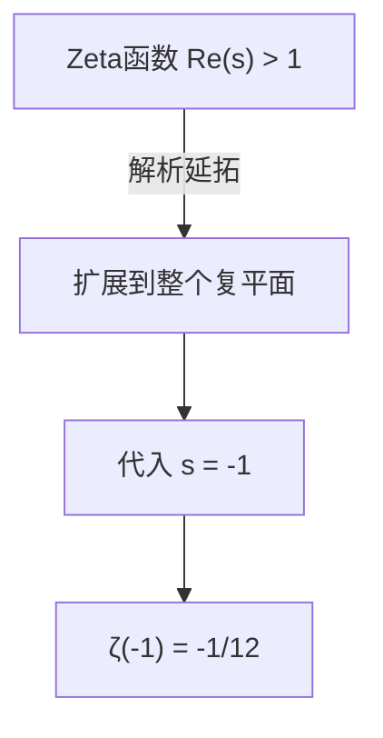
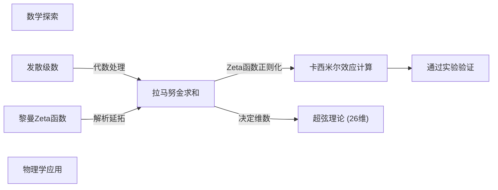

## 1. 引言：无限相加的不可思议

在我们的日常直觉中，如果不断将正数相加，其和会无限制地变大。也就是说，如果无限继续进行“ $1 + 2 + 3 + 4 + \dots$ ”的计算，认为结果是 **无穷大（ $\infty$ ）** 是很自然的。这在数学上被称为“发散”。

然而，在理论物理学和复分析等高级数学的世界中，有时会给这种无限的加法赋予一个非常奇怪的值。那就是以下公式：

$$
1 + 2 + 3 + 4 + \dots = -\frac{1}{12}
$$

明明是在将正整数无限相加，不知为何却变成了一个 **负分数** 。这个违反直觉的结果，因印度天才数学家[斯里尼瓦瑟·拉马努金](https://kenji.blog/zh-cn/p/ramanujan/)（[Srinivasa Ramanujan](https://kenji.blog/zh-cn/p/ramanujan/)）在给英国数学家G.H.哈代（G.H. Hardy）的信中提及而闻名。

在本文中，我们将解说这种被称为“[拉马努金求和（Ramanujan Summation）](https://kenji.blog/p/ramanujan-summation/)”的方法，探讨这个奇妙的值是如何推导出来的，以及它是如何与现实世界中的物理现象联系在一起的。

---

## 2. 发散级数与“和”的重新定义

### 格兰迪级数（Grandi's series）

作为理解拉马努金求和的第一步，让我们来看另一个稍微简单的无穷级数。那就是“ $1 - 1 + 1 - 1 + \dots$ ”这个级数。它以其发现者的名字命名，被称为 **格兰迪级数** 。

$$
S_1 = 1 - 1 + 1 - 1 + 1 - 1 + \dots
$$

这个级数的和会是多少呢？如果改变相加的顺序并加上括号，会得到不同的结果。

1. 若为 **(1 - 1) + (1 - 1) + ...** 则 $0 + 0 + \dots = 0$
2. 若为 **1 - (1 - 1) - (1 - 1) - ...** 则 $1 - 0 - 0 - \dots = 1$

像这样，根据计算方法的不同，结果有时会是 $0$ ，有时会是 $1$ 。在通常的数学定义中，这样的级数被认为是“发散”的，不会确定为一个单一的值。但是，如果使用代数技巧，就可以推导出一个有趣的值。

让我们从整体中减去 $S_1$ 试试看。

$$
1 - S_1 = 1 - (1 - 1 + 1 - 1 + \dots)
$$
$$
1 - S_1 = 1 - 1 + 1 - 1 + \dots = S_1
$$

因此，得到 $1 - S_1 = S_1$ ，解这个方程可得 **$S_1 = \frac{1}{2}$** 。
由于状态在 $0$ 和 $1$ 之间来回变化，因此赋予其平均值 $\frac{1}{2}$ ，在某种意义上也许能在直觉上令人信服。

### 另一个级数：交错级数

接下来，我们考虑以下级数 $S_2$ 。

$$
S_2 = 1 - 2 + 3 - 4 + 5 - \dots
$$

我们考虑将两个这样的级数相加的操作。稍微错开一位相加是关键。

$$
\begin{array}{rcrrrrrl}
S_2 & = & 1 & -2 & +3 & -4 & +5 & -\dots \\
{}+S_2 & = & & +1 & -2 & +3 & -4 & +\dots \\
\hline
2S_2 & = & 1 & -1 & +1 & -1 & +1 & -\dots
\end{array}
$$

正如你所注意到的，右边变成了刚才的格兰迪级数 $S_1$ 。因此，

$$
2S_2 = S_1 = \frac{1}{2}
$$

解这个方程，得到 **$S_2 = \frac{1}{4}$** 。

### 终于进入拉马努金求和

准备工作已经完成。我们来考虑正题，即所有自然数之和 $S$ 。

$$
S = 1 + 2 + 3 + 4 + 5 + 6 + \dots
$$

试着从中减去刚才的 $S_2$ 。

$$
S - S_2 = (1 + 2 + 3 + 4 + 5 + 6 + \dots) - (1 - 2 + 3 - 4 + 5 - 6 + \dots)
$$

逐项进行减法运算，奇数项会被抵消，偶数项会翻倍。

$$
S - S_2 = 0 + 4 + 0 + 8 + 0 + 12 + \dots = 4 + 8 + 12 + \dots
$$

右边可以提取出 $4$ 。

$$
S - S_2 = 4(1 + 2 + 3 + \dots) = 4S
$$

因此，我们得到方程 $S - S_2 = 4S$ 。将其变形，

$$
-3S = S_2
$$

由于如前所述 $S_2 = \frac{1}{4}$ ，我们将其代入。

$$
-3S = \frac{1}{4}
$$
$$
S = -\frac{1}{12}
$$

就这样，推导出了 **$1 + 2 + 3 + 4 + \dots = -\frac{1}{12}$** 这个令人惊讶的等式。

---

## 3. 解析延拓与黎曼Zeta函数

上述那样的代数操作，乍一看可能就像是单纯的戏法或诡辩。在严谨的数学中，是不允许无条件地将普通的四则运算应用于发散级数的。

然而，这个结果绝不是毫无意义的。在现代数学中，这可以使用被称为 **解析延拓（Analytic Continuation）** 的严谨概念来加以证实。

### 黎曼Zeta函数

为了解释解析延拓，我们引入 **黎曼Zeta函数** $\zeta(s)$ 。Zeta函数的定义如下。

$$
\zeta(s) = 1^{-s} + 2^{-s} + 3^{-s} + 4^{-s} + \dots = \sum_{n=1}^{\infty} \frac{1}{n^s}
$$

这里 $s$ 是复数。这个级数仅当 $s$ 的实部大于 $1$ （ $\text{Re}(s) > 1$ ）时才收敛，并具有有限的值。

例如，当 $s = 2$ 时，这就是著名的巴塞尔问题，已知它收敛于 $\zeta(2) = \frac{\pi^2}{6}$ 。

### 通过解析延拓进行扩展

那么，如果代入 $s = -1$ 会怎样呢？

$$
\zeta(-1) = 1^1 + 2^1 + 3^1 + 4^1 + \dots = 1 + 2 + 3 + 4 + \dots
$$

这正是我们要求的全体自然数之和。但是，由于在原Zeta函数的定义中 $s = -1$ 在收敛域之外，因此无法直接计算。

于是数学家们使用了 **解析延拓** 这个技巧。这是一种将定义在某个区域上的平滑函数，在保持其性质（如可微性等）不变的情况下，扩展到原本未定义的更广阔区域的方法。

黎曼证明了Zeta函数可以唯一地扩展到整个复平面（除了极点 $s=1$ ）。在扩展后的Zeta函数中计算 $s = -1$ 的值，可以完美地得出 **$-\frac{1}{12}$** 。

也就是说，“ $1+2+3+... = -1/12$ ”这个公式，并不是“通常意义上的和”，而是作为“通过Zeta函数进行解析延拓意义上的值”被正当化了。

---

## 4. 物理学中的实际应用：卡西米尔效应与超弦理论

这个 $-\frac{1}{12}$ 的值，并不仅仅停留在数学拼图的层面上。令人惊讶的是，在现实的物理世界中这个值也出现了，并且通过实验观测到了它的影响。

### 卡西米尔效应

在量子力学的世界里，即使是完全的真空，能量也不为零。被称为“零点能”的能量总是在发生涨落。

1948年，荷兰物理学家亨德里克·卡西米尔（Hendrik Casimir）预言，如果在真空中留出极小的间隙平行放置两块金属板，金属板之间就会产生引力。这被称为 **卡西米尔效应** 。

在计算这个引力时，需要将存在于金属板之间的无数电磁波模式（频率）的能量全部加起来。在这个计算公式中，恰好出现了 $\sum_{n=1}^{\infty} n = 1 + 2 + 3 + \dots$ 这样的发散级数。

物理学家们为了处理这个无穷大（作为重整化方法的一部分），使用了Zeta函数正则化，将这个和替换为 $-\frac{1}{12}$ ，从而推导出有限的力作为计算结果。而重要的是， **这个计算结果与实际实验中的测量值完美吻合** 这个事实。

### 玻色弦理论

此外，在将宇宙中所有物质视为一维“弦”的超弦理论的早期模型（玻色弦理论）中，这个值也起着重要作用。

为了使玻色弦理论在数学上不产生矛盾而成立，时空的维数 $D$ 需要满足特定条件。在将弦的振动模式的能量相加的过程中，同样出现了 $1 + 2 + 3 + \dots$ 这样的无穷和，如果将其设为 $-\frac{1}{12}$ ，方程就会变成如下形式：

$$
\frac{D - 2}{2} \times \left(-\frac{1}{12}\right) + 1 = 0
$$

解这个方程，得到 $D = 26$ 。也就是说，推导出了玻色弦理论只有在 **26维时空** 中才能成立的结果。（后来引入费米子的超弦理论变为了10维，但其背后的数学结构是相似的。）

---

## 5. 总结

“ $1 + 2 + 3 + 4 + \dots = -\frac{1}{12}$ ”这个公式，对于初次看到的人来说，一定会觉得是明显的错误或诡辩。事实上，在我们日常使用的“加法”定义中，这个级数是发散到无穷大的。

但是，当数学使用“解析延拓”这个工具来扩展函数的概念时，那里展现出了一片新的风景。而更令人惊叹的是，数学家们出于纯粹的求知欲而探索的这个抽象概念，后来竟成为了量子力学和弦理论等最前沿物理学中，解开宇宙结构不可或缺的拼图碎片。

可以说，拉马努金求和是告诉我们数学的深奥，以及存在于数学与物理学之间神秘联系的最美妙的例子之一。

