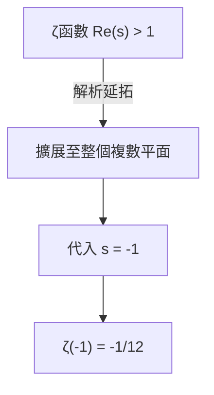
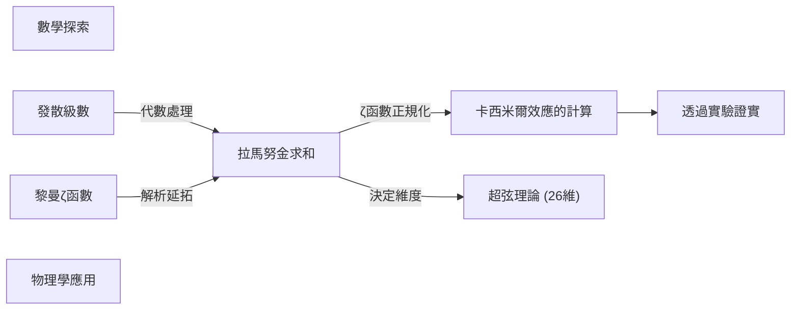

## 1. 前言：將無限相加的不可思議

在我們的日常直覺中，如果不斷將正數相加，其總和會無止盡地變大。也就是說，將「 $1 + 2 + 3 + 4 + \dots$ 」這個計算無限進行下去，結果會是 **無限大（ $\infty$ ）** ，這是很自然的。在數學上這被稱為「發散」。

然而，在理論物理學與複變分析這些高等數學領域中，有時會為這種無限相加賦予一個非常奇妙的值。那就是以下的公式。

$$
1 + 2 + 3 + 4 + \dots = -\frac{1}{12}
$$

明明是將正整數無限相加，不知為何卻變成了 **負分數** 。這個違反直覺的結果，因為印度天才數學家[斯里尼瓦瑟·拉馬努金](https://kenji.blog/zh-tw/p/ramanujan/)（[Srinivasa Ramanujan](https://kenji.blog/zh-tw/p/ramanujan/)）在寫給英國數學家 G.H. 哈代（G.H. Hardy）的信中提及而聲名大噪。

在本文中，我們將解說這種被稱為「[拉馬努金求和（[Ramanujan Summation](https://kenji.blog/zh-tw/p/ramanujan-summation/)）](https://kenji.blog/p/ramanujan-summation/)」的方法，探討這個奇妙的值是如何被推導出來的，以及它與現實世界的物理現象有何關聯。

---

## 2. 發散級數與「和」的重新定義

### 格蘭迪級數（Grandi's series）

作為理解拉馬努金求和的第一步，讓我們先來看另一個比較簡單的無限級數。那就是「 $1 - 1 + 1 - 1 + \dots$ 」這個級數。為了紀念發現者，這被稱為 **格蘭迪級數** 。

$$
S_1 = 1 - 1 + 1 - 1 + 1 - 1 + \dots
$$

這個級數的和會是多少呢？如果改變相加的順序加上括號，會得到不同的結果。

1. 若為 **(1 - 1) + (1 - 1) + ...** 則 $0 + 0 + \dots = 0$
2. 若為 **1 - (1 - 1) - (1 - 1) - ...** 則 $1 - 0 - 0 - \dots = 1$

像這樣，根據計算方式的不同，結果有時是 $0$ ，有時是 $1$ 。在一般數學的定義中，這種級數會「發散」，無法確定為單一的值。但是，如果使用代數上的技巧，就能推導出有趣的值。

讓我們從 $1$ 減去 $S_1$ 看看。

$$
1 - S_1 = 1 - (1 - 1 + 1 - 1 + \dots)
$$
$$
1 - S_1 = 1 - 1 + 1 - 1 + \dots = S_1
$$

因此，得出 $1 - S_1 = S_1$ ，解開這個方程式就會得到 **$S_1 = \frac{1}{2}$** 。
因為狀態在 $0$ 與 $1$ 之間來回切換，所以賦予其平均值 $\frac{1}{2}$ ，在某種意義上或許能在直覺上被接受。

### 另一個級數：交錯級數

接著，我們考慮以下的級數 $S_2$ 。

$$
S_2 = 1 - 2 + 3 - 4 + 5 - \dots
$$

我們來考慮將兩個這個級數相加的操作。稍微錯開再相加是重點。

$$
\begin{array}{rcrrrrrl}
S_2 & = & 1 & -2 & +3 & -4 & +5 & -\dots \\
{}+S_2 & = & & +1 & -2 & +3 & -4 & +\dots \\
\hline
2S_2 & = & 1 & -1 & +1 & -1 & +1 & -\dots
\end{array}
$$

如您所見，右邊變成了剛才提到的格蘭迪級數 $S_1$ 。因此，

$$
2S_2 = S_1 = \frac{1}{2}
$$

解開這個方程式，就會得到 **$S_2 = \frac{1}{4}$** 。

### 終於進入拉馬努金求和

準備工作完成了。我們來考慮正題，也就是所有自然數的和 $S$ 。

$$
S = 1 + 2 + 3 + 4 + 5 + 6 + \dots
$$

我們從這裡減去剛才的 $S_2$ 看看。

$$
S - S_2 = (1 + 2 + 3 + 4 + 5 + 6 + \dots) - (1 - 2 + 3 - 4 + 5 - 6 + \dots)
$$

逐項進行減法後，奇數項會互相抵消，偶數項則會變成兩倍。

$$
S - S_2 = 0 + 4 + 0 + 8 + 0 + 12 + \dots = 4 + 8 + 12 + \dots
$$

右邊可以提出 $4$ 作為公因數。

$$
S - S_2 = 4(1 + 2 + 3 + \dots) = 4S
$$

因此，得出 $S - S_2 = 4S$ 這個方程式。將其變形後，

$$
-3S = S_2
$$

因為如同剛才求出的 $S_2 = \frac{1}{4}$ ，我們將其代入。

$$
-3S = \frac{1}{4}
$$
$$
S = -\frac{1}{12}
$$

就這樣，推導出了 **$1 + 2 + 3 + 4 + \dots = -\frac{1}{12}$** 這個令人驚訝的等式。

---

## 3. 解析延拓與黎曼ζ函數

上述的代數操作，乍看之下可能只像是單純的技巧或詭辯。在嚴格的數學中，是不允許無條件對發散的級數應用一般的四則運算的。

但是，這個結果絕非毫無意義。在現代數學中，這可以透過被稱為 **解析延拓（Analytic Continuation）** 的嚴格概念來佐證。

### 黎曼ζ函數

為了解釋解析延拓，我們導入 **黎曼ζ函數** $\zeta(s)$ 。ζ函數定義如下。

$$
\zeta(s) = 1^{-s} + 2^{-s} + 3^{-s} + 4^{-s} + \dots = \sum_{n=1}^{\infty} \frac{1}{n^s}
$$

這裡的 $s$ 是複數。這個級數只有在 $s$ 的實部大於 $1$ （ $\text{Re}(s) > 1$ ）時才會收斂，並具有有限的值。

例如當 $s = 2$ 時，這會變成著名的巴塞爾問題，已知會收斂於 $\zeta(2) = \frac{\pi^2}{6}$ 。

### 透過解析延拓進行擴展

那麼，如果代入 $s = -1$ 會變成怎樣呢？

$$
\zeta(-1) = 1^1 + 2^1 + 3^1 + 4^1 + \dots = 1 + 2 + 3 + 4 + \dots
$$

這正是我們要求的全體自然數之和。然而，在原本ζ函數的定義中， $s = -1$ 位於收斂區域之外，因此無法直接計算。

於是數學家們使用了 **解析延拓** 這個技巧。這是一種將定義在某個區域的平滑函數，在保持其性質（如可微性等）的情況下，擴展到原本未定義的更廣泛區域的方法。

黎曼證明了ζ函數可以唯一地擴展至整個複數平面（除了 $s=1$ 的極點之外）。在擴展後的ζ函數中計算 $s = -1$ 的值，可以發現其完美地等於 **$-\frac{1}{12}$** 。

換句話說，「 $1+2+3+... = -1/12$ 」這個算式，不是作為「一般意義上的和」，而是作為「透過ζ函數解析延拓後意義上的值」被正當化了。

---

## 4. 在物理學上的實用範例：卡西米爾效應與超弦理論

這個 $-\frac{1}{12}$ 的值，並不僅限於單純的數學謎題。令人驚訝的是，這個值也出現在現實的物理世界中，且其影響已透過實驗被觀測到。

### 卡西米爾效應

在量子力學的世界中，即使是完全的真空，能量也不是零。被稱為「零點能量」的能量總是在不斷漲落。

1948 年，荷蘭物理學家亨德里克·卡西米爾（Hendrik Casimir）預言，如果在真空中將兩塊金屬板平行放置且保持極小的間隙，金屬板之間將會產生引力。這被稱為 **卡西米爾效應** 。

在計算這個引力時，必須將金屬板之間存在的無數電磁波模式（頻率）的能量全部相加。在這個計算式中，正好出現了 $\sum_{n=1}^{\infty} n = 1 + 2 + 3 + \dots$ 這樣的發散級數。

當物理學家為了處理這個無限大（作為重整化手法的一環），使用ζ函數正規化，將這個和替換為 $-\frac{1}{12}$ 時，計算結果被導出為有限的力。而且重要的是， **這個計算結果與實際實驗中的測量值完美吻合** 的事實。

### 玻色弦理論

此外，在將宇宙所有物質視為一維「弦」的超弦理論早期模型（玻色弦理論）中，這個值也扮演了重要的角色。

為了讓玻色弦理論在數學上毫無矛盾地成立，時空的維度數 $D$ 必須滿足特定的條件。在將弦的振動模式能量相加的過程中，同樣出現了 $1 + 2 + 3 + \dots$ 的無限和，如果將其視為 $-\frac{1}{12}$ ，方程式將如下所示。

$$
\frac{D - 2}{2} \times \left(-\frac{1}{12}\right) + 1 = 0
$$

解開這個方程式，會得到 $D = 26$ 。也就是說，會得出玻色弦理論只能在 **26 維時空** 中成立的結果。（雖然在後來引入費米子的超弦理論中變成了 10 維，但其背後的數學結構是相似的。）

---

## 5. 總結

「 $1 + 2 + 3 + 4 + \dots = -\frac{1}{12}$ 」這個算式，對於初次看到的人來說，可能會覺得是明顯的錯誤或詭辯。事實上，在我們日常使用的「加法」定義中，這個級數會發散至無限大。

然而，當數學利用「解析延拓」這個工具擴展了函數的概念時，那裡展現了一片新的風景。更令人驚嘆的是，數學家們純粹出於求知慾而探索的抽象概念，後來竟成為量子力學與弦理論等最尖端物理學中，解開宇宙結構所不可缺少的拼圖。

可以說，拉馬努金求和是告訴我們數學的奧妙，以及數學與物理學之間存在著神祕連結的最美麗範例之一。

