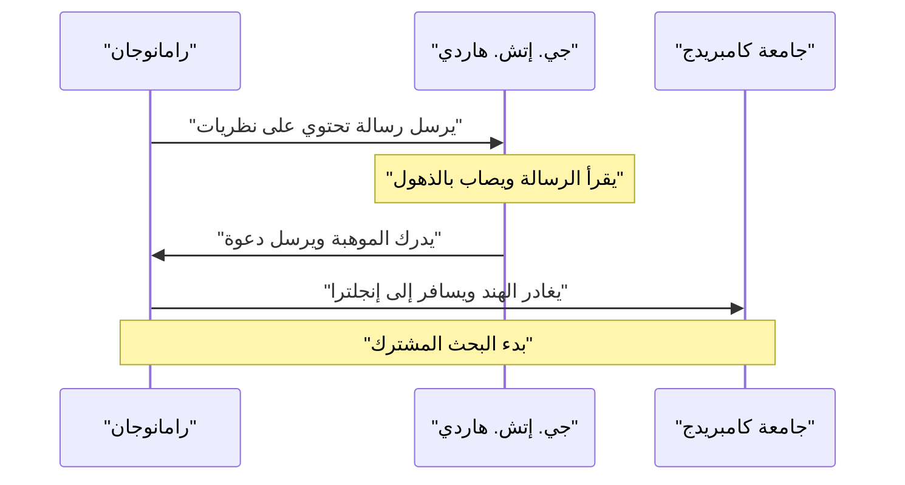
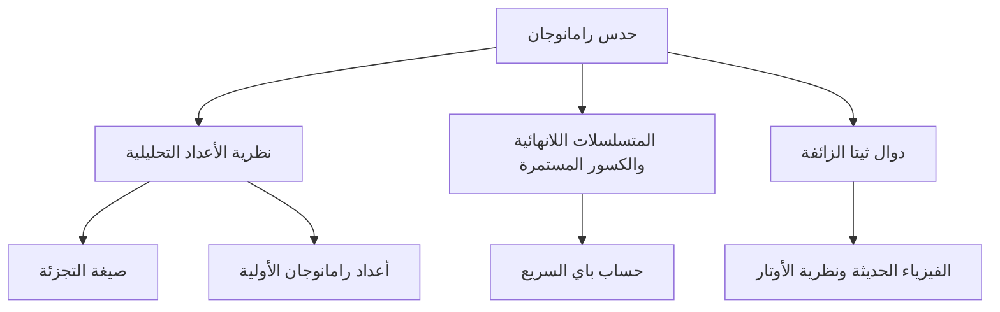

## مقدمة: الرجل الذي تلقى المعادلات من الآلهة

كان سرينيفاسا رامانوجان (1887-1920) عبقرياً رياضياً هندياً ظهر كالمذنب في عالم الرياضيات في أوائل القرن العشرين قبل أن تنتهي حياته القصيرة بشكل مأساوي. وعلى الرغم من عدم تلقيه تعليماً رياضياً رسمياً تقريباً، إلا أنه استنتج العديد من النظريات والصيغ المذهلة من خلال الحدس المطلق والبصيرة الفريدة. ولا تزال دفاتره التي نجت من الزمن تؤثر على الأبحاث المتطورة في الرياضيات والفيزياء الحديثة، حتى بعد أكثر من قرن على وفاته.

في هذا المقال، نتعمق في حياة رامانوجان المضطربة، ولقاءاته المصيرية مع عالم الرياضيات البريطاني جي. إتش. هاردي الذي اكتشفه، والإرث الرياضي اللامع الذي تركه وراءه. تعتبر حياته شهادة قوية على كيف يمكن للشغف والموهبة التغلب على الشدائد وتغيير العالم.

## الحياة المبكرة والخلفية: الصحوة على الرياضيات

وُلد رامانوجان في 22 ديسمبر 1887، في عائلة براهمية فقيرة في إيرود، وهي بلدة في تاميل نادو بجنوب الهند، وكان والده يعمل كاتباً في متجر صغير للأقمشة. كان لوالدته، وهي هندوسية متدينة وربة منزل، تأثير عميق عليه. منذ سن مبكرة جدًا، أظهر هوساً وموهبة غير عادية في الأرقام. وبدخوله مدرسة تاون الثانوية في كومباكونام في سن العاشرة، ازدهرت عبقريته الرياضية بسرعة. وكثيراً ما كان يطرح أسئلة تحير معلميه وتثير رهبة زملائه.

في سن الخامسة عشرة، حدث لقاء حاسم في حياته. فقد استعار من صديق له نسخة من كتاب *ملخص النتائج الأولية في الرياضيات البحتة والتطبيقية* للمؤلف جورج شوبريدج كار. كان الكتاب يضم آلاف النظريات بدون براهين. التهم رامانوجان الكتاب، وابتكر براهينه الخاصة وكتب نظريات جديدة تماماً في دفاتره. شكل هذا البحث الانعزالي أساس أسلوبه الرياضي الفريد.

ومع ذلك، أدى تفانيه المطلق في الرياضيات إلى إهماله لمواد أخرى. فقد رسب في امتحانات اللغة الإنجليزية والتاريخ، مما أدى إلى فقدانه لمنحته الدراسية الجامعية. وبدون الحصول على شهادة، واصل أبحاثه الرياضية في فقر مدقع. وبينما بدا أن النجاح الاجتماعي يراوغه، إلا أن شغفه بالرياضيات لم يضعف أبداً.

وفي وقت لاحق، وسعياً للحصول على دخل ثابت بعد الزواج، حصل على وظيفة كاتب في هيئة ميناء مدراس، بمساعدة في. راماسوامي آير، مؤسس جمعية الرياضيات الهندية. اعترف رؤساؤه بموهبته ودعموه إلى حد كبير، مما سمح له بالعمل على دفاتره ومتابعة أفكاره الرياضية أثناء فترات الراحة من العمل وفي وقت متأخر من الليل.

## اللقاء المصيري مع جي. إتش. هاردي

في عام 1913، وبتشجيع من حوله، أرسل رامانوجان رسائل تفصل أبحاثه إلى علماء رياضيات بريطانيين بارزين. تجاهل معظمهم رسائل كاتب هندي غير معروف، لكن رد فعل جودفري هارولد هاردي في جامعة كامبريدج كان مختلفاً. في البداية، اعتبر هاردي الرسالة بمثابة **هذيان رجل مجنون**. ومع ذلك، وعند الفحص الدقيق لبعض الصيغ، أدرك أنها عميقة ومعقدة لدرجة أنه لا يمكن لأحد أن يخترعها ما لم تكن صحيحة.

وقد علق هاردي لاحقاً قائلاً: "لقد هزمتني تماماً؛ لم أرَ شيئاً يشبهها على الإطلاق من قبل. نظرة واحدة إليها تكفي لإظهار أنه لا يمكن أن يكتبها سوى عالم رياضيات من الطراز الأول. لابد وأنها صحيحة لأنه، لو لم تكن كذلك، لما امتلك أحد الخيال الكافي لاختراعها."

يوجد أدناه مخطط تسلسلي يوضح التفاعل المصيري بين رامانوجان وهاردي.

## الحياة والإنجازات في كامبريدج

في عام 1914، وقبل اندلاع الحرب العالمية الأولى مباشرة، عبر رامانوجان المحيط - متحدياً المحرمات الدينية التي تمنع البراهمة من عبور البحر - ووصل إلى كلية ترينيتي في كامبريدج. هناك، بدأ بحثاً جاداً مع هاردي ومعاونه جون إدينسور ليتلوود.

غالباً ما يوصف تعاونهما بأنه أحد أكثر الأحداث رومانسية في تاريخ الرياضيات. كان هاردي عالم رياضيات غربياً تقليدياً يقدر البراهين الصارمة، بينما كان رامانوجان عبقرياً يستمد النتائج من خلال الحدس والإلهام. وكثيراً ما كان رامانوجان يقول: "ظهرت الإلهة ناماجيري، إلهة مسقط رأسي، في أحلامي وعلمتني الصيغ". وعلى الرغم من أن أسلوبيهما كانا متناقضين تماماً، إلا أنهما كانا يكملان نقاط ضعف بعضهما البعض، ونجحا في نشر العديد من الأبحاث المهمة. علم هاردي رامانوجان الصرامة الرياضية الحديثة، بينما زود رامانوجان هاردي بأفكار أصلية لم يكن ليخطر ببال أحد غيره.

## رقم سيارة الأجرة 1729: الحكاية الأشهر

تتعلق أشهر حكاية عن رامانوجان بـ "رقم سيارة الأجرة". وتُعرف على نطاق واسع كقصة تُظهر حدسه الاستثنائي وشغفه بالأرقام.

بينما كان رامانوجان في المستشفى في بوتني بسبب المرض، جاء هاردي لزيارته. وبحثاً عن طريقة لبدء محادثة، علق هاردي قائلاً: "لقد جئت في سيارة أجرة تحمل الرقم 1729. بدا لي أنه رقم ممل إلى حد ما. آمل ألا يكون فألاً سيئاً."

رد رامانوجان على الفور:
"لا يا سيد هاردي، إنه رقم مثير للاهتمام للغاية. إنه أصغر رقم يمكن التعبير عنه كمجموع مكعبين موجبين بطريقتين مختلفتين."

وعند التعبير عن ذلك رياضياً، يبدو كالتالي:

$$
1729 = 1^3 + 12^3 = 9^3 + 10^3
$$

منذ هذه الحادثة، أُطلق على الأرقام التي تحمل هذه الخاصية اسم "أرقام سيارة الأجرة". كان يفهم ويتذكر خصائص الأرقام الفردية وكأنها **أصدقاء شخصيون** له. ولاحقاً أشار ليتلوود قائلاً: "كان كل عدد صحيح موجب أحد الأصدقاء الشخصيين لرامانوجان."

## مساهمات رامانوجان الرياضية

ترك رامانوجان وراءه مجموعة متنوعة من الإنجازات، لكننا سنعرض بعضاً من أشهرها هنا. تركزت معظم أبحاثه على نظرية الأعداد، والمتسلسلات اللانهائية، والكسور المستمرة.

### المتسلسلات اللانهائية لباي $\pi$

اكتشف رامانوجان العديد من المتسلسلات اللانهائية سريعة التقارب لقيمة باي (pi). ومن بينها، الصيغة الأشهر هي التالية:

$$
\frac{1}{\pi} = \frac{2\sqrt{2}}{9801} \sum_{k=0}^{\infty} \frac{(4k)!(1103 + 26390k)}{(k!)^4 396^{4k}}
$$

تمتلك هذه الصيغة خاصية مذهلة تتمثل في أن حساب الحد الأول فقط ($k=0$) يعطي قيمة باي بدقة تصل إلى ستة منازل عشرية. في ذلك الوقت، كانت الصيغة معقدة للغاية، وظل استنتاجها لغزاً كاملاً، لكن علماء الرياضيات لاحقاً أثبتوا صحتها. وحتى اليوم، تُستخدم صيغ رامانوجان وخوارزمية تشودنوفسكي المبنية عليها في الحسابات الحاسوبية لقيمة باي، مما يساهم في تحقيق أرقام قياسية تتجاوز تريليونات الأرقام.

### الصيغة المقاربة لدالة التجزئة

تمثل دالة التجزئة $p(n)$ عدد الطرق التي يمكن بها التعبير عن عدد صحيح موجب $n$ كمجموع أعداد صحيحة موجبة. على سبيل المثال، تجزئة الرقم 4 هي 5 طرق (4، 3+1، 2+2، 2+1+1، 1+1+1+1).
كلما زادت قيمة $n$، يزداد $p(n)$ بسرعة، لكن العثور على قيمته الدقيقة كان يُعتبر صعباً لسنوات عديدة.

اكتشف رامانوجان وهاردي صيغة مذهلة توضح التقريب (السلوك المقارب) لـ $p(n)$.

$$
p(n) \sim \frac{1}{4n\sqrt{3}} \exp\left( \pi \sqrt{\frac{2n}{3}} \right) \quad (\text{عندما } n \to \infty)
$$

أدى هذا البحث إلى ميلاد طريقة جديدة في نظرية الأعداد التحليلية تسمى "طريقة الدائرة"، والتي أثرت بشكل كبير على التطور اللاحق للرياضيات. يمكن لهذه الصيغة التنبؤ بعدد التجزئات بدقة مذهلة حتى بالنسبة لقيم $n$ الكبيرة جداً.

### دوال ثيتا الزائفة (Mock Theta Functions)

وصف رامانوجان بحثه حول "دوال ثيتا الزائفة" في رسالته الأخيرة إلى هاردي قبل وفاته بوقت قصير. ولفترة طويلة، ظل المعنى الرياضي لهذه الدوال لغزاً، وحاول العديد من علماء الرياضيات فك شفرتها. في السنوات الأخيرة، أصبح من الواضح أن هذه الدوال تلعب دوراً حاسماً في طليعة الفيزياء الحديثة، مثل الديناميكا الحرارية للثقوب السوداء ونظرية الأوتار. لقد كان حدسه يسبق عصره بعقود، إن لم يكن بقرن من الزمان.

### أعداد رامانوجان الأولية والأعداد المركبة العالية

كان يمتلك أيضاً رؤى عميقة حول توزيع الأعداد الأولية. وتحتل أبحاثه التي أدت إلى اكتشاف "أعداد رامانوجان الأولية"، المستمدة من تعميم مسلمة بيرتراند، و"الأعداد المركبة العالية"، التي تمتلك عدداً كبيراً بشكل غير عادي من القواسم، مكانة مهمة في نظرية الأعداد الحديثة.

يوجد أدناه مخطط يوضح الروابط بين مجالات بحث رامانوجان.

## العودة إلى الوطن والوفاة المبكرة

جلبت حياته البحثية في إنجلترا شهرة هائلة لرامانوجان. في عام 1918، تم انتخابه زميلاً في الجمعية الملكية (FRS) وزميلاً في كلية ترينيتي في نفس العام. كان هذا إنجازاً غير مسبوق بالنسبة لهندي وشكل اللحظة التي تم فيها الاعتراف بقدراته عالمياً.

ومع ذلك، ووراء هذا المجد، كان جسده قد وصل إلى حدوده القصوى. أدى المناخ الإنجليزي البارد، وعدم قدرته على الحصول على طعام مناسب لكونه نباتياً براهمياً متشدداً، ونقص الغذاء الناجم عن الحرب العالمية الأولى إلى تقويض صحته بشدة. فقد أصيب بالسل ونقص حاد في الفيتامينات (أو ربما داء الأميبات الكبدي) وأُجبر على العيش في المصحات لفترات طويلة.

في عام 1919، بعد انتهاء الحرب العالمية الأولى، تعافت صحته قليلاً، وعاد إلى الهند حيث كانت تنتظره زوجته وعائلته. رحبت الهند بأكملها بعودته، لكن حالته استمرت في التدهور حتى بعد عودته إلى وطنه. وحتى على فراش المرض، لم يتوقف أبداً عن تأملاته الرياضية، واستمر في كتابة الصيغ في دفتره حتى النهاية. في 26 أبريل 1920، وافته المنية في سن مبكرة تناهز 32 عاماً.

## الإرث: الدفتر المفقود والتأثير على العالم الحديث

ظل الدفتر الأخير الذي كتبه رامانوجان على فراش الموت مفقوداً لفترة طويلة، ولكن تم اكتشافه في مكتبة جامعة كامبريدج بواسطة عالم الرياضيات الأمريكي جورج أندروز في عام 1976. وأصبح يُعرف باسم "الدفتر المفقود" وأرسل مرة أخرى موجات من الصدمة عبر المجتمع الرياضي. احتوى الدفتر على حوالي 600 صيغة جديدة، ولا تزال الأبحاث حول معانيها وتطبيقاتها مستمرة حتى يومنا هذا.

تم تصوير حياة سرينيفاسا رامانوجان المضطربة في سيرة روبرت كانيجل *الرجل الذي عرف اللانهاية* واقتباسها السينمائي عام 2015 الذي يحمل نفس الاسم، مما ألهم عدداً لا يحصى من الأشخاص خارج المجتمع الرياضي.

أعظم إرث له هو عدد لا يحصى من الصيغ التي تركها في دفاتره. ولأنها كانت تفتقر غالباً إلى البراهين، أمضى علماء الرياضيات اللاحقون عقوداً في إثباتها واحدة تلو الأخرى. وبفضل الجهود الدؤوبة لعلماء رياضيات مثل بروس بيرندت، تقدمت عملية فك رموز دفاتره، لكن الألغاز الجديدة وموضوعات البحث المستمدة منها لا تزال بعيدة عن الاستنفاد.

## خاتمة

غالباً ما تُستخدم كلمة **عبقري** باستخفاف، لكن رامانوجان كان عبقرياً بالمعنى الحقيقي للكلمة. فالصيغ العديدة التي تركها وراءه ليست مجرد تسلسلات من الرموز، بل تبدو وكأنها أعمال فنية تجسد قوانين الكون ذاتها. وعلى الرغم من معاناته من الفقر والمرض، استمر في استكشاف عالم الأفكار الرياضية البحتة، وسيظل اسمه وإنجازاته يتألقان إلى الأبد في تاريخ الرياضيات. أما الألغاز التي تركها فهي بمثابة تحدٍ أبدي لعلماء الرياضيات في المستقبل.
