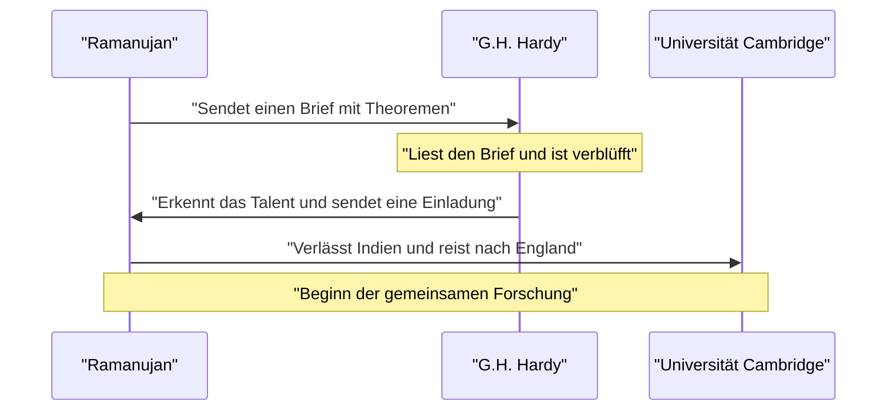
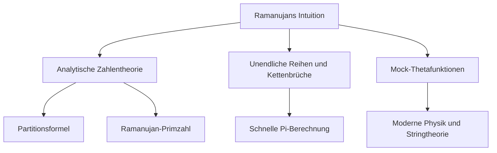

## Einleitung: Der Mann, der Formeln von den Göttern erhielt

[Srinivasa Ramanujan](https://kenji.blog/de/p/ramanujan/) (1887–1920) war ein indisches Mathematikgenie, das in der mathematischen Welt des frühen 20. Jahrhunderts wie ein Komet auftauchte, bevor sein tragisch kurzes Leben endete. Obwohl er fast keine formelle mathematische Ausbildung genossen hatte, leitete er durch bloße Intuition und einzigartige Einsicht zahlreiche erstaunliche Theoreme und Formeln ab. Seine überlieferten Notizbücher beeinflussen die Spitzenforschung in der modernen Mathematik und Physik noch mehr als ein Jahrhundert nach seinem Tod.

In diesem Artikel tauchen wir tief in Ramanujans turbulentes Leben ein, in seine schicksalhaften Begegnungen mit dem britischen Mathematiker G.H. Hardy, der ihn entdeckte, und in das brillante mathematische Erbe, das er hinterließ. Sein Leben ist ein starkes Zeugnis dafür, wie Leidenschaft und Talent Widrigkeiten überwinden und die Welt verändern können.

## Frühes Leben und Hintergrund: Das Erwachen zur Mathematik

Geboren am 22. Dezember 1887 in einer armen Brahmanen-Familie in Erode, einer Stadt in Tamil Nadu in Südindien, arbeitete Ramanujans Vater als Angestellter in einem kleinen Stoffladen. Seine Mutter, eine fromme Hinduistin und Hausfrau, hatte einen tiefen Einfluss auf ihn. Von klein auf zeigte er eine außergewöhnliche Besessenheit und Begabung für Zahlen. Als er im Alter von 10 Jahren in die Town High School in Kumbakonam eintrat, blühte sein mathematisches Genie schnell auf. Er stellte oft Fragen, die seine Lehrer verblüfften und seinen Klassenkameraden Ehrfurcht einflößten.

Im Alter von 15 Jahren kam es zu einer schicksalhaften Begegnung. Er lieh sich von einem Freund ein Exemplar von George Shoobridge Carrs *A Synopsis of Elementary Results in Pure and Applied Mathematics* aus. Das Buch listete Tausende von Theoremen ohne Beweise auf. Ramanujan verschlang das Buch, schuf seine eigenen Beweise und schrieb völlig neue Theoreme in seine Notizbücher. Diese einsame Forschung bildete das Fundament seines einzigartigen mathematischen Stils.

Seine völlige Hingabe an die Mathematik führte jedoch dazu, dass er andere Fächer vernachlässigte. Er fiel bei seinen Englisch- und Geschichtsprüfungen durch, was zum Verlust seines College-Stipendiums führte. Ohne Abschluss setzte er seine mathematischen Forschungen in extremer Armut fort. Während ihm sozialer Erfolg verwehrt zu bleiben schien, schwand seine Leidenschaft für die Mathematik nie.

Als er später nach seiner Heirat ein stabiles Einkommen suchte, sicherte er sich mit Hilfe von V. Ramaswamy Aiyer, dem Gründer der Indian Mathematical Society, eine Stelle als Angestellter beim Madras Port Trust. Seine Vorgesetzten erkannten sein Talent und unterstützten ihn weitgehend. Sie erlaubten ihm, in den Arbeitspausen und bis spät in die Nacht an seinen Notizbüchern zu arbeiten und seinen mathematischen Gedanken nachzugehen.

## Die schicksalhafte Begegnung mit G.H. Hardy

Im Jahr 1913 sandte Ramanujan, ermutigt von seinem Umfeld, Briefe mit Details zu seinen Forschungen an prominente britische Mathematiker. Die meisten ignorierten die Briefe eines unbekannten indischen Angestellten, doch die Reaktion von Godfrey Harold Hardy an der Universität Cambridge war anders. Zunächst hielt Hardy den Brief für die **Wahnvorstellungen eines Verrückten**. Bei näherer Betrachtung einiger der Formeln erkannte er jedoch, dass sie so tiefgründig waren, dass sie niemand hätte erfinden können, wenn sie nicht wahr wären.

Hardy bemerkte später: „Sie haben mich völlig besiegt; ich hatte noch nie etwas auch nur im Entferntesten Ähnliches gesehen. Ein einziger Blick auf sie genügt, um zu zeigen, dass sie nur von einem Mathematiker der höchsten Klasse geschrieben sein konnten. Sie müssen wahr sein, denn wenn sie nicht wahr wären, hätte niemand die Fantasie, sie zu erfinden.“

Unten ist ein Sequenzdiagramm dargestellt, das die schicksalhafte Interaktion zwischen Ramanujan und Hardy zeigt.

## Leben und Leistungen in Cambridge

Im Jahr 1914, kurz vor Ausbruch des Ersten Weltkriegs, überquerte Ramanujan den Ozean – und brach damit das religiöse Tabu, das es Brahmanen verbot, das Meer zu überqueren – und kam am Trinity College in Cambridge an. Dort begann er ernsthafte Forschungen mit Hardy und dessen Mitarbeiter John Edensor Littlewood.

Ihre Zusammenarbeit wird oft als eines der romantischsten Ereignisse in der Geschichte der Mathematik beschrieben. Hardy war ein traditioneller westlicher Mathematiker, der strenge Beweise schätzte, während Ramanujan ein Genie war, das Ergebnisse durch Intuition und Inspiration ableitete. Ramanujan sagte oft: „Die Göttin Namagiri aus meiner Heimatstadt erschien mir in meinen Träumen und lehrte mich die Formeln.“ Obwohl ihre Stile gegensätzlich waren, ergänzten sie die Schwächen des anderen und veröffentlichten erfolgreich zahlreiche wichtige Papiere. Hardy brachte Ramanujan moderne mathematische Strenge bei, während Ramanujan Hardy mit originellen Ideen versorgte, die sonst niemand hätte konzipieren können.

## Taxicab-Zahl 1729: Die berühmteste Anekdote

Die berühmteste Anekdote über Ramanujan betrifft die „Taxicab-Zahl“. Sie ist weithin als eine Geschichte bekannt, die seine außergewöhnliche Intuition und seine Zuneigung zu Zahlen demonstriert.

Als Ramanujan krankheitsbedingt im Sanatorium in Putney lag, kam Hardy ihn besuchen. Auf der Suche nach einem Gesprächseinstieg bemerkte Hardy: „Ich bin in einem Taxi mit der Nummer 1729 gefahren. Es schien mir eine ziemlich langweilige Zahl zu sein. Ich hoffe, das ist kein ungünstiges Omen.“

Ramanujan antwortete sofort:
„Nein, Mr. Hardy, es ist eine sehr interessante Zahl. Es ist die kleinste Zahl, die auf zwei verschiedene Arten als Summe zweier positiver Kuben ausgedrückt werden kann.“

Mathematisch ausgedrückt sieht dies wie folgt aus:

$$
1729 = 1^3 + 12^3 = 9^3 + 10^3
$$

Seit dieser Anekdote werden Zahlen mit dieser Eigenschaft als „Taxicab-Zahlen“ (oder Hardy-Ramanujan-Zahlen) bezeichnet. Er verstand und erinnerte sich an die Eigenschaften einzelner Zahlen, als wären sie seine **persönlichen Freunde**. Littlewood bemerkte später: „Jede positive ganze Zahl war einer von Ramanujans persönlichen Freunden.“

## Ramanujans mathematische Beiträge

Ramanujan hinterließ eine Vielzahl von Leistungen, von denen wir hier einige der berühmtesten vorstellen möchten. Der Großteil seiner Forschung umfasste Zahlentheorie, unendliche Reihen und Kettenbrüche.

### Unendliche Reihen für Pi $\pi$

Ramanujan entdeckte zahlreiche schnell konvergierende unendliche Reihen für Pi. Die berühmteste davon ist die folgende Formel:

$$
\frac{1}{\pi} = \frac{2\sqrt{2}}{9801} \sum_{k=0}^{\infty} \frac{(4k)!(1103 + 26390k)}{(k!)^4 396^{4k}}
$$

Diese Formel hat die erstaunliche Eigenschaft, dass die Berechnung nur des ersten Terms ($k=0$) Pi auf sechs Dezimalstellen genau liefert. Damals war sie zu komplex, und es blieb ein völliges Rätsel, wie sie abgeleitet wurde, aber spätere Mathematiker bewiesen ihre Richtigkeit. Noch heute werden Ramanujans Formeln und der darauf basierende Chudnovsky-Algorithmus bei der Computerberechnung von Pi verwendet und tragen dazu bei, Rekorde von über Billionen von Stellen aufzustellen.

### Asymptotische Formel für die Partitionsfunktion

Die Partitionsfunktion $p(n)$ gibt die Anzahl der Möglichkeiten an, wie eine positive ganze Zahl $n$ als Summe positiver ganzer Zahlen ausgedrückt werden kann. Zum Beispiel ist die Partition von 4 gleich 5 (4, 3+1, 2+2, 2+1+1, 1+1+1+1).
Je größer $n$ wird, desto schneller steigt $p(n)$, aber den genauen Wert zu finden, galt viele Jahre lang als schwierig.

Ramanujan und Hardy entdeckten eine erstaunliche Formel, die die Annäherung (asymptotisches Verhalten) dieser $p(n)$ zeigt.

$$
p(n) \sim \frac{1}{4n\sqrt{3}} \exp\left( \pi \sqrt{\frac{2n}{3}} \right) \quad (\text{für } n \to \infty)
$$

Diese Forschung gebar eine neue Methode in der analytischen Zahlentheorie, die als „Kreismethode“ (Circle Method) bezeichnet wird und die spätere Entwicklung der Mathematik stark beeinflusste. Diese Formel kann die Anzahl der Partitionen mit unglaublicher Präzision vorhersagen, selbst für extrem große Werte von $n$.

### Mock-Thetafunktionen (Mock Theta Functions)

Ramanujans Forschungen zu „Mock-Thetafunktionen“ wurden in seinem letzten Brief an Hardy kurz vor seinem Tod beschrieben. Lange Zeit blieb die mathematische Bedeutung dieser Funktionen ein Rätsel, und viele Mathematiker versuchten, sie zu entschlüsseln. In den letzten Jahren ist deutlich geworden, dass diese Funktionen eine entscheidende Rolle an der Spitze der modernen Physik spielen, etwa in der Thermodynamik von Schwarzen Löchern und der Stringtheorie. Seine Intuition war der Zeit um Jahrzehnte, wenn nicht gar um ein Jahrhundert, voraus.

### Ramanujan-Primzahlen und hochzusammengesetzte Zahlen

Er besaß auch tiefe Einblicke in die Verteilung von Primzahlen. Seine Forschung, die zu „Ramanujan-Primzahlen“ führte, abgeleitet aus der Verallgemeinerung des Bertrandschen Postulats, und zu „hochzusammengesetzten Zahlen“, die eine ungewöhnlich große Anzahl von Teilern aufweisen, nimmt einen wichtigen Platz in der modernen Zahlentheorie ein.

Nachfolgend ein Diagramm, das die Verbindungen zwischen Ramanujans Forschungsgebieten zeigt.

## Rückkehr in die Heimat und früher Tod

Sein Forschungsleben in England brachte Ramanujan enormen Ruhm. 1918 wurde er zum Fellow of the Royal Society (FRS) und im selben Jahr zum Fellow des Trinity College gewählt. Dies war eine beispiellose Leistung für einen Inder und markierte den Moment, in dem seine Fähigkeiten weltweit anerkannt wurden.

Hinter diesem Ruhm jedoch hatte sein Körper seine Grenzen erreicht. Das kalte englische Klima, seine Unfähigkeit als strenger brahmanischer Vegetarier, angemessene Nahrung zu erhalten, und die durch den Ersten Weltkrieg verursachten Nahrungsmittelengpässe untergruben seine Gesundheit schwer. Er litt an Tuberkulose und schwerem Vitaminmangel (oder möglicherweise hepatischer Amöbiasis) und war gezwungen, für lange Zeit in Sanatorien zu leben.

1919, nach dem Ende des Ersten Weltkriegs, erholte sich seine Gesundheit leicht, und er kehrte nach Indien zurück, wo seine Frau und seine Familie auf ihn warteten. Ganz Indien begrüßte seine Rückkehr, doch sein Zustand verschlechterte sich auch nach der Rückkehr in sein Heimatland weiter. Selbst auf dem Krankenbett hörte er nie mit seinen mathematischen Überlegungen auf und schrieb bis zum Schluss Formeln in sein Notizbuch. Am 26. April 1920 verstarb er im jungen Alter von 32 Jahren.

## Vermächtnis: Das verlorene Notizbuch und die Auswirkungen auf die moderne Welt

Das letzte Notizbuch, das Ramanujan auf dem Sterbebett schrieb, war lange Zeit verschollen, wurde aber 1976 vom amerikanischen Mathematiker George Andrews in der Bibliothek der Universität Cambridge entdeckt. Es wurde als „Das verlorene Notizbuch“ (The Lost Notebook) bekannt und sandte erneut Schockwellen durch die mathematische Gemeinschaft. Es enthielt etwa 600 neue Formeln, und die Forschung nach ihrer Bedeutung und ihren Anwendungen wird bis heute fortgesetzt.

Das turbulente Leben von [Srinivasa Ramanujan](https://kenji.blog/de/p/ramanujan/) wurde in Robert Kanigels Biografie *Der Mann, der die Unendlichkeit kannte* und der gleichnamigen Verfilmung von 2015 dargestellt, die unzählige Menschen über die mathematische Gemeinschaft hinaus inspirierte.

Sein größtes Vermächtnis ist die unzählige Menge an Formeln, die in seinen Notizbüchern hinterlassen wurden. Da sie oft ohne Beweise waren, verbrachten spätere Mathematiker Jahrzehnte damit, jede einzelne zu beweisen. Dank der unermüdlichen Bemühungen von Mathematikern wie Bruce Berndt ist die Entzifferung seiner Notizbücher vorangeschritten, aber die neuen Rätsel und Forschungsthemen, die daraus abgeleitet wurden, sind noch lange nicht erschöpft.

## Fazit

Das Wort **Genie** wird oft leichtfertig verwendet, aber Ramanujan war ein Genie im wahrsten Sinne des Wortes. Die zahlreichen Formeln, die er hinterließ, sind nicht bloße Aneinanderreihungen von Symbolen, sondern wirken wie Kunstwerke, die die Gesetze des Universums selbst einfangen. Obwohl er unter Armut und Krankheit litt, fuhr er fort, das Reich reiner mathematischer Ideen zu erforschen, und sein Name und seine Errungenschaften werden für immer in der Geschichte der Mathematik leuchten. Die Mysterien, die er hinterließ, dienen als ewige Herausforderung für die Mathematiker der Zukunft.
