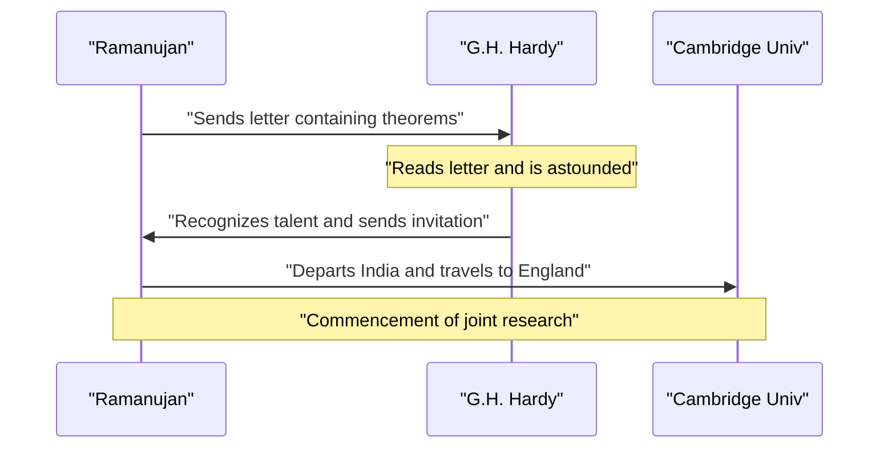
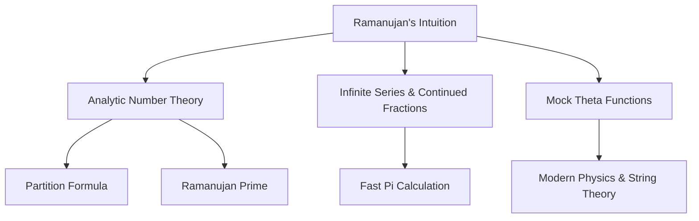

## Introduction: The Man Who Received Formulas from the Gods

[Srinivasa Ramanujan](https://kenji.blog/en/p/ramanujan/) (1887–1920) was an Indian mathematical genius who appeared like a comet in the early 20th-century mathematical world before his tragically short life ended. Despite having almost no formal mathematical education, he derived numerous astonishing theorems and formulas through sheer intuition and unique insight. His surviving notebooks continue to influence cutting-edge research in modern mathematics and physics, more than a century after his death.

In this article, we delve deep into Ramanujan's turbulent life, his fateful interactions with the British mathematician G.H. Hardy who discovered him, and the brilliant mathematical legacy he left behind. His life stands as a powerful testament to how passion and talent can overcome adversity and change the world.

## Early Life and Background: Awakening to Mathematics

Born on December 22, 1887, into a poor Brahmin family in Erode, a town in Tamil Nadu, southern India, Ramanujan's father worked as a clerk in a small cloth shop. His mother, a devout Hindu and homemaker, had a profound influence on him. From a very young age, he showed an extraordinary obsession and talent for numbers. Entering Town High School in Kumbakonam at age 10, his mathematical genius quickly blossomed. He often asked questions that baffled his teachers and earned the awe of his classmates.

At 15, a fateful encounter occurred. He borrowed a copy of George Shoobridge Carr's *A Synopsis of Elementary Results in Pure and Applied Mathematics* from a friend. The book listed thousands of theorems without proofs. Ramanujan devoured the book, creating his own proofs and writing down entirely new theorems in his notebooks. This solitary research formed the foundation of his unique mathematical style.

However, his utter devotion to mathematics caused him to neglect other subjects. He failed his English and history exams, resulting in the loss of his college scholarship. Without a degree, he continued his mathematical research in extreme poverty. While social success seemed to elude him, his passion for mathematics never waned.

Later, seeking a stable income after marriage, he secured a position as a clerk at the Madras Port Trust, aided by V. Ramaswamy Aiyer, the founder of the Indian Mathematical Society. His superiors recognized his talent and largely supported him, allowing him to work on his notebooks and pursue his mathematical thoughts during work breaks and late at night.

## The Fateful Encounter with G.H. Hardy

In 1913, encouraged by those around him, Ramanujan sent letters detailing his research to prominent British mathematicians. Most ignored the letters from an unknown Indian clerk, but the reaction of Godfrey Harold Hardy at Cambridge University was different. At first, Hardy considered the letter to be the **ravings of a madman**. However, upon closer examination of some of the formulas, he realized they were so profoundly deep that no one could possibly have invented them unless they were true.

Hardy later remarked, "They defeated me completely; I had never seen anything in the least like them before. A single look at them is enough to show that they could only be written by a mathematician of the highest class. They must be true because, if they were not true, no one would have the imagination to invent them."

Below is a sequence diagram showing the fateful interaction between Ramanujan and Hardy.

## Life and Achievements in Cambridge

In 1914, just before the outbreak of World War I, Ramanujan crossed the ocean—defying the religious taboo forbidding Brahmins from crossing the sea—and arrived at Trinity College, Cambridge. There, he began serious research with Hardy and his collaborator John Edensor Littlewood.

Their collaboration is often described as one of the most romantic incidents in the history of mathematics. Hardy was a traditional Western mathematician who valued rigorous proofs, while Ramanujan was a genius who derived results through intuition and inspiration. Ramanujan often said, "The goddess Namagiri of my hometown appeared in my dreams and taught me the formulas." Although their styles were polar opposites, they complemented each other's weaknesses, successfully publishing numerous important papers. Hardy taught Ramanujan modern mathematical rigor, while Ramanujan provided Hardy with original ideas no one else could conceive.

## Taxicab Number 1729: The Most Famous Anecdote

The most famous anecdote about Ramanujan concerns the "taxicab number." It is widely known as a story that demonstrates his extraordinary intuition and affection for numbers.

While Ramanujan was hospitalized in Putney due to illness, Hardy came to visit him. Looking for a way to start the conversation, Hardy remarked, "I rode in a taxicab numbered 1729. It seemed to me rather a dull number. I hope it is not an unfavorable omen."

Ramanujan immediately replied:
"No, Mr. Hardy, it is a very interesting number. It is the smallest number expressible as the sum of two positive cubes in two different ways."

Expressed mathematically, this looks like the following:

$$
1729 = 1^3 + 12^3 = 9^3 + 10^3
$$

Since this anecdote, numbers with this property have been called "Taxicab numbers". He understood and remembered the properties of individual numbers as if they were his **personal friends**. Littlewood later remarked, "Every positive integer was one of Ramanujan's personal friends."

## Ramanujan's Mathematical Contributions

Ramanujan left behind a wide variety of achievements, but we will introduce some of the most famous here. The majority of his research involved number theory, infinite series, and continued fractions.

### Infinite Series for Pi $\pi$

Ramanujan discovered numerous rapidly converging infinite series for pi. Among them, the most famous is the following formula:

$$
\frac{1}{\pi} = \frac{2\sqrt{2}}{9801} \sum_{k=0}^{\infty} \frac{(4k)!(1103 + 26390k)}{(k!)^4 396^{4k}}
$$

This formula has the astonishing property that calculating just the first term ($k=0$) yields pi accurately to six decimal places. At the time, it was too complex, and it remained a complete mystery how it was derived, but later mathematicians proved its correctness. Even today, Ramanujan's formulas and the Chudnovsky algorithm based on them are used in computer calculations of pi, contributing to setting records exceeding trillions of digits.

### Asymptotic Formula for the Partition Function

The partition function $p(n)$ represents the number of ways a positive integer $n$ can be expressed as the sum of positive integers. For example, the partition of 4 is 5 (4, 3+1, 2+2, 2+1+1, 1+1+1+1).
As $n$ becomes larger, $p(n)$ increases rapidly, but finding its exact value was considered difficult for many years.

Ramanujan and Hardy discovered an astounding formula showing the approximation (asymptotic behavior) of this $p(n)$.

$$
p(n) \sim \frac{1}{4n\sqrt{3}} \exp\left( \pi \sqrt{\frac{2n}{3}} \right) \quad (\text{as } n \to \infty)
$$

This research birthed a new method in analytic number theory called the "Circle Method," greatly influencing the subsequent development of mathematics. This formula can predict the number of partitions with incredible precision even for extremely large values of $n$.

### Mock Theta Functions

Ramanujan's research on "mock theta functions" was described in his last letter to Hardy just before his death. For a long time, the mathematical meaning of these functions remained a mystery, and many mathematicians attempted to decode them. In recent years, it has become clear that these functions play a critical role in the forefront of modern physics, such as black hole thermodynamics and string theory. His intuition was decades, if not a century, ahead of its time.

### Ramanujan Primes and Highly [Composite](https://kenji.blog/en/p/browser-rendering-mechanism-dom-paint/) Numbers

He also possessed deep insights into the distribution of primes. His research leading to "Ramanujan primes," derived from the generalization of Bertrand's postulate, and "highly composite numbers," which have an unusually large number of divisors, hold an important place in modern number theory.

Below is a diagram showing the connections between Ramanujan's research fields.

## Return Home and Premature Death

His research life in England brought Ramanujan immense fame. In 1918, he was elected a Fellow of the Royal Society (FRS) and a Fellow of Trinity College in the same year. This was an unprecedented achievement for an Indian and marked the moment his abilities were recognized globally.

However, behind that glory, his body had reached its limit. The cold English climate, his inability to obtain proper food as a strict Brahmin vegetarian, and the food shortages caused by World War I severely undermined his health. He suffered from tuberculosis and severe vitamin deficiency (or possibly hepatic amoebiasis) and was forced to live in sanatoriums for long periods.

In 1919, after the end of World War I, his health recovered slightly, and he returned to India where his wife and family waited. The whole of India welcomed his return, but his condition continued to worsen even after returning to his home country. Even on his sickbed, he never ceased his mathematical ponderings, writing formulas in his notebook until the very end. On April 26, 1920, he passed away at the young age of 32.

## Legacy: The Lost Notebook and Impact on the Modern World

The final notebook Ramanujan wrote on his deathbed was lost for a long time, but it was discovered in the library of Cambridge University by American mathematician George Andrews in 1976. This became known as "The Lost Notebook" and once again sent shockwaves through the mathematical community. It contained about 600 new formulas, and research into their meaning and applications continues to this day.

The turbulent life of [Srinivasa Ramanujan](https://kenji.blog/en/p/ramanujan/) was depicted in Robert Kanigel's biography *The Man Who Knew Infinity* and its 2015 film adaptation of the same name, inspiring countless people beyond the mathematical community.

His greatest legacy is the myriad formulas left in his notebooks. Since they were often devoid of proofs, later mathematicians spent decades proving each one. Thanks to the tireless efforts of mathematicians like Bruce Berndt, the deciphering of his notebooks has progressed, but the new mysteries and research themes derived from them are still far from exhausted.

## Conclusion

The word **genius** is often used lightly, but Ramanujan was a genius in the truest sense. The numerous formulas he left behind are not mere sequences of symbols but seem like works of art capturing the very laws of the universe. Though suffering from poverty and disease, he continued to explore the realm of pure mathematical ideas, and his name and achievements will shine forever in the history of mathematics. The mysteries he left behind serve as an eternal challenge to the mathematicians of the future.
