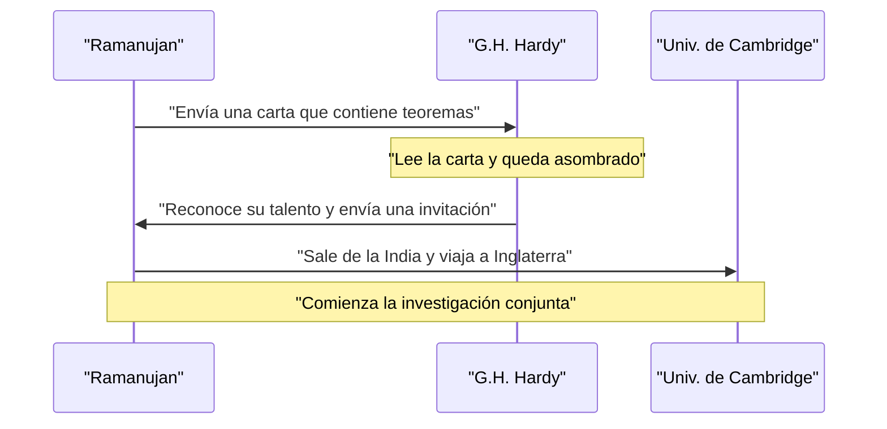
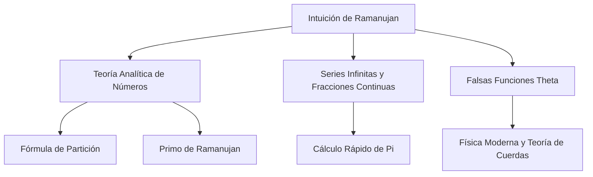

## Introducción: El hombre que recibió fórmulas de los dioses

Srinivasa Ramanujan (1887–1920) fue un genio matemático indio que apareció como un cometa en el mundo matemático de principios del siglo XX, antes de que terminara su trágicamente corta vida. A pesar de casi no tener educación matemática formal, derivó numerosos teoremas y fórmulas asombrosas gracias a su pura intuición y su visión única. Sus cuadernos de notas, que han sobrevivido, siguen influyendo en la investigación de vanguardia de las matemáticas y la física modernas, más de un siglo después de su muerte.

En este artículo, profundizaremos en la turbulenta vida de Ramanujan, sus decisivos encuentros con el matemático británico G.H. Hardy que lo descubrió, y el brillante legado matemático que dejó atrás. Su vida es un poderoso testimonio de cómo la pasión y el talento pueden superar la adversidad y cambiar el mundo.

## Primeros años y orígenes: El despertar a las matemáticas

Nacido el 22 de diciembre de 1887 en el seno de una familia brahmán pobre en Erode, una ciudad de Tamil Nadu en el sur de la India, el padre de Ramanujan trabajaba como empleado en una pequeña tienda de telas. Su madre, devota hindú y ama de casa, tuvo una profunda influencia en él. Desde muy joven, mostró una obsesión y un talento extraordinarios por los números. Al ingresar a la Town High School en Kumbakonam a los 10 años, su genio matemático floreció rápidamente. A menudo hacía preguntas que desconcertaban a sus profesores y se ganaba el asombro de sus compañeros.

A los 15 años, ocurrió un encuentro fatídico. Pidió prestado a un amigo una copia de *A Synopsis of Elementary Results in Pure and Applied Mathematics* de George Shoobridge Carr. El libro enumeraba miles de teoremas sin demostraciones. Ramanujan devoró el libro, creando sus propias pruebas y anotando teoremas completamente nuevos en sus cuadernos. Esta investigación solitaria sentó las bases de su singular estilo matemático.

Sin embargo, su total dedicación a las matemáticas hizo que descuidara otras materias. Reprobó sus exámenes de inglés e historia, lo que resultó en la pérdida de su beca universitaria. Sin un título, continuó su investigación matemática en la extrema pobreza. Aunque el éxito social parecía eludirle, su pasión por las matemáticas nunca disminuyó.

Más tarde, buscando ingresos estables tras casarse, consiguió un puesto como oficinista en el Madras Port Trust, con la ayuda de V. Ramaswamy Aiyer, fundador de la Sociedad Matemática de la India. Sus superiores reconocieron su talento y lo apoyaron en gran medida, permitiéndole trabajar en sus cuadernos y continuar con sus pensamientos matemáticos durante los descansos y a altas horas de la noche.

## El encuentro decisivo con G.H. Hardy

En 1913, animado por quienes le rodeaban, Ramanujan envió cartas detallando sus investigaciones a destacados matemáticos británicos. La mayoría ignoró las cartas de un oficinista indio desconocido, pero la reacción de Godfrey Harold Hardy en la Universidad de Cambridge fue diferente. Al principio, Hardy consideró que la carta eran los **delirios de un loco**. Sin embargo, al examinar más de cerca algunas de las fórmulas, se dio cuenta de que eran tan profundamente complejas que nadie podría haberlas inventado a menos que fueran ciertas.

Hardy comentó más tarde: "Me derrotaron por completo; nunca antes había visto nada que se les pareciera en lo más mínimo. Un solo vistazo es suficiente para mostrar que solo podrían haber sido escritas por un matemático de la más alta clase. Deben ser ciertas, porque, si no lo fueran, nadie tendría la imaginación de inventarlas."

A continuación, se muestra un diagrama de secuencia que ilustra la interacción decisiva entre Ramanujan y Hardy.

## Vida y logros en Cambridge

En 1914, justo antes del estallido de la Primera Guerra Mundial, Ramanujan cruzó el océano —desafiando el tabú religioso que prohibía a los brahmanes cruzar el mar— y llegó al Trinity College de Cambridge. Allí, comenzó a investigar seriamente con Hardy y su colaborador John Edensor Littlewood.

Su colaboración se describe a menudo como uno de los incidentes más románticos de la historia de las matemáticas. Hardy era un matemático occidental tradicional que valoraba las pruebas rigurosas, mientras que Ramanujan era un genio que derivaba resultados a través de la intuición y la inspiración. Ramanujan solía decir: "La diosa Namagiri de mi ciudad natal apareció en mis sueños y me enseñó las fórmulas." Aunque sus estilos eran polos opuestos, compensaban las debilidades del otro, publicando con éxito numerosos e importantes artículos. Hardy le enseñó a Ramanujan el rigor matemático moderno, mientras que Ramanujan le proporcionó a Hardy ideas originales que nadie más habría podido concebir.

## El número del taxi 1729: La anécdota más famosa

La anécdota más famosa sobre Ramanujan tiene que ver con el "número del taxi". Se la conoce ampliamente como una historia que demuestra su extraordinaria intuición y su afecto por los números.

Mientras Ramanujan estaba hospitalizado en Putney a causa de una enfermedad, Hardy fue a visitarlo. Buscando una manera de iniciar la conversación, Hardy comentó: "Viajé en un taxi con el número 1729. Me pareció un número bastante aburrido. Espero que no sea un mal presagio."

Ramanujan respondió inmediatamente:
"No, Sr. Hardy, es un número muy interesante. Es el número más pequeño que se puede expresar como la suma de dos cubos positivos de dos maneras diferentes."

Expresado matemáticamente, se ve así:

$$
1729 = 1^3 + 12^3 = 9^3 + 10^3
$$

Desde esta anécdota, los números con esta propiedad reciben el nombre de "números de taxi". Él entendía y recordaba las propiedades de los números individuales como si fueran sus **amigos personales**. Littlewood señaló más tarde: "Cada entero positivo era uno de los amigos personales de Ramanujan."

## Contribuciones matemáticas de Ramanujan

Ramanujan dejó tras de sí una gran variedad de logros, pero aquí presentaremos algunos de los más famosos. La mayor parte de su investigación se centró en la teoría de números, las series infinitas y las fracciones continuas.

### Series infinitas para Pi $\pi$

Ramanujan descubrió numerosas series infinitas de rápida convergencia para pi. Entre ellas, la más famosa es la siguiente fórmula:

$$
\frac{1}{\pi} = \frac{2\sqrt{2}}{9801} \sum_{k=0}^{\infty} \frac{(4k)!(1103 + 26390k)}{(k!)^4 396^{4k}}
$$

Esta fórmula tiene la asombrosa propiedad de que el cálculo del primer término ($k=0$) proporciona a pi seis decimales de precisión. En aquel entonces, era demasiado compleja y seguía siendo un misterio total cómo se dedujo, pero matemáticos posteriores demostraron su corrección. Aún hoy, las fórmulas de Ramanujan y el algoritmo de Chudnovsky basado en ellas se utilizan en los cálculos informáticos de pi, contribuyendo a establecer récords que superan los billones de dígitos.

### Fórmula asintótica de la función de partición

La función de partición $p(n)$ representa el número de formas en que un entero positivo $n$ puede expresarse como suma de enteros positivos. Por ejemplo, la partición de 4 es 5 (4, 3+1, 2+2, 2+1+1, 1+1+1+1).
A medida que $n$ se hace más grande, $p(n)$ aumenta rápidamente, pero hallar su valor exacto se consideró difícil durante muchos años.

Ramanujan y Hardy descubrieron una fórmula asombrosa que muestra la aproximación (comportamiento asintótico) de este $p(n)$.

$$
p(n) \sim \frac{1}{4n\sqrt{3}} \exp\left( \pi \sqrt{\frac{2n}{3}} \right) \quad (\text{cuando } n \to \infty)
$$

Esta investigación dio origen a un nuevo método en la teoría analítica de números llamado el "Método del círculo", que influyó enormemente en el desarrollo posterior de las matemáticas. Esta fórmula puede predecir el número de particiones con increíble precisión, incluso para valores de $n$ extremadamente grandes.

### Falsas funciones theta (Mock Theta Functions)

La investigación de Ramanujan sobre las "falsas funciones theta" fue descrita en su última carta a Hardy justo antes de su muerte. Durante mucho tiempo, el significado matemático de estas funciones siguió siendo un misterio, y muchos matemáticos intentaron descifrarlas. En los últimos años, ha quedado claro que estas funciones desempeñan un papel crucial a la vanguardia de la física moderna, como en la termodinámica de los agujeros negros y la teoría de cuerdas. Su intuición se adelantó décadas, si no un siglo, a su tiempo.

### Primos de Ramanujan y números altamente compuestos

También poseía conocimientos profundos sobre la distribución de los números primos. Sus investigaciones que condujeron a los "primos de Ramanujan", derivados de la generalización del postulado de Bertrand, y los "números altamente compuestos", que tienen una cantidad inusualmente grande de divisores, ocupan un lugar importante en la teoría de números moderna.

A continuación, se presenta un diagrama que muestra las conexiones entre los campos de investigación de Ramanujan.

## Regreso a casa y muerte prematura

Su vida de investigación en Inglaterra le dio a Ramanujan una inmensa fama. En 1918, fue elegido Miembro de la Royal Society (FRS) y Miembro del Trinity College ese mismo año. Esto fue un logro sin precedentes para un indio y marcó el momento en que sus habilidades fueron reconocidas a nivel mundial.

Sin embargo, detrás de esa gloria, su cuerpo había llegado al límite. El clima frío de Inglaterra, su incapacidad para obtener alimentos adecuados como brahmán estrictamente vegetariano, y la escasez de alimentos provocada por la Primera Guerra Mundial minaron gravemente su salud. Sufrió de tuberculosis y de una grave deficiencia de vitaminas (o posiblemente de amebiasis hepática) y se vio obligado a vivir en sanatorios durante largos períodos.

En 1919, tras el fin de la Primera Guerra Mundial, su salud se recuperó ligeramente y regresó a la India, donde le esperaban su esposa y su familia. Toda la India celebró su regreso, pero su estado siguió empeorando incluso después de regresar a su país natal. Incluso en su lecho de enfermo, nunca abandonó sus cavilaciones matemáticas y continuó escribiendo fórmulas en su cuaderno hasta el final. El 26 de abril de 1920, falleció a la temprana edad de 32 años.

## El legado: El cuaderno perdido y el impacto en el mundo moderno

El último cuaderno que Ramanujan escribió en su lecho de muerte estuvo perdido durante mucho tiempo, pero fue descubierto en la biblioteca de la Universidad de Cambridge por el matemático estadounidense George Andrews en 1976. Se hizo conocido como "El cuaderno perdido" y volvió a conmocionar a la comunidad matemática. Contenía alrededor de 600 fórmulas nuevas, y la investigación sobre su significado y sus aplicaciones continúa hasta nuestros días.

La turbulenta vida de Srinivasa Ramanujan fue retratada en la biografía de Robert Kanigel *El hombre que conocía el infinito* y en su adaptación cinematográfica de 2015 del mismo nombre, inspirando a innumerables personas más allá de la comunidad matemática.

Su mayor legado es la gran cantidad de fórmulas que dejó en sus cuadernos. Como a menudo carecían de pruebas, los matemáticos posteriores pasaron décadas probándolas una por una. Gracias a los incansables esfuerzos de matemáticos como Bruce Berndt, el desciframiento de sus cuadernos ha progresado, pero los nuevos misterios y temas de investigación derivados de ellos están aún lejos de agotarse.

## Conclusión

La palabra **genio** se usa a menudo a la ligera, pero Ramanujan fue un genio en el sentido más estricto. Las numerosas fórmulas que dejó atrás no son meras secuencias de símbolos, sino que parecen obras de arte que capturan las mismísimas leyes del universo. A pesar de sufrir la pobreza y la enfermedad, continuó explorando el reino de las ideas matemáticas puras, y su nombre y sus logros brillarán para siempre en la historia de las matemáticas. Los misterios que dejó sirven como un desafío eterno para los matemáticos del futuro.
