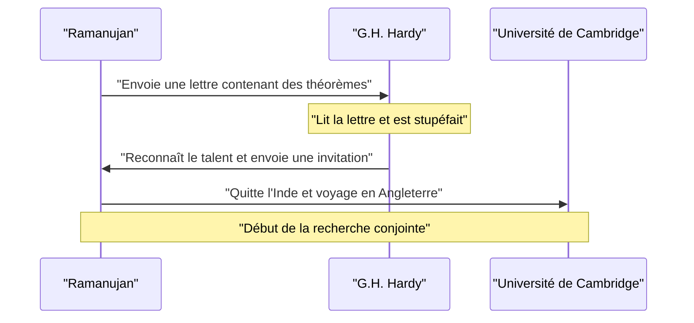
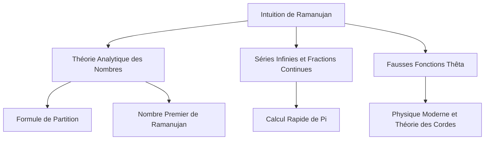

## Introduction : L'Homme Qui Recevait des Formules des Dieux

[Srinivasa Ramanujan](https://kenji.blog/fr/p/ramanujan/) (1887-1920) était un génie mathématique indien apparu comme une comète dans le monde mathématique du début du 20e siècle, avant que sa vie tragiquement courte ne s'achève. Bien qu'il n'ait eu presque aucune éducation mathématique formelle, il a déduit de nombreux théorèmes et formules stupéfiants grâce à sa seule intuition et sa vision unique. Ses carnets de notes continuent d'influencer la recherche de pointe en mathématiques et en physique modernes, plus d'un siècle après sa mort.

Dans cet article, nous plongeons dans la vie mouvementée de Ramanujan, ses interactions décisives avec le mathématicien britannique G.H. Hardy qui l'a découvert, et le brillant héritage mathématique qu'il a laissé derrière lui. Sa vie est un puissant témoignage de la façon dont la passion et le talent peuvent surmonter l'adversité et changer le monde.

## Jeunesse et Contexte : L'Éveil aux Mathématiques

Né le 22 décembre 1887 dans une famille brahmane pauvre à Erode, une ville du Tamil Nadu au sud de l'Inde, le père de Ramanujan travaillait comme commis dans un petit magasin de tissus. Sa mère, fervente hindoue et femme au foyer, eut une profonde influence sur lui. Dès son plus jeune âge, il montra une obsession et un talent extraordinaires pour les nombres. En entrant à la Town High School de Kumbakonam à l'âge de 10 ans, son génie mathématique s'épanouit rapidement. Il posait souvent des questions qui déroutaient ses professeurs et forçaient l'admiration de ses camarades.

À 15 ans, une rencontre décisive eut lieu. Il emprunta à un ami un exemplaire du *Synopsis of Elementary Results in Pure and Applied Mathematics* de George Shoobridge Carr. Le livre répertoriait des milliers de théorèmes sans démonstrations. Ramanujan dévora l'ouvrage, créant ses propres preuves et écrivant de tout nouveaux théorèmes dans ses carnets. Cette recherche solitaire constitua le fondement de son style mathématique unique.

Cependant, son dévouement absolu aux mathématiques l'amena à négliger d'autres matières. Il échoua à ses examens d'anglais et d'histoire, ce qui lui fit perdre sa bourse universitaire. Sans diplôme, il poursuivit ses recherches mathématiques dans une pauvreté extrême. Bien que la réussite sociale semblât lui échapper, sa passion pour les mathématiques ne faiblit jamais.

Plus tard, cherchant un revenu stable après son mariage, il obtint un poste d'employé au Madras Port Trust, aidé par V. Ramaswamy Aiyer, le fondateur de la Société mathématique indienne. Ses supérieurs reconnurent son talent et le soutinrent largement, lui permettant de travailler sur ses carnets et de poursuivre ses réflexions mathématiques pendant ses pauses et tard dans la nuit.

## La Rencontre Décisive avec G.H. Hardy

En 1913, encouragé par son entourage, Ramanujan envoya des lettres détaillant ses recherches à d'éminents mathématiciens britanniques. La plupart ignorèrent les lettres d'un inconnu employé indien, mais la réaction de Godfrey Harold Hardy de l'Université de Cambridge fut différente. Au début, Hardy considéra la lettre comme les **délires d'un fou**. Cependant, en examinant de plus près certaines des formules, il réalisa qu'elles étaient si profondément complexes que personne n'aurait pu les inventer à moins qu'elles ne soient vraies.

Hardy fit plus tard cette remarque : "Elles m'ont complètement vaincu ; je n'avais jamais rien vu de tel auparavant. Un seul coup d'œil suffit pour comprendre qu'elles n'auraient pu être écrites que par un mathématicien de la plus haute classe. Elles doivent être vraies car, si elles ne l'étaient pas, personne n'aurait l'imagination de les inventer."

Voici un diagramme de séquence montrant l'interaction décisive entre Ramanujan et Hardy.

## Vie et Réalisations à Cambridge

En 1914, juste avant le déclenchement de la Première Guerre mondiale, Ramanujan traversa l'océan — bravant le tabou religieux interdisant aux brahmanes de traverser la mer — et arriva au Trinity College de Cambridge. Là, il commença des recherches sérieuses avec Hardy et son collaborateur John Edensor Littlewood.

Leur collaboration est souvent décrite comme l'un des incidents les plus romantiques de l'histoire des mathématiques. Hardy était un mathématicien occidental traditionnel qui valorisait les preuves rigoureuses, tandis que Ramanujan était un génie qui obtenait des résultats par l'intuition et l'inspiration. Ramanujan disait souvent : "La déesse Namagiri de ma ville natale est apparue dans mes rêves et m'a enseigné les formules." Bien que leurs styles fussent diamétralement opposés, ils compensaient mutuellement leurs faiblesses, réussissant à publier de nombreux articles importants. Hardy enseigna à Ramanujan la rigueur mathématique moderne, tandis que Ramanujan apporta à Hardy des idées originales que personne d'autre n'aurait pu concevoir.

## Le Nombre de Taxi 1729 : L'Anecdote la Plus Célèbre

L'anecdote la plus célèbre concernant Ramanujan concerne le "nombre de taxi". Elle est largement connue comme une histoire illustrant son extraordinaire intuition et son affection pour les nombres.

Alors que Ramanujan était hospitalisé à Putney pour maladie, Hardy vint lui rendre visite. Cherchant un moyen d'entamer la conversation, Hardy remarqua : "J'ai roulé dans un taxi portant le numéro 1729. Il m'a semblé que c'était un nombre plutôt ennuyeux. J'espère que ce n'est pas un mauvais présage."

Ramanujan répondit immédiatement :
"Non, M. Hardy, c'est un nombre très intéressant. C'est le plus petit nombre exprimable comme la somme de deux cubes positifs de deux manières différentes."

Exprimé mathématiquement, cela donne :

$$
1729 = 1^3 + 12^3 = 9^3 + 10^3
$$

Depuis cette anecdote, les nombres possédant cette propriété sont appelés "nombres de taxi". Il comprenait et mémorisait les propriétés des nombres individuels comme s'ils étaient ses **amis personnels**. Littlewood déclara plus tard : "Chaque entier positif était l'un des amis personnels de Ramanujan."

## Les Contributions Mathématiques de Ramanujan

Ramanujan a laissé derrière lui une grande variété de réalisations, mais nous présenterons ici certaines des plus célèbres. La majorité de ses recherches portaient sur la théorie des nombres, les séries infinies et les fractions continues.

### Séries Infinies pour Pi $\pi$

Ramanujan a découvert de nombreuses séries infinies pour pi à convergence extrêmement rapide. Parmi elles, la plus célèbre est la formule suivante :

$$
\frac{1}{\pi} = \frac{2\sqrt{2}}{9801} \sum_{k=0}^{\infty} \frac{(4k)!(1103 + 26390k)}{(k!)^4 396^{4k}}
$$

Cette formule possède l'étonnante propriété que le calcul du seul premier terme ($k=0$) donne pi avec une précision de six décimales. À l'époque, elle était trop complexe et la façon dont elle avait été déduite restait un mystère total, mais plus tard, des mathématiciens ont prouvé son exactitude. Aujourd'hui encore, les formules de Ramanujan et l'algorithme de Chudnovsky qui en découle sont utilisés dans les calculs informatiques de pi, contribuant à établir des records dépassant les billions de chiffres.

### Formule Asymptotique de la Fonction de Partition

La fonction de partition $p(n)$ représente le nombre de façons dont un entier positif $n$ peut être exprimé comme la somme d'entiers positifs. Par exemple, la partition de 4 est 5 (4, 3+1, 2+2, 2+1+1, 1+1+1+1).
À mesure que $n$ devient plus grand, $p(n)$ augmente rapidement, mais trouver sa valeur exacte fut considéré comme difficile pendant de nombreuses années.

Ramanujan et Hardy découvrirent une formule stupéfiante montrant l'approximation (le comportement asymptotique) de ce $p(n)$.

$$
p(n) \sim \frac{1}{4n\sqrt{3}} \exp\left( \pi \sqrt{\frac{2n}{3}} \right) \quad (\text{lorsque } n \to \infty)
$$

Cette recherche a donné naissance à une nouvelle méthode en théorie analytique des nombres appelée la "Méthode du cercle", influençant grandement le développement ultérieur des mathématiques. Cette formule peut prédire le nombre de partitions avec une précision incroyable même pour des valeurs de $n$ extrêmement grandes.

### Fausses Fonctions Thêta (Mock Theta Functions)

Les recherches de Ramanujan sur les "fausses fonctions thêta" ont été décrites dans sa dernière lettre à Hardy juste avant sa mort. Pendant longtemps, la signification mathématique de ces fonctions est restée un mystère, et de nombreux mathématiciens ont tenté de les décoder. Ces dernières années, il est devenu évident que ces fonctions jouent un rôle essentiel à l'avant-garde de la physique moderne, comme la thermodynamique des trous noirs et la théorie des cordes. Son intuition était en avance de plusieurs décennies, voire d'un siècle, sur son temps.

### Nombres Premiers de Ramanujan et Nombres Hautement Composés

Il possédait également des connaissances approfondies sur la distribution des nombres premiers. Ses recherches ayant conduit aux "nombres premiers de Ramanujan", dérivés de la généralisation du postulat de Bertrand, et aux "nombres hautement composés", qui ont un nombre exceptionnellement grand de diviseurs, occupent une place importante dans la théorie moderne des nombres.

Voici un diagramme montrant les connexions entre les domaines de recherche de Ramanujan.

## Retour au Pays et Mort Prématurée

Sa vie de chercheur en Angleterre a apporté à Ramanujan une immense renommée. En 1918, il fut élu Membre de la Royal Society (FRS) et Membre du Trinity College la même année. C'était un accomplissement sans précédent pour un Indien et cela marqua le moment où ses capacités furent reconnues mondialement.

Cependant, derrière cette gloire, son corps avait atteint ses limites. Le climat froid de l'Angleterre, son incapacité à obtenir une nourriture adéquate en tant que brahmane strictement végétarien, et les pénuries alimentaires causées par la Première Guerre mondiale ont gravement sapé sa santé. Il a souffert de tuberculose et d'une grave carence en vitamines (ou possiblement d'amibiase hépatique) et a été contraint de vivre dans des sanatoriums pendant de longues périodes.

En 1919, après la fin de la Première Guerre mondiale, sa santé s'étant légèrement rétablie, il retourna en Inde où l'attendaient sa femme et sa famille. L'Inde entière accueillit son retour, mais son état continua de s'aggraver même après son retour dans son pays natal. Même sur son lit de malade, il ne cessa jamais ses réflexions mathématiques, écrivant des formules dans son carnet jusqu'à la toute fin. Le 26 avril 1920, il décéda au jeune âge de 32 ans.

## Héritage : Le Carnet Perdu et l'Impact sur le Monde Moderne

Le dernier carnet que Ramanujan a écrit sur son lit de mort a été perdu pendant longtemps, mais il a été découvert dans la bibliothèque de l'Université de Cambridge par le mathématicien américain George Andrews en 1976. Il est devenu connu sous le nom de "Carnet Perdu" et a de nouveau envoyé une onde de choc dans la communauté mathématique. Il contenait environ 600 nouvelles formules, et les recherches sur leur signification et leurs applications se poursuivent encore aujourd'hui.

La vie mouvementée de [Srinivasa Ramanujan](https://kenji.blog/fr/p/ramanujan/) a été décrite dans la biographie de Robert Kanigel *L'Homme qui défiait l'infini* et son adaptation cinématographique de 2015 du même nom, inspirant d'innombrables personnes au-delà de la communauté mathématique.

Son plus grand héritage réside dans la myriade de formules laissées dans ses carnets. Comme elles étaient souvent dépourvues de preuves, les mathématiciens ultérieurs ont passé des décennies à les prouver une par une. Grâce aux efforts inlassables de mathématiciens comme Bruce Berndt, le déchiffrement de ses carnets a progressé, mais les nouveaux mystères et thèmes de recherche qui en découlent sont encore loin d'être épuisés.

## Conclusion

Le mot **génie** est souvent utilisé à la légère, mais Ramanujan était un génie au sens le plus vrai du terme. Les nombreuses formules qu'il a laissées derrière lui ne sont pas de simples séquences de symboles, mais ressemblent à des œuvres d'art capturant les lois mêmes de l'univers. Bien que souffrant de la pauvreté et de la maladie, il a continué à explorer le royaume des pures idées mathématiques, et son nom et ses réalisations brilleront à jamais dans l'histoire des mathématiques. Les mystères qu'il a laissés constituent un défi éternel pour les mathématiciens de l'avenir.
