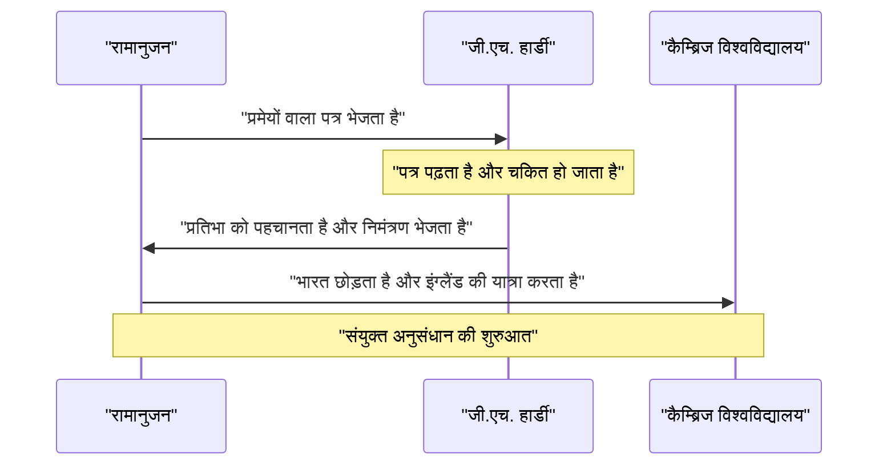
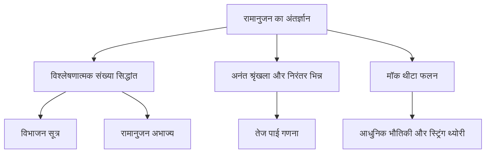

## परिचय: वह व्यक्ति जिसे देवताओं से सूत्र प्राप्त हुए

श्रीनिवास रामानुजन (1887-1920) एक भारतीय गणितीय प्रतिभा थे, जो 20वीं सदी की शुरुआत में गणितीय दुनिया में एक धूमकेतु की तरह उभरे, इससे पहले कि उनका दुखद रूप से छोटा जीवन समाप्त हो गया। लगभग कोई औपचारिक गणितीय शिक्षा नहीं होने के बावजूद, उन्होंने अपनी शुद्ध अंतर्ज्ञान और अनूठी अंतर्दृष्टि के माध्यम से कई आश्चर्यजनक प्रमेयों और सूत्रों को प्राप्त किया। उनकी बची हुई नोटबुक उनकी मृत्यु के एक सदी से भी अधिक समय बाद आज भी आधुनिक गणित और भौतिकी में अत्याधुनिक अनुसंधान को प्रभावित कर रही हैं।

इस लेख में, हम रामानुजन के अशांत जीवन, ब्रिटिश गणितज्ञ जी.एच. हार्डी के साथ उनकी भाग्यशाली मुलाकातों, जिन्होंने उन्हें खोजा था, और उनके द्वारा छोड़ी गई शानदार गणितीय विरासत की गहराई से पड़ताल करेंगे। उनका जीवन इस बात का एक शक्तिशाली प्रमाण है कि कैसे जुनून और प्रतिभा प्रतिकूल परिस्थितियों पर विजय प्राप्त कर दुनिया को बदल सकते हैं।

## प्रारंभिक जीवन और पृष्ठभूमि: गणित के प्रति जागृति

22 दिसंबर 1887 को दक्षिणी भारत के तमिलनाडु के एक शहर इरोड में एक गरीब ब्राह्मण परिवार में जन्मे रामानुजन के पिता एक छोटी सी कपड़े की दुकान में क्लर्क के रूप में काम करते थे। उनकी माँ, जो एक समर्पित हिंदू और गृहिणी थीं, का उन पर गहरा प्रभाव था। बहुत छोटी उम्र से ही उन्होंने संख्याओं के प्रति असाधारण जुनून और प्रतिभा दिखाई। 10 साल की उम्र में कुंभकोणम के टाउन हाई स्कूल में प्रवेश करते ही, उनकी गणितीय प्रतिभा तेजी से खिल उठी। वे अक्सर ऐसे प्रश्न पूछते थे जो उनके शिक्षकों को चकित कर देते थे और उनके सहपाठियों को आश्चर्यचकित कर देते थे।

15 वर्ष की आयु में, एक भाग्यशाली घटना हुई। उन्होंने एक मित्र से जॉर्ज शू्ब्रिज कैर की *A Synopsis of Elementary Results in Pure and Applied Mathematics* नामक पुस्तक उधार ली। इस पुस्तक में बिना प्रमाण के हजारों प्रमेय सूचीबद्ध थे। रामानुजन ने इस पुस्तक का गहराई से अध्ययन किया, अपने स्वयं के प्रमाण बनाए और अपनी नोटबुक में पूरी तरह से नए प्रमेय लिखे। इस एकांत शोध ने उनकी अनूठी गणितीय शैली की नींव रखी।

हालाँकि, गणित के प्रति उनके पूर्ण समर्पण के कारण उन्होंने अन्य विषयों की उपेक्षा की। वे अपनी अंग्रेजी और इतिहास की परीक्षाओं में अनुत्तीर्ण हो गए, जिसके परिणामस्वरूप उन्होंने अपनी कॉलेज की छात्रवृत्ति खो दी। बिना किसी डिग्री के, उन्होंने अत्यधिक गरीबी में अपना गणितीय शोध जारी रखा। हालाँकि सामाजिक सफलता उनसे दूर होती दिख रही थी, लेकिन गणित के प्रति उनका जुनून कभी कम नहीं हुआ।

बाद में, शादी के बाद एक स्थिर आय की तलाश में, उन्होंने इंडियन मैथमेटिकल सोसाइटी के संस्थापक वी. रामास्वामी अय्यर की मदद से मद्रास पोर्ट ट्रस्ट में एक क्लर्क के रूप में नौकरी हासिल की। उनके वरिष्ठ अधिकारियों ने उनकी प्रतिभा को पहचाना और काफी हद तक उनका समर्थन किया, जिससे उन्हें अपने काम के ब्रेक के दौरान और देर रात तक अपनी नोटबुक पर काम करने और अपने गणितीय विचारों को आगे बढ़ाने की अनुमति मिली।

## जी.एच. हार्डी के साथ भाग्यशाली मुलाकात

1913 में, अपने आस-पास के लोगों द्वारा प्रोत्साहित किए जाने पर, रामानुजन ने प्रमुख ब्रिटिश गणितज्ञों को अपने शोध का विवरण देते हुए पत्र भेजे। अधिकांश ने एक अज्ञात भारतीय क्लर्क के पत्रों को नजरअंदाज कर दिया, लेकिन कैम्ब्रिज विश्वविद्यालय के गॉडफ्रे हेरोल्ड हार्डी की प्रतिक्रिया अलग थी। हार्डी ने पहले पत्र को **पागल की बकवास** माना। हालाँकि, कुछ सूत्रों की बारीकी से जांच करने पर, उन्होंने महसूस किया कि वे इतने गहरे हैं कि कोई भी उन्हें तब तक नहीं गढ़ सकता जब तक कि वे सत्य न हों।

हार्डी ने बाद में टिप्पणी की: "उन्होंने मुझे पूरी तरह से हरा दिया; मैंने पहले कभी उनके जैसा कुछ नहीं देखा था। उन पर एक नज़र डालना यह दिखाने के लिए पर्याप्त है कि उन्हें केवल उच्चतम श्रेणी के गणितज्ञ द्वारा ही लिखा जा सकता है। उन्हें सत्य होना चाहिए क्योंकि, यदि वे सत्य नहीं होते, तो किसी के पास भी उन्हें गढ़ने की कल्पना नहीं होती।"

नीचे एक अनुक्रम आरेख है जो रामानुजन और हार्डी के बीच भाग्यशाली बातचीत को दर्शाता है।

## कैम्ब्रिज में जीवन और उपलब्धियां

1914 में, प्रथम विश्व युद्ध के छिड़ने से ठीक पहले, रामानुजन ने महासागर पार किया — उस धार्मिक वर्जना को तोड़ते हुए जो ब्राह्मणों को समुद्र पार करने से रोकती थी — और कैम्ब्रिज के ट्रिनिटी कॉलेज पहुंचे। वहां, उन्होंने हार्डी और उनके सहयोगी जॉन एडेन्सर लिटिलवुड के साथ गंभीर शोध शुरू किया।

उनके सहयोग को अक्सर गणित के इतिहास में सबसे रोमांटिक घटनाओं में से एक के रूप में वर्णित किया जाता है। हार्डी एक पारंपरिक पश्चिमी गणितज्ञ थे जो कठोर प्रमाणों को महत्व देते थे, जबकि रामानुजन एक प्रतिभा थे जो अंतर्ज्ञान और प्रेरणा के माध्यम से परिणाम प्राप्त करते थे। रामानुजन अक्सर कहते थे: "मेरे गृहनगर की देवी नामगिरी मेरे सपनों में प्रकट हुईं और मुझे सूत्र सिखाए।" हालाँकि उनकी शैलियाँ बिल्कुल विपरीत थीं, लेकिन उन्होंने एक-दूसरे की कमजोरियों की भरपाई की, और कई महत्वपूर्ण शोध पत्र सफलतापूर्वक प्रकाशित किए। हार्डी ने रामानुजन को आधुनिक गणितीय कठोरता सिखाई, जबकि रामानुजन ने हार्डी को ऐसे मूल विचार प्रदान किए जो कोई और नहीं सोच सकता था।

## टैक्सीकैब संख्या 1729: सबसे प्रसिद्ध किस्सा

रामानुजन के बारे में सबसे प्रसिद्ध किस्सा "टैक्सीकैब संख्या" से संबंधित है। इसे व्यापक रूप से एक कहानी के रूप में जाना जाता है जो उनकी असाधारण अंतर्ज्ञान और संख्याओं के प्रति उनके स्नेह को प्रदर्शित करती है।

जब रामानुजन बीमारी के कारण पुटनी के एक अस्पताल में भर्ती थे, हार्डी उनसे मिलने आए। बातचीत शुरू करने का एक तरीका खोजते हुए, हार्डी ने टिप्पणी की: "मैं 1729 नंबर की टैक्सी में आया। मुझे लगा कि यह एक बहुत ही नीरस संख्या है। मुझे उम्मीद है कि यह कोई अपशकुन नहीं है।"

रामानुजन ने तुरंत उत्तर दिया:
"नहीं, मिस्टर हार्डी, यह एक बहुत ही दिलचस्प संख्या है। यह वह सबसे छोटी संख्या है जिसे दो अलग-अलग तरीकों से दो सकारात्मक घनों के योग के रूप में व्यक्त किया जा सकता है।"

गणितीय रूप से व्यक्त, यह इस प्रकार दिखता है:

$$
1729 = 1^3 + 12^3 = 9^3 + 10^3
$$

इस किस्से के बाद से, इस गुण वाले संख्याओं को "टैक्सीकैब संख्या" कहा जाता है। वह अलग-अलग संख्याओं के गुणों को ऐसे समझते और याद रखते थे जैसे कि वे उनके **व्यक्तिगत मित्र** हों। लिटिलवुड ने बाद में टिप्पणी की: "हर सकारात्मक पूर्णांक रामानुजन के व्यक्तिगत मित्रों में से एक था।"

## रामानुजन का गणितीय योगदान

रामानुजन ने अपने पीछे कई तरह की उपलब्धियां छोड़ीं, लेकिन हम यहां कुछ सबसे प्रसिद्ध उपलब्धियों का परिचय देंगे। उनके अधिकांश शोध में संख्या सिद्धांत, अनंत श्रृंखला और निरंतर भिन्न शामिल थे।

### पाई के लिए अनंत श्रृंखला $\pi$

रामानुजन ने पाई के लिए कई तेजी से अभिसरण करने वाली अनंत श्रृंखलाओं की खोज की। उनमें से, सबसे प्रसिद्ध निम्नलिखित सूत्र है:

$$
\frac{1}{\pi} = \frac{2\sqrt{2}}{9801} \sum_{k=0}^{\infty} \frac{(4k)!(1103 + 26390k)}{(k!)^4 396^{4k}}
$$

इस सूत्र में यह आश्चर्यजनक गुण है कि केवल पहले पद ($k=0$) की गणना करने से ही पाई का मान छह दशमलव स्थानों तक सटीक रूप से प्राप्त हो जाता है। उस समय, यह बहुत जटिल था, और यह पूरी तरह से रहस्य बना रहा कि इसे कैसे प्राप्त किया गया, लेकिन बाद के गणितज्ञों ने इसकी शुद्धता साबित कर दी। आज भी, रामानुजन के सूत्र और उन पर आधारित चुडनोवस्की एल्गोरिथ्म का उपयोग पाई की कंप्यूटर गणनाओं में किया जाता है, जो खरबों अंकों से अधिक के रिकॉर्ड स्थापित करने में योगदान करते हैं।

### विभाजन फलन के लिए स्पर्शोन्मुख सूत्र

विभाजन फलन $p(n)$ उन तरीकों की संख्या का प्रतिनिधित्व करता है जिनसे एक सकारात्मक पूर्णांक $n$ को सकारात्मक पूर्णांकों के योग के रूप में व्यक्त किया जा सकता है। उदाहरण के लिए, 4 का विभाजन 5 (4, 3+1, 2+2, 2+1+1, 1+1+1+1) है।
जैसे-जैसे $n$ बड़ा होता जाता है, $p(n)$ तेजी से बढ़ता है, लेकिन इसका सटीक मान ज्ञात करना कई वर्षों तक कठिन माना जाता था।

रामानुजन और हार्डी ने इस $p(n)$ के सन्निकटन (स्पर्शोन्मुख व्यवहार) को दर्शाने वाला एक आश्चर्यजनक सूत्र खोजा।

$$
p(n) \sim \frac{1}{4n\sqrt{3}} \exp\left( \pi \sqrt{\frac{2n}{3}} \right) \quad (\text{जब } n \to \infty)
$$

इस शोध ने विश्लेषणात्मक संख्या सिद्धांत में "सर्कल मेथड" नामक एक नई पद्धति को जन्म दिया, जिसने बाद में गणित के विकास को बहुत प्रभावित किया। यह सूत्र $n$ के अत्यंत बड़े मानों के लिए भी अविश्वसनीय सटीकता के साथ विभाजनों की संख्या की भविष्यवाणी कर सकता है।

### मॉक थीटा फलन (Mock Theta Functions)

"मॉक थीटा फलन" पर रामानुजन का शोध उनकी मृत्यु से ठीक पहले हार्डी को लिखे उनके अंतिम पत्र में वर्णित था। लंबे समय तक, इन फलनों का गणितीय अर्थ एक रहस्य बना रहा, और कई गणितज्ञों ने उन्हें डिकोड करने का प्रयास किया। हाल के वर्षों में, यह स्पष्ट हो गया है कि ये फलन आधुनिक भौतिकी के अग्रिम मोर्चे पर, जैसे ब्लैक होल थर्मोडायनामिक्स और स्ट्रिंग थ्योरी में एक महत्वपूर्ण भूमिका निभाते हैं। उनका अंतर्ज्ञान अपने समय से दशकों, यदि एक सदी नहीं, तो आगे था।

### रामानुजन अभाज्य संख्याएँ और अत्यधिक भाज्य संख्याएँ

उनके पास अभाज्य संख्याओं के वितरण में भी गहरी अंतर्दृष्टि थी। उनके शोध जिसके कारण "रामानुजन अभाज्य संख्याएँ" (जो बर्ट्रेंड के अभिधारणा के सामान्यीकरण से प्राप्त होती हैं) और "अत्यधिक भाज्य संख्याएँ" (जिनके भाजक असामान्य रूप से बड़ी संख्या में होते हैं) की खोज हुई, आधुनिक संख्या सिद्धांत में एक महत्वपूर्ण स्थान रखते हैं।

नीचे एक आरेख है जो रामानुजन के अनुसंधान क्षेत्रों के बीच संबंधों को दर्शाता है।

## घर वापसी और असामयिक मृत्यु

इंग्लैंड में उनके शोध जीवन ने रामानुजन को अपार प्रसिद्धि दिलाई। 1918 में, उन्हें रॉयल सोसाइटी (FRS) का फेलो और उसी वर्ष ट्रिनिटी कॉलेज का फेलो चुना गया। यह एक भारतीय के लिए एक अभूतपूर्व उपलब्धि थी और यह उस क्षण को चिह्नित करता है जब उनकी क्षमताओं को विश्व स्तर पर मान्यता मिली।

हालाँकि, उस गौरव के पीछे, उनका शरीर अपनी सीमा तक पहुँच चुका था। इंग्लैंड की ठंडी जलवायु, एक सख्त ब्राह्मण शाकाहारी के रूप में उचित भोजन प्राप्त करने में उनकी अक्षमता, और प्रथम विश्व युद्ध के कारण होने वाली भोजन की कमी ने उनके स्वास्थ्य को गंभीर रूप से कमजोर कर दिया। वे तपेदिक और गंभीर विटामिन की कमी (या संभवतः हेपेटिक अमीबियासिस) से पीड़ित हुए और उन्हें लंबे समय तक सेनेटोरियम में रहने के लिए मजबूर होना पड़ा।

1919 में, प्रथम विश्व युद्ध की समाप्ति के बाद, उनका स्वास्थ्य थोड़ा सुधरा, और वे भारत लौट आए जहाँ उनकी पत्नी और परिवार उनका इंतजार कर रहे थे। पूरे भारत ने उनकी वापसी का स्वागत किया, लेकिन अपने स्वदेश लौटने के बाद भी उनकी स्थिति बिगड़ती रही। अपनी बीमारी के बिस्तर पर भी, उन्होंने कभी अपने गणितीय विचारों को नहीं रोका, और अंत तक अपनी नोटबुक में सूत्र लिखते रहे। 26 अप्रैल 1920 को, 32 वर्ष की कम उम्र में उनका निधन हो गया।

## विरासत: खोई हुई नोटबुक और आधुनिक विश्व पर प्रभाव

मृत्यु शय्या पर रामानुजन द्वारा लिखी गई अंतिम नोटबुक लंबे समय तक खो गई थी, लेकिन 1976 में अमेरिकी गणितज्ञ जॉर्ज एंड्रयूज द्वारा कैम्ब्रिज विश्वविद्यालय के पुस्तकालय में खोजी गई। इसे "लॉस्ट नोटबुक" के रूप में जाना जाने लगा और इसने एक बार फिर गणितीय समुदाय में सदमे की लहरें भेज दीं। इसमें लगभग 600 नए सूत्र थे, और उनके अर्थ और अनुप्रयोगों पर शोध आज भी जारी है।

श्रीनिवास रामानुजन के अशांत जीवन को रॉबर्ट कैनिगेल की जीवनी *द मैन हू न्यू इन्फिनिटी* और उसी नाम के इसके 2015 के फिल्म रूपांतरण में चित्रित किया गया था, जिसने गणितीय समुदाय से परे अनगिनत लोगों को प्रेरित किया।

उनकी सबसे बड़ी विरासत उनकी नोटबुक में छोड़े गए असंख्य सूत्र हैं। चूँकि उनमें अक्सर प्रमाणों का अभाव होता था, इसलिए बाद के गणितज्ञों ने उनमें से प्रत्येक को साबित करने में दशकों बिता दिए। ब्रूस बर्नड्ट जैसे गणितज्ञों के अथक प्रयासों के लिए धन्यवाद, उनकी नोटबुक को डिकोड करने में प्रगति हुई है, लेकिन उनसे उत्पन्न नए रहस्य और शोध विषय अभी भी समाप्त होने से कोसों दूर हैं।

## निष्कर्ष

**जीनियस** (प्रतिभाशाली) शब्द का प्रयोग अक्सर हल्के में किया जाता है, लेकिन रामानुजन सही मायनों में एक प्रतिभाशाली व्यक्ति थे। उनके द्वारा छोड़े गए कई सूत्र केवल प्रतीकों के अनुक्रम नहीं हैं, बल्कि कला के कार्यों की तरह लगते हैं जो ब्रह्मांड के नियमों को पकड़ते हैं। गरीबी और बीमारी से पीड़ित होने के बावजूद, उन्होंने शुद्ध गणितीय विचारों के दायरे का पता लगाना जारी रखा, और उनका नाम और उपलब्धियां गणित के इतिहास में हमेशा चमकती रहेंगी। उनके द्वारा छोड़े गए रहस्य भविष्य के गणितज्ञों के लिए एक शाश्वत चुनौती के रूप में काम करते हैं।
