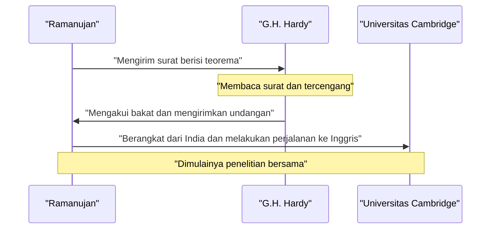
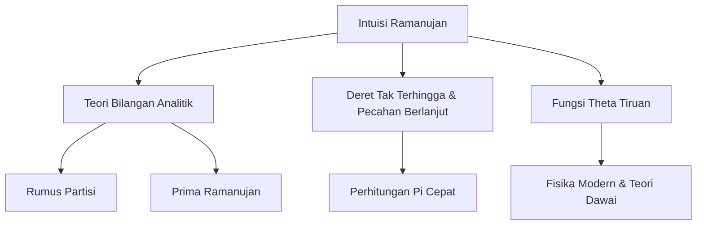

## Pendahuluan: Pria yang Menerima Rumus dari Para Dewa

Srinivasa Ramanujan (1887–1920) adalah seorang jenius matematika India yang muncul seperti komet di dunia matematika awal abad ke-20 sebelum hidupnya yang tragis dan singkat berakhir. Meskipun hampir tidak memiliki pendidikan matematika formal, ia merumuskan banyak teorema dan rumus mencengangkan melalui intuisi murni dan wawasan uniknya. Buku catatannya yang masih ada terus memengaruhi penelitian mutakhir dalam matematika dan fisika modern, lebih dari seabad setelah kematiannya.

Dalam artikel ini, kami mendalami kehidupan Ramanujan yang bergejolak, pertemuannya yang menentukan nasib dengan matematikawan Inggris G.H. Hardy yang menemukannya, dan warisan matematika brilian yang ditinggalkannya. Hidupnya berdiri sebagai bukti kuat bagaimana hasrat dan bakat dapat mengatasi kesulitan dan mengubah dunia.

## Kehidupan Awal dan Latar Belakang: Kebangkitan terhadap Matematika

Lahir pada 22 Desember 1887, dari keluarga Brahmana miskin di Erode, sebuah kota di Tamil Nadu, India selatan, ayah Ramanujan bekerja sebagai juru tulis di sebuah toko kain kecil. Ibunya, seorang penganut Hindu yang taat dan ibu rumah tangga, memiliki pengaruh yang mendalam pada dirinya. Sejak usia sangat muda, ia menunjukkan obsesi dan bakat luar biasa terhadap angka. Memasuki Town High School di Kumbakonam pada usia 10 tahun, kejeniusan matematikanya segera berkembang. Ia sering mengajukan pertanyaan yang membingungkan guru-gurunya dan membuat kagum teman-teman sekelasnya.

Pada usia 15, sebuah pertemuan yang menentukan nasib terjadi. Ia meminjam salinan *A Synopsis of Elementary Results in Pure and Applied Mathematics* karya George Shoobridge Carr dari seorang teman. Buku tersebut mendaftar ribuan teorema tanpa pembuktian. Ramanujan melahap buku tersebut, menciptakan pembuktiannya sendiri dan menulis teorema yang sama sekali baru di buku catatannya. Penelitian soliter ini membentuk dasar dari gaya matematika uniknya.

Namun, pengabdiannya yang luar biasa pada matematika menyebabkan ia mengabaikan mata pelajaran lain. Ia gagal dalam ujian bahasa Inggris dan sejarah, yang mengakibatkan hilangnya beasiswa perguruan tingginya. Tanpa gelar sarjana, ia melanjutkan penelitian matematikanya dalam kemiskinan ekstrem. Meskipun kesuksesan sosial tampaknya menghindarinya, hasratnya pada matematika tidak pernah memudar.

Kemudian, untuk mencari penghasilan yang stabil setelah menikah, ia mendapatkan posisi sebagai juru tulis di Madras Port Trust, dibantu oleh V. Ramaswamy Aiyer, pendiri Masyarakat Matematika India. Atasannya mengakui bakatnya dan sangat mendukungnya, mengizinkannya untuk mengerjakan buku catatannya dan mengejar pemikiran matematikanya selama waktu istirahat kerja dan larut malam.

## Pertemuan Penentu Nasib dengan G.H. Hardy

Pada tahun 1913, didorong oleh orang-orang di sekitarnya, Ramanujan mengirim surat yang merinci penelitiannya ke matematikawan Inggris terkemuka. Sebagian besar mengabaikan surat dari juru tulis India yang tidak dikenal, namun reaksi Godfrey Harold Hardy di Universitas Cambridge berbeda. Pada awalnya, Hardy menganggap surat itu sebagai **ocehan orang gila**. Namun, setelah pemeriksaan lebih dekat terhadap beberapa rumus, ia menyadari bahwa rumus tersebut sangat mendalam sehingga tidak mungkin ada orang yang bisa menciptakannya kecuali jika rumus itu benar.

Hardy kemudian berkomentar, "Rumus-rumus tersebut mengalahkan saya sama sekali; saya belum pernah melihat apa pun yang mirip dengan itu sebelumnya. Sekilas pandang saja sudah cukup untuk menunjukkan bahwa rumus itu hanya bisa ditulis oleh seorang matematikawan kelas tertinggi. Rumus itu pasti benar karena, jika tidak benar, tidak ada orang yang memiliki imajinasi untuk menemukannya."

Di bawah ini adalah diagram urutan yang menunjukkan interaksi penentu nasib antara Ramanujan dan Hardy.

## Kehidupan dan Pencapaian di Cambridge

Pada tahun 1914, tepat sebelum pecahnya Perang Dunia I, Ramanujan menyeberangi lautan — menentang tabu agama yang melarang kaum Brahmana menyeberangi laut — dan tiba di Trinity College, Cambridge. Di sana, ia memulai penelitian serius dengan Hardy dan kolaboratornya John Edensor Littlewood.

Kolaborasi mereka sering digambarkan sebagai salah satu insiden paling romantis dalam sejarah matematika. Hardy adalah seorang matematikawan Barat tradisional yang menghargai pembuktian yang ketat, sementara Ramanujan adalah seorang jenius yang memperoleh hasil melalui intuisi dan inspirasi. Ramanujan sering berkata, "Dewi Namagiri dari kampung halaman saya muncul dalam mimpiku dan mengajari saya rumus-rumus tersebut." Meskipun gaya mereka bertolak belakang, mereka saling melengkapi kelemahan satu sama lain, berhasil menerbitkan banyak makalah penting. Hardy mengajari Ramanujan ketelitian matematika modern, sementara Ramanujan memberi Hardy ide-ide orisinal yang tidak dapat dibayangkan oleh orang lain.

## Bilangan Taksi 1729: Anekdot Paling Terkenal

Anekdot paling terkenal tentang Ramanujan menyangkut "bilangan taksi". Kisah ini dikenal luas sebagai cerita yang menunjukkan intuisi luar biasa dan kasih sayangnya pada angka.

Saat Ramanujan dirawat di rumah sakit di Putney karena penyakitnya, Hardy datang mengunjunginya. Mencari cara untuk memulai percakapan, Hardy berkata, "Saya mengendarai taksi bernomor 1729. Tampaknya itu angka yang agak membosankan bagi saya. Saya harap itu bukan pertanda buruk."

Ramanujan segera menjawab:
"Tidak, Tuan Hardy, itu adalah angka yang sangat menarik. Itu adalah angka terkecil yang dapat dinyatakan sebagai jumlah dari dua kubik positif dengan dua cara yang berbeda."

Dinyatakan secara matematis, terlihat seperti berikut:

$$
1729 = 1^3 + 12^3 = 9^3 + 10^3
$$

Sejak anekdot ini, angka dengan properti ini disebut "Angka taksi". Ia memahami dan mengingat sifat-sifat individu dari angka seolah-olah angka tersebut adalah **teman pribadinya**. Littlewood kemudian berkomentar, "Setiap bilangan bulat positif adalah salah satu teman pribadi Ramanujan."

## Kontribusi Matematika Ramanujan

Ramanujan meninggalkan berbagai macam pencapaian, namun kami akan memperkenalkan beberapa yang paling terkenal di sini. Mayoritas penelitiannya melibatkan teori bilangan, deret tak terhingga, dan pecahan berlanjut.

### Deret Tak Terhingga untuk Pi $\pi$

Ramanujan menemukan banyak deret tak terhingga yang konvergen dengan sangat cepat untuk pi. Di antara semuanya, yang paling terkenal adalah rumus berikut:

$$
\frac{1}{\pi} = \frac{2\sqrt{2}}{9801} \sum_{k=0}^{\infty} \frac{(4k)!(1103 + 26390k)}{(k!)^4 396^{4k}}
$$

Rumus ini memiliki sifat mencengangkan bahwa menghitung suku pertama saja ($k=0$) menghasilkan pi secara akurat hingga enam tempat desimal. Pada saat itu, rumus ini terlalu rumit, dan tetap menjadi misteri total bagaimana hal itu bisa diturunkan, namun kemudian matematikawan membuktikan kebenarannya. Bahkan hingga hari ini, rumus Ramanujan dan algoritma Chudnovsky yang didasarkan padanya digunakan dalam perhitungan komputer untuk pi, berkontribusi dalam mencetak rekor yang melampaui triliunan digit.

### Rumus Asimtotik untuk Fungsi Partisi

Fungsi partisi $p(n)$ mewakili jumlah cara sebuah bilangan bulat positif $n$ dapat dinyatakan sebagai jumlah bilangan bulat positif. Sebagai contoh, partisi dari 4 adalah 5 (4, 3+1, 2+2, 2+1+1, 1+1+1+1).
Ketika $n$ menjadi lebih besar, $p(n)$ meningkat pesat, tetapi menemukan nilai tepatnya dianggap sulit selama bertahun-tahun.

Ramanujan dan Hardy menemukan rumus mencengangkan yang menunjukkan perkiraan (perilaku asimtotik) dari $p(n)$ ini.

$$
p(n) \sim \frac{1}{4n\sqrt{3}} \exp\left( \pi \sqrt{\frac{2n}{3}} \right) \quad (\text{saat } n \to \infty)
$$

Penelitian ini melahirkan metode baru dalam teori bilangan analitik yang disebut "Metode Lingkaran", yang sangat memengaruhi perkembangan matematika selanjutnya. Rumus ini dapat memprediksi jumlah partisi dengan presisi luar biasa bahkan untuk nilai $n$ yang sangat besar.

### Fungsi Theta Tiruan (Mock Theta Functions)

Penelitian Ramanujan tentang "fungsi theta tiruan" dijelaskan dalam surat terakhirnya kepada Hardy tepat sebelum kematiannya. Untuk waktu yang lama, makna matematika dari fungsi ini tetap menjadi misteri, dan banyak matematikawan mencoba untuk memecahkannya. Dalam beberapa tahun terakhir, menjadi jelas bahwa fungsi ini memainkan peran penting di garis depan fisika modern, seperti termodinamika lubang hitam dan teori dawai. Intuisinya mendahului zamannya hingga beberapa dekade, jika tidak satu abad.

### Bilangan Prima Ramanujan dan Bilangan Komposit Tinggi

Ia juga memiliki wawasan mendalam tentang distribusi bilangan prima. Penelitiannya yang mengarah pada "Bilangan Prima Ramanujan," yang diturunkan dari generalisasi postulat Bertrand, dan "bilangan komposit tinggi," yang memiliki jumlah pembagi yang luar biasa besar, memegang tempat penting dalam teori bilangan modern.

Di bawah ini adalah diagram yang menunjukkan hubungan antara bidang penelitian Ramanujan.

## Kembali ke Tanah Air dan Kematian Dini

Kehidupan penelitiannya di Inggris membawa ketenaran yang luar biasa bagi Ramanujan. Pada tahun 1918, ia terpilih sebagai Anggota Royal Society (FRS) dan Anggota Trinity College di tahun yang sama. Ini adalah pencapaian yang belum pernah terjadi sebelumnya bagi seorang India dan menandai momen ketika kemampuannya diakui secara global.

Namun, di balik kejayaan tersebut, tubuhnya telah mencapai batas kemampuannya. Iklim dingin Inggris, ketidakmampuannya untuk mendapatkan makanan yang layak sebagai vegetarian Brahmana yang ketat, dan kekurangan makanan yang disebabkan oleh Perang Dunia I sangat merusak kesehatannya. Ia menderita tuberkulosis dan kekurangan vitamin parah (atau mungkin amebiasis hati) dan terpaksa tinggal di sanatorium dalam waktu lama.

Pada tahun 1919, setelah berakhirnya Perang Dunia I, kesehatannya sedikit pulih, dan ia kembali ke India di mana istri dan keluarganya menunggu. Seluruh India menyambut kepulangannya, namun kondisinya terus memburuk bahkan setelah kembali ke negara asalnya. Bahkan di ranjang sakitnya, ia tidak pernah menghentikan pemikiran matematikanya, menulis rumus di buku catatannya hingga akhir. Pada tanggal 26 April 1920, ia meninggal dunia pada usia muda, 32 tahun.

## Warisan: Buku Catatan yang Hilang dan Dampak pada Dunia Modern

Buku catatan terakhir yang ditulis Ramanujan di ranjang kematiannya telah lama hilang, namun ditemukan di perpustakaan Universitas Cambridge oleh matematikawan Amerika George Andrews pada tahun 1976. Buku ini dikenal sebagai "Buku Catatan yang Hilang" dan sekali lagi mengirimkan gelombang kejutan ke komunitas matematika. Buku itu berisi sekitar 600 rumus baru, dan penelitian mengenai makna serta penerapannya berlanjut hingga hari ini.

Kehidupan Ramanujan yang bergejolak digambarkan dalam biografi karya Robert Kanigel *The Man Who Knew Infinity* dan adaptasi filmnya pada tahun 2015 dengan nama yang sama, menginspirasi banyak orang di luar komunitas matematika.

Warisan terbesarnya adalah ribuan rumus yang tertinggal di buku catatannya. Karena rumus tersebut sering kali tidak disertai pembuktian, matematikawan di kemudian hari menghabiskan puluhan tahun untuk membuktikan satu per satu. Berkat upaya tak kenal lelah dari matematikawan seperti Bruce Berndt, penguraian buku catatannya telah maju, namun misteri baru dan tema penelitian yang diturunkan darinya masih jauh dari kata habis.

## Kesimpulan

Kata **jenius** sering digunakan dengan mudah, tetapi Ramanujan adalah seorang jenius dalam arti yang sebenarnya. Banyak rumus yang ia tinggalkan bukan hanya urutan simbol, melainkan tampak seperti karya seni yang menangkap hukum alam semesta itu sendiri. Meskipun menderita kemiskinan dan penyakit, ia terus menjelajahi ranah ide matematika murni, dan nama serta pencapaiannya akan bersinar selamanya dalam sejarah matematika. Misteri yang ia tinggalkan berfungsi sebagai tantangan abadi bagi matematikawan masa depan.
