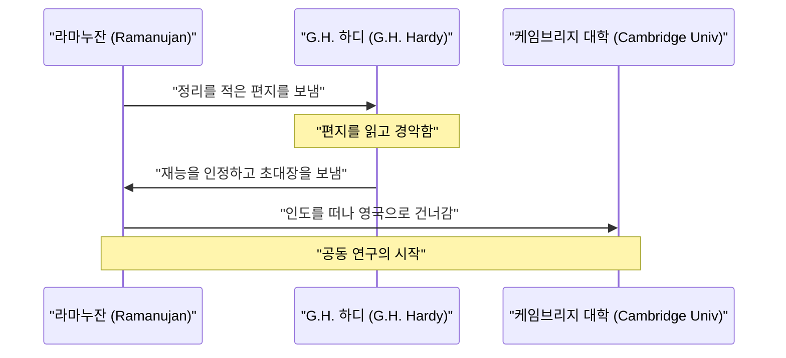
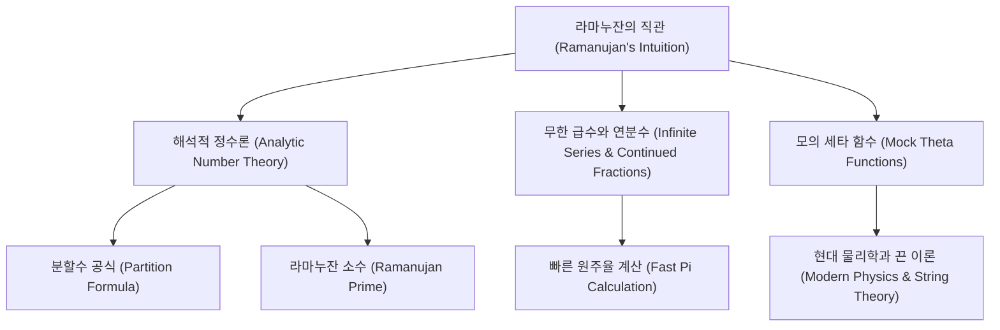

## 서론: 신으로부터 공식을 부여받은 사나이

[스리니바사 라마누잔](https://kenji.blog/ko/p/ramanujan/)([Srinivasa Ramanujan](https://kenji.blog/ko/p/ramanujan/), 1887~1920)은 20세기 초 수학계에 혜성처럼 나타나 짧은 생을 마감한 인도의 천재 수학자입니다. 그는 정규 수학 교육을 거의 받지 않았음에도 불구하고, 직관과 독자적인 통찰력으로 수많은 경이로운 정리와 공식을 도출해 냈습니다. 그가 남긴 노트는 사후 100년 이상이 지난 현재에도 최첨단 수학 및 물리학 연구에 계속해서 영향을 미치고 있습니다.

이 글에서는 라마누잔의 파란만장한 생애, 그를 발굴한 영국의 수학자 G.H. 하디와의 교류, 그리고 그가 남긴 눈부신 수학적 업적에 대해 깊이 파헤쳐 봅니다. 그의 삶은 열정과 재능이 어떻게 역경을 이겨내고 세상을 바꿀 수 있는지를 보여주는 강력한 증거입니다.

## 성장 배경 및 초기 경력: 수학에 대한 눈뜸

1887년 12월 22일, 라마누잔은 남인도 타밀나두주 에로데라는 마을의 가난한 브라만 계급 가정에서 태어났습니다. 아버지는 작은 옷가게의 점원으로 일했고, 어머니는 전업주부이면서도 독실한 힌두교 신자로서 라마누잔에게 큰 영향을 미쳤습니다. 어린 시절부터 숫자에 대해 비정상적일 정도의 집착과 재능을 보였으며, 10세 때 쿰바코남의 타운 고등학교에 입학하자 그 수학적 재능은 금세 만개했습니다. 그는 종종 교사들을 놀라게 하는 질문을 던졌고, 동급생들로부터는 경외의 대상이 되었습니다.

그가 15세 때 운명적인 만남이 찾아옵니다. 조지 슈브리지 카(George Shoobridge Carr)가 저술한 『순수 수학 및 응용 수학의 기본 결과 개요(A Synopsis of Elementary Results in Pure and Applied Mathematics)』라는 책을 친구에게서 빌린 것입니다. 이 책에는 수천 개의 정리가 증명 없이 나열되어 있었는데, 라마누잔은 이 책을 구석구석 읽으며 독자적인 증명을 생각해 내고 완전히 새로운 정리를 자신의 노트에 적기 시작했습니다. 이 고독한 연구 작업이 훗날 그만의 독특한 수학적 스타일의 기반이 되었습니다.

그러나 수학에 몰두한 나머지 다른 과목을 소홀히 하여 영어와 역사 시험에서 낙제하고 대학 장학금을 잃게 됩니다. 그는 학위를 얻지 못한 채 극심한 빈곤 속에서 독학으로 수학 연구를 계속했습니다. 사회적 성공과는 거리가 멀어 보였지만, 수학에 대한 그의 열정은 결코 식지 않았습니다.

이후 결혼을 계기로 안정적인 수입을 구하기 시작했고, 인도 수학회의 창립자인 V. 라마스와미 아이어(V. Ramaswamy Aiyer)의 도움을 받아 마드라스 항만국의 서기로 일하게 됩니다. 상사들도 그의 재능을 알아보고 그를 적극적으로 지원하여, 근무 시간의 틈틈이 또는 늦은 밤에 노트에 수학적 사색을 이어나갈 수 있도록 허락해 주었습니다.

## G.H. 하디와의 운명적인 만남

1913년, 주변의 권유로 라마누잔은 영국의 저명한 수학자들에게 자신의 연구 성과를 적은 편지를 보냈습니다. 대부분은 이름 모를 인도인 서기의 편지로 무시했지만, 케임브리지 대학의 고드프리 해럴드 하디(Godfrey Harold Hardy)의 반응은 달랐습니다. 하디는 처음에 그 편지를 미치광이의 **헛소리** 라고 생각했습니다. 그러나 그곳에 적힌 공식 중 몇 가지를 자세히 검토하자, 그것들이 놀라울 정도로 심오하며 사실이 아니라면 도저히 상상조차 할 수 없는 것임을 깨달았습니다.

하디는 훗날 "그 공식들은 나를 완전히 압도했다. 이전에 그와 비슷한 것은 본 적도 없었다. 한눈에 보기만 해도 그것을 쓸 수 있는 사람은 최고 수준의 수학자뿐이라는 것을 알 수 있었다. 그것들은 사실임이 틀림없다. 왜냐하면, 만약 사실이 아니라면, 그런 것을 상상할 만한 지성을 가진 사람은 아무도 없기 때문이다"라고 회상했습니다.

다음은 라마누잔과 하디의 운명적인 교류를 보여주는 시퀀스 다이어그램입니다.

## 케임브리지에서의 생활과 업적

1914년 제1차 세계대전이 발발하기 직전, 라마누잔은 바다를 건너면 안 된다는 브라만의 종교적 금기를 깨고 바다를 건너 영국 케임브리지 대학 트리니티 칼리지에 도착했습니다. 그곳에서 하디와 그의 공동 연구자인 존 에든서 리틀우드(John Edensor Littlewood)와 함께 본격적인 연구를 시작했습니다.

그들의 협력 관계는 수학사에서 가장 낭만적인 사건 중 하나로 일컬어집니다. 하디는 엄밀한 증명을 중시하는 서양의 전통적인 수학자였고, 라마누잔은 직관과 영감을 통해 결과를 도출하는 천재였습니다. 라마누잔은 종종 "내 고향의 여신인 나마기리 여신이 꿈에 나타나 공식을 가르쳐 주었다"고 말했습니다. 두 사람의 스타일은 정반대였지만, 그렇기에 서로의 단점을 보완하며 수많은 중요한 논문을 발표하는 데 성공했습니다. 하디는 라마누잔에게 현대 수학의 엄밀함을 가르쳤고, 라마누잔은 하디에게 누구도 생각할 수 없는 독창적인 발상을 제공했습니다.

## 택시 수 1729: 가장 유명한 일화

라마누잔에 관한 가장 유명한 일화는 "택시 수"에 관한 것입니다. 이는 숫자에 대한 그의 비범한 직관과 애정을 보여주는 이야기로 널리 알려져 있습니다.

라마누잔이 병으로 퍼트니의 요양원에 입원해 있을 때의 일입니다. 병문안을 온 하디는 대화의 실마리를 찾고자 다음과 같이 말했습니다. "내가 타고 온 택시 번호는 1729였소. 참으로 따분한 숫자 같더군. 불길한 징조가 아니었으면 좋겠는데."

그러자 라마누잔은 즉시 이렇게 대답했습니다.
"아닙니다, 하디 선생님. 그것은 매우 흥미로운 숫자입니다. 두 개의 양의 세제곱수의 합으로 두 가지 다르게 표현할 수 있는 가장 작은 자연수입니다."

이 말을 수식으로 표현하면 다음과 같습니다.

$$
1729 = 1^3 + 12^3 = 9^3 + 10^3
$$

이 일화 이후 이러한 성질을 가진 숫자는 "택시 수(Taxicab number)"라고 불리게 되었습니다. 그는 각각의 숫자가 마치 자신의 **개인적인 친구** 인 것처럼 개별 숫자의 성질을 깊이 이해하고 기억하고 있었습니다. 리틀우드는 훗날 "모든 양의 정수는 라마누잔의 개인적인 친구 중 하나였다"고 평했습니다.

## 라마누잔의 수학적 공헌

라마누잔이 남긴 업적은 매우 다양하지만, 여기서는 그중에서도 가장 유명한 것들을 소개합니다. 그의 연구의 대부분은 정수론, 무한 급수, 연분수와 관련된 것이었습니다.

### 원주율 $\pi$ 의 무한 급수

라마누잔은 원주율에 관한 수렴 속도가 매우 빠른 무한 급수를 다수 발견했습니다. 그중에서도 가장 유명한 것이 다음 공식입니다.

$$
\frac{1}{\pi} = \frac{2\sqrt{2}}{9801} \sum_{k=0}^{\infty} \frac{(4k)!(1103 + 26390k)}{(k!)^4 396^{4k}}
$$

이 공식은 첫 번째 항($k=0$)만 계산해도 원주율이 소수점 이하 6자리까지 정확히 구해지는 경이로운 성질을 가지고 있습니다. 당시로서는 너무나 복잡하여 어떻게 도출되었는지 전혀 알 수 없었지만, 후대 수학자들에 의해 그 정확성이 증명되었습니다. 현재에도 컴퓨터를 이용한 원주율 계산에 라마누잔의 공식과 이를 기반으로 한 추드노프스키 알고리즘이 사용되어, 수조 자리를 넘는 계산 기록 갱신에 기여하고 있습니다.

### 분할수(Partition Function)의 점근 공식

분할수 $p(n)$ 은 양의 정수 $n$ 을 양의 정수의 합으로 나타내는 방법의 수를 말합니다. 예를 들어, 4의 분할수는 5입니다(4, 3+1, 2+2, 2+1+1, 1+1+1+1).
$n$ 이 커지면 $p(n)$ 은 급격히 증가하지만, 그 정확한 값을 구하는 것은 오랫동안 어려운 과제로 여겨졌습니다.

라마누잔과 하디는 이 $p(n)$ 의 근사치(점근적 거동)를 보여주는 놀라운 공식을 발견했습니다.

$$
p(n) \sim \frac{1}{4n\sqrt{3}} \exp\left( \pi \sqrt{\frac{2n}{3}} \right) \quad (\text{단, } n \to \infty)
$$

이 연구는 '원 방법(Circle Method)'이라 불리는 해석적 정수론의 새로운 기법을 탄생시켰고, 이후 수학 발전에 지대한 영향을 미쳤습니다. 이 공식은 극도로 큰 $n$ 에 대해서도 믿을 수 없을 만큼 정확하게 분할수를 예측할 수 있습니다.

### 모의 세타 함수(Mock Theta Functions)

라마누잔이 죽기 직전 하디에게 보낸 마지막 편지에 적혀 있던 것이 "모의 세타 함수"에 관한 연구입니다. 오랫동안 이 함수가 어떤 수학적 의미를 갖는지는 수수께끼로 남아 있었고, 많은 수학자가 해독에 도전했습니다. 최근에 들어서야 이 함수가 블랙홀 열역학이나 끈 이론과 같은 현대 물리학의 최전선에서 중요한 역할을 한다는 사실이 밝혀졌습니다. 그의 직관은 시대를 수십 년, 아니 한 세기나 앞서 있었던 것입니다.

### 라마누잔 소수와 고도 합성수

그는 소수의 분포에 관해서도 깊은 통찰을 가지고 있었습니다. 베르트랑의 공준을 일반화한 연구에서 도출된 "라마누잔 소수(Ramanujan Prime)"나 약수를 비정상적으로 많이 가지는 "고도 합성수(Highly [Composite](https://kenji.blog/ko/p/browser-rendering-mechanism-dom-paint/) Number)"에 관한 연구는 현대 정수론에서 중요한 위치를 차지하고 있습니다.

다음은 라마누잔의 연구 분야 간의 연결성을 보여주는 다이어그램입니다.

## 귀국과 이른 죽음

영국에서의 연구 생활은 라마누잔에게 큰 명성을 안겨 주었습니다. 1918년 그는 왕립학회 펠로우(FRS)로 선출되었고, 같은 해 트리니티 칼리지의 펠로우로도 선출되었습니다. 이는 인도인으로서는 최초의 쾌거였으며, 그의 실력이 세계적으로 인정받는 순간이었습니다.

그러나 그 영광의 이면에서 그의 몸은 한계에 달해 있었습니다. 영국의 한랭한 기후와 엄격한 브라만 채식주의자인 그에게 적절한 식사가 제공되지 않은 점, 그리고 제1차 세계대전으로 인한 식량난이 겹치면서 그의 건강은 심하게 악화되었습니다. 결핵과 심각한 비타민 결핍증(또는 간 아메바증일 가능성)을 앓으며 오랜 기간 요양원에서 생활해야 했습니다.

제1차 세계대전 종전 후인 1919년, 건강 상태가 약간 호전되어 그는 아내와 가족이 기다리는 인도로 귀국했습니다. 인도 전역이 그의 귀환을 환영했지만, 조국으로 돌아온 후에도 병세는 계속 악화되었습니다. 병상에 누워서도 그는 수학적 사색을 멈추지 않았고, 마지막 순간까지 노트에 수식을 적어 내려갔습니다. 그리고 1920년 4월 26일, 불과 32세의 젊은 나이로 세상을 떠났습니다.

## 유산: 잃어버린 노트와 현대에 미친 영향

라마누잔이 죽음의 문턱에서 써 내려간 마지막 노트는 그 후 오랫동안 행방불명되었으나, 1976년 미국의 수학자 조지 앤드루스에 의해 케임브리지 대학 도서관에서 발견되었습니다. 이는 "잃어버린 노트(The Lost Notebook)"라 불리며 수학계에 또다시 큰 충격을 주었습니다. 거기에는 약 600개의 새로운 공식이 적혀 있었으며, 지금도 그 의미와 응용에 대한 연구가 계속되고 있습니다.

[스리니바사 라마누잔](https://kenji.blog/ko/p/ramanujan/)의 파란만장한 생애는 로버트 카니겔의 전기 『무한을 본 남자(The Man Who Knew Infinity)』와 이를 원작으로 한 2015년 동명 영화(한국 개봉명 『무한대를 본 남자』) 등으로 그려져 수학계를 넘어 많은 사람에게 감동을 주었습니다.

그의 가장 큰 유산은 노트에 남겨진 무수히 많은 공식들입니다. 증명이 생략된 경우가 많았기에 후대 수학자들은 수십 년에 걸쳐 그것들을 하나하나 증명해 나가야 했습니다. 브루스 번트(Bruce Berndt) 등 수학자들의 끊임없는 노력으로 그의 노트 해독이 진전되었지만, 그로부터 파생된 새로운 수수께끼와 연구 주제는 아직도 마를 날이 없습니다.

## 결론

**천재** 라는 단어는 쉽게 사용되곤 하지만, 라마누잔이야말로 진정한 의미의 천재였습니다. 그가 남긴 수많은 공식은 단순한 기호의 나열이 아니라, 우주의 법칙 그 자체를 담아낸 예술 작품과도 같습니다. 빈곤과 병마에 시달리면서도 순수한 수학적 이데아의 세계를 계속해서 탐구했던 그의 이름과 업적은 수학의 역사에서 영원히 빛날 것입니다. 그가 남긴 수수께끼는 미래의 수학자들에게 던지는 영원한 도전장입니다.
