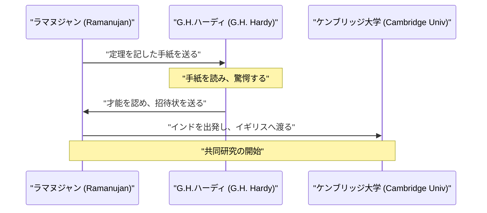
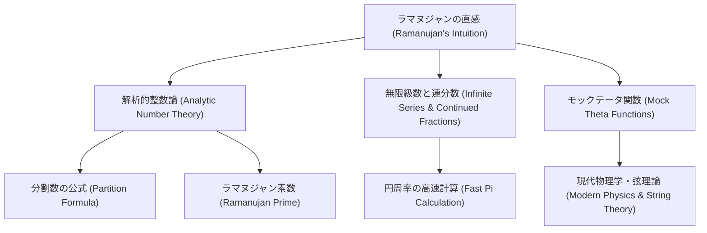

## 導入：神から公式を授かった男

[シュリニヴァーサ・ラマヌジャン](https://kenji.blog/p/ramanujan/)（[Srinivasa Ramanujan](https://kenji.blog/p/ramanujan/), 1887年 – 1920年）は、20世紀初頭の数学界に彗星のごとく現れ、そして短い生涯を閉じたインドの天才数学者です。彼は正式な数学的教育をほとんど受けていなかったにもかかわらず、直感と独自の洞察力によって数々の驚異的な定理や公式を導き出しました。彼の残したノートブックは、死後100年以上が経過した現在でも、最先端の数学や物理学の研究に影響を与え続けています。

本記事では、[ラマヌジャン](https://kenji.blog/p/ramanujan/)の波乱に満ちた生涯、彼を見出したイギリスの数学者G.H.ハーディとの交流、そして彼が残した輝かしい数学的業績について深く掘り下げていきます。彼の人生は、情熱と才能がどのようにして困難を乗り越え、世界を変えることができるのかを示す力強い証明です。

## 生い立ちと初期の経歴：数学への目覚め

1887年12月22日、[ラマヌジャン](https://kenji.blog/p/ramanujan/)はインド南部のタミル・ナードゥ州エロードという町の貧しいバラモン階級の家庭に生まれました。父親は小さな布地店の店員として働き、母親は専業主婦でありながらもヒンドゥー教の信仰に厚く、[ラマヌジャン](https://kenji.blog/p/ramanujan/)に多大な影響を与えました。幼少期から数字に対して異常なほどの執着と才能を示し、10歳でクンバコナムのタウン・ハイスクールに入学すると、その数学的才能はすぐに開花しました。彼はしばしば教師たちを驚かせるような質問をし、同級生たちからは畏敬の念を抱かれていました。

彼が15歳の時、運命の出会いが訪れます。ジョージ・シューブリッジ・カーが著した『純粋数学と応用数学の基本結果要覧（A Synopsis of Elementary Results in Pure and Applied Mathematics）』という本を友人から借りたのです。この本には数千もの定理が証明なしで羅列されており、[ラマヌジャン](https://kenji.blog/p/ramanujan/)はこの本を隅々まで読み込み、独自の証明を考え出し、さらに新しい定理を自らのノートブックに書き留めるようになりました。この孤独な研究作業が、後の彼独自の数学的スタイルの基盤となりました。

しかし、数学に没頭するあまり他の科目が疎かになり、英語や歴史の試験に落第し、大学の奨学金を失ってしまいます。彼は学位を得ることなく、極貧の中で独学で数学の研究を続けることになりました。社会的な成功からは見放されたかのように見えましたが、彼の数学への情熱が衰えることはありませんでした。

その後、結婚を機に安定した収入を求めて職探しを始め、インド数学会の創設者であるV.ラーマスワーミ・アイヤル（V. Ramaswamy Aiyer）の助けを借りて、ついにマドラス港湾局の事務員として働き始めます。上司たちも彼の才能に気づき、勤務の合間や夜中にノートブックに向かい、数学の思索にふける生活をある程度黙認し、支援しました。

## G.H.ハーディとの運命の出会い

1913年、周囲の勧めもあり、[ラマヌジャン](https://kenji.blog/p/ramanujan/)はイギリスの著名な数学者たちに自らの研究成果を記した手紙を送りました。そのほとんどは無名のインド人からの手紙として無視されましたが、ケンブリッジ大学のゴッドフレイ・ハロルド・ハーディ（G.H. Hardy）の反応は違いました。ハーディは最初、その手紙を **狂人の戯言** （きょうじんのたわごと）かと考えました。しかし、そこに記された公式のいくつかを詳細に検討すると、それらが驚くほど深く、かつ真実でなければ到底思いつかないようなものであることに気付いたのです。

ハーディは後に、「それらの公式は、これまで私が見たこともないようなものだった。一目見ただけで、それらを書き下すことができるのは最高クラスの数学者だけだと分かった。それらは真実に違いない。なぜなら、もし真実でなければ、そんなものを想像するだけの知性を持つ者は誰もいないからだ」と語っています。

以下は、[ラマヌジャン](https://kenji.blog/p/ramanujan/)とハーディの運命的な交流を示すシーケンス図です。

## ケンブリッジでの生活と業績

1914年、第一次世界大戦が勃発する直前の時期に、[ラマヌジャン](https://kenji.blog/p/ramanujan/)は宗教的な禁忌（バラモンは海を渡ってはならないという教え）を乗り越えて海を渡り、イギリスのケンブリッジ大学トリニティ・カレッジに到着しました。そこでハーディと、彼の共同研究者であるジョン・エデンサー・リトルウッド（J.E. Littlewood）と共に本格的な研究を始めました。

彼らの協力関係は、数学史上最もロマンチックな出来事の一つと言われています。ハーディは厳密な証明を重んじる西洋の伝統的な数学者であり、[ラマヌジャン](https://kenji.blog/p/ramanujan/)は直感とインスピレーションによって結果を導き出す天才でした。[ラマヌジャン](https://kenji.blog/p/ramanujan/)はしばしば、「私の故郷の女神であるナーマギリ女神が夢に現れて、公式を教えてくれた」と語っていました。二人のスタイルは対極にありましたが、だからこそ互いの欠点を補い合い、数々の重要な論文を発表することに成功しました。ハーディは[ラマヌジャン](https://kenji.blog/p/ramanujan/)に現代的な数学の厳密さを教え、[ラマヌジャン](https://kenji.blog/p/ramanujan/)はハーディに誰も思いつかないような独創的な発想を提供しました。

## タクシー数 1729：最も有名な逸話

[ラマヌジャン](https://kenji.blog/p/ramanujan/)に関する最も有名な逸話は、「タクシー数」と呼ばれる数字に関するものです。これは彼の数字に対する並外れた直感と愛情を示すエピソードとして、広く知られています。

[ラマヌジャン](https://kenji.blog/p/ramanujan/)が病気でパットニーの療養所に入院していた時のことです。見舞いに訪れたハーディは、会話の糸口として次のように言いました。「乗ってきたタクシーのナンバーは1729だった。なんともつまらない数字だったよ。不吉な兆候でなければいいが。」

すると[ラマヌジャン](https://kenji.blog/p/ramanujan/)は即座にこう答えました。
「いいえ、ハーディ先生。それはとても興味深い数字です。それは、2つの立方数の和として2通りに表すことができる最小の自然数なのです。」

この言葉を数式で表すと以下のようになります。

$$
1729 = 1^3 + 12^3 = 9^3 + 10^3
$$

この逸話から、このような性質を持つ数は「タクシー数（Taxicab number）」と呼ばれるようになりました。彼は、数字たちが彼にとって **個人的な友人** （こじんてきなゆうじん）であるかのように、個々の数字の性質を深く理解し、記憶していたのです。リトルウッドは後に、「すべての正の整数は[ラマヌジャン](https://kenji.blog/p/ramanujan/)の個人的な友人である」と評しています。

## [ラマヌジャン](https://kenji.blog/p/ramanujan/)の数学的貢献

[ラマヌジャン](https://kenji.blog/p/ramanujan/)が残した業績は多岐にわたりますが、ここではその中でも特に有名なものをいくつか紹介します。彼の研究の大部分は数論、無限級数、連分数に関するものでした。

### 円周率 $\pi$ の無限級数

[ラマヌジャン](https://kenji.blog/p/ramanujan/)は円周率に関する非常に収束の速い無限級数を多数発見しました。その中でも特に有名なのが以下の公式です。

$$
\frac{1}{\pi} = \frac{2\sqrt{2}}{9801} \sum_{k=0}^{\infty} \frac{(4k)!(1103 + 26390k)}{(k!)^4 396^{4k}}
$$

この公式は、最初の1項（$k=0$）を計算するだけで円周率が小数点以下6桁まで正確に求まるという驚異的な性質を持っています。当時としてはあまりにも複雑で、どのようにして導かれたのか全く謎でしたが、後の数学者たちによってその正しさが証明されました。現在でも、コンピュータを用いた円周率の計算において、[ラマヌジャン](https://kenji.blog/p/ramanujan/)の公式やそれに基づいたチュドノフスキーのアルゴリズムが使用され、兆桁を超える計算記録の更新に貢献しています。

### 分割数（Partition Function）の漸近公式

分割数 $p(n)$ とは、正の整数 $n$ を正の整数の和として表す方法の数のことです。例えば、4の分割数は5です（4, 3+1, 2+2, 2+1+1, 1+1+1+1）。
$n$ が大きくなると $p(n)$ は急激に増加しますが、その正確な値を求めることは長年困難だとされていました。

[ラマヌジャン](https://kenji.blog/p/ramanujan/)とハーディは、この $p(n)$ の近似値（漸近的な振る舞い）を示す驚異的な公式を発見しました。

$$
p(n) \sim \frac{1}{4n\sqrt{3}} \exp\left( \pi \sqrt{\frac{2n}{3}} \right) \quad (\text{as } n \to \infty)
$$

この研究は「円周法（Circle Method）」と呼ばれる新しい解析的整数論の手法を生み出し、後の数学の発展に多大な影響を与えました。この公式は、極めて大きな $n$ に対しても信じられないほどの精度で分割数を予測することができます。

### モックテータ関数（Mock Theta Functions）

[ラマヌジャン](https://kenji.blog/p/ramanujan/)が死の直前にハーディに宛てた最後の手紙の中に記されていたのが「モックテータ関数」に関する研究です。長年、この関数がどのような数学的意味を持つのかは謎のままであり、多くの数学者がその解読に挑みました。近年になって、この関数がブラックホールの熱力学や弦理論といった現代物理学の最前線において重要な役割を果たすことが明らかになりました。彼の直感は、時代を数十年、いや一世紀も先取りしていたのです。

### [ラマヌジャン](https://kenji.blog/p/ramanujan/)素数と高度合成数

彼は素数の分布に関しても深い洞察を持っていました。ベルトランの仮説の一般化に関する研究から導き出された「[ラマヌジャン](https://kenji.blog/p/ramanujan/)素数」や、約数を非常に多く持つ「高度合成数」に関する研究も、現代の数論において重要な位置を占めています。

以下は、[ラマヌジャン](https://kenji.blog/p/ramanujan/)の研究分野のつながりを示すダイアグラムです。

## 帰国と早すぎる死

イギリスでの研究生活は[ラマヌジャン](https://kenji.blog/p/ramanujan/)に大きな名声をもたらしました。彼は1918年に王立協会フェロー（FRS）に選出され、同じ年にトリニティ・カレッジのフェローにも選ばれました。これはインド人として初となる快挙であり、彼の実力が世界的に認められた瞬間でした。

しかし、その栄光の裏で彼の身体は限界に達していました。イギリスの寒冷な気候と、厳格なバラモンの菜食主義者である彼にとって適切な食事が得られなかったこと、さらに第一次世界大戦による食糧難が重なり、彼の健康は著しく蝕まれました。結核や重度のビタミン欠乏症（あるいは肝アメーバ症と言われています）などを患い、長期間療養所での生活を余儀なくされました。

第一次世界大戦終結後の1919年、健康状態がわずかに回復したため、彼は妻と家族が待つインドへ帰国しました。インド中が彼の帰国を歓迎しましたが、母国に戻ってからも病状は悪化し続けました。病の床にあっても彼は数学の思索をやめず、最後の瞬間までノートブックに数式を書き付けていました。そして1920年4月26日、わずか32歳という若さでこの世を去りました。

## 遺産：失われたノートブックと現代への影響

[ラマヌジャン](https://kenji.blog/p/ramanujan/)が死の床で書き残した最後のノートブックは、その後長らく行方不明となっていましたが、1976年にアメリカの数学者ジョージ・アンドリュースによってケンブリッジ大学の図書館から発見されました。これは「失われたノートブック（The Lost Notebook）」と呼ばれ、再び数学界に大きな衝撃を与えました。そこには約600もの新しい公式が記されており、現在でもその意味や応用についての研究が続けられています。

[シュリニヴァーサ・ラマヌジャン](https://kenji.blog/p/ramanujan/)の波乱万丈な生涯は、ロバート・カニーゲルの伝記『無限の天才（The Man Who Knew Infinity）』や、それを原作とした2015年の同名映画（邦題『奇蹟がくれた数式』）などで描かれ、数学界を超えて多くの人々に感銘を与えています。

彼の最大の遺産は、そのノートブックに残された無数の公式たちです。それらは証明が省かれていることが多かったため、後の数学者たちが何十年もかけてその一つ一つを証明していくことになりました。ブルース・バーントなどの数学者のたゆまぬ努力により、彼のノートブックの解読は進められましたが、そこから派生した新しい謎や研究テーマは未だに尽きることがありません。

## 結論

**天才** という言葉は容易に使われがちですが、[ラマヌジャン](https://kenji.blog/p/ramanujan/)こそは真の意味での天才でした。彼が残した数々の公式は、単なる記号の羅列ではなく、宇宙の法則そのものを写し取った芸術作品のようです。貧困や病魔に苦しみながらも、純粋な数学的イデアの世界を探求し続けた彼の名前と業績は、数学の歴史において永遠に輝き続けることでしょう。彼の残した謎は、未来の数学者たちへの永遠の挑戦状なのです。
