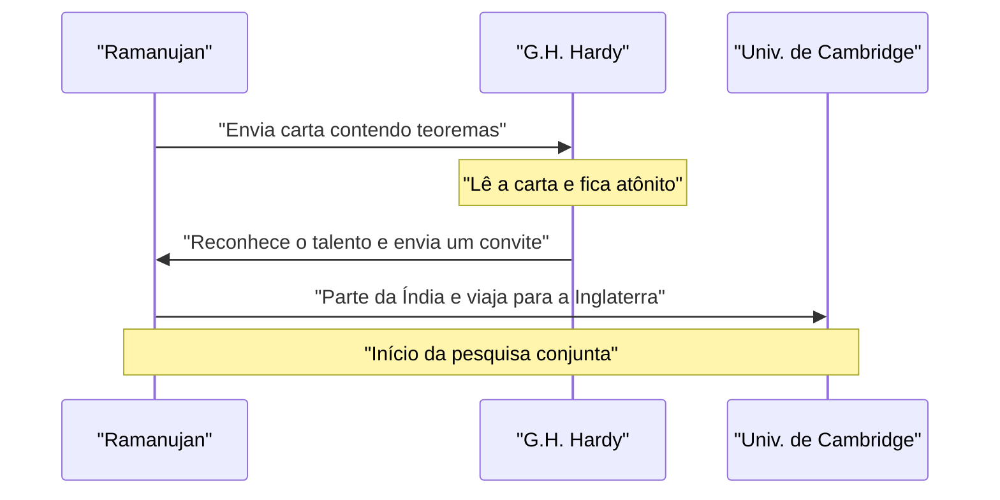
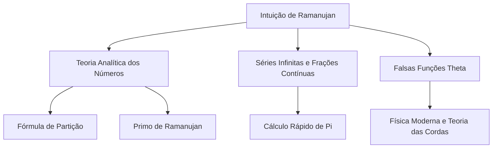

## Introdução: O Homem Que Recebeu Fórmulas dos Deuses

Srinivasa Ramanujan (1887–1920) foi um gênio matemático indiano que apareceu como um cometa no mundo matemático do início do século XX, antes que sua vida tragicamente curta chegasse ao fim. Apesar de não ter quase nenhuma educação matemática formal, ele deduziu inúmeros teoremas e fórmulas surpreendentes por meio de pura intuição e uma visão única. Seus cadernos, que sobreviveram, continuam a influenciar pesquisas de ponta na matemática e física modernas, mais de um século após sua morte.

Neste artigo, vamos mergulhar na vida turbulenta de Ramanujan, em suas interações cruciais com o matemático britânico G.H. Hardy, que o descobriu, e no brilhante legado matemático que ele deixou para trás. Sua vida é um poderoso testemunho de como a paixão e o talento podem superar a adversidade e mudar o mundo.

## Primeiros Anos e Origem: O Despertar Para a Matemática

Nascido em 22 de dezembro de 1887, em uma família brâmane pobre de Erode, uma cidade em Tamil Nadu, no sul da Índia, o pai de Ramanujan trabalhava como balconista em uma pequena loja de tecidos. Sua mãe, uma dona de casa hindu devota, exerceu profunda influência sobre ele. Desde muito jovem, ele demonstrou uma obsessão e um talento extraordinários por números. Ao ingressar na Town High School em Kumbakonam, aos 10 anos de idade, seu gênio matemático rapidamente desabrochou. Ele costumava fazer perguntas que confundiam os professores e conquistavam a admiração de seus colegas de classe.

Aos 15 anos, ocorreu um encontro fatídico. Ele pegou emprestado com um amigo um exemplar do livro *A Synopsis of Elementary Results in Pure and Applied Mathematics*, de George Shoobridge Carr. O livro listava milhares de teoremas sem demonstrações. Ramanujan devorou o livro, criando suas próprias provas e anotando teoremas inteiramente novos em seus cadernos. Essa pesquisa solitária formou a base de seu estilo matemático único.

No entanto, sua devoção absoluta à matemática fez com que negligenciasse outras matérias. Ele foi reprovado nos exames de inglês e história, resultando na perda da bolsa de estudos da faculdade. Sem um diploma, ele continuou suas pesquisas matemáticas na extrema pobreza. Embora o sucesso social parecesse eludi-lo, sua paixão pela matemática nunca diminuiu.

Mais tarde, em busca de uma renda estável após o casamento, ele conseguiu um emprego como escriturário no Madras Port Trust, com a ajuda de V. Ramaswamy Aiyer, fundador da Sociedade Matemática Indiana. Seus superiores reconheceram seu talento e o apoiaram amplamente, permitindo-lhe trabalhar em seus cadernos e buscar seus pensamentos matemáticos durante as pausas no trabalho e até tarde da noite.

## O Encontro Decisivo com G.H. Hardy

Em 1913, encorajado por pessoas próximas, Ramanujan enviou cartas detalhando suas pesquisas a proeminentes matemáticos britânicos. A maioria ignorou as cartas de um escriturário indiano desconhecido, mas a reação de Godfrey Harold Hardy na Universidade de Cambridge foi diferente. A princípio, Hardy considerou a carta como o **delírio de um louco**. Contudo, ao examinar mais de perto algumas das fórmulas, ele percebeu que eram tão profundamente complexas que ninguém poderia tê-las inventado a menos que fossem verdadeiras.

Hardy comentou mais tarde: "Elas me derrotaram completamente; eu nunca tinha visto nada que se parecesse minimamente com elas. Basta um único olhar para perceber que elas só poderiam ter sido escritas por um matemático do mais alto nível. Elas devem ser verdadeiras porque, se não fossem verdadeiras, ninguém teria a imaginação necessária para inventá-las."

Abaixo está um diagrama de sequência mostrando a interação crucial entre Ramanujan e Hardy.

## Vida e Conquistas em Cambridge

Em 1914, pouco antes do início da Primeira Guerra Mundial, Ramanujan cruzou o oceano — desafiando o tabu religioso que proibia os brâmanes de atravessar o mar — e chegou ao Trinity College, em Cambridge. Lá, ele começou uma pesquisa séria com Hardy e seu colaborador, John Edensor Littlewood.

A colaboração entre eles é frequentemente descrita como um dos incidentes mais românticos da história da matemática. Hardy era um matemático ocidental tradicional, que valorizava provas rigorosas, enquanto Ramanujan era um gênio que derivava resultados por meio da intuição e da inspiração. Ramanujan frequentemente dizia: "A deusa Namagiri da minha cidade natal apareceu nos meus sonhos e me ensinou as fórmulas". Embora seus estilos fossem polos opostos, eles compensavam as fraquezas um do outro, publicando com sucesso vários artigos importantes. Hardy ensinou a Ramanujan o rigor matemático moderno, enquanto Ramanujan forneceu a Hardy ideias originais que ninguém mais conseguiria conceber.

## Número do Táxi 1729: A Anedota Mais Famosa

A anedota mais famosa sobre Ramanujan diz respeito ao "número do táxi". Ela é amplamente conhecida como uma história que demonstra sua intuição extraordinária e seu afeto pelos números.

Enquanto Ramanujan estava internado em Putney devido a uma doença, Hardy foi visitá-lo. Procurando uma maneira de iniciar a conversa, Hardy comentou: "Eu vim em um táxi com o número 1729. Pareceu-me um número bastante monótono. Espero que não seja um mau presságio."

Ramanujan respondeu imediatamente:
"Não, Sr. Hardy, é um número muito interessante. É o menor número que pode ser expresso como a soma de dois cubos positivos de duas maneiras diferentes."

Expresso matematicamente, fica assim:

$$
1729 = 1^3 + 12^3 = 9^3 + 10^3
$$

Desde essa anedota, os números com essa propriedade foram chamados de "números de táxi". Ele compreendia e lembrava das propriedades dos números individuais como se fossem seus **amigos pessoais**. Littlewood comentou mais tarde: "Todo número inteiro positivo era um dos amigos pessoais de Ramanujan."

## Contribuições Matemáticas de Ramanujan

Ramanujan deixou uma grande variedade de conquistas, mas apresentaremos aqui algumas das mais famosas. A maior parte de suas pesquisas envolvia a teoria dos números, séries infinitas e frações contínuas.

### Séries Infinitas para Pi $\pi$

Ramanujan descobriu inúmeras séries infinitas de rápida convergência para o pi. Entre elas, a mais famosa é a seguinte fórmula:

$$
\frac{1}{\pi} = \frac{2\sqrt{2}}{9801} \sum_{k=0}^{\infty} \frac{(4k)!(1103 + 26390k)}{(k!)^4 396^{4k}}
$$

Esta fórmula possui a propriedade surpreendente de que calcular apenas o primeiro termo ($k=0$) fornece o pi com exatidão até a sexta casa decimal. Na época, ela era muito complexa e permaneceu um mistério completo como foi deduzida, mas, posteriormente, matemáticos provaram sua correção. Ainda hoje, as fórmulas de Ramanujan e o algoritmo de Chudnovsky baseado nelas são usados em cálculos computacionais de pi, contribuindo para estabelecer recordes que excedem trilhões de dígitos.

### Fórmula Assintótica da Função de Partição

A função de partição $p(n)$ representa o número de maneiras que um número inteiro positivo $n$ pode ser expresso como a soma de números inteiros positivos. Por exemplo, a partição de 4 é 5 (4, 3+1, 2+2, 2+1+1, 1+1+1+1).
À medida que $n$ se torna maior, $p(n)$ aumenta rapidamente, mas encontrar seu valor exato foi considerado difícil por muitos anos.

Ramanujan e Hardy descobriram uma fórmula impressionante que mostra a aproximação (comportamento assintótico) desse $p(n)$.

$$
p(n) \sim \frac{1}{4n\sqrt{3}} \exp\left( \pi \sqrt{\frac{2n}{3}} \right) \quad (\text{quando } n \to \infty)
$$

Essa pesquisa deu origem a um novo método na teoria analítica dos números chamado "Método do Círculo", influenciando grandemente o desenvolvimento subsequente da matemática. Esta fórmula pode prever o número de partições com precisão incrível, mesmo para valores extremamente grandes de $n$.

### Falsas Funções Theta (Mock Theta Functions)

A pesquisa de Ramanujan sobre "falsas funções theta" foi descrita em sua última carta a Hardy, pouco antes de sua morte. Durante muito tempo, o significado matemático dessas funções permaneceu um mistério e muitos matemáticos tentaram decodificá-las. Nos últimos anos, ficou claro que essas funções desempenham um papel crítico na vanguarda da física moderna, como a termodinâmica de buracos negros e a teoria das cordas. Sua intuição estava décadas, senão um século, à frente do seu tempo.

### Primos de Ramanujan e Números Altamente Compostos

Ele também possuía uma visão profunda sobre a distribuição de números primos. Suas pesquisas que levaram aos "primos de Ramanujan", derivados da generalização do postulado de Bertrand, e aos "números altamente compostos", que têm um número incomumente grande de divisores, ocupam um lugar importante na teoria moderna dos números.

Abaixo está um diagrama que mostra as conexões entre as áreas de pesquisa de Ramanujan.

## Retorno ao Lar e Morte Prematura

Sua vida de pesquisas na Inglaterra trouxe imensa fama a Ramanujan. Em 1918, ele foi eleito Membro da Royal Society (FRS) e Membro do Trinity College no mesmo ano. Isso foi uma conquista sem precedentes para um indiano e marcou o momento em que suas habilidades foram reconhecidas globalmente.

Contudo, por trás dessa glória, seu corpo havia chegado ao limite. O frio clima inglês, sua incapacidade de obter alimentos adequados como um brâmane estritamente vegetariano, e a escassez de alimentos causada pela Primeira Guerra Mundial comprometeram gravemente sua saúde. Ele sofreu de tuberculose e severa deficiência vitamínica (ou possivelmente amebíase hepática) e foi forçado a viver em sanatórios por longos períodos.

Em 1919, após o fim da Primeira Guerra Mundial, sua saúde melhorou um pouco e ele voltou à Índia, onde sua esposa e família o esperavam. Toda a Índia saudou seu retorno, mas seu quadro continuou a piorar mesmo após retornar ao seu país de origem. Mesmo em seu leito de doente, ele nunca cessou suas reflexões matemáticas, escrevendo fórmulas em seu caderno até o fim. Em 26 de abril de 1920, ele faleceu, com apenas 32 anos de idade.

## Legado: O Caderno Perdido e o Impacto no Mundo Moderno

O último caderno que Ramanujan escreveu em seu leito de morte ficou perdido por um longo tempo, mas foi descoberto na biblioteca da Universidade de Cambridge pelo matemático americano George Andrews, em 1976. Ele ficou conhecido como "O Caderno Perdido" e mais uma vez enviou ondas de choque através da comunidade matemática. Continha cerca de 600 novas fórmulas, e pesquisas sobre o significado e aplicações delas continuam até hoje.

A vida turbulenta de Srinivasa Ramanujan foi retratada na biografia de Robert Kanigel *O Homem que Conhecia o Infinito* e em sua adaptação para o cinema de 2015 com o mesmo nome, inspirando inúmeras pessoas além da comunidade matemática.

Seu maior legado é a imensa quantidade de fórmulas deixadas em seus cadernos. Como elas muitas vezes não possuíam provas, matemáticos posteriores passaram décadas provando cada uma delas. Graças aos esforços incansáveis de matemáticos como Bruce Berndt, a decifração de seus cadernos progrediu, mas os novos mistérios e temas de pesquisa deles derivados ainda estão longe de se esgotar.

## Conclusão

A palavra **gênio** é frequentemente usada de forma leviana, mas Ramanujan foi um gênio no sentido mais verdadeiro da palavra. As inúmeras fórmulas que ele deixou não são meras sequências de símbolos, mas parecem obras de arte capturando as próprias leis do universo. Embora tenha sofrido com a pobreza e a doença, ele continuou a explorar o reino das ideias matemáticas puras, e seu nome e suas realizações brilharão para sempre na história da matemática. Os mistérios que ele deixou servem como um desafio eterno aos matemáticos do futuro.
