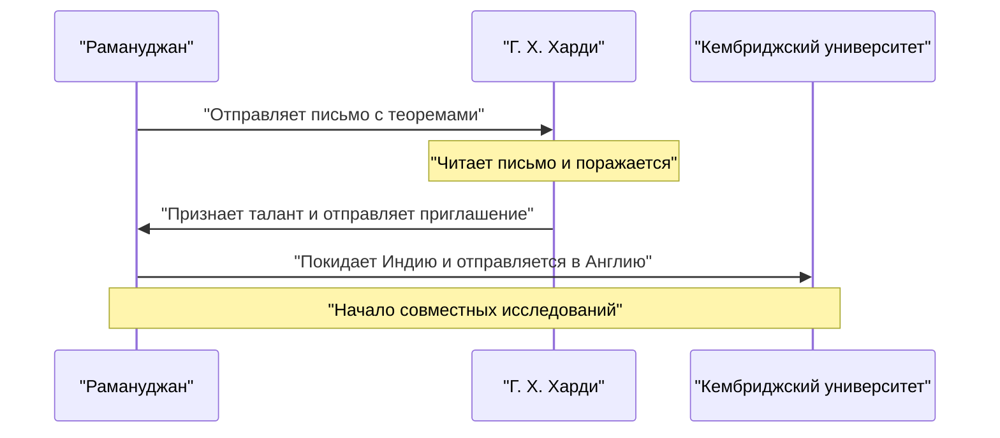
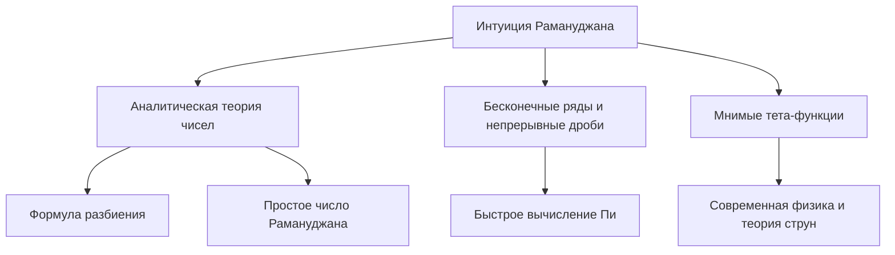

## Введение: Человек, получавший формулы от богов

Шриниваса Рамануджан (1887–1920) был индийским математическим гением, появившимся словно комета в математическом мире начала 20-го века, прежде чем его трагически короткая жизнь оборвалась. Несмотря на то, что у него почти не было формального математического образования, он вывел множество поразительных теорем и формул, полагаясь на чистую интуицию и уникальную проницательность. Его сохранившиеся записные книжки продолжают оказывать влияние на передовые исследования в современной математике и физике даже спустя столетие после его смерти.

В этой статье мы подробно рассмотрим бурную жизнь Рамануджана, его судьбоносное знакомство с британским математиком Г. Х. Харди, открывшим его миру, и блестящее математическое наследие, которое он оставил. Его жизнь является ярким свидетельством того, как страсть и талант могут преодолеть невзгоды и изменить мир.

## Ранние годы и происхождение: Пробуждение математики

Рамануджан родился 22 декабря 1887 года в бедной брахманской семье в Эроде, городе в штате Тамилнад на юге Индии. Его отец работал клерком в небольшом магазине тканей, а мать, глубоко верующая индуистка и домохозяйка, оказала на него огромное влияние. С самого раннего возраста он проявлял необычайную одержимость и талант к числам. Когда в 10 лет он поступил в среднюю школу в Кумбаконаме, его математический гений быстро расцвел. Он часто задавал вопросы, которые ставили в тупик учителей и вызывали трепет у одноклассников.

В 15 лет произошла судьбоносная встреча. Он одолжил у друга книгу Джорджа Шубриджа Карра «Сборник элементарных результатов чистой и прикладной математики». В книге были перечислены тысячи теорем без доказательств. Рамануджан буквально проглотил книгу, придумывая собственные доказательства и записывая совершенно новые теоремы в свои тетради. Это уединенное исследование заложило основу его уникального математического стиля.

Однако его абсолютная преданность математике привела к тому, что он забросил другие предметы. Он провалил экзамены по английскому языку и истории, что привело к потере стипендии в колледже. Не имея диплома, он продолжал свои математические исследования в крайней нищете. И хотя социальный успех, казалось, обходил его стороной, его страсть к математике никогда не угасала.

Позже, в поисках стабильного заработка после женитьбы, он получил должность клерка в Портовом управлении Мадраса благодаря помощи В. Рамасвами Айера, основателя Индийского математического общества. Руководство признало его талант и всячески поддерживало его, позволяя работать над записными книжками и развивать математические идеи в перерывах и поздно ночью.

## Судьбоносная встреча с Г. Х. Харди

В 1913 году по совету окружающих Рамануджан отправил письма с описанием своих исследований видным британским математикам. Большинство проигнорировало письма неизвестного индийского клерка, но реакция Годфри Гарольда Харди из Кембриджского университета была иной. Сначала Харди счел письмо **бреднями сумасшедшего**. Однако при ближайшем рассмотрении некоторых формул он понял, что они настолько глубоки и сложны, что никто не смог бы их выдумать, если бы они не были правдой.

Позже Харди заметил: «Они полностью разбили меня; я никогда раньше не видел ничего подобного. Достаточно одного взгляда на них, чтобы понять, что они могли быть написаны только математиком высочайшего класса. Они должны быть истинными, потому что, если бы это было не так, ни у кого не хватило бы воображения изобрести их».

Ниже приведена диаграмма последовательности, показывающая судьбоносное взаимодействие между Рамануджаном и Харди.

## Жизнь и достижения в Кембридже

В 1914 году, незадолго до начала Первой мировой войны, Рамануджан пересек океан — нарушив религиозный запрет, не позволявший брахманам пересекать море, — и прибыл в Тринити-колледж Кембриджа. Там он начал серьезные исследования вместе с Харди и его соавтором Джоном Иденсором Литтлвудом.

Их сотрудничество часто называют одним из самых романтичных эпизодов в истории математики. Харди был традиционным западным математиком, ценившим строгие доказательства, а Рамануджан — гением, получавшим результаты благодаря интуиции и вдохновению. Рамануджан часто говорил: «Богиня Намагири из моего родного города явилась мне во сне и научила формулам». Хотя их стили были диаметрально противоположными, они компенсировали слабости друг друга, успешно опубликовав множество важных работ. Харди обучил Рамануджана современной математической строгости, а Рамануджан предоставил Харди оригинальные идеи, которые никто другой не смог бы придумать.

## Число такси 1729: Самый известный случай

Самый известный случай из жизни Рамануджана связан с «числом такси». Эта история широко известна и демонстрирует его экстраординарную интуицию и любовь к числам.

Когда Рамануджан лежал в больнице в Патни, Харди пришел навестить его. Желая начать разговор, Харди заметил: «Я приехал на такси с номером 1729. Мне показалось, что это довольно скучное число. Надеюсь, это не дурное предзнаменование».

Рамануджан немедленно ответил:
«Нет, мистер Харди, это очень интересное число. Это наименьшее число, которое можно выразить как сумму двух кубов двумя разными способами».

Математически это выглядит так:

$$
1729 = 1^3 + 12^3 = 9^3 + 10^3
$$

С тех пор числа с таким свойством стали называть «числами такси». Он понимал и помнил свойства отдельных чисел так, словно они были его **личными друзьями**. Литтлвуд позже заметил: «Каждое положительное целое число было одним из личных друзей Рамануджана».

## Математический вклад Рамануджана

Рамануджан оставил после себя огромное количество достижений, и здесь мы представим лишь некоторые из самых известных. Большая часть его исследований была посвящена теории чисел, бесконечным рядам и непрерывным дробям.

### Бесконечные ряды для Пи $\pi$

Рамануджан открыл множество быстро сходящихся бесконечных рядов для числа пи. Среди них наиболее известна следующая формула:

$$
\frac{1}{\pi} = \frac{2\sqrt{2}}{9801} \sum_{k=0}^{\infty} \frac{(4k)!(1103 + 26390k)}{(k!)^4 396^{4k}}
$$

Эта формула обладает удивительным свойством: вычисление только первого члена ($k=0$) дает значение пи с точностью до шести знаков после запятой. В то время она казалась невероятно сложной, и оставалось полной загадкой, как она была выведена, но позже математики доказали ее правильность. Даже сегодня формулы Рамануджана и основанный на них алгоритм Чудновского используются в компьютерных вычислениях числа пи, помогая устанавливать рекорды, превышающие триллионы знаков.

### Асимптотическая формула для функции разбиения

Функция разбиения $p(n)$ представляет собой количество способов, которыми положительное целое число $n$ может быть выражено как сумма положительных целых чисел. Например, разбиение числа 4 равно 5 (4, 3+1, 2+2, 2+1+1, 1+1+1+1).
По мере увеличения $n$ значение $p(n)$ быстро растет, но точное его определение долгие годы считалось сложной задачей.

Рамануджан и Харди открыли поразительную формулу, показывающую приближение (асимптотическое поведение) для $p(n)$.

$$
p(n) \sim \frac{1}{4n\sqrt{3}} \exp\left( \pi \sqrt{\frac{2n}{3}} \right) \quad (\text{при } n \to \infty)
$$

Это исследование положило начало новому методу в аналитической теории чисел, названному «круговым методом», который сильно повлиял на последующее развитие математики. Данная формула может предсказывать число разбиений с невероятной точностью даже для экстремально больших значений $n$.

### Мнимые тета-функции (Mock Theta Functions)

Исследования Рамануджана о «мнимых тета-функциях» были описаны в его последнем письме к Харди незадолго до смерти. Долгое время математический смысл этих функций оставался загадкой, и многие пытались их расшифровать. В последние годы стало ясно, что эти функции играют важнейшую роль на переднем крае современной физики, например, в термодинамике черных дыр и теории струн. Его интуиция опередила время на десятилетия, если не на целый век.

### Простые числа Рамануджана и сверхсоставные числа

Он также обладал глубоким пониманием распределения простых чисел. Его исследования, приведшие к «простым числам Рамануджана», вытекающим из обобщения постулата Бертрана, и «сверхсоставным числам», имеющим необычайно большое количество делителей, занимают важное место в современной теории чисел.

Ниже представлена диаграмма, показывающая связи между областями исследований Рамануджана.

## Возвращение на родину и преждевременная смерть

Исследовательская работа в Англии принесла Рамануджану огромную славу. В 1918 году он был избран членом Лондонского королевского общества (FRS) и членом Тринити-колледжа. Это стало беспрецедентным достижением для индийца и ознаменовало момент, когда его способности получили мировое признание.

Однако за этой славой скрывалось физическое истощение. Холодный английский климат, невозможность найти подходящую еду будучи строгим вегетарианцем-брахманом, а также нехватка продовольствия, вызванная Первой мировой войной, серьезно подорвали его здоровье. Он заболел туберкулезом и страдал от тяжелого авитаминоза (или, возможно, печеночного амебиаза), из-за чего был вынужден долгое время проводить в санаториях.

В 1919 году, после окончания Первой мировой войны, его здоровье немного улучшилось, и он вернулся в Индию, где его ждали жена и семья. Вся Индия приветствовала его возвращение, но его состояние продолжало ухудшаться даже на родине. Даже прикованный к постели, он не прекращал своих математических размышлений, записывая формулы в тетрадь до самого конца. 26 апреля 1920 года он скончался в молодом возрасте — ему было всего 32 года.

## Наследие: Потерянная тетрадь и влияние на современный мир

Последняя тетрадь, которую Рамануджан заполнял на смертном одре, долгое время считалась утерянной, но была обнаружена в библиотеке Кембриджского университета американским математиком Джорджем Эндрюсом в 1976 году. Она стала известна как «Потерянная тетрадь» и вновь вызвала шок в математическом сообществе. Она содержала около 600 новых формул, и исследования их значений и применения продолжаются по сей день.

Бурная жизнь Шринивасы Рамануджана была описана в биографии Роберта Канигеля «Человек, который познал бесконечность» и в одноименной экранизации 2015 года, вдохновившей бесчисленное множество людей за пределами математического сообщества.

Его величайшее наследие — огромное множество формул, оставленных в тетрадях. Поскольку они часто не содержали доказательств, последующим математикам потребовались десятилетия, чтобы доказать каждую из них. Благодаря неустанным усилиям таких математиков, как Брюс Берндт, расшифровка его записей продвинулась далеко вперед, но новые загадки и темы для исследований, вытекающие из них, все еще не исчерпаны.

## Заключение

Слово **гений** часто используют необдуманно, но Рамануджан был гением в самом истинном смысле этого слова. Многочисленные формулы, оставленные им, — это не просто последовательности символов; они кажутся произведениями искусства, отражающими сами законы Вселенной. Несмотря на нищету и болезни, он продолжал исследовать царство чистых математических идей, и его имя и достижения будут вечно сиять в истории математики. Загадки, которые он оставил, служат вечным вызовом для математиков будущего.
