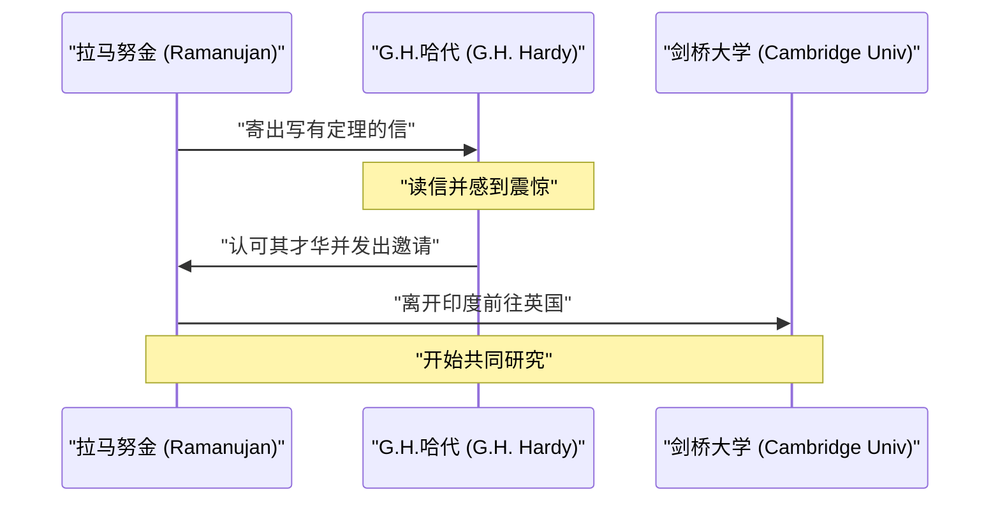
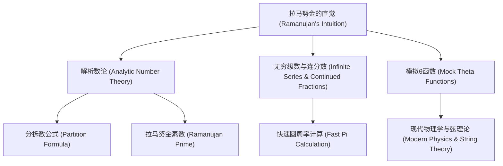

## 引言：从神灵那里获得公式的男人

[斯里尼瓦瑟·拉马努金](https://kenji.blog/zh-cn/p/ramanujan/)（[Srinivasa Ramanujan](https://kenji.blog/zh-cn/p/ramanujan/), 1887年–1920年）是20世纪初如彗星般闪耀在数学界，却又英年早逝的印度天才数学家。尽管他几乎没有受过正规的数学教育，却凭借直觉和独特的洞察力推导出了无数令人惊叹的定理和公式。他留下的笔记，在死后100多年的今天，依然持续影响着最前沿的数学和物理学研究。

在本文中，我们将深入挖掘拉马努金波澜壮阔的一生、他与发掘他的英国数学家G.H.哈代的交集，以及他留下的辉煌数学成就。他的人生有力地证明了热情与才华如何能够克服逆境并改变世界。

## 成长背景与早期经历：数学的觉醒

1887年12月22日，拉马努金出生在印度南部泰米尔纳德邦埃罗德镇的一个贫穷的婆罗门家庭。父亲在一家小布店当职员，母亲虽然是全职主妇，却是一位虔诚的印度教徒，对拉马努金产生了深远的影响。他从小就对数字表现出异于常人的痴迷和天赋，10岁进入贡伯戈讷姆的镇立高中后，其数学才华迅速绽放。他经常提出让老师瞠目结舌的问题，令同学们心生敬畏。

在他15岁时，命运的转折点到来了。他从朋友那里借到了一本乔治·舒布里奇·卡尔（George Shoobridge Carr）编写的《纯粹与应用数学基本结果要览》。这本书中罗列了数千条没有证明的定理。拉马努金将这本书从头到尾仔细钻研，想出了自己的证明方法，并将全新的定理写在自己的笔记本上。这种孤独的研究工作，成为了他日后独特数学风格的基础。

然而，由于他过于沉迷数学而荒废了其他学科，导致英语和历史考试不及格，最终失去了大学的奖学金。他没有获得学位，在极度贫困中坚持自学数学。虽然世俗的成功似乎离他远去，但他对数学的热情却从未衰退。

后来，为了在婚后获得稳定的收入，在印度数学会创始人V.拉马斯瓦米·艾耶（V. Ramaswamy Aiyer）的帮助下，他终于在马德拉斯港务局找到了一份文职工作。上司们也意识到了他的才华，并在很大程度上支持他，允许他在工作间隙和深夜里继续埋首于笔记本，进行数学上的思考。

## 与G.H.哈代命运般的相遇

1913年，在周围人的鼓励下，拉马努金向英国著名的数学家们发送了记载着自己研究成果的信件。大多数人都无视了这封来自不知名印度文员的信，但剑桥大学的戈弗雷·哈罗德·哈代（G.H. Hardy）的反应却不同。哈代起初以为这封信是疯子的 **胡言乱语** 。然而，当他仔细审查了其中的一些公式后，他意识到这些公式是如此深奥，如果不是真实的，根本没有人能凭空想象出来。

哈代后来回忆道：“这些公式完全打败了我；我以前从未见过任何类似的东西。只要看一眼就知道，只有最高级别的数学家才能写出它们。它们必须是真实的，因为如果不是真实的，没有人有足够的想象力去发明它们。”

以下是展示拉马努金与哈代命运般交流的序列图。

## 在剑桥的生活与成就

1914年，就在第一次世界大战爆发前夕，拉马努金克服了婆罗门禁止渡海的宗教禁忌，漂洋过海来到了英国剑桥大学三一学院。在那里，他与哈代及其合作者约翰·伊登斯尔·李特尔伍德（J.E. Littlewood）一起开始了真正的研究。

他们的合作关系被称为数学史上最浪漫的事件之一。哈代是注重严格证明的西方传统数学家，而拉马努金则是凭借直觉和灵感得出结论的天才。拉马努金经常说：“我家乡的娜玛吉利女神在梦中显现，教给了我这些公式。”虽然两人的风格截然相反，但也正因如此，他们互补了彼此的缺点，成功发表了许多重要的论文。哈代教会了拉马努金现代数学的严谨性，而拉马努金则为哈代提供了常人无法想象的独创性思维。

## 的士数 1729：最著名的轶事

关于拉马努金最著名的轶事，莫过于“的士数（Taxicab number）”的故事。这个故事广为人知，充分展示了他对数字的非凡直觉和热爱。

当时拉马努金因病住在普特尼的疗养院里。哈代前去探望他，为了寻找话题，哈代说道：“我乘坐的计程车车牌号是1729。这似乎是个相当无聊的数字。希望这不是个不祥的兆头。”

拉马努金立刻回答道：
“不，哈代先生，这是一个非常有趣的数字。它是可以用两种不同方式表示为两个正立方数之和的最小自然数。”

用数学公式表示如下：

$$
1729 = 1^3 + 12^3 = 9^3 + 10^3
$$

自从这则轶事之后，具有这种性质的数就被称为“的士数”。他深刻理解并记住了每个数字的特性，仿佛它们是他 **个人的朋友** 一般。李特尔伍德后来评价道：“每一个正整数都是拉马努金的个人朋友之一。”

## 拉马努金的数学贡献

拉马努金留下的成就极其广泛，这里我们介绍其中最著名的一些。他的大部分研究都涉及数论、无穷级数和连分数。

### 圆周率 $\pi$ 的无穷级数

拉马努金发现了许多关于圆周率的收敛极快的无穷级数。其中最著名的是以下公式：

$$
\frac{1}{\pi} = \frac{2\sqrt{2}}{9801} \sum_{k=0}^{\infty} \frac{(4k)!(1103 + 26390k)}{(k!)^4 396^{4k}}
$$

这个公式具有令人震惊的性质：仅仅计算第一项（$k=0$），就能得出精确到小数点后6位的圆周率。在当时，这个公式太过复杂，它是如何被推导出来的完全是个谜，但后来的数学家们证明了它的正确性。直到今天，拉马努金的公式以及基于它发展出来的楚德诺夫斯基算法，仍被用于计算机的圆周率计算中，为打破超越万亿位的计算记录做出了贡献。

### 整数分拆（Partition Function）的渐近公式

整数分拆函数 $p(n)$ 是指将正整数 $n$ 表示为正整数之和的方法数。例如，4的分拆数是5（4, 3+1, 2+2, 2+1+1, 1+1+1+1）。
随着 $n$ 的增大，$p(n)$ 会急剧增加，但要找出其精确值，多年来一直被认为是非常困难的。

拉马努金和哈代发现了一个惊人的公式，展示了 $p(n)$ 的近似值（渐近行为）。

$$
p(n) \sim \frac{1}{4n\sqrt{3}} \exp\left( \pi \sqrt{\frac{2n}{3}} \right) \quad (\text{当 } n \to \infty)
$$

这项研究催生了解析数论中一种被称为“圆法（Circle Method）”的新方法，对后来数学的发展产生了巨大影响。该公式即使对于极大的 $n$ 值，也能以令人难以置信的精度预测分拆数。

### 模拟θ函数（Mock Theta Functions）

拉马努金在临终前写给哈代的最后一封信中，描述了关于“模拟θ函数”的研究。很长一段时间里，这些函数的数学意义一直是个谜，许多数学家都试图去破解它。近年来人们才清楚地认识到，这些函数在黑洞热力学和弦理论等现代物理学的最前沿扮演着至关重要的角色。他的直觉超越了那个时代几十年，甚至整整一个世纪。

### 拉马努金素数与高度合成数

他对素数的分布也有着深刻的洞察。他从伯特兰假设的推广中导出的“拉马努金素数”，以及具有异常多约数的“高度合成数”的研究，在现代数论中占据着重要地位。

以下是展示拉马努金研究领域之间联系的图表。

## 回国与英年早逝

在英国的研究生活为拉马努金带来了巨大的声誉。1918年，他被选为皇家学会会士（FRS），同年又被选为三一学院的研究员。这对于印度人来说是史无前例的壮举，标志着他的能力得到了世界的认可。

然而，在荣耀的背后，他的身体已经达到了极限。英国寒冷的气候、作为严格的婆罗门素食主义者无法获得合适的食物，加上第一次世界大战导致的食物短缺，严重侵蚀了他的健康。他患上了肺结核和严重的维生素缺乏症（或可能是肝阿米巴病），被迫长期在疗养院生活。

第一次世界大战结束后的1919年，他的健康状况略有恢复，便返回了妻子和家人等候的印度。全印度都欢迎他的归来，但即使回到了祖国，他的病情仍在持续恶化。即使在病榻上，他也从未停止过数学上的思考，直到生命的最后一刻，他依然在笔记本上写下公式。1920年4月26日，他与世长辞，年仅32岁。

## 遗产：失落的笔记本与对现代的影响

拉马努金在临终病榻上写下的最后的一本笔记本，此后很长一段时间下落不明，直到1976年才由美国数学家乔治·安德鲁斯在剑桥大学图书馆的资料中被发现。这被称为“失落的笔记本（The Lost Notebook）”，再次给数学界带来了巨大的冲击。其中记载了约600个新公式，关于它们的意义和应用的研究至今仍在继续。

[斯里尼瓦瑟·拉马努金](https://kenji.blog/zh-cn/p/ramanujan/)波澜壮阔的一生，在罗伯特·卡尼格尔的传记《知无涯者（The Man Who Knew Infinity）》及其2015年的同名改编电影中得到了描绘，感动了数学界之外的无数人。

他最大的遗产是留在笔记本中的无数公式。由于它们通常缺乏证明，后来的数学家们花了数十年的时间去逐一证明它们。在布鲁斯·伯恩特（Bruce Berndt）等数学家不懈的努力下，他的笔记本的破译工作取得了很大进展，但从中衍生出的新谜题和研究主题，依然取之不尽用之不竭。

## 结论

**天才** 这个词很容易被滥用，但拉马努金是真正意义上的天才。他留下的众多公式，不仅仅是符号的排列，更像是捕捉了宇宙法则本身的艺术品。尽管饱受贫困和疾病的折磨，他却坚持在纯粹的数学理念世界中探索，他的名字和成就将在数学史上永远闪耀。他留下的谜题，是向未来数学家们发出的永恒挑战书。
