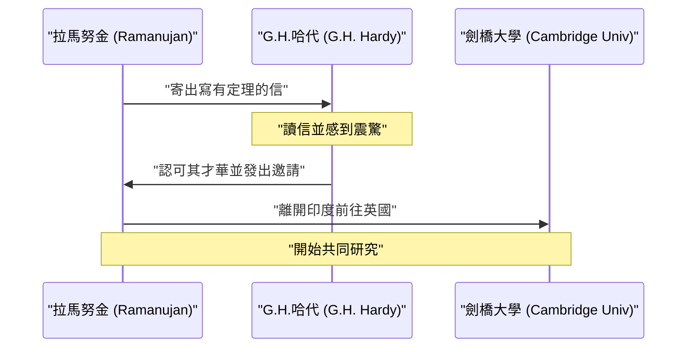
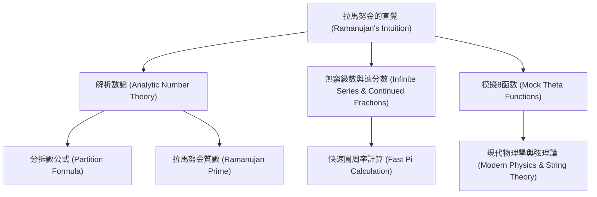

## 引言：從神靈那裡獲得公式的男人

[斯里尼瓦瑟·拉馬努金](https://kenji.blog/p/ramanujan/)（[Srinivasa Ramanujan](https://kenji.blog/p/ramanujan/), 1887年–1920年）是20世紀初如彗星般閃耀在數學界，卻又英年早逝的印度天才數學家。儘管他幾乎沒有受過正規的數學教育，卻憑藉直覺和獨特的洞察力推導出了無數令人驚嘆的定理和公式。他留下的筆記，在死後100多年的今天，依然持續影響著最前沿的數學和物理學研究。

在本文中，我們將深入挖掘拉馬努金波瀾壯闊的一生、他與發掘他的英國數學家G.H.哈代的交集，以及他留下的輝煌數學成就。他的人生有力地證明了熱情與才華如何能夠克服逆境並改變世界。

## 成長背景與早期經歷：數學的覺醒

1887年12月22日，拉馬努金出生在印度南部泰米爾納德邦埃羅德鎮的一個貧窮的婆羅門家庭。父親在一家小布店當職員，母親雖然是全職主婦，卻是一位虔誠的印度教徒，對拉馬努金產生了深遠的影響。他從小就對數字表現出異於常人的痴迷和天賦，10歲進入貢伯戈訥姆的鎮立高中後，其數學才華迅速綻放。他經常提出讓老師瞠目結舌的問題，令同學們心生敬畏。

在他15歲時，命運的轉折點到來了。他從朋友那裡借到了一本喬治·舒布里奇·卡爾（George Shoobridge Carr）編寫的《純粹與應用數學基本結果要覽》。這本書中羅列了數千條沒有證明的定理。拉馬努金將這本書從頭到尾仔細鑽研，想出了自己的證明方法，並將全新的定理寫在自己的筆記本上。這種孤獨的研究工作，成為了他日後獨特數學風格的基礎。

然而，由於他過於沉迷數學而荒廢了其他學科，導致英語和歷史考試不及格，最終失去了大學的獎學金。他沒有獲得學位，在極度貧困中堅持自學數學。雖然世俗的成功似乎離他遠去，但他對數學的熱情卻從未衰退。

後來，為了在婚後獲得穩定的收入，在印度數學會創始人V.拉馬斯瓦米·艾耶（V. Ramaswamy Aiyer）的幫助下，他終於在馬德拉斯港務局找到了一份文職工作。上司們也意識到了他的才華，並在很大程度上支持他，允許他在工作間隙和深夜裡繼續埋首於筆記本，進行數學上的思考。

## 與G.H.哈代命運般的相遇

1913年，在周圍人的鼓勵下，拉馬努金向英國著名的數學家們發送了記載著自己研究成果的信件。大多數人都無視了這封來自不知名印度文員的信，但劍橋大學的戈弗雷·哈羅德·哈代（G.H. Hardy）的反應卻不同。哈代起初以為這封信是瘋子的 **胡言亂語** 。然而，當他仔細審查了其中的一些公式後，他意識到這些公式是如此深奧，如果不是真實的，根本沒有人能憑空想像出來。

哈代後來回憶道：“這些公式完全打敗了我；我以前從未見過任何類似的東西。只要看一眼就知道，只有最高級別的數學家才能寫出它們。它們必須是真實的，因為如果不是真實的，沒有人有足夠的想像力去發明它們。”

以下是展示拉馬努金與哈代命運般交流的序列圖。

## 在劍橋的生活與成就

1914年，就在第一次世界大戰爆發前夕，拉馬努金克服了婆羅門禁止渡海的宗教禁忌，漂洋過海來到了英國劍橋大學三一學院。在那裡，他與哈代及其合作者約翰·伊登斯爾·李特爾伍德（J.E. Littlewood）一起開始了真正的研究。

他們的合作關係被稱為數學史上最浪漫的事件之一。哈代是注重嚴格證明的西方傳統數學家，而拉馬努金則是憑藉直覺和靈感得出結論的天才。拉馬努金經常說：“我家鄉的娜瑪吉利女神在夢中顯現，教給了我這些公式。”雖然兩人的風格截然相反，但也正因如此，他們互補了彼此的缺點，成功發表了許多重要的論文。哈代教會了拉馬努金現代數學的嚴謹性，而拉馬努金則為哈代提供了常人無法想像的獨創性思維。

## 計程車數 1729：最著名的軼事

關於拉馬努金最著名的軼事，莫過於“計程車數（Taxicab number）”的故事。這個故事廣為人知，充分展示了他對數字的非凡直覺和熱愛。

當時拉馬努金因病住在普特尼的療養院裡。哈代前去探望他，為了尋找話題，哈代說道：“我乘坐的計程車車牌號是1729。這似乎是個相當無聊的數字。希望這不是個不祥的兆頭。”

拉馬努金立刻回答道：
“不，哈代先生，這是一個非常有趣的數字。它是可以用兩種不同方式表示為兩個正立方數之和的最小自然數。”

用數學公式表示如下：

$$
1729 = 1^3 + 12^3 = 9^3 + 10^3
$$

自從這則軼事之後，具有這種性質的數就被稱為“計程車數”。他深刻理解並記住了每個數字的特性，彷彿它們是他 **個人的朋友** 一般。李特爾伍德後來評價道：“每一個正整數都是拉馬努金的個人朋友之一。”

## 拉馬努金的數學貢獻

拉馬努金留下的成就極其廣泛，這裡我們介紹其中最著名的一些。他的大部分研究都涉及數論、無窮級數和連分數。

### 圓周率 $\pi$ 的無窮級數

拉馬努金發現了許多關於圓周率的收斂極快的無窮級數。其中最著名的是以下公式：

$$
\frac{1}{\pi} = \frac{2\sqrt{2}}{9801} \sum_{k=0}^{\infty} \frac{(4k)!(1103 + 26390k)}{(k!)^4 396^{4k}}
$$

這個公式具有令人震驚的性質：僅僅計算第一項（$k=0$），就能得出精確到小數點後6位的圓周率。在當時，這個公式太過複雜，它是如何被推導出來的完全是個謎，但後來的數學家們證明了它的正確性。直到今天，拉馬努金的公式以及基於它發展出來的楚德諾夫斯基演算法，仍被用於電腦的圓周率計算中，為打破超越萬億位的計算記錄做出了貢獻。

### 整數分拆（Partition Function）的漸近公式

整數分拆函數 $p(n)$ 是指將正整數 $n$ 表示為正整數之和的方法數。例如，4的分拆數是5（4, 3+1, 2+2, 2+1+1, 1+1+1+1）。
隨著 $n$ 的增大，$p(n)$ 會急劇增加，但要找出其精確值，多年來一直被認為是非常困難的。

拉馬努金和哈代發現了一個驚人的公式，展示了 $p(n)$ 的近似值（漸近行為）。

$$
p(n) \sim \frac{1}{4n\sqrt{3}} \exp\left( \pi \sqrt{\frac{2n}{3}} \right) \quad (\text{當 } n \to \infty)
$$

這項研究催生了解析數論中一種被稱為“圓法（Circle Method）”的新方法，對後來數學的發展產生了巨大影響。該公式即使對於極大的 $n$ 值，也能以令人難以置信的精度預測分拆數。

### 模擬θ函數（Mock Theta Functions）

拉馬努金在臨終前寫給哈代的最後一封信中，描述了關於“模擬θ函數”的研究。很長一段時間裡，這些函數的數學意義一直是個謎，許多數學家都試圖去破解它。近年來人們才清楚地認識到，這些函數在黑洞熱力學和弦理論等現代物理學的最前沿扮演著至關重要的角色。他的直覺超越了那個時代幾十年，甚至整整一個世紀。

### 拉馬努金質數與高度合成數

他對質數的分佈也有著深刻的洞察。他從伯特蘭假設的推廣中導出的“拉馬努金質數”，以及具有異常多因數的“高度合成數”的研究，在現代數論中佔據著重要地位。

以下是展示拉馬努金研究領域之間聯繫的圖表。

## 回國與英年早逝

在英國的研究生活為拉馬努金帶來了巨大的聲譽。1918年，他被選為皇家學會會士（FRS），同年又被選為三一學院的研究員。這對於印度人來說是史無前例的壯舉，標誌著他的能力得到了世界的認可。

然而，在榮耀的背後，他的身體已經達到了極限。英國寒冷的氣候、作為嚴格的婆羅門素食主義者無法獲得合適的食物，加上第一次世界大戰導致的食物短缺，嚴重侵蝕了他的健康。他患上了肺結核和嚴重的維生素缺乏症（或可能是肝阿米巴病），被迫長期在療養院生活。

第一次世界大戰結束後的1919年，他的健康狀況略有恢復，便返回了妻子和家人等候的印度。全印度都歡迎他的歸來，但即使回到了祖國，他的病情仍在持續惡化。即使在病榻上，他也從未停止過數學上的思考，直到生命的最後一刻，他依然在筆記本上寫下公式。1920年4月26日，他與世長辭，年僅32歲。

## 遺產：失落的筆記本與對現代的影響

拉馬努金在臨終病榻上寫下的最後的一本筆記本，此後很長一段時間下落不明，直到1976年才由美國數學家喬治·安德魯斯在劍橋大學圖書館的資料中被發現。這被稱為“失落的筆記本（The Lost Notebook）”，再次給數學界帶來了巨大的衝擊。其中記載了約600個新公式，關於它們的意義和應用的研究至今仍在繼續。

[斯里尼瓦瑟·拉馬努金](https://kenji.blog/p/ramanujan/)波瀾壯闊的一生，在羅伯特·卡尼格爾的傳記《知無涯者（The Man Who Knew Infinity）》及其2015年的同名改編電影中得到了描繪，感動了數學界之外的無數人。

他最大的遺產是留在筆記本中的無數公式。由於它們通常缺乏證明，後來的數學家們花了數十年的時間去逐一證明它們。在布魯斯·伯恩特（Bruce Berndt）等數學家不懈的努力下，他的筆記本的破譯工作取得了很大進展，但從中衍生出的新謎題和研究主題，依然取之不盡用之不竭。

## 結論

**天才** 這個詞很容易被濫用，但拉馬努金是真正意義上的天才。他留下的眾多公式，不僅僅是符號的排列，更像是捕捉了宇宙法則本身的藝術品。儘管飽受貧困和疾病的折磨，他卻堅持在純粹的數學理念世界中探索，他的名字和成就將在數學史上永遠閃耀。他留下的謎題，是向未來數學家們發出的永恆挑戰書。
