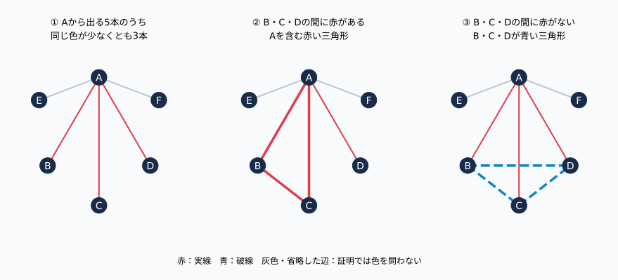
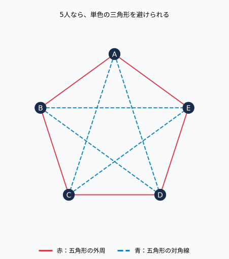
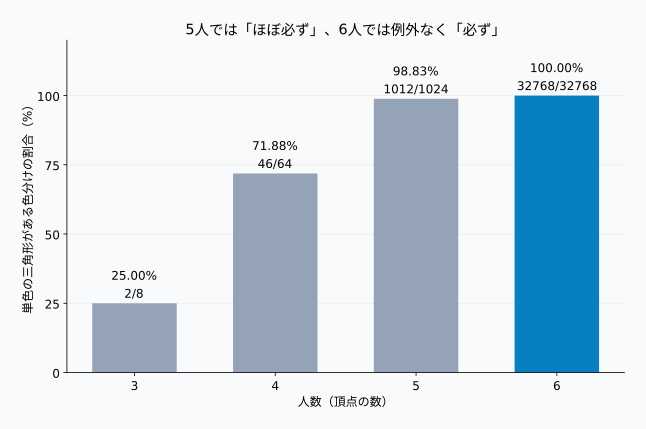
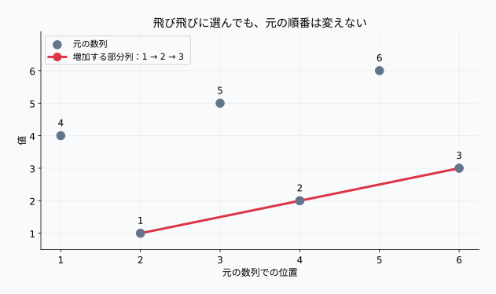

## 1. जब 6 लोग इकट्ठा होते हैं, तो हमेशा मिलता है 3 लोगों का एक समूह

मान लीजिए किसी पार्टी में 6 लोग इकट्ठा होते हैं। उनमें से कुछ पुराने परिचित हो सकते हैं, जबकि कुछ पहली बार मिल रहे हो सकते हैं। कौन किसको जानता है, यह संबंध कितना भी जटिल और उलझा हुआ क्यों न हो, फिर भी निम्नलिखित दो स्थितियों में से कोई एक अवश्य पाई जाएगी:

- **उस समूह के किन्हीं भी 2 व्यक्तियों को चुनें, वे आपस में एक-दूसरे के परिचित हों।**
- **उस समूह के किन्हीं भी 2 व्यक्तियों को चुनें, वे आपस में एक-दूसरे के परिचित न हों।**

यहाँ बात "अक्सर मिल जाने" की नहीं है। आप उनके बीच के संबंधों को चाहे जैसे भी व्यवस्थित करें, यह समूह बिना किसी अपवाद के अवश्य मिलेगा। इसके अलावा, 6 की यह संख्या न्यूनतम है। यदि केवल 5 लोग हों, तो ऐसी व्यवस्था बनाना संभव है जिसमें दोनों में से कोई भी 3 लोगों का समूह न बने।

यह छोटा सा आश्चर्य **रामसे सिद्धांत (Ramsey Theory)** का प्रवेश द्वार है। किसी बड़ी संरचना को चाहे कितनी भी जटिलता से क्यों न विभाजित किया जाए, यदि उसका आकार पर्याप्त रूप से बड़ा है, तो विशिष्ट शर्तों को पूरा करने वाली छोटी संरचनाओं से पूरी तरह बचना असंभव हो जाता है। यह सिद्धांत ऐसी ही "अपरिहार्य नियमितता" का अध्ययन करता है।

हालाँकि, इसका यह अर्थ नहीं है कि अव्यवस्था के भीतर अपनी मनपसंद कोई भी संरचना प्रकट हो जाएगी। जब तक हम यह परिभाषित नहीं करते कि वस्तुएँ क्या हैं, उन्हें कितने प्रकारों में वर्गीकृत किया जा रहा है, और हम किस आकृति की खोज कर रहे हैं, तब तक यह एक गणितीय दावा नहीं बनता। आइए सबसे पहले कागज़ पर 6 बिंदु बनाकर एक परिचित और सरल उदाहरण से शुरुआत करते हैं।

## 2. मानवीय संबंधों को लाल और नीली रेखाओं में बदलना

### मॉडल के नियम

इस लेख में, हम "परिचित" होने को एक सममित (symmetric) संबंध मानते हैं। यदि A, B को जानता है, तो B भी A को जानता है, और प्रत्येक जोड़ी को अनिवार्य रूप से या तो "परिचित" या "अपरिचित" के रूप में वर्गीकृत किया जा सकता है।

एकतरफा केवल नाम जानने वाले संबंध या जहाँ परिचित होने की स्थिति अस्पष्ट हो, उन्हें इस मॉडल में शामिल नहीं किया गया है। साथ ही, "अपरिचित" होने का अर्थ "नापसंद करना" या "शत्रुता" नहीं है।

हम प्रत्येक व्यक्ति को एक बिंदु (शीर्ष) और दो व्यक्तियों के संबंध को एक रेखा (किनारा) मानते हैं।

| आरेख का घटक | अर्थ |
|---|---|
| बिंदु (शीर्ष) | 1 प्रतिभागी |
| लाल ठोस रेखा | दोनों परस्पर परिचित हैं |
| नीली टूटी रेखा | दोनों परस्पर अपरिचित हैं |
| समान रंग की 3 भुजाओं वाला त्रिभुज | वह 3 व्यक्तियों का समूह जिसे हम खोज रहे हैं |

चूँकि सभी प्रतिभागियों के प्रत्येक जोड़े को आपस में जोड़ा जाता है, इसलिए यह एक **पूर्ण ग्राफ (Complete Graph)** है। $n$ शीर्षों वाले पूर्ण ग्राफ को $K_n$ लिखा जाता है, और किनारों (edges) की संख्या निम्नलिखित होती है:

$$
\binom{n}{2}=\frac{n(n-1)}{2}
$$

यदि 6 लोग हों, तो कुल 15 रेखाएँ होती हैं। केवल यह तथ्य कि "A, B और C को जानता है", यह गारंटी नहीं देता कि वे तीनों परस्पर परिचित हैं। इसके लिए B और C के बीच की रेखा का भी लाल होना आवश्यक है। याद रखें कि त्रिभुज की **तीनों भुजाओं** का रंग एक ही होना आवश्यक शर्त है।

इसके बाद, पूरी तरह से लाल या पूरी तरह से नीले त्रिभुज को हम **एकवर्णी त्रिभुज (Monochromatic Triangle)** कहेंगे। रंगों में अंतर पहचानना आसान बनाने के लिए, आरेखों में लाल रेखा को ठोस रेखा और नीली रेखा को टूटी रेखा के रूप में दर्शाया गया है।

## 3. 6 लोगों में यह हमेशा क्यों मौजूद होता है: प्रमाण

इस प्रमाण में प्रयुक्त एकमात्र उपकरण [कबूतर का घोंसला सिद्धांत (Pigeonhole Principle)](../pigeonhole-principle-hash-collision/) है। हम इस अत्यंत सरल तथ्य का उपयोग करते हैं: "यदि 5 वस्तुओं को 2 प्रकारों में विभाजित किया जाए, तो कम से कम एक प्रकार में 3 वस्तुएँ अवश्य होंगी।"

### चरण 1: केवल एक व्यक्ति पर ध्यान केंद्रित करना

6 लोगों में से, अपनी पसंद के किसी एक व्यक्ति को A मान लेते हैं। A से शेष 5 लोगों की ओर 5 रेखाएँ निकलती हैं। चूँकि प्रत्येक रेखा या तो लाल है या नीली, इसलिए समान रंग की कम से कम 3 रेखाएँ अवश्य होंगी:

$$
\left\lceil\frac{5}{2}\right\rceil=3
$$

यहाँ $\lceil x\rceil$ उस न्यूनतम पूर्णांक को दर्शाता है जो $x$ से बड़ा या उसके बराबर हो। इसे इस प्रकार भी समझा जा सकता है कि यदि लाल और नीली दोनों रेखाएँ 2 या उससे कम हों, तो कुल मिलाकर अधिकतम 4 रेखाएँ ही हो सकती हैं, जिससे 5 रेखाओं को रंगना संभव नहीं होगा।

मान लीजिए कि लाल रेखाएँ 3 या उससे अधिक हैं, और उनसे जुड़े 3 व्यक्तियों को B, C और D कहते हैं। इस प्रकार A–B, A–C और A–D सभी लाल हैं। (यदि शुरुआत में 3 या अधिक नीली रेखाएँ मिलती हैं, तो नीचे दिए गए तर्क में लाल और नीले रंग को आपस में बदलकर ठीक वही निष्कर्ष प्राप्त किया जा सकता है।)

### चरण 2: B, C और D के बीच के संबंधों को देखना

अब B–C, B–D और C–D की 3 रेखाओं पर विचार करें। यहाँ केवल दो ही स्थितियाँ संभव हैं:

**स्थिति ①: कम से कम एक लाल रेखा मौजूद है।** उदाहरण के लिए, यदि B–C लाल है, तो चूँकि A–B और A–C भी लाल हैं, इसलिए A, B और C मिलकर एक लाल त्रिभुज बनाते हैं। बाकी 2 रेखाओं का रंग चाहे जो भी हो, इससे कोई फर्क नहीं पड़ता।

**स्थिति ②: एक भी लाल रेखा मौजूद नहीं है।** इसका अर्थ है कि B–C, B–D और C–D तीनों रेखाएँ नीली हैं। इस स्थिति में, B, C और D मिलकर एक नीला त्रिभुज बनाते हैं।



आरेख में धूसर और छोड़े गए किनारे वे भाग हैं जिनके रंग को प्रमाण के लिए निर्धारित करने की आवश्यकता नहीं है। वास्तविक पूर्ण ग्राफ में, वे भी या तो लाल या नीले रंग से रंगे होते हैं।

इससे सिद्ध होता है कि रंगों के किसी भी विन्यास में एकवर्णी त्रिभुज अवश्य मौजूद होता है। हमें सभी 15 रेखाओं की जाँच करने की आवश्यकता नहीं पड़ी। **केवल 1 व्यक्ति से निकलने वाली 5 रेखाओं और उनके सिरों पर स्थित 3 लोगों के आपसी संबंधों से ही सभी संभावनाओं को सिद्ध कर दिया गया।** [विश्वविद्यालय पाठ्यसामग्री का विवरण](https://ximera.osu.edu/math/combinatorics/combinatoricsBook/combinatoricsBook/combinatorics/ramseyTheory/ramseyTheory)

## 4. केवल 5 लोग पर्याप्त क्यों नहीं हैं?

"6 लोग पर्याप्त हैं" और "6 न्यूनतम संख्या है", ये दो अलग-अलग दावे हैं। यह सिद्ध करने के लिए कि 6 ही न्यूनतम संख्या है, हमें 5 लोगों का एक ऐसा उदाहरण प्रस्तुत करना होगा जो इस शर्त को पूरा न करता हो (अर्थात एक प्रति-उदाहरण)।

5 लोगों को एक सम पंचभुज (regular pentagon) के शीर्षों पर व्यवस्थित करते हैं। आपस में सटे हुए पड़ोसियों, अर्थात् पंचभुज की बाहरी परिधि की 5 भुजाओं को लाल रंग में रंगते हैं। शेष 5 विकर्णों को नीले रंग में रंगते हैं।



यदि केवल लाल रंग को देखें, तो यह पंचभुज के चारों ओर का एक चक्र है। किन्हीं भी 3 लोगों को चुनने पर, केवल लाल भुजाओं से कोई बंद त्रिभुज नहीं बनाया जा सकता। यदि केवल नीले रंग को देखें, तो यह एक तारे के आकार जैसा दिखता है, लेकिन शीर्षों के क्रम को बदलकर देखने पर यह भी 5 शीर्षों का एक चक्र ही है। अतः नीले रंग में भी कोई त्रिभुज नहीं बनता।

ध्यान दें कि तारे के आकार में रेखाओं का प्रतिच्छेदन बिंदु कोई नया शीर्ष नहीं है। व्यक्तियों के अनुरूप केवल A से E तक के 5 बिंदु ही हैं। रेखाओं के एक-दूसरे को काटने से जो छोटे त्रिभुज दिखाई देते हैं, वे इस समस्या में गिने जाने वाले त्रिभुज नहीं हैं।

चूँकि लाल और नीले दोनों प्रकार के 3 लोगों के समूहों से बचना संभव है, इसलिए 5 लोगों में इसकी गारंटी नहीं दी जा सकती। "6 लोगों में यह अनिवार्य रूप से मौजूद है" के साथ मिलकर, यह निश्चित हो जाता है कि न्यूनतम संख्या 6 ही है।

## 5. इस "न्यूनतम आकार" को रामसे संख्या कहा जाता है

जब किसी पूर्ण ग्राफ के किनारों को लाल और नीले रंग में रंगा जाता है, तो लाल $K_s$ या नीला $K_t$ अनिवार्य रूप से प्रकट होने के लिए आवश्यक न्यूनतम शीर्षों की संख्या को **रामसे संख्या** $R(s,t)$ लिखा जाता है।

लाल $K_s$ का अर्थ है कि चुने गए $s$ शीर्षों के बीच के सभी किनारे लाल हैं। केवल लाल पथ से जुड़ा होना पर्याप्त नहीं है। चूँकि $K_3$ एक त्रिभुज है, इसलिए अब तक का निष्कर्ष निम्नलिखित एक पंक्ति में व्यक्त होता है:

$$
R(3,3)=6
$$

रामसे का प्रमेय बताता है कि किसी भी निश्चित परिमित $s, t$ के लिए, ऐसी परिमित संख्या का अस्तित्व हमेशा होता है। लेकिन "अस्तित्व होना" और "न्यूनतम मान को आसानी से ज्ञात कर पाना" दो अलग बातें हैं। भले ही त्रिभुज का प्रमाण छोटा और सरल हो, लेकिन जैसे ही हम बड़े एकवर्णी समूहों की तलाश करते हैं, गणना अत्यंत कठिन हो जाती है।

मूलभूत उपरि सीमा के लिए निम्नलिखित संबंध लागू होता है:

$$
R(s,t)\leq R(s-1,t)+R(s,t-1)
\qquad(s,t\geq3)
$$

दाएँ पक्ष को $N$ मानते हुए, $N$ शीर्षों में से किसी एक शीर्ष को चुनते हैं। यदि उस शीर्ष से लाल किनारों द्वारा जुड़े शीर्षों की संख्या $R(s-1,t)$ या उससे अधिक है, तो उनमें या तो एक लाल $K_{s-1}$ या एक नीला $K_t$ अवश्य मौजूद होगा। पहली स्थिति में, मूल शीर्ष को जोड़कर एक लाल $K_s$ बनाया जा सकता है। दूसरी स्थिति में, सीधे ही लक्ष्य प्राप्त हो जाता है।

यदि लाल किनारे इतने अधिक नहीं हैं, तो नीले किनारों से जुड़े शीर्षों की संख्या $R(s,t-1)$ या उससे अधिक होगी। वही तर्क विपरीत रंग के लिए भी लागू होता है। यह भी उसी प्रमाण का विस्तार है जहाँ "एक बिंदु पर ध्यान केंद्रित कर समान रंग के पड़ोसियों को एकत्रित" किया गया था।

सीमांत मानों $R(2,t)=t$ और $R(s,2)=s$ से शुरुआत करके, इस संबंध के माध्यम से क्रमशः परिमित उपरि सीमाएँ प्राप्त की जा सकती हैं। हालाँकि, चूँकि यह एक असमिका (inequality) है, इसलिए प्राप्त संख्या का न्यूनतम होना आवश्यक नहीं है। "जिस आकार की गारंटी दी जा सके" और "वास्तव में आवश्यक न्यूनतम मान" के बीच अंतर समझना महत्वपूर्ण है।

## 6. "लगभग हमेशा" और "बिना किसी अपवाद के हमेशा" में अंतर

अब एक प्रयोग के रूप में मान लेते हैं कि प्रत्येक किनारे को स्वतंत्र रूप से $1/2$ की प्रायिकता के साथ लाल या नीले रंग से रंगा जाता है। यह संभाव्यता मॉडल प्रमाण के लिए आवश्यक नहीं है, लेकिन परिणामों के अंतर को समझने में काफी सहायक है।

शीर्षों को A, B, C... नाम देकर गिनने पर, रंग भरने के कुल विन्यासों की संख्या निम्नलिखित होती है (घूर्णन या नाम बदलने से बनने वाले समान रूपों को भी अलग विन्यास के रूप में गिना जाता है):

$$
2^{\binom{n}{2}}
$$

6 लोगों के लिए यह संख्या $2^{15}=32768$ विन्यास होती है। 3 से 6 व्यक्तियों के लिए सभी संभावनाओं की जाँच करने पर निम्नलिखित परिणाम प्राप्त होते हैं:

| लोगों की संख्या | कुल रंग विन्यास | बिना एकवर्णी त्रिभुज के विन्यास | एकवर्णी त्रिभुज होने का अनुपात |
|---|---:|---:|---:|
| 3 लोग | 8 | 6 | 25.00% |
| 4 लोग | 64 | 18 | 71.88% |
| 5 लोग | 1024 | 12 | 98.83% |
| 6 लोग | 32768 | 0 | 100.00% |



5 लोगों के मामले में भी यादृच्छिक रूप से रंगने पर लगभग 98.83% संभावना होती है कि एकवर्णी त्रिभुज मिल जाए। यदि कोई केवल कुछ ही बार प्रयास करे, तो उसे लग सकता है कि "5 लोगों में भी यह हमेशा मौजूद होता है।" लेकिन 1024 विन्यासों में से 12 प्रति-उदाहरण अभी भी शेष रहते हैं। प्रायिकता का उच्च होना और एक भी प्रति-उदाहरण न होने के बीच एक स्पष्ट और मौलिक अंतर है।

यह तालिका स्वतंत्र और समान प्रायिकता के तहत रंगने के अनुपात को दर्शाती है। इसका यह अर्थ कतई नहीं है कि वास्तविक जीवन में परिचित होने के संबंध स्वतंत्र रूप से आधे-आधे होते हैं। दूसरी ओर, 6 व्यक्तियों का प्रमेय प्रायिकता पर निर्भर नहीं करता, इसलिए चाहे संबंध कितने भी विषम या एकतरफा क्यों न हों, यह हमेशा सत्य सिद्ध होता है।

### औसतन कितने त्रिभुज मिलते हैं?

किन्हीं निश्चित 3 शीर्षों के बीच 3 किनारे होते हैं, और उन्हें रंगने के 8 विन्यास संभव हैं। इनमें से सभी लाल या सभी नीले रंग के केवल 2 विन्यास एकवर्णी होते हैं, अतः इसकी प्रायिकता $1/4$ है। यदि एकवर्णी त्रिभुजों की संख्या को $T$ मानें, तो प्रत्याशा की रैखिकता से:

$$
E[T]=\binom{n}{3}\frac14
$$

होता है। 6 लोगों के लिए यह औसत 5 त्रिभुज है। चूँकि विभिन्न त्रिभुज आपस में किनारों को साझा करते हैं, इसलिए वे स्वतंत्र नहीं होते, लेकिन गणितीय प्रत्याशाओं को जोड़ने के लिए स्वतंत्रता की आवश्यकता नहीं होती।

हालाँकि, केवल औसत के धनात्मक होने का अर्थ यह नहीं है कि वह प्रत्येक रंग विन्यास में अवश्य उपस्थित होगा। 5 लोगों के लिए भी औसत 2.5 त्रिभुज है, फिर भी 0 त्रिभुज वाले प्रति-उदाहरण मौजूद हैं। "औसत" और "सबसे खराब स्थिति" को एक न समझना — यह भी एक महत्वपूर्ण दृष्टिकोण है जो रामसे सिद्धांत हमें सिखाता है।

## 7. Python द्वारा सभी 32,768 विन्यासों का सत्यापन

निम्नलिखित कोड केवल मानक लाइब्रेरी पर चलता है। लाल रंग को 0 और नीले रंग को 1 मानते हुए, प्रत्येक किनारे के रंग को बाइनरी संख्या के बिट्स से मैप किया गया है। कोड 3 शीर्ष चुनता है और जाँचता है कि उनके बीच के 3 किनारे समान रंग के हैं या नहीं।

```python
from itertools import combinations

def check_all(n):
    edges = list(combinations(range(n), 2))
    edge_index = {edge: i for i, edge in enumerate(edges)}
    triples = [
        [edge_index[e] for e in combinations(vertices, 2)]
        for vertices in combinations(range(n), 3)
    ]
    total = 1 << len(edges)
    without_triangle = 0
    minimum = len(triples)

    for coloring in range(total):
        count = 0
        for i, j, k in triples:
            if ((coloring >> i) & 1) == ((coloring >> j) & 1) == ((coloring >> k) & 1):
                count += 1
        without_triangle += (count == 0)
        minimum = min(minimum, count)

    return total, without_triangle, minimum

for n in range(3, 7):
    total, missing, minimum = check_all(n)
    print(f"{n} लोग: कुल {total} विन्यास, बिना त्रिभुज वाले {missing} विन्यास, न्यूनतम {minimum}")
```

```text
3 लोग: कुल 8 विन्यास, बिना त्रिभुज वाले 6 विन्यास, न्यूनतम 0
4 लोग: कुल 64 विन्यास, बिना त्रिभुज वाले 18 विन्यास, न्यूनतम 0
5 लोग: कुल 1024 विन्यास, बिना त्रिभुज वाले 12 विन्यास, न्यूनतम 0
6 लोग: कुल 32768 विन्यास, बिना त्रिभुज वाले 0 विन्यास, न्यूनतम 2
```

6 लोगों के मामले में "न्यूनतम 2" का परिणाम हमारे शुरुआती प्रमाण से थोड़ा अधिक सशक्त निष्कर्ष है। वास्तव में, यदि प्रत्येक शीर्ष पर लाल किनारों की संख्या $r_v$ और नीले किनारों की संख्या $b_v$ हो, तो $r_v+b_v=5$ और $r_vb_v\leq6$ होता है।

गैर-एकवर्णी त्रिभुज में ठीक दो शीर्ष ऐसे होते हैं जहाँ एक लाल और एक नीला किनारा मिलता है। इसलिए, यदि हम प्रत्येक शीर्ष पर "1 लाल और 1 नीले किनारे के जोड़ों" की गणना करते हैं, तो प्रत्येक गैर-एकवर्णी त्रिभुज को ठीक दो बार गिना जाता है। चूँकि कुल त्रिभुजों की संख्या 20 है, अतः:

$$
T=\binom63-\frac12\sum_{v=1}^{6}r_vb_v
\geq20-\frac12\cdot6\cdot6=2
$$

इस प्रकार यह सिद्ध होता है। इसके अतिरिक्त, यदि 6 शीर्षों को 3-3 के दो समूहों में विभाजित किया जाए, और प्रत्येक समूह के आंतरिक किनारों को लाल तथा समूहों के बीच के किनारों को नीला कर दिया जाए, तो ठीक दो लाल त्रिभुज और शून्य नीले त्रिभुज बनते हैं। अतः न्यूनतम मान 2 भी पूर्णतः सटीक है।

यह संपूर्ण गणना कम संख्या के लिए प्रभावी है, लेकिन रंग विन्यासों की कुल संख्या $2^{n(n-1)/2}$ की दर से बढ़ती है। व्यक्तियों की संख्या बढ़ाने पर यही कोड बहुत धीमा हो जाता है, इसलिए यहाँ इसे 3 से 6 व्यक्तियों तक ही सीमित रखा गया है। आरेख और विस्तृत वितरण को [पुनरुत्पादन स्क्रिप्ट](generate_graphs.py) और [गणना परिणाम JSON](calculation-results.json) में देखा जा सकता है।

## 8. अनुप्रयोग ①: नेटवर्क में "पूर्णतः जुड़े" या "पूर्णतः असंबद्ध" समूह

आइए "परिचित" शब्द को उपकरणों के बीच के सीधे कनेक्शन से बदल कर देखें। मान लीजिए 6 उपकरण हैं, और प्रत्येक जोड़ी में या तो "सीधा कनेक्शन है" या "सीधा कनेक्शन नहीं है"। यदि कनेक्शन अदिश (undirected) है, तो ठीक यही प्रमेय सीधे लागू होता है।

इसका परिणाम यह होता है कि या तो ऐसे 3 उपकरणों का समूह अवश्य होगा जिनके सभी जोड़ों के बीच सीधा कनेक्शन हो, या फिर ऐसे 3 उपकरणों का समूह अवश्य होगा जिनके किसी भी जोड़े के बीच सीधा कनेक्शन न हो। पहला समूह 3 शीर्षों का **क्लीक** (clique) कहलाता है, और दूसरा 3 शीर्षों का **स्वतंत्र समुच्चय** (independent set) कहलाता है। यहाँ "सीधा कनेक्शन नहीं है" का अर्थ यह नहीं है कि वे किसी अन्य उपकरण के माध्यम से संचार नहीं कर सकते।

यह दृष्टिकोण उन कार्यों में उपयोगी है जहाँ जोड़ों के बीच अनुकूलता या प्रतिकूलता तय की जाती है, साथ ही छोटे नेटवर्कों के डिज़ाइन सत्यापन में भी। यदि कोई यह शर्त रखे कि "हम परस्पर अनुकूल 3 कार्यों और परस्पर प्रतिकूल 3 कार्यों, दोनों से बचना चाहते हैं", तो 6 तत्वों के होने पर खोज शुरू करने से पहले ही यह स्पष्ट हो जाता है कि ऐसा करना गणितीय रूप से असंभव है।

हालाँकि, यह प्रमेय यह नहीं चुनता कि दोनों में से कौन सी स्थिति सामने आएगी। संभव है कि आपको परस्पर अनुकूल 3 कार्य चाहिए हों, लेकिन केवल परस्पर प्रतिकूल 3 कार्य ही मिलें। साथ ही, जोड़ों के स्तर पर अनुकूल होने के बावजूद 3 कार्य एक साथ निष्पादित करने के लिए संसाधन अपर्याप्त हो सकते हैं — ऐसी शर्तों की अलग से जाँच करनी होगी। इस प्रमेय की गारंटी केवल दिए गए द्विपक्षीय संबंधों तक ही सीमित है।

## 9. अनुप्रयोग ②: अव्यवस्थित संख्या अनुक्रम से बढ़ते या घटते क्रम निकालना

मान लीजिए परस्पर भिन्न 6 संख्याएँ किसी क्रम में रखी गई हैं। जब स्थिति $i$, स्थिति $j$ से पहले आती है, तब यदि $a_i\lt a_j$ हो तो हम उन दो स्थितियों को लाल रेखा से जोड़ते हैं, और यदि $a_i\gt a_j$ हो तो नीली रेखा से जोड़ते हैं।

यह भी 6 शीर्षों वाले पूर्ण ग्राफ का 2 रंगों में विभाजन ही है। अतः एकवर्णी त्रिभुज अवश्य उपस्थित होगा। यदि उन 3 स्थितियों को बढ़ते क्रम में $i\lt j\lt k$ मानें, तो लाल त्रिभुज होने पर:

$$
a_i\lt a_j\lt a_k
$$

और नीले त्रिभुज होने पर:

$$
a_i\gt a_j\gt a_k
$$

होगा। अर्थात्, यह सिद्ध होता है कि **मूल क्रम को बनाए रखते हुए, 3 बढ़ते हुए पदों या 3 घटते हुए पदों को अवश्य निकाला जा सकता है।** इन पदों का निरंतर होना आवश्यक नहीं है। इस प्रकार क्रम बदले बिना चुने गए तत्वों के समूह को उप-अनुक्रम (subsequence) कहा जाता है।



आरेख में दिए गए अनुक्रम $4,1,5,2,6,3$ में, 2री, 4थी और 6ठी स्थिति को चुनने पर $1,2,3$ प्राप्त होता है। यह संख्याओं को छोटे से बड़े क्रम में पुनर्व्यवस्थित करके नहीं, बल्कि उनके मूल क्रम को बनाए रखते हुए चुना गया है।

यह अवधारणा डेटा अनुक्रमों के भीतर नियमित उप-संरचनाओं को खोजने के विचार से जुड़ती है। हालाँकि, चुने गए 3 बिंदुओं के बढ़ते क्रम में होने का यह अर्थ नहीं है कि संपूर्ण डेटा श्रृंखला में वृद्धि की प्रवृत्ति है। यदि कोई पैटर्न किसी भी अनुक्रम में अनिवार्य रूप से पाया ही जाता है, तो केवल उसकी उपस्थिति किसी विशेष घटना का प्रमाण नहीं हो सकती।

उल्लेखनीय है कि इस अनुक्रम की समस्या में 6 पद न्यूनतम सीमा नहीं हैं; वास्तव में 5 परस्पर भिन्न पदों में भी लंबाई 3 के बढ़ते या घटते उप-अनुक्रम की गारंटी होती है। यह एर्डॉस-सेकेरेस एकदिष्ट उप-अनुक्रम प्रमेय का एक विशेष मामला है। अनुक्रम से बनने वाले रंग-विभाजन में क्रम संबंधों की अंतर्निहित बाधाएँ होती हैं, जिसके कारण मनमाने 2-रंग विभाजन की तुलना में अधिक सशक्त परिणाम प्राप्त होते हैं। [एकदिष्ट उप-अनुक्रमों पर व्याख्यान सामग्री](https://ywigderson.math.ethz.ch/math/static/pcmi2025/Notes10.pdf)

## 10. निष्कर्ष: अव्यवस्था में भी अपरिहार्य संरचनाएँ होती हैं

6 व्यक्तियों के संबंधों को लाल और नीले रंग में बदलकर, केवल एक व्यक्ति से निकलने वाली 5 रेखाओं पर ध्यान केंद्रित करने मात्र से यह सिद्ध हो गया कि एकवर्णी त्रिभुज अवश्य मिलता है। 5 लोगों का पंचभुज एक प्रति-उदाहरण प्रस्तुत करता है, अतः रामसे संख्या $R(3,3)=6$ है।

याद रखने योग्य मुख्य तीन बातें निम्नलिखित हैं:

- **"अनिवार्य रूप से" का अर्थ यादृच्छिक प्रयोगों में "उच्च प्रायिकता" होना नहीं है।** 5 लोगों में लगभग 98.83% संभावना के बावजूद प्रति-उदाहरण शेष रहते हैं, जबकि 6 लोगों में एक भी नहीं बचता।
- **नियम की उपस्थिति और उस नियम का वास्तविक अर्थ दो अलग बातें हैं।** केवल एकवर्णी त्रिभुज या बढ़ते उप-अनुक्रम की उपस्थिति से पूरे समूह की समग्र प्रकृति या कार्य-कारण संबंध निर्धारित नहीं होते।
- **प्रत्येक गारंटी का एक निश्चित दायरा और शर्तें होती हैं।** यह स्पष्ट होना चाहिए कि संबंध सममित हैं या नहीं, क्या सभी जोड़ों को दो श्रेणियों में विभाजित किया जा सकता है, और हम किस प्रकार की उप-संरचना की तलाश कर रहे हैं।

रामसे सिद्धांत का सौंदर्य इसमें नहीं है कि कोई जटिल समग्र संरचना सरल बन जाती है। संपूर्ण तंत्र जटिल बने रहने पर भी, उसके भीतर की छोटी नियमितताओं को पूरी तरह समाप्त नहीं किया जा सकता। कागज़ पर खींची गई चंद रेखाओं के माध्यम से हम इस विचार की पुष्टि कर सकते हैं।

### संदर्भ सामग्री

- Ohio State University, [Ramsey Theory](https://ximera.osu.edu/math/combinatorics/combinatoricsBook/combinatoricsBook/combinatorics/ramseyTheory/ramseyTheory): किनारों के 2-रंग विभाजन और छोटी रामसे संख्याओं की व्याख्या।
- Yuval Wigderson, PCMI 2025, [Extremal graph theory and Ramsey theory: Lecture 10](https://ywigderson.math.ethz.ch/math/static/pcmi2025/Notes10.pdf): एकदिष्ट उप-अनुक्रमों सहित रामसे-शैली के विचारों पर व्याख्यान सामग्री।

इस लेख के आरेख, संपूर्ण गणना तालिका, प्रायिकता और त्रिभुज वितरण संलग्न Python स्क्रिप्ट द्वारा उत्पन्न किए गए हैं।
