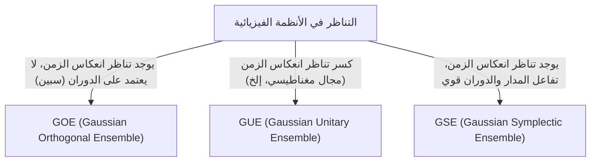

# مقدمة: العالمية المذهلة لنظرية المصفوفات العشوائية

يبدو العالم معقدًا ولا يمكن التنبؤ به، ولكن عندما ننظر من خلال عدسة الرياضيات، يمكننا أحيانًا العثور على قواسم مشتركة مذهلة في مجالات مختلفة تمامًا. "نظرية المصفوفات العشوائية (Random Matrix Theory, RMT)" هي بالضبط أحد هذه الأطر الرياضية التي تتمتع بمثل هذه العالمية.

المصفوفة العشوائية هي مصفوفة يتم إعطاء عناصرها بواسطة متغيرات عشوائية. للوهلة الأولى، قد تبدو مجرد ترتيب عشوائي للأرقام، ولكن عندما نقترب بحجم المصفوفة إلى اللانهاية، يظهر في توزيع قيمها الذاتية قانون عالمي وجميل بشكل مدهش. هذا القانون يكمن وراء أنظمة مختلفة تمامًا، بدءًا من العالم المجهري للنوى الذرية، إلى لغز توزيع الأعداد الأولية، وتقلبات الأسعار في الأسواق المالية، ووصولاً إلى ديناميكيات التعلم في أحدث نماذج التعلم العميق.

في هذه المقالة، سنبدأ بالخلفية التاريخية لنظرية المصفوفات العشوائية، ونشرح أساسياتها الرياضية من خلال تصنيف المجموعات مثل GOE/GUE/GSE، والإثبات الرياضي لقانون نصف الدائرة لفيغنر، وحتى الارتباط غير المتوقع بدالة زيتا لريمان. في النصف الثاني، سنتعمق في التطبيقات الحديثة، مثل تحسين المحافظ في الهندسة المالية ومشكلة تهيئة الأوزان في الذكاء الاصطناعي والتعلم العميق، مع تضمين تصورات عملية باستخدام كود Python.

---

# 1. الولادة من الفيزياء: فيغنر ولغز النوى الذرية الثقيلة

تعود جذور نظرية المصفوفات العشوائية إلى فيزياء النوى الذرية في الخمسينيات من القرن الماضي. في ذلك الوقت، كان الفيزيائيون يكافحون من أجل فهم مستويات الطاقة (قيم الطاقة التي يمكن أن تتخذها الحالة الميكانيكية الكمومية) للنوى الذرية الثقيلة مثل اليورانيوم.

## مستويات الطاقة لنواة اليورانيوم

بالنسبة للنوى الذرية الخفيفة، يمكن التنبؤ بمستويات الطاقة بدقة عن طريق حساب تفاعل البروتونات والنيوترونات وفقًا لمعادلة شرودنغر. ومع ذلك، في النوى الثقيلة مثل اليورانيوم (العدد الكتلي 238 وما إلى ذلك)، حيث يتفاعل عدد كبير من النيوكليونات بشكل معقد، تكون درجات الحرية كبيرة جدًا بحيث تكون الحسابات الدقيقة مستحيلة عمليًا.

بالنظر إلى بيانات تشتت النيوترونات التي تمت ملاحظتها تجريبيًا، بدت مستويات طاقة الرنين وكأنها مصطفة بشكل فوضوي. ومع ذلك، عند فحص التوزيع الإحصائي لـ "التباعد (spacing)" بين مستويات الطاقة، وجدوا أن هناك نمطًا واضحًا. كانت لمستويات الطاقة المتجاورة خاصية "تنافر المستويات (level repulsion)" حيث لا تقترب أبدًا من بعضها البعض بشكل مفرط.

## حدس فيغنر واكتشاف قانون نصف الدائرة

في عام 1955، اقترح يوجين فيغنر (Eugene Wigner) فكرة جريئة لنمذجة الهاميلتوني (المصفوفة التي تمثل الطاقة) لهذا النظام الكمي المعقد ليس كمصفوفة محددة ذات بنية فيزيائية مفصلة، بل كـ "مصفوفة متماثلة ضخمة تأخذ عناصرها قيمًا عشوائية".

بشكل مدهش، تطابق توزيع التباعد بين القيم الذاتية لهذه المصفوفة العشوائية المبسطة للغاية بشكل مثالي مع توزيع التباعد بين مستويات الطاقة لنواة اليورانيوم الفعلية. اكتشف فيغنر أيضًا أنه في النهاية عندما يتجه حجم المصفوفة $N$ إلى اللانهاية، يصبح توزيع الكثافة الإجمالي للقيم الذاتية على شكل نصف دائرة. هذا هو "قانون نصف الدائرة لفيغنر (Wigner's semicircle law)" الشهير.

---

# 2. تصنيف المجموعات: GOE، GUE، GSE

بناءً على أبحاث فيغنر، قام فريمان دايسون (Freeman Dyson) بتنظيم نظرية المصفوفات العشوائية وصنف المصفوفات العشوائية إلى 3 فئات عالمية (مجموعات - Ensembles) بناءً على التناظر الذي يمتلكه النظام الفيزيائي. تُعرف هذه باسم "طريق دايسون الثلاثي (Dyson's threefold way)".



## المجموعة المتعامدة الغاوسية (GOE)

GOE هي مجموعة من المصفوفات المتماثلة الحقيقية التي تتكون عناصرها من أعداد حقيقية. يتم اختيار كل عنصر غير قطري بشكل مستقل من توزيع طبيعي بمتوسط 0 وتباين 1، ويتم اختيار العناصر القطرية من توزيع طبيعي بمتوسط 0 وتباين 2. تُستخدم GOE لنمذجة الهاميلتوني للأنظمة الكمومية (على سبيل المثال، نظام من الجسيمات بدون دوران) حيث لا يوجد مجال مغناطيسي خارجي ويتم الحفاظ على تناظر انعكاس الزمن.

## المجموعة الوحدوية الغاوسية (GUE)

GUE هي مجموعة من المصفوفات الهيرميتية التي تتكون عناصرها من أعداد مركبة. تتبع الأجزاء الحقيقية والتخيلية للعناصر غير القطرية توزيعات طبيعية مستقلة. تُطبق على الأنظمة الفيزيائية حيث يتم كسر تناظر انعكاس الزمن، كما هو الحال عند وجود مجال مغناطيسي خارجي. مجموعة GUE هي التي لها علاقة عميقة بتوزيع أصفار دالة زيتا لريمان، والتي سيتم وصفها لاحقًا.

## المجموعة السمبلكتية الغاوسية (GSE)

GSE هي مجموعة من المصفوفات الهيرميتية ذاتية الازدواج والتي تتكون عناصرها من الكواتيرنيونات (Quaternions). تصف الأنظمة التي تتكون من جسيمات ذات دوران نصف صحيح (سبين) وحيث يكون تفاعل الدوران والمدار قويًا، مع الحفاظ على تناظر انعكاس الزمن.

---

# 3. الهاوية الرياضية: إثبات قانون نصف الدائرة لفيغنر

سنستعرض عملية إثبات قانون نصف الدائرة لفيغنر، وهو النتيجة الأساسية لنظرية المصفوفات العشوائية، باستخدام طريقة العزوم (Method of Moments).

نعتبر مصفوفة متماثلة حقيقية $X$ بحجم $N \times N$ عناصرها $X_{ij}$ مستقلة عن بعضها البعض ومتغيرات عشوائية بمتوسط 0 وتباين 1. سنسعى لإيجاد نهاية ($N \to \infty$) توزيع القيم الذاتية للمصفوفة المقاسة $W = \frac{1}{\sqrt{N}}X$.

## نهج طريقة العزوم

لتحليل دالة التوزيع التجريبية للقيم الذاتية، سنحسب العزم (moment) من الدرجة $k$ للتوزيع $m_k$. نظرًا لأن أثر المصفوفة (Trace، مجموع العناصر القطرية) يساوي مجموع القيم الذاتية، فإننا نقيم:
$$ m_k = \lim_{N \to \infty} \frac{1}{N} \mathbb{E}[\text{Tr}(W^k)] $$

عند توسيع الأثر (Trace)، نحصل على:
$$ \text{Tr}(W^k) = \frac{1}{N^{k/2}} \sum_{i_1, i_2, \dots, i_k} X_{i_1 i_2} X_{i_2 i_3} \cdots X_{i_k i_1} $$
عند أخذ القيمة المتوقعة، وبما أن العناصر $X_{ij}$ مستقلة ومتوسطها 0، فإن المصطلحات في التوسع التي يظهر فيها نفس العنصر مرة واحدة فقط سيكون لها قيمة متوقعة قدرها 0. لكي يكون هناك مساهمة غير صفرية، يجب عبور كل حافة على المسار $i_1 \to i_2 \to \dots \to i_k \to i_1$ مرتين على الأقل.

في النهاية $N \to \infty$، المساهمة الرئيسية تأتي من المسارات التي تتكون بالضبط من $k$ خطوة، والتي تشكل هيكل "شجرة (tree)" حيث نستكشف رؤوسًا جديدة ونعود عبر الحواف المارة مرة واحدة بالضبط. هذا ممكن فقط إذا كان $k$ زوجيًا ($k = 2m$)، والعزوم ذات الدرجة الفردية تصبح 0 في النهاية.

## الرابط بين أعداد كاتالان وقانون نصف الدائرة

العدد الإجمالي لمثل هذه المسارات (مسارات ديك - Dyck paths) ذات الطول $2m$ يُعطى بواسطة "أعداد كاتالان (Catalan numbers)" الشهيرة في التوافقيات $C_m$:
$$ C_m = \frac{1}{m+1} \binom{2m}{m} $$

لذلك، فإن عزوم التوزيع النهائي هي:
$$ m_{2m} = C_m, \quad m_{2m+1} = 0 $$
يُعرف التوزيع الاحتمالي الذي يمتلك هذه العزوم بأنه توزيع نصف دائري (قانون نصف الدائرة لفيغنر) مدعوم على الفاصل $[-2, 2]$. دالة كثافة الاحتمال الخاصة به هي كما يلي:
$$ \rho(x) = \begin{cases} \frac{1}{2\pi} \sqrt{4 - x^2} & (-2 \le x \le 2) \\ 0 & (\text{otherwise}) \end{cases} $$

---

# 4. لقاء غير متوقع مع دالة زيتا لريمان

نظرية المصفوفات العشوائية، التي ولدت لحل مشاكل في الفيزياء، أدت في السبعينيات إلى اكتشاف عظيم في مجال الرياضيات البحتة، وخاصة نظرية الأعداد.

## حدسية مونتغومري-أودليزكو

في عام 1972، كان عالم نظرية الأعداد هيو مونتغومري (Hugh Montgomery) يدرس توزيع التباعد بين الأصفار غير التافهة لدالة زيتا لريمان. وفقًا لفرضية ريمان، تقع جميع هذه الأصفار على "الخط الحرج (الخط ذو الجزء الحقيقي 1/2)" في المستوى المركب. قام مونتغومري بحساب دالة ارتباط أزواج الأصفار واشتق أنها تساوي $1 - \left(\frac{\sin(\pi x)}{\pi x}\right)^2$.

في أحد الأيام، خلال وقت الشاي في معهد الدراسات المتقدمة في برينستون، أخبر مونتغومري الفيزيائي فريمان دايسون بهذه النتيجة. ذُهل دايسون. لأن هذه الصيغة الرياضية كانت مطابقة تمامًا لتوزيع التباعد بين القيم الذاتية لـ GUE (المجموعة الوحدوية الغاوسية) الذي اشتقه دايسون نفسه.

## تقاطع الأعداد الأولية والفوضى الكمومية

في وقت لاحق، استخدم عالم الرياضيات أندرو أودليزكو (Andrew Odlyzko) أجهزة الكمبيوتر العملاقة لحساب ملايين الأصفار لدالة زيتا، وأثبت أن توزيع تباعدها يتطابق مع تنبؤات GUE بدقة مذهلة.

يُعرف هذا الاكتشاف باسم "حدسية مونتغومري-أودليزكو"، ويشير إلى وجود صلة عالمية عميقة بين توزيع الأعداد الأولية (حيث ترتبط أصفار دالة زيتا ارتباطًا وثيقًا بتوزيع الأعداد الأولية) وأنظمة الفوضى الكمومية (GUE). كانت هذه هي اللحظة التي تقاطعت فيها الرياضيات التي تصف القوانين الميكروية للكون مع الرياضيات التي تحكم الأعداد الأولية، لبنات بناء الأعداد، من خلال نقطة اتصال المصفوفات العشوائية.

---

# 5. التطبيقات في الهندسة المالية: تطور تحسين المحافظ

لا تقتصر نظرية المصفوفات العشوائية على الفيزياء والرياضيات البحتة، بل تُطبق أيضًا كأداة قوية في تحليل الأسواق المالية. على وجه الخصوص، تلعب دورًا مهمًا في تحسين إدارة الأصول.

## حدود نموذج ماركويتز

في نموذج المتوسط-التباين لهاري ماركويتز (Harry Markowitz)، وهو أساس نظرية المحفظة الحديثة، يتم استخدام معكوس مصفوفة التغاير للأصول لتحديد نسبة الاستثمار المثلى. ومع ذلك، كانت هناك مشكلة كبيرة في الممارسة العملية.

عند تقدير مصفوفة التغاير لعينة من بيانات العوائد لـ $N$ من الأصول على مدى فترات $T$ السابقة، إذا كان $N$ كبيرًا ولم يكن $T$ كافيًا (بحيث لا يمكن القول إن $N/T$ يقترب من الصفر)، فإن مصفوفة التغاير للعينة ستحتوي على قدر كبير من الضوضاء الإحصائية (الضجيج). عندما يتم حساب معكوس هذه المصفوفة المليئة بالضوضاء، تتضخم الأخطاء وتتولد محافظ غير واقعية ومتطرفة (تأمر باتخاذ مراكز شراء أو بيع متطرفة في بعض الأصول).

## تنظيف الضوضاء باستخدام المصفوفات العشوائية

هنا يأتي دور نظرية المصفوفات العشوائية. في عام 1999، قام بوشو (Bouchaud) وآخرون ولالو (Laloux) وآخرون بتطبيق نظرية المصفوفات العشوائية بشكل مستقل على مصفوفات التغاير في الأسواق المالية. قاموا بمقارنة توزيع القيم الذاتية لمصفوفة التغاير التي تم الحصول عليها من بيانات السلاسل الزمنية العشوائية بالكامل (توزيع مارشينكو-باستور، Marchenko-Pastur distribution) مع توزيع القيم الذاتية لمصفوفة التغاير لبيانات السوق الفعلية.

ونتيجة لذلك، وجدوا أن الغالبية العظمى (أكثر من 90٪) من القيم الذاتية لبيانات السوق تقع ضمن الحدود النظرية التي تنبأت بها نظرية المصفوفات العشوائية. وبعبارة أخرى، هذه مجرد "ضوضاء". من ناحية أخرى، تبين أن العدد القليل من القيم الذاتية الكبيرة التي تتجاوز الحدود بشكل كبير هي التي تحمل معلومات ذات مغزى تعكس بنية الارتباط الحقيقية للسوق (عوامل السوق أو عوامل القطاع).

بناءً على هذه المعرفة، تم تطوير تقنيات لتصفية القيم الذاتية المقابلة للضوضاء (على سبيل المثال، تعيينها إلى الصفر، أو استبدالها بمتوسط القيمة) من أجل "تنظيف" مصفوفة التغاير. وقد أدى هذا إلى تحسين أداء واستقرار المحافظ بشكل كبير، ويُستخدم الآن كتقنية قياسية في العديد من الصناديق الكمية (Quants).

---

# 6. التطبيقات في الذكاء الاصطناعي: الأوزان وديناميكيات التعلم في التعلم العميق

في السنوات الأخيرة، برزت نظرية المصفوفات العشوائية أيضًا في التحليل النظري للذكاء الاصطناعي والتعلم الآلي، وخاصة التعلم العميق (Deep Learning).

## مشكلة التهيئة في الشبكات العصبية

عند تدريب شبكة عصبية ضخمة، فإن كيفية تحديد القيم الأولية لمصفوفة الأوزان الخاصة بالشبكة هي مسألة بالغة الأهمية تحدد نجاح أو فشل التعلم. إذا كانت التهيئة غير مناسبة، سيحدث تلاشي التدرج (Gradient Vanishing) أو انفجار التدرج (Gradient Exploding)، ولن يتقدم التعلم.

عندما تتم تهيئة مصفوفة الأوزان بقيم عشوائية، فهي في الحقيقة مصفوفة عشوائية. باستخدام نظرية المصفوفات العشوائية، يمكن تحليل انتقال التباين للإشارة عبر الطبقات وسلوك التدرج في الانتشار العكسي بدقة. على سبيل المثال، من خلال تحليل تأثير دوال التنشيط غير الخطية على الطيف (توزيع القيم الذاتية) للمصفوفة العشوائية، تم تبرير الشرعية النظرية لطرق التهيئة القياسية الحديثة مثل تهيئة Xavier وتهيئة He.

## توزيع القيم الذاتية للهيسيان (Hessian)

لفهم ديناميكيات عملية التعلم، من الضروري تحليل مصفوفة الهيسيان، التي تمثل انحناء دالة الخسارة. إن الهيسيان الخاص بالنماذج اللغوية الكبيرة (LLMs) ذات عشرات الملايين إلى مئات المليارات من المعلمات هو مصفوفة ضخمة، ومن الصعب فحص خصائصها بشكل مباشر، ولكن يمكن تقريب التنبؤ بتوزيع قيمها الذاتية باستخدام نظرية المصفوفات العشوائية.

وفقًا للأبحاث، يُعرف أن توزيع القيم الذاتية لهيسيان الشبكات العصبية العميقة يتكون من الجزء الأكبر (Bulk، كمية كبيرة من القيم الذاتية القريبة من الصفر) وعدد قليل من القيم المتطرفة (Outliers) الكبيرة. يمكن نمذجة الجزء الأكبر كمصفوفة عشوائية تحتوي على ضوضاء (على سبيل المثال، الاتجاهات ذات المعلومات القليلة)، في حين تمثل القيم المتطرفة اتجاهات التعلم المهمة المرتبطة بشكل مباشر بالمهمة. يوفر فهم هذا الهيكل الطيفي رؤى مفيدة للغاية لتحسين تقارب خوارزميات التحسين (SGD، Adam، إلخ) وتحسين جداول معدل التعلم.

---

# 7. الممارسة: تصور توزيع القيم الذاتية باستخدام Python

أخيرًا، دعونا نستخدم Python لإنشاء GOE (المجموعة المتعامدة الغاوسية) فعليًا ونؤكد عدديًا أن قانون نصف الدائرة لفيغنر ينطبق.

```python
import numpy as np
import matplotlib.pyplot as plt
from scipy.stats import semicircular

# パラメータ設定
N = 1000  # 行列のサイズ
num_matrices = 50  # アンサンブルのサンプル数

eigenvalues = []

# GOE行列の生成と固有値の計算
for _ in range(num_matrices):
    # 要素がN(0, 1)に従うN x N行列を生成
    X = np.random.randn(N, N)
    # 対称化してGOE行列を作成 (分散のスケーリングに注意)
    A = (X + X.T) / np.sqrt(2)
    # 分散を 1/N にスケーリング
    W = A / np.sqrt(N)
    
    # 固有値を計算（実対称行列なのでeighを使用）
    eigvals = np.linalg.eigh(W)[0]
    eigenvalues.extend(eigvals)

# プロットの設定
plt.figure(figsize=(10, 6))

# 固有値のヒストグラムをプロット
plt.hist(eigenvalues, bins=100, density=True, alpha=0.6, color='skyblue', edgecolor='black', label='Empirical Eigenvalues (GOE)')

# 理論的なウィグナーの半円則をプロット
x = np.linspace(-2.2, 2.2, 1000)
# 半径 R=2 の半円則の確率密度関数
y = np.where(np.abs(x) <= 2, np.sqrt(4 - x**2) / (2 * np.pi), 0)
plt.plot(x, y, 'r-', lw=3, label="Wigner's Semicircle Law")

plt.title(f"Eigenvalue Distribution of GOE Matrices ($N={N}$)", fontsize=16)
plt.xlabel("Eigenvalue", fontsize=14)
plt.ylabel("Density", fontsize=14)
plt.legend(fontsize=12)
plt.grid(True, alpha=0.3)
plt.tight_layout()
plt.show()
```

عند تنفيذ هذا الكود، يمكنك التأكد من أن القيم الذاتية للمصفوفات التي تم إنشاؤها عشوائيًا يتم توزيعها في شكل نصف دائري جميل. على الرغم من أن العناصر الفردية للمصفوفة عشوائية تمامًا، فإن حقيقة ظهور مثل هذا القانون المنظم ككل هي أعظم جاذبية لنظرية المصفوفات العشوائية.

---

# الخاتمة

في هذا المقال، تتبعنا القصة الملحمية لنظرية المصفوفات العشوائية، التي بدأت من الفيزياء النووية، وامتدت إلى الرياضيات البحتة، والهندسة المالية، وصولاً إلى تقنيات الذكاء الاصطناعي الحديثة. إن حقيقة أن الأنظمة المعقدة التي تبدو غير مرتبطة يمكن أن تتحدث بلغة مشتركة وهي "القيم الذاتية للمصفوفات العشوائية" في الحالات القصوى، تُظهر العمق الغامض الذي تتمتع به الطبيعة والرياضيات.

في العصر الحديث حيث تتزايد البيانات بشكل انفجاري وتستمر النماذج في النمو بشكل كبير، تطورت نظرية المصفوفات العشوائية من مجرد موضوع في الرياضيات المجردة إلى سلاح قوي لحل المشكلات العملية في علم البيانات والتعلم الآلي. هذه النظرية، التي تستكشف الحقيقة العالمية الكامنة وراء الأنظمة المعقدة، ستستمر في كونها نورًا يعمق فهمنا في مختلف المجالات في المستقبل.
