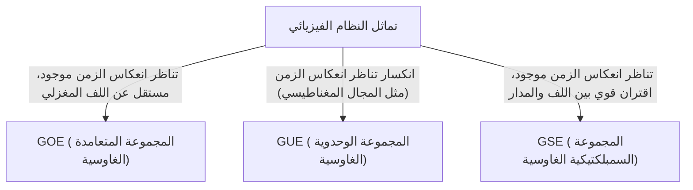

# مقدمة: العالمية المذهلة لنظرية المصفوفة العشوائية

قد يبدو العالم معقداً ولا يمكن التنبؤ به، ولكن من خلال عدسة الرياضيات، نجد أحياناً قواسم مشتركة مذهلة عبر مجالات مختلفة تماماً. "نظرية المصفوفة العشوائية (Random Matrix Theory, RMT)" هي بالضبط أحد تلك الأطر الرياضية التي تتمتع بهذه العالمية.

المصفوفة العشوائية هي مصفوفة تُعطى عناصرها بواسطة متغيرات عشوائية. للوهلة الأولى، إنها مجرد مصفوفة عشوائية من الأرقام، ولكن مع اقتراب حجم المصفوفة من اللانهاية، يظهر قانون جميل وعالمي بشكل مذهل في توزيع [القيم الذاتية (eigenvalues)](/p/eigenvalues-and-eigenvectors/) الخاصة بها. يكمن هذا القانون خلف أنظمة مختلفة تماماً، من العالم المجهري للنوى الذرية، وألغاز توزيع الأعداد الأولية، وتقلبات الأسعار في الأسواق المالية، إلى ديناميكيات التعلم لأحدث نماذج التعلم العميق.

في هذا المقال، بدءاً من الخلفية التاريخية لنظرية المصفوفة العشوائية، سنشرح أساسها الرياضي مثل تصنيف المجموعات (GOE/GUE/GSE)، والإثبات الرياضي لقانون نصف الدائرة لفيغنر، وحتى ارتباطها غير المتوقع بدالة زيتا لريمان. في النصف الثاني، سنتعمق في التطبيقات الحديثة، مثل تحسين المحفظة في الهندسة المالية ومشكلة تهيئة الأوزان في الذكاء الاصطناعي والتعلم العميق، مصحوبة بتصورات عملية باستخدام كود Python.

---

# 1. وُلدت من الفيزياء: فيغنر ولغز النوى الثقيلة

تعود جذور نظرية المصفوفة العشوائية إلى الفيزياء النووية في الخمسينيات من القرن الماضي. في ذلك الوقت، كان الفيزيائيون يكافحون لفهم مستويات الطاقة (قيم الطاقة المحتملة التي يمكن أن تتخذها حالة ميكانيكا الكم) للنوى الثقيلة مثل اليورانيوم.

## مستويات الطاقة لنوى اليورانيوم

بالنسبة للنوى الخفيفة، يمكن التنبؤ بمستويات الطاقة بدقة عن طريق حساب التفاعلات بين البروتونات والنيوترونات وفقاً لمعادلة شرودنغر. ومع ذلك، بالنسبة للنوى الثقيلة حيث تتفاعل العديد من النيوكليونات بشكل معقد، مثل اليورانيوم (العدد الكتلي 238)، فإن درجات الحرية كبيرة جداً، مما يجعل الحسابات الدقيقة مستحيلة تقريباً.

بالنظر إلى بيانات تشتت النيوترونات التي لوحظت تجريبياً، بدت مستويات طاقة الرنين مرتبة بشكل عشوائي. ومع ذلك، عند فحص التوزيع الإحصائي لـ "التباعد" بين مستويات الطاقة، تم العثور على نمط واضح. كانت لمستويات الطاقة المتجاورة خاصية تسمى "تنافر المستويات"، حيث لا تقترب أبداً من بعضها البعض.

## حدس فيغنر واكتشاف قانون نصف الدائرة

في عام 1955، اقترح يوجين فيغنر فكرة جريئة: بدلاً من التعامل مع الهاملتوني (المصفوفة التي تمثل الطاقة) لهذا النظام الكمي المعقد كمصفوفة محددة ذات بنية فيزيائية مفصلة، قام بنمذجتها على أنها "مصفوفة متماثلة ضخمة تأخذ عناصرها قيماً عشوائية".

والمثير للدهشة أن توزيع التباعد لـ [القيم الذاتية](/p/eigenvalues-and-eigenvectors/) لهذه المصفوفة العشوائية المبسطة للغاية يتطابق تماماً مع توزيع التباعد لمستويات الطاقة في نوى اليورانيوم الفعلية. واكتشف فيغنر أيضاً أنه في النهاية حيث يؤول حجم المصفوفة $N$ إلى اللانهاية، فإن التوزيع الكثافي الكلي لـ [القيم الذاتية](/p/eigenvalues-and-eigenvectors/) يشكل شكل نصف دائرة. هذا هو "قانون نصف الدائرة لفيغنر" الشهير.

---

# 2. تصنيف المجموعات: GOE, GUE, GSE

بعد بحث فيغنر، قام فريمان دايسون بتنظيم نظرية المصفوفات العشوائية وصنفها إلى ثلاث فئات عالمية (مجموعات) بناءً على تماثل الأنظمة الفيزيائية. تُعرف هذه باسم "طريق دايسون الثلاثي".



## المجموعة المتعامدة الغاوسية (GOE)

GOE هي مجموعة من المصفوفات المتماثلة الحقيقية التي تتكون عناصرها من أعداد حقيقية. يُستخرج كل عنصر غير قطري بشكل مستقل من توزيع طبيعي بمتوسط 0 وتباين 1، بينما تُستخرج العناصر القطرية من توزيع طبيعي بمتوسط 0 وتباين 2. تُستخدم GOE لنمذجة الهاملتوني للأنظمة الكمية (على سبيل المثال، أنظمة الجسيمات عديمة اللف المغزلي) حيث لا يوجد مجال مغناطيسي خارجي ويتم الحفاظ على تناظر انعكاس الزمن.

## المجموعة الوحدوية الغاوسية (GUE)

GUE هي مجموعة من المصفوفات الهيرميتية التي تتكون عناصرها من أعداد مركبة. تتبع الأجزاء الحقيقية والتخيلية للعناصر غير القطرية توزيعات طبيعية مستقلة. يتم تطبيقها على الأنظمة الفيزيائية حيث ينكسر تناظر انعكاس الزمن، كما هو الحال في وجود مجال مغناطيسي خارجي. هذه الـ GUE بالتحديد لها صلة عميقة بتوزيع أصفار دالة زيتا لريمان، والتي سنناقشها لاحقاً.

## المجموعة السمبلكتيكية الغاوسية (GSE)

GSE هي مجموعة من المصفوفات الهيرميتية المزدوجة ذاتياً والتي تتكون عناصرها من الكواتيرنيون. وتصف الأنظمة التي يتم فيها الحفاظ على تناظر انعكاس الزمن، ولكن الجسيمات لها لف مغزلي نصف صحيح وتفاعلات قوية بين اللف والمدار.

---

# 3. الهاوية الرياضية: إثبات قانون نصف الدائرة لفيغنر

دعونا نلقي نظرة عامة على عملية إثبات قانون نصف الدائرة لفيغنر، وهو النتيجة الأكثر أساسية في نظرية المصفوفة العشوائية، باستخدام طريقة العزوم (Method of Moments).

لنفترض مصفوفة متماثلة حقيقية $X$ بحجم $N \times N$ حيث عناصرها $X_{ij}$ هي متغيرات عشوائية مستقلة بشكل متبادل بمتوسط 0 وتباين 1. نبحث عن النهاية ($N \to \infty$) لتوزيع [القيم الذاتية](/p/eigenvalues-and-eigenvectors/) للمصفوفة المقاسة $W = \frac{1}{\sqrt{N}}X$.

## النهج عن طريق طريقة العزوم

لتحليل دالة التوزيع التجريبية لـ [القيم الذاتية](/p/eigenvalues-and-eigenvectors/)، نقوم بحساب العزم من الرتبة $k$ وهو $m_k$ للتوزيع. نظراً لأن أثر المصفوفة (مجموع العناصر القطرية) يساوي مجموع [قيمها الذاتية](/p/eigenvalues-and-eigenvectors/)، فإننا نقيم:
$$ m_k = \lim_{N \to \infty} \frac{1}{N} \mathbb{E}[\text{Tr}(W^k)] $$

توسيع الأثر يعطي:
$$ \text{Tr}(W^k) = \frac{1}{N^{k/2}} \sum_{i_1, i_2, \dots, i_k} X_{i_1 i_2} X_{i_2 i_3} \cdots X_{i_k i_1} $$
عند أخذ القيمة المتوقعة، نظراً لأن العناصر $X_{ij}$ مستقلة بمتوسط 0، فإن أي حد موسع يظهر فيه العنصر مرة واحدة فقط ستكون قيمته المتوقعة 0. لكي يكون هناك مساهمة غير صفرية، يجب اجتياز كل حافة في المسار $i_1 \to i_2 \to \dots \to i_k \to i_1$ مرتين على الأقل.

في النهاية $N \to \infty$، تأتي المساهمة السائدة من مسارات من خطوات $k$ بالضبط تشكل بنية "شجرة"، حيث تستكشف رؤوساً جديدة وتعود مرة واحدة بالضبط على طول كل حافة تم اجتيازها. هذا ممكن فقط عندما يكون $k$ زوجياً ($k = 2m$)، وتصبح العزوم الفردية 0 في النهاية.

## العلاقة بين أعداد كاتالان وقانون نصف الدائرة

العدد الإجمالي لمثل هذه المسارات (مسارات دايك) بطول $2m$ يُعطى بواسطة "[أعداد كاتالان](/p/catalan-numbers/)" $C_m$، الشهيرة في التوافيقيات.
$$ C_m = \frac{1}{m+1} \binom{2m}{m} $$

لذلك، العزوم للتوزيع النهائي هي:
$$ m_{2m} = C_m, \quad m_{2m+1} = 0 $$
يُعرف التوزيع الاحتمالي الذي يمتلك هذه العزوم بأنه توزيع نصف الدائرة المدعوم في الفترة $[-2, 2]$ (قانون نصف الدائرة لفيغنر). دالة كثافة الاحتمال الخاصة به هي كما يلي:
$$ \rho(x) = \begin{cases} \frac{1}{2\pi} \sqrt{4 - x^2} & (-2 \le x \le 2) \\ 0 & (\text{بخلاف ذلك}) \end{cases} $$

---

# 4. لقاء غير متوقع مع دالة زيتا لريمان

نظرية المصفوفة العشوائية، التي ولدت لحل مشاكل في الفيزياء، أحدثت اكتشاف القرن في مجال الرياضيات البحتة، وخاصة نظرية الأعداد، في السبعينيات.

## حدسية مونتغمري-أودليزكو

في عام 1972، كان عالم نظرية الأعداد هيو مونتغمري يدرس توزيع التباعد للأصفار غير التافهة لدالة زيتا لريمان. وفقاً لفرضية ريمان، تقع كل هذه الأصفار على "الخط الحرج" (الخط ذو الجزء الحقيقي 1/2) في المستوى المركب. حسب مونتغمري دالة ارتباط الأزواج للأصفار واشتق أنها تساوي $1 - \left(\frac{\sin(\pi x)}{\pi x}\right)^2$.

في أحد الأيام، أثناء وقت الشاي في معهد الدراسات المتقدمة في برينستون، ذكر مونتغمري هذه النتيجة للفيزيائي فريمان دايسون. ذُهل دايسون. لماذا؟ لأن الصيغة كانت مطابقة تماماً لتوزيع التباعد لـ [القيم الذاتية](/p/eigenvalues-and-eigenvectors/) لـ GUE (المجموعة الوحدوية الغاوسية) التي اشتقها دايسون بنفسه.

## تقاطع الأعداد الأولية وفوضى الكم

في وقت لاحق، قام عالم الرياضيات أندرو أودليزكو بحساب ملايين الأصفار لدالة زيتا باستخدام حاسوب عملاق وأثبت أن توزيع التباعد الخاص بها يتطابق مع تنبؤات GUE بدقة مذهلة.

يُعرف هذا الاكتشاف باسم "حدسية مونتغمري-أودليزكو"، وهو يشير إلى وجود صلة عميقة وعالمية بين توزيع الأعداد الأولية (ترتبط أصفار دالة زيتا ارتباطاً وثيقاً بتوزيع الأعداد الأولية) والأنظمة الكمية الفوضوية (GUE). كانت هذه هي اللحظة التي تقاطعت فيها الرياضيات التي تصف القوانين المجهرية للكون والرياضيات التي تحكم اللبنات الأساسية للأعداد (الأعداد الأولية) عبر نقطة اتصال المصفوفات العشوائية.

---

# 5. التطبيقات في الهندسة المالية: تطور تحسين المحفظة

تم تطبيق نظرية المصفوفة العشوائية كأداة قوية ليس فقط في الفيزياء والرياضيات البحتة ولكن أيضاً في تحليل الأسواق المالية. إنها تلعب دوراً مهماً بشكل خاص في تحسين إدارة الأصول.

## حدود نموذج ماركويتز

في نموذج متوسط-التباين لهاري ماركويتز، وهو أساس نظرية المحفظة الحديثة، يتم تحديد نسب الاستثمار المثلى باستخدام معكوس مصفوفة التغاير للأصول. ومع ذلك، فإن هذا يطرح مشكلة كبيرة في الممارسة العملية.

عند تقدير مصفوفة التغاير للعينة من بيانات عوائد $N$ من الأصول خلال فترات الـ $T$ الماضية، إذا كانت $N$ كبيرة وكانت $T$ ليست كبيرة بما يكفي (بحيث لا تقترب $N/T$ من الصفر)، فإن مصفوفة التغاير للعينة تحتوي على كمية هائلة من الضوضاء الإحصائية. عند حساب معكوس هذه المصفوفة الصاخبة، تتضخم الأخطاء، مما يؤدي إلى إنشاء محافظ غير واقعية ومتطرفة (على سبيل المثال، توجيه صفقات بيع أو شراء متطرفة لبعض الأصول).

## تنظيف الضوضاء باستخدام المصفوفات العشوائية

هنا يأتي دور نظرية المصفوفة العشوائية. في عام 1999، طبق بوشو وآخرون ولالو وآخرون بشكل مستقل نظرية المصفوفة العشوائية على مصفوفات التغاير للأسواق المالية. قاموا بمقارنة توزيع [القيم الذاتية](/p/eigenvalues-and-eigenvectors/) لمصفوفة التغاير التي تم الحصول عليها من بيانات السلاسل الزمنية العشوائية البحتة (توزيع مارتشينكو-باستور) مع توزيع [القيم الذاتية](/p/eigenvalues-and-eigenvectors/) لمصفوفة التغاير لبيانات السوق الفعلية.

ونتيجة لذلك، وجدوا أن الغالبية العظمى (أكثر من 90٪) من [القيم الذاتية](/p/eigenvalues-and-eigenvectors/) لبيانات السوق تقع ضمن الحدود النظرية التي تنبأت بها نظرية المصفوفة العشوائية. بعبارة أخرى، هذه مجرد "ضوضاء". من ناحية أخرى، تبين أن عدداً قليلاً فقط من [القيم الذاتية](/p/eigenvalues-and-eigenvectors/) الكبيرة التي تتجاوز الحدود بكثير تحتوي على معلومات مفيدة تعكس بنية الارتباط الحقيقية للسوق (مثل عوامل السوق وعوامل القطاع).

بناءً على هذه الرؤية، تم تطوير طرق لـ "تنظيف" مصفوفة التغاير عن طريق تصفية [القيم الذاتية](/p/eigenvalues-and-eigenvectors/) المقابلة للضوضاء (على سبيل المثال، جعلها صفراً أو استبدالها بمتوسط القيمة). هذا يحسن أداء واستقرار المحافظ بشكل كبير، ويُستخدم حالياً كتقنية قياسية في العديد من الصناديق الكمية.

---

# 6. التطبيقات في الذكاء الاصطناعي: الأوزان وديناميكيات التعلم في التعلم العميق

في السنوات الأخيرة، برزت نظرية المصفوفة العشوائية أيضاً في التحليل النظري للذكاء الاصطناعي والتعلم الآلي، ولا سيما التعلم العميق (Deep Learning).

## مشكلة تهيئة الشبكات العصبية

عند تدريب الشبكات العصبية الضخمة، فإن كيفية تعيين القيم الأولية لمصفوفات أوزان الشبكة هي مشكلة بالغة الأهمية تحدد نجاح أو فشل التدريب. إذا كانت التهيئة غير مناسبة، يحدث تلاشي التدرج (Gradient Vanishing) أو انفجار التدرج (Gradient Exploding)، مما يوقف عملية التعلم.

عند تهيئة مصفوفات الأوزان بقيم عشوائية، فإنها تكون بالضبط مصفوفة عشوائية. من خلال تطبيق نظرية المصفوفة العشوائية، يمكن للمرء أن يحلل بدقة انتقال تباين الإشارة أثناء مرورها عبر الطبقات وسلوك التدرجات أثناء الانتشار العكسي (backpropagation). على سبيل المثال، يوفر تحليل تأثير دوال التنشيط غير الخطية على الطيف (توزيع [القيم الذاتية](/p/eigenvalues-and-eigenvectors/)) للمصفوفات العشوائية مبرراً نظرياً لطرق التهيئة القياسية الحديثة مثل تهيئة Xavier وتهيئة He.

## توزيع القيم الذاتية لهيسيان (Hessian)

فهم ديناميكيات عملية التعلم يتطلب بشكل أساسي تحليل مصفوفة هيسيان، التي تمثل انحناء دالة الخسارة. مصفوفة هيسيان لـ [LLMs](/p/large-language-models-llm-transformer-prompt-engineering/) ([نماذج اللغة الكبيرة](/p/large-language-models-llm-transformer-prompt-engineering/)) التي تحتوي على عشرات الملايين إلى مئات المليارات من المعلمات هي مصفوفة عملاقة، مما يجعل من الصعب فحص خصائصها بشكل مباشر، ولكن يمكن استخدام نظرية المصفوفة العشوائية لتقريب وتوقع توزيع [القيم الذاتية](/p/eigenvalues-and-eigenvectors/) الخاص بها.

أظهرت الدراسات أن توزيع [القيم الذاتية](/p/eigenvalues-and-eigenvectors/) لمصفوفة هيسيان في الشبكات العصبية العميقة يتكون من كتلة (عدد كبير من [القيم الذاتية](/p/eigenvalues-and-eigenvectors/) بالقرب من الصفر) وعدد قليل من القيم المتطرفة الكبيرة (outliers). يمكن نمذجة جزء الكتلة كمصفوفة عشوائية صاخبة (على سبيل المثال، الاتجاهات التي تحتوي على القليل من المعلومات)، بينما تشير القيم المتطرفة إلى اتجاهات تعلم حرجة مرتبطة ارتباطاً مباشراً بالمهمة. يوفر فهم هذه البنية الطيفية رؤى قيّمة للغاية لتحسين تقارب خوارزميات التحسين (مثل SGD و Adam) وتحسين جداول معدل التعلم.

---

# 7. الممارسة: تصور توزيع القيم الذاتية باستخدام Python

أخيراً، دعونا ننشئ عملياً GOE (المجموعة المتعامدة الغاوسية) باستخدام Python ونتحقق عددياً من صحة قانون نصف الدائرة لفيغنر.

```python
import numpy as np
import matplotlib.pyplot as plt
from scipy.stats import semicircular

# إعدادات المعلمات
N = 1000  # حجم المصفوفة
num_matrices = 50  # عدد العينات في المجموعة

eigenvalues = []

# توليد مصفوفات GOE وحساب القيم الذاتية
for _ in range(num_matrices):
    # توليد مصفوفة N x N مع عناصر ~ N(0, 1)
    X = np.random.randn(N, N)
    # التماثل لإنشاء مصفوفة GOE (لاحظ قياس التباين)
    A = (X + X.T) / np.sqrt(2)
    # قياس التباين إلى 1/N
    W = A / np.sqrt(N)
    
    # حساب القيم الذاتية (باستخدام eigh للمصفوفات المتماثلة الحقيقية)
    eigvals = np.linalg.eigh(W)[0]
    eigenvalues.extend(eigvals)

# إعدادات الرسم البياني
plt.figure(figsize=(10, 6))

# رسم المدرج التكراري للقيم الذاتية
plt.hist(eigenvalues, bins=100, density=True, alpha=0.6, color='skyblue', edgecolor='black', label='Empirical Eigenvalues (GOE)')

# رسم قانون نصف الدائرة لفيغنر النظري
x = np.linspace(-2.2, 2.2, 1000)
# دالة الكثافة الاحتمالية لقانون نصف الدائرة بنصف قطر R=2
y = np.where(np.abs(x) <= 2, np.sqrt(4 - x**2) / (2 * np.pi), 0)
plt.plot(x, y, 'r-', lw=3, label="Wigner's Semicircle Law")

plt.title(f"Eigenvalue Distribution of GOE Matrices ($N={N}$)", fontsize=16)
plt.xlabel("Eigenvalue", fontsize=14)
plt.ylabel("Density", fontsize=14)
plt.legend(fontsize=12)
plt.grid(True, alpha=0.3)
plt.tight_layout()
plt.show()
```

عندما تقوم بتشغيل هذا الكود، يمكنك التأكد من أن [القيم الذاتية](/p/eigenvalues-and-eigenvectors/) للمصفوفات المولدة عشوائياً موزعة في شكل نصف دائري جميل. إن أكبر جاذبية لنظرية المصفوفة العشوائية هي أنه، على الرغم من أن عناصر المصفوفات الفردية عشوائية تماماً، إلا أنه يظهر قانون منظم ومثالي ككل.

---

# الخاتمة

في هذا المقال، تابعنا القصة الكبرى لنظرية المصفوفة العشوائية، بدءاً من الفيزياء النووية وامتداداً إلى الرياضيات البحتة والهندسة المالية وتقنيات الذكاء الاصطناعي الحديثة. إن حقيقة أن الأنظمة المعقدة التي تبدو غير مرتبطة يمكن أن تتواصل باستخدام اللغة المشتركة المتمثلة في "[القيم الذاتية](/p/eigenvalues-and-eigenvectors/) للمصفوفات العشوائية" في ظل الظروف القاسية، توضح العمق الغامض الذي تمتلكه الطبيعة والرياضيات.

في العصر الحديث حيث تتزايد البيانات بشكل هائل وتستمر النماذج في النمو بشكل كبير، تتطور نظرية المصفوفة العشوائية من مجرد موضوع للرياضيات المجردة إلى سلاح قوي لحل المشكلات العملية في علوم البيانات والتعلم الآلي. إن هذه النظرية، التي تستكشف الحقائق العالمية المخفية وراء الأنظمة المعقدة، ستظل بلا شك ضوءاً يعمق فهمنا في مختلف المجالات في المستقبل.
