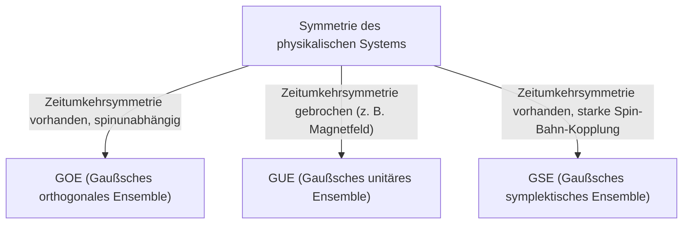

# Einführung: Die überraschende Universalität der Theorie der Zufallsmatrizen

Die Welt mag komplex und unvorhersehbar erscheinen, aber durch die Linse der Mathematik finden wir manchmal überraschende Gemeinsamkeiten in völlig unterschiedlichen Bereichen. Die "Theorie der Zufallsmatrizen" (Random Matrix Theory, RMT) ist genau ein solches mathematisches Rahmenwerk mit einer derartigen Universalität.

Eine Zufallsmatrix ist eine Matrix, deren Elemente durch Zufallsvariablen gegeben sind. Auf den ersten Blick handelt es sich nur um eine zufällige Anordnung von Zahlen, aber wenn die Größe der Matrix gegen unendlich geht, zeigt sich in der Verteilung ihrer [Eigenwerte](/p/eigenvalues-and-eigenvectors/) ein überraschend schönes und universelles Gesetz. Dieses Gesetz verbirgt sich hinter völlig unterschiedlichen Systemen, von der mikroskopischen Welt der Atomkerne, den Rätseln der Primzahlverteilung und den Preisschwankungen auf den Finanzmärkten bis hin zur Lerndynamik modernster Deep-Learning-Modelle.

In diesem Artikel, ausgehend vom historischen Hintergrund der Theorie der Zufallsmatrizen, erklären wir ihre mathematische Grundlage wie die Klassifikation von Ensembles (GOE/GUE/GSE), den mathematischen Beweis des Wignerschen Halbkreisgesetzes und sogar ihre unerwartete Verbindung zur Riemannschen Zeta-Funktion. In der zweiten Hälfte tauchen wir tief in moderne Anwendungen ein, wie die Portfolio-Optimierung in der Finanzmathematik und das Problem der Gewichtsinitialisierung in der KI und im Deep Learning, begleitet von praktischen Visualisierungen mit Python-Code.

---

# 1. Geboren aus der Physik: Wigner und das Geheimnis der schweren Kerne

Die Wurzeln der Theorie der Zufallsmatrizen reichen zurück in die Kernphysik der 1950er Jahre. Damals kämpften die Physiker damit, die Energieniveaus (die möglichen Energiewerte, die ein quantenmechanischer Zustand annehmen kann) schwerer Kerne wie Uran zu verstehen.

## Energieniveaus von Urankernen

Für leichte Kerne lassen sich die Energieniveaus präzise vorhersagen, indem man die Wechselwirkungen zwischen Protonen und Neutronen gemäß der Schrödinger-Gleichung berechnet. Für schwere Kerne, bei denen viele Nukleonen komplex wechselwirken, wie Uran (Massenzahl 238), sind die Freiheitsgrade jedoch zu groß, was strenge Berechnungen praktisch unmöglich macht.

Betrachtet man experimentell beobachtete Neutronenstreudaten, schienen die Resonanzenergieniveaus zufällig angeordnet zu sein. Bei der Untersuchung der statistischen Verteilung des "Abstands" zwischen den Energieniveaus fand sich jedoch ein klares Muster. Benachbarte Energieniveaus hatten eine Eigenschaft namens "Niveauabstoßung", bei der sie sich nie zu nahe kommen.

## Wigners Intuition und die Entdeckung des Halbkreisgesetzes

1955 schlug Eugene Wigner eine mutige Idee vor: Anstatt den Hamiltonoperator (die Matrix, die die Energie repräsentiert) dieses komplexen Quantensystems als eine spezifische Matrix mit detaillierter physikalischer Struktur zu behandeln, modellierte er ihn als eine "riesige symmetrische Matrix, deren Elemente zufällige Werte annehmen".

Überraschenderweise stimmte die Abstandsverteilung der [Eigenwerte](/p/eigenvalues-and-eigenvectors/) dieser stark vereinfachten Zufallsmatrix perfekt mit der Abstandsverteilung der Energieniveaus in tatsächlichen Urankernen überein. Wigner entdeckte weiter, dass im Grenzwert, wenn die Matrixgröße $N$ gegen unendlich geht, die Gesamtdichteverteilung der [Eigenwerte](/p/eigenvalues-and-eigenvectors/) die Form eines Halbkreises annimmt. Dies ist das berühmte "Wignersche Halbkreisgesetz".

---

# 2. Klassifikation von Ensembles: GOE, GUE, GSE

Auf Wigners Forschung aufbauend, systematisierte Freeman Dyson die Theorie der Zufallsmatrizen und klassifizierte sie basierend auf den Symmetrien der physikalischen Systeme in drei universelle Klassen (Ensembles). Diese sind als "Dysons dreifacher Weg" bekannt.



## Gaußsches orthogonales Ensemble (GOE)

Das GOE ist eine Menge reeller symmetrischer Matrizen, deren Elemente aus reellen Zahlen bestehen. Jedes nicht-diagonale Element wird unabhängig aus einer Normalverteilung mit Mittelwert 0 und Varianz 1 gezogen, während die Diagonalelemente aus einer Normalverteilung mit Mittelwert 0 und Varianz 2 gezogen werden. Das GOE wird verwendet, um den Hamiltonoperator von Quantensystemen (z. B. Systemen spinloser Teilchen) zu modellieren, bei denen kein externes Magnetfeld vorhanden ist und die Zeitumkehrsymmetrie erhalten bleibt.

## Gaußsches unitäres Ensemble (GUE)

Das GUE ist eine Menge hermitescher Matrizen, deren Elemente aus komplexen Zahlen bestehen. Der Real- und Imaginärteil der nicht-diagonalen Elemente folgen jeweils unabhängigen Normalverteilungen. Es wird auf physikalische Systeme angewendet, bei denen die Zeitumkehrsymmetrie gebrochen ist, wie beispielsweise in Anwesenheit eines externen Magnetfelds. Genau dieses GUE hat eine tiefe Verbindung zur Verteilung der Nullstellen der Riemannschen Zeta-Funktion, worauf wir später noch eingehen werden.

## Gaußsches symplektisches Ensemble (GSE)

Das GSE ist eine Menge selbstdualer hermitescher Matrizen, deren Elemente aus Quaternionen bestehen. Es beschreibt Systeme, in denen die Zeitumkehrsymmetrie erhalten bleibt, aber die Teilchen einen halbzahligen Spin und starke Spin-Bahn-Wechselwirkungen aufweisen.

---

# 3. Mathematischer Abgrund: Beweis des Wignerschen Halbkreisgesetzes

Lassen Sie uns den Prozess des Beweises des Wignerschen Halbkreisgesetzes, des grundlegendsten Ergebnisses der Theorie der Zufallsmatrizen, mit Hilfe der Momentenmethode skizzieren.

Betrachten wir eine reelle symmetrische $N \times N$-Matrix $X$, deren Elemente $X_{ij}$ voneinander unabhängige Zufallsvariablen mit Mittelwert 0 und Varianz 1 sind. Wir suchen den Grenzwert ($N \to \infty$) der [Eigenwertverteilung](/p/eigenvalues-and-eigenvectors/) der skalierten Matrix $W = \frac{1}{\sqrt{N}}X$.

## Ansatz über die Momentenmethode

Um die empirische Verteilungsfunktion der [Eigenwerte](/p/eigenvalues-and-eigenvectors/) zu analysieren, berechnen wir das $k$-te Moment $m_k$ der Verteilung. Da die Spur (Summe der Diagonalelemente) einer Matrix gleich der Summe ihrer [Eigenwerte](/p/eigenvalues-and-eigenvectors/) ist, werten wir Folgendes aus:
$$ m_k = \lim_{N \to \infty} \frac{1}{N} \mathbb{E}[\text{Tr}(W^k)] $$

Die Erweiterung der Spur ergibt:
$$ \text{Tr}(W^k) = \frac{1}{N^{k/2}} \sum_{i_1, i_2, \dots, i_k} X_{i_1 i_2} X_{i_2 i_3} \cdots X_{i_k i_1} $$
Bei der Berechnung des Erwartungswerts wird jeder erweiterte Term, in dem ein Element nur einmal vorkommt, einen Erwartungswert von 0 haben, da die Elemente $X_{ij}$ unabhängig sind und einen Mittelwert von 0 haben. Um einen Beitrag ungleich null zu leisten, muss jede Kante auf dem Pfad $i_1 \to i_2 \to \dots \to i_k \to i_1$ mindestens zweimal durchlaufen werden.

Im Grenzwert $N \to \infty$ stammt der dominante Beitrag von Pfaden mit genau $k$ Schritten, die eine "Baum"-Struktur bilden, bei der neue Knotenpunkte erkundet und entlang jeder durchlaufenen Kante genau einmal zurückgekehrt wird. Dies ist nur möglich, wenn $k$ gerade ist ($k = 2m$), und ungerade Momente werden im Grenzwert zu 0.

## Verbindung zwischen Catalan-Zahlen und dem Halbkreisgesetz

Die Gesamtzahl solcher Pfade (Dyck-Pfade) der Länge $2m$ ist durch die "[Catalan-Zahlen](/p/catalan-numbers/)" $C_m$ gegeben, die in der Kombinatorik berühmt sind.
$$ C_m = \frac{1}{m+1} \binom{2m}{m} $$

Daher sind die Momente der Grenzverteilung:
$$ m_{2m} = C_m, \quad m_{2m+1} = 0 $$
Es ist bekannt, dass die Wahrscheinlichkeitsverteilung mit diesen Momenten die auf dem Intervall $[-2, 2]$ getragene Halbkreisverteilung ist (Wignersches Halbkreisgesetz). Ihre Wahrscheinlichkeitsdichtefunktion ist wie folgt:
$$ \rho(x) = \begin{cases} \frac{1}{2\pi} \sqrt{4 - x^2} & (-2 \le x \le 2) \\ 0 & (\text{sonst}) \end{cases} $$

---

# 4. Unerwartete Begegnung mit der Riemannschen Zeta-Funktion

Die Theorie der Zufallsmatrizen, die zur Lösung von Problemen in der Physik entwickelt wurde, führte in den 1970er Jahren zu einer Entdeckung des Jahrhunderts im Bereich der reinen Mathematik, insbesondere der Zahlentheorie.

## Montgomery-Odlyzko-Vermutung

1972 untersuchte der Zahlentheoretiker Hugh Montgomery die Abstandsverteilung der nicht-trivialen Nullstellen der Riemannschen Zeta-Funktion. Nach der Riemannschen Vermutung liegen all diese Nullstellen auf der "kritischen Gerade" (der Gerade mit Realteil 1/2) in der komplexen Ebene. Montgomery berechnete die Paarkorrelationsfunktion der Nullstellen und leitete ab, dass sie gleich $1 - \left(\frac{\sin(\pi x)}{\pi x}\right)^2$ ist.

Eines Tages während der Teezeit am Institute for Advanced Study in Princeton erwähnte Montgomery dieses Ergebnis gegenüber dem Physiker Freeman Dyson. Dyson war verblüfft. Warum? Weil die Formel exakt mit der Abstandsverteilung der [Eigenwerte](/p/eigenvalues-and-eigenvectors/) des GUE (Gaußsches unitäres Ensemble) übereinstimmte, die Dyson selbst abgeleitet hatte.

## Die Schnittstelle zwischen Primzahlen und Quantenchaos

Später berechnete der Mathematiker Andrew Odlyzko mit einem Supercomputer Millionen von Nullstellen der Zeta-Funktion und zeigte, dass ihre Abstandsverteilung mit erstaunlicher Genauigkeit mit den GUE-Vorhersagen übereinstimmte.

Diese Entdeckung ist als "Montgomery-Odlyzko-Vermutung" bekannt und deutet auf eine tiefe und universelle Verbindung zwischen der Verteilung von Primzahlen (die Nullstellen der Zeta-Funktion hängen eng mit der Primzahlverteilung zusammen) und chaotischen Quantensystemen (GUE) hin. Es war der Moment, in dem die Mathematik, die die mikroskopischen Gesetze des Universums beschreibt, und die Mathematik, die die Bausteine der Zahlen (Primzahlen) regiert, sich durch den Berührungspunkt der Zufallsmatrizen überschnitten.

---

# 5. Anwendungen in der Finanzmathematik: Die Evolution der Portfolio-Optimierung

Die Theorie der Zufallsmatrizen wurde als mächtiges Werkzeug nicht nur in der Physik und der reinen Mathematik, sondern auch in der Analyse von Finanzmärkten angewendet. Sie spielt eine besonders wichtige Rolle bei der Optimierung des Asset Managements.

## Grenzen des Markowitz-Modells

In Harry Markowitz' Mean-Variance-Modell, das die Grundlage der modernen Portfoliotheorie bildet, werden die optimalen Anlageverhältnisse anhand der inversen Kovarianzmatrix der Vermögenswerte bestimmt. Dies stellt in der Praxis jedoch ein großes Problem dar.

Wenn man die empirische Kovarianzmatrix aus den Renditedaten von $N$ Vermögenswerten über die letzten $T$ Perioden schätzt und $N$ groß und $T$ nicht ausreichend groß ist (sodass $N/T$ nicht nahe 0 liegt), enthält die empirische Kovarianzmatrix eine massive Menge an statistischem Rauschen. Wenn man die Inverse dieser fehlerbehafteten Matrix berechnet, werden die Fehler verstärkt, was zur Generierung unrealistischer und extremer Portfolios führt (z. B. durch die Anweisung extremer Short- oder Long-Positionen bei bestimmten Vermögenswerten).

## Rauschbereinigung mit Zufallsmatrizen

Hier kommt die Theorie der Zufallsmatrizen ins Spiel. 1999 wendeten Bouchaud et al. und Laloux et al. unabhängig voneinander die Theorie der Zufallsmatrizen auf die Kovarianzmatrizen von Finanzmärkten an. Sie verglichen die [Eigenwertverteilung](/p/eigenvalues-and-eigenvectors/) der aus rein zufälligen Zeitreihendaten erhaltenen Kovarianzmatrix (Marchenko-Pastur-Verteilung) mit der [Eigenwertverteilung](/p/eigenvalues-and-eigenvectors/) der Kovarianzmatrix tatsächlicher Marktdaten.

Als Ergebnis fanden sie heraus, dass die überwiegende Mehrheit (über 90 %) der [Eigenwerte](/p/eigenvalues-and-eigenvectors/) der Marktdaten innerhalb der theoretischen Grenzen liegt, die von der Theorie der Zufallsmatrizen vorhergesagt werden. Mit anderen Worten: Es handelt sich lediglich um "Rauschen". Andererseits wurde gezeigt, dass nur wenige große [Eigenwerte](/p/eigenvalues-and-eigenvectors/), die die Grenzen weit überschreiten, bedeutsame Informationen enthalten, die die wahre Korrelationsstruktur des Marktes widerspiegeln (wie Marktfaktoren und Sektorfaktoren).

Basierend auf dieser Erkenntnis wurden Methoden entwickelt, um die Kovarianzmatrix zu "bereinigen", indem die dem Rauschen entsprechenden [Eigenwerte](/p/eigenvalues-and-eigenvectors/) herausgefiltert werden (z. B. indem man sie auf null setzt oder durch den Durchschnittswert ersetzt). Dies verbessert die Leistung und Stabilität von Portfolios drastisch und wird derzeit als Standardtechnik in vielen quantitativen Fonds eingesetzt.

---

# 6. Anwendungen in der Künstlichen Intelligenz: Gewichte und Lerndynamik im Deep Learning

In den letzten Jahren rückte die Theorie der Zufallsmatrizen auch bei der theoretischen Analyse von KI und maschinellem Lernen, insbesondere beim Deep Learning, ins Rampenlicht.

## Das Initialisierungsproblem neuronaler Netze

Beim Training massiver neuronaler Netze ist die Festlegung der Anfangswerte der Gewichtsmatrizen des Netzwerks ein äußerst wichtiges Problem, das über den Erfolg oder Misserfolg des Trainings entscheidet. Wenn die Initialisierung unangemessen ist, kommt es zu einem verschwindenden Gradienten (Gradient Vanishing) oder explodierenden Gradienten (Gradient Exploding), wodurch der Lernprozess gestoppt wird.

Wenn Gewichtsmatrizen mit zufälligen Werten initialisiert werden, handelt es sich exakt um eine Zufallsmatrix. Durch die Anwendung der Theorie der Zufallsmatrizen kann man den Übergang der Varianz des Signals beim Durchlaufen der Schichten und das Verhalten von Gradienten während der Backpropagation streng analysieren. Beispielsweise liefert die Analyse der Auswirkung nichtlinearer Aktivierungsfunktionen auf das Spektrum ([Eigenwertverteilung](/p/eigenvalues-and-eigenvectors/)) von Zufallsmatrizen die theoretische Rechtfertigung für moderne Standard-Initialisierungsmethoden wie die Xavier-Initialisierung und die He-Initialisierung.

## Eigenwertverteilung der Hesse-Matrix

Das Verständnis der Dynamik des Lernprozesses erfordert im Wesentlichen die Analyse der Hesse-Matrix, die die Krümmung der Verlustfunktion darstellt. Die Hesse-Matrix von [LLMs](/p/large-language-models-llm-transformer-prompt-engineering/) ([Großen Sprachmodellen](/p/large-language-models-llm-transformer-prompt-engineering/)) mit zig Millionen bis Hunderten von Milliarden von Parametern ist eine gigantische Matrix, was es schwierig macht, ihre Eigenschaften direkt zu untersuchen. Mit der Theorie der Zufallsmatrizen lässt sich ihre [Eigenwertverteilung](/p/eigenvalues-and-eigenvectors/) jedoch annähern und vorhersagen.

Studien haben gezeigt, dass die [Eigenwertverteilung](/p/eigenvalues-and-eigenvectors/) der Hesse-Matrix in tiefen neuronalen Netzen aus einem Bulk (einer großen Anzahl von [Eigenwerten](/p/eigenvalues-and-eigenvectors/) nahe null) und einigen großen Ausreißern (Outliers) besteht. Der Bulk-Teil kann als fehlerbehaftete Zufallsmatrix (z. B. Richtungen mit wenig Informationen) modelliert werden, während die Ausreißer kritische Lernrichtungen anzeigen, die direkt mit der Aufgabe verknüpft sind. Das Verständnis dieser spektralen Struktur liefert äußerst wertvolle Erkenntnisse zur Verbesserung der Konvergenz von Optimierungsalgorithmen (wie SGD und Adam) und zur Optimierung von Zeitplänen für Lernraten.

---

# 7. Praxis: Visualisierung der Eigenwertverteilung mit Python

Schließlich wollen wir ein GOE (Gaußsches orthogonales Ensemble) mit Python generieren und numerisch verifizieren, dass das Wignersche Halbkreisgesetz gilt.

```python
import numpy as np
import matplotlib.pyplot as plt
from scipy.stats import semicircular

# Parametereinstellungen
N = 1000  # Matrixgröße
num_matrices = 50  # Anzahl der Samples im Ensemble

eigenvalues = []

# GOE-Matrizen generieren und Eigenwerte berechnen
for _ in range(num_matrices):
    # Eine N x N-Matrix mit Elementen ~ N(0, 1) generieren
    X = np.random.randn(N, N)
    # Symmetrisieren, um eine GOE-Matrix zu erstellen (beachten Sie die Varianzskalierung)
    A = (X + X.T) / np.sqrt(2)
    # Varianz auf 1/N skalieren
    W = A / np.sqrt(N)
    
    # Eigenwerte berechnen (unter Verwendung von eigh für reelle symmetrische Matrizen)
    eigvals = np.linalg.eigh(W)[0]
    eigenvalues.extend(eigvals)

# Plot-Einstellungen
plt.figure(figsize=(10, 6))

# Das Histogramm der Eigenwerte plotten
plt.hist(eigenvalues, bins=100, density=True, alpha=0.6, color='skyblue', edgecolor='black', label='Empirical Eigenvalues (GOE)')

# Das theoretische Wignersche Halbkreisgesetz plotten
x = np.linspace(-2.2, 2.2, 1000)
# Wahrscheinlichkeitsdichtefunktion des Halbkreisgesetzes mit Radius R=2
y = np.where(np.abs(x) <= 2, np.sqrt(4 - x**2) / (2 * np.pi), 0)
plt.plot(x, y, 'r-', lw=3, label="Wigner's Semicircle Law")

plt.title(f"Eigenvalue Distribution of GOE Matrices ($N={N}$)", fontsize=16)
plt.xlabel("Eigenvalue", fontsize=14)
plt.ylabel("Density", fontsize=14)
plt.legend(fontsize=12)
plt.grid(True, alpha=0.3)
plt.tight_layout()
plt.show()
```

Wenn Sie diesen Code ausführen, können Sie bestätigen, dass die [Eigenwerte](/p/eigenvalues-and-eigenvectors/) der zufällig generierten Matrizen in Form eines wunderschönen Halbkreises verteilt sind. Der größte Reiz der Theorie der Zufallsmatrizen liegt darin, dass, obwohl die Elemente der einzelnen Matrizen völlig zufällig sind, insgesamt ein solch geordnetes Gesetz entsteht.

---

# Fazit

In diesem Artikel folgten wir der großen Erzählung der Theorie der Zufallsmatrizen, beginnend in der Kernphysik und bis hin zur reinen Mathematik, der Finanzmathematik und den modernen KI-Technologien. Die Tatsache, dass scheinbar unzusammenhängende komplexe Systeme unter extremen Bedingungen mit der gemeinsamen Sprache "der [Eigenwerte](/p/eigenvalues-and-eigenvectors/) von Zufallsmatrizen" kommunizieren können, zeigt die mysteriöse Tiefe, die die Natur und die Mathematik besitzen.

In der heutigen Zeit, in der Daten explodieren und Modelle immer weiter enorm anwachsen, entwickelt sich die Theorie der Zufallsmatrizen von einem bloßen Gegenstand der abstrakten Mathematik zu einer mächtigen Waffe zur Lösung praktischer Probleme in der Datenwissenschaft und im maschinellen Lernen. Diese Theorie, die die universellen Wahrheiten erforscht, die sich hinter komplexen Systemen verbergen, wird zweifellos auch in Zukunft ein Licht sein, das unser Verständnis in verschiedenen Bereichen vertieft.
