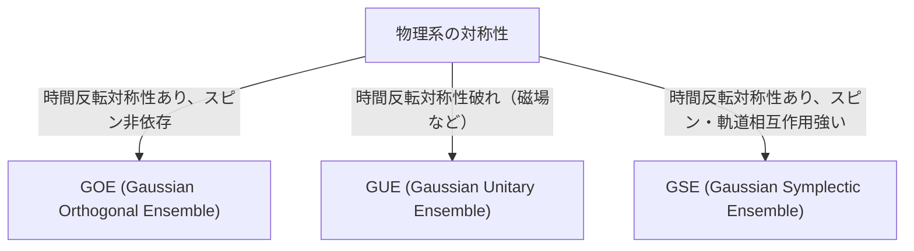

# Einleitung: Die erstaunliche Universalität der Zufallsmatrizen-Theorie

Die Welt erscheint komplex und unvorhersehbar, doch wenn man sie durch die Linse der Mathematik betrachtet, findet man manchmal überraschende Gemeinsamkeiten in völlig unterschiedlichen Bereichen. Die "Zufallsmatrizen-Theorie" (Random Matrix Theory, RMT) ist genau ein solches mathematisches Rahmenwerk, das eine derartige Universalität besitzt.

Eine Zufallsmatrix ist eine Matrix, deren Elemente durch Zufallsvariablen gegeben sind. Auf den ersten Blick ist es nur eine zufällige Anordnung von Zahlen, aber wenn man die Größe der Matrix gegen unendlich gehen lässt, offenbaren sich in der Verteilung ihrer Eigenwerte erstaunlich schöne und universelle Gesetze. Diese Gesetze verbergen sich hinter völlig unterschiedlichen Systemen, von der mikroskopischen Welt der Atomkerne über das Rätsel der Primzahlverteilung und die Preisschwankungen der Finanzmärkte bis hin zur Lerndynamik modernster Deep-Learning-Modelle.

Dieser Artikel beginnt mit den historischen Hintergründen der Zufallsmatrizen-Theorie und erläutert ihre mathematischen Grundlagen – die Klassifizierung der Ensembles wie GOE/GUE/GSE, den mathematischen Beweis von Wigners Halbkreisgesetz sowie die unerwartete Verbindung zur Riemannschen Zeta-Funktion. In der zweiten Hälfte werden wir moderne Anwendungen, wie die Portfolio-Optimierung im Financial Engineering und das Problem der Gewichtsinitialisierung in KI und Deep Learning, unter Einbeziehung praktischer Visualisierungen mit Python-Code vertieft betrachten.

---

# 1. Ursprung in der Physik: Wigner und das Rätsel der schweren Atomkerne

Die Wurzeln der Zufallsmatrizen-Theorie reichen bis in die Kernphysik der 1950er Jahre zurück. Die damaligen Physiker kämpften damit, die Energieniveaus (die Energiewerte, die ein quantenmechanischer Zustand annehmen kann) schwerer Atomkerne wie Uran zu verstehen.

## Die Energieniveaus des Urankerns

Bei leichten Atomkernen können die Energieniveaus genau vorhergesagt werden, indem die Wechselwirkung zwischen Protonen und Neutronen gemäß der Schrödinger-Gleichung berechnet wird. Bei schweren Atomkernen wie Uran (mit einer Massenzahl von etwa 238), in denen zahlreiche Nukleonen komplex interagieren, sind die Freiheitsgrade jedoch so groß, dass exakte Berechnungen praktisch unmöglich sind.

Die experimentell beobachteten Daten der Neutronenstreuung ließen die Resonanz-Energieniveaus scheinbar ungeordnet erscheinen. Als man jedoch die statistische Verteilung der "Abstände" (spacing) zwischen den Energieniveaus untersuchte, zeigte sich ein klares Muster. Benachbarte Energieniveaus wiesen die Eigenschaft der "Niveauabstoßung" (level repulsion) auf und kamen sich niemals zu nahe.

## Wigners Intuition und die Entdeckung des Halbkreisgesetzes

Im Jahr 1955 schlug Eugene Wigner die kühne Idee vor, den Hamiltonoperator (die Matrix, die die Energie darstellt) dieses komplexen Quantensystems nicht als spezifische Matrix mit detaillierter physikalischer Struktur zu behandeln, sondern ihn als "riesige symmetrische Matrix mit zufälligen Elementen" zu modellieren.

Überraschenderweise stimmte die Abstandsverteilung der Eigenwerte dieser extrem vereinfachten Zufallsmatrix perfekt mit der tatsächlichen Abstandsverteilung der Energieniveaus des Urankerns überein. Wigner entdeckte darüber hinaus, dass die Gesamtdichteverteilung der Eigenwerte im Grenzwert, wenn die Größe der Matrix $N$ gegen unendlich geht, die Form eines Halbkreises annimmt. Dies ist das berühmte "Wignersche Halbkreisgesetz" (Wigner's semicircle law).

---

# 2. Klassifizierung der Ensembles: GOE, GUE, GSE

Aufbauend auf Wigners Arbeit systematisierte Freeman Dyson die Theorie der Zufallsmatrizen und klassifizierte sie basierend auf den Symmetrien physikalischer Systeme in drei universelle Klassen (Ensembles). Diese werden als "Dysons dreifacher Weg" (Dyson's threefold way) bezeichnet.



## Gaußsches Orthogonales Ensemble (GOE)

Das GOE ist die Menge reellsymmetrischer Matrizen, deren Elemente reelle Zahlen sind. Jedes Nicht-Diagonal-Element wird unabhängig aus einer Normalverteilung mit Mittelwert 0 und Varianz 1 gewählt, und die Diagonalelemente aus einer Normalverteilung mit Mittelwert 0 und Varianz 2. Das GOE wird verwendet, um die Hamiltonoperatoren von Quantensystemen zu modellieren, in denen kein äußeres Magnetfeld vorhanden ist und die Zeitumkehrsymmetrie erhalten bleibt (z. B. Systeme von Teilchen ohne Spin).

## Gaußsches Unitäres Ensemble (GUE)

Das GUE ist die Menge hermitescher Matrizen, deren Elemente komplexe Zahlen sind. Der Real- und Imaginärteil der Nicht-Diagonal-Elemente folgen jeweils unabhängigen Normalverteilungen. Es wird auf physikalische Systeme angewendet, in denen die Zeitumkehrsymmetrie gebrochen ist, beispielsweise durch das Vorhandensein eines äußeren Magnetfeldes. Dieses GUE ist tief mit der Verteilung der Nullstellen der Riemannschen Zeta-Funktion verbunden, die später besprochen wird.

## Gaußsches Symplektisches Ensemble (GSE)

Das GSE ist die Menge der selbstdualen hermiteschen Matrizen, die aus Quaternionen bestehen. Es beschreibt Systeme, in denen die Zeitumkehrsymmetrie erhalten ist, die Teilchen jedoch einen halbzahligen Spin haben und eine starke Spin-Bahn-Wechselwirkung aufweisen.

---

# 3. Mathematische Tiefen: Beweis von Wigners Halbkreisgesetz

Wir werden den Prozess des Beweises von Wigners Halbkreisgesetz, dem grundlegendsten Ergebnis der Zufallsmatrizen-Theorie, mit Hilfe der Momentenmethode (Method of Moments) skizzieren.

Betrachten wir eine reelle symmetrische $N \times N$-Matrix $X$, deren Elemente $X_{ij}$ voneinander unabhängige Zufallsvariablen mit Mittelwert 0 und Varianz 1 sind. Wir suchen den Grenzwert ($N \to \infty$) der Eigenwertverteilung der skalierten Matrix $W = \frac{1}{\sqrt{N}}X$.

## Ansatz über die Momentenmethode

Um die empirische Verteilungsfunktion der Eigenwerte zu analysieren, berechnen wir das $k$-te Moment $m_k$ der Verteilung. Da die Spur (die Summe der Diagonalelemente) der Matrix der Summe der Eigenwerte entspricht, evaluieren wir
$$ m_k = \lim_{N \to \infty} \frac{1}{N} \mathbb{E}[\text{Tr}(W^k)] $$

Durch Entwickeln der Spur erhalten wir
$$ \text{Tr}(W^k) = \frac{1}{N^{k/2}} \sum_{i_1, i_2, \dots, i_k} X_{i_1 i_2} X_{i_2 i_3} \cdots X_{i_k i_1} $$
Da die Elemente $X_{ij}$ bei der Erwartungswertbildung einen Mittelwert von 0 haben und unabhängig sind, wird der Erwartungswert von Termen, in denen dasselbe Element nur einmal vorkommt, 0. Um einen von null verschiedenen Beitrag zu leisten, muss jede Kante auf dem [Pfad](/de/p/windows-%E3%81%A7pfad%E3%81%AE%E9%80%9A%E3%81%A3%E3%81%9Fausf%C3%BChrbare-datei%E3%81%AE%E5%A0%B4%E6%89%80%E3%82%92%E8%A6%8B%E3%81%A4%E3%81%91%E3%82%8B%E6%96%B9%E6%B3%95/) $i_1 \to i_2 \to \dots \to i_k \to i_1$ mindestens zweimal durchlaufen werden.

Im Grenzwert $N \to \infty$ stammt der Hauptbeitrag von Pfaden mit genau $k$ Schritten, die eine "Baum"-Struktur (tree) bilden, bei der neue Knoten erkundet und die durchlaufenen Kanten genau einmal zurückgegangen werden. Dies ist nur möglich, wenn $k$ gerade ist ($k = 2m$); die Momente ungerader Ordnung werden im Grenzwert 0.

## Verbindung zwischen Catalan-Zahlen und dem Halbkreisgesetz

Die Gesamtzahl solcher Pfade der Länge $2m$ (Dyck-Pfade) ist durch die in der Kombinatorik bekannten "[Catalan-Zahlen](/de/p/catalan-numbers/)" (Catalan numbers) $C_m$ gegeben.
$$ C_m = \frac{1}{m+1} \binom{2m}{m} $$

Daher sind die Momente der Grenzverteilung
$$ m_{2m} = C_m, \quad m_{2m+1} = 0 $$
Es ist bekannt, dass die Wahrscheinlichkeitsverteilung mit diesen Momenten eine Halbkreisverteilung (Wigners Halbkreisgesetz) mit einem Träger im Intervall $[-2, 2]$ ist. Ihre Wahrscheinlichkeitsdichtefunktion lautet wie folgt:
$$ \rho(x) = \begin{cases} \frac{1}{2\pi} \sqrt{4 - x^2} & (-2 \le x \le 2) \\ 0 & (\text{sonst}) \end{cases} $$

---

# 4. Eine unerwartete Begegnung mit der Riemannschen Zeta-Funktion

Die Zufallsmatrizen-Theorie, die zur Lösung physikalischer Probleme entwickelt wurde, sollte in den 1970er Jahren in der reinen Mathematik, insbesondere im Bereich der Zahlentheorie, zu einer der größten Entdeckungen des Jahrhunderts führen.

## Die Montgomery-Odlyzko-Vermutung

Im Jahr 1972 untersuchte der Zahlentheoretiker Hugh Montgomery die Abstandsverteilung der nichttrivialen Nullstellen der Riemannschen Zeta-Funktion. Gemäß der Riemannschen Vermutung liegen alle diese Nullstellen auf der "kritischen Geraden" (der Geraden mit Realteil 1/2) in der komplexen Ebene. Montgomery berechnete die Paar-Korrelationsfunktion der Nullstellen und leitete ab, dass sie $1 - \left(\frac{\sin(\pi x)}{\pi x}\right)^2$ beträgt.

Eines Tages beim Nachmittagstee am Institute for Advanced Study in Princeton erzählte Montgomery dem Physiker Freeman Dyson von diesem Ergebnis. Dyson war verblüfft. Denn die Formel war exakt dieselbe wie die Abstandsverteilung der Eigenwerte des GUE (Gaussian Unitary Ensemble), die Dyson selbst abgeleitet hatte.

## Die Schnittstelle zwischen Primzahlen und Quantenchaos

Später berechnete der Mathematiker Andrew Odlyzko mit Hilfe von Supercomputern Millionen von Nullstellen der Zeta-Funktion und demonstrierte, dass ihre Abstandsverteilung mit bemerkenswerter Genauigkeit mit den Vorhersagen des GUE übereinstimmt.

Diese Entdeckung wird als "Montgomery-Odlyzko-Vermutung" bezeichnet und legt nahe, dass es eine tiefe universelle Verbindung zwischen der Verteilung von Primzahlen (die Nullstellen der Zeta-Funktion sind eng mit der Verteilung von Primzahlen verknüpft) und quantenchaotischen Systemen (GUE) gibt. Dies war der Moment, in dem die Mathematik, die die mikroskopischen Gesetze des Universums beschreibt, sich mit der Mathematik, die die Bausteine der Zahlen, die Primzahlen, beherrscht, durch die Berührungsfläche der Zufallsmatrizen kreuzte.

---

# 5. Anwendung im Financial Engineering: Die Evolution der Portfolio-Optimierung

Die Zufallsmatrizen-Theorie wird nicht nur in der Physik und der reinen Mathematik, sondern auch als mächtiges Werkzeug zur Analyse von Finanzmärkten eingesetzt. Sie spielt insbesondere bei der Optimierung der Vermögensverwaltung eine wichtige Rolle.

## Die Grenzen des Markowitz-Modells

Im Mean-Variance-Modell von Harry Markowitz, dem Fundament der modernen Portfoliotheorie, wird die optimale Investitionsquote mithilfe der Inversen der Kovarianzmatrix der Vermögenswerte bestimmt. In der Praxis gab es jedoch ein großes Problem.

Wenn die Stichprobenkovarianzmatrix aus historischen Renditedaten von $N$ Vermögenswerten über $T$ Perioden geschätzt wird, und $N$ groß ist, während $T$ nicht ausreichend groß ist (sodass $N/T$ nicht nahe 0 ist), enthält die geschätzte Matrix eine große Menge an statistischem Rauschen. Wenn man die Inverse dieser fehlerbehafteten Matrix berechnet, werden die Fehler verstärkt, und es werden unrealistische, extreme Portfolios generiert (die extreme Short- oder Long-Positionen in bestimmten Vermögenswerten vorgeben).

## Rauschbereinigung (Noise Cleaning) durch Zufallsmatrizen

Hier kommt die Zufallsmatrizen-Theorie ins Spiel. Im Jahr 1999 wandten Bouchaud et al. und Laloux et al. unabhängig voneinander die Zufallsmatrizen-Theorie auf die Kovarianzmatrizen von Finanzmärkten an. Sie verglichen die Eigenwertverteilung von Kovarianzmatrizen, die aus rein zufälligen Zeitreihendaten gewonnen wurden (Marchenko-Pastur-Verteilung), mit der Eigenwertverteilung realer Marktdaten-Kovarianzmatrizen.

Das Ergebnis zeigte, dass der Großteil der Eigenwerte der Marktdaten (über 90 %) innerhalb der von der Zufallsmatrizen-Theorie vorhergesagten theoretischen Grenzen liegt. Das bedeutet, dass sie lediglich "Rauschen" sind. Andererseits wurde gezeigt, dass nur wenige große Eigenwerte, die diese Grenzen weit überschreiten, bedeutungsvolle Informationen enthalten, die die wahre Korrelationsstruktur des Marktes (Marktfaktoren oder Sektorfaktoren) widerspiegeln.

Basierend auf diesen Erkenntnissen wurden Methoden zur "Bereinigung" (cleaning) von Kovarianzmatrizen entwickelt, indem die dem Rauschen entsprechenden Eigenwerte gefiltert werden (z. B. auf null gesetzt oder durch den Mittelwert ersetzt). Dies hat die Performance und Stabilität von Portfolios drastisch verbessert und wird heute von vielen quantitativen Fonds als Standardtechnik verwendet.

---

# 6. Anwendung in der Künstlichen Intelligenz: Gewichte und Lerndynamik im Deep Learning

In den letzten Jahren hat die Zufallsmatrizen-Theorie auch bei der theoretischen Analyse in der KI und im Maschinellen Lernen, insbesondere im Deep Learning, viel Aufmerksamkeit erlangt.

## Das Problem der Initialisierung neuronaler Netze

Beim Trainieren riesiger neuronaler Netze ist die Frage, wie die Anfangswerte der Gewichtsmatrizen des Netzwerks gesetzt werden, ein äußerst wichtiges Problem, das über Erfolg oder Misserfolg des Trainings entscheidet. Ist die Initialisierung ungeeignet, kommt es zum Verschwinden der Gradienten (Gradient Vanishing) oder zum Explodieren der Gradienten (Gradient Exploding), und das Training kommt nicht voran.

Wenn eine Gewichtsmatrix mit zufälligen Werten initialisiert wird, ist sie nichts anderes als eine Zufallsmatrix. Durch die Anwendung der Zufallsmatrizen-Theorie lässt sich die Entwicklung der Varianz des Signals beim Durchgang durch die Schichten und das Verhalten des Gradienten bei der Backpropagation streng analysieren. Beispielsweise durch die Analyse, wie nichtlineare Aktivierungsfunktionen das Spektrum (Eigenwertverteilung) von Zufallsmatrizen beeinflussen, wurde die theoretische Gültigkeit moderner Standardinitialisierungsmethoden wie der Xavier-Initialisierung und der He-Initialisierung untermauert.

## Eigenwertverteilung der Hesse-Matrix

Um die Dynamik des Lernprozesses zu verstehen, ist die Analyse der Hesse-Matrix (Hessian), die die Krümmung der Verlustfunktion beschreibt, unerlässlich. Bei LLMs ([Large Language Models](/de/p/large-language-models-llm-transformer-prompt-engineering/)) mit Dutzenden von Millionen bis Hunderten von Milliarden von Parametern ist die Hesse-Matrix gigantisch, und es ist schwierig, ihre Eigenschaften direkt zu untersuchen. Durch die Nutzung der Zufallsmatrizen-Theorie lässt sich jedoch ihre Eigenwertverteilung approximieren und vorhersagen.

Studien haben gezeigt, dass die Eigenwertverteilung der Hesse-Matrix tiefer neuronaler Netze aus einem Bulk (einer großen Menge von Eigenwerten in der Nähe von null) und wenigen großen Ausreißern (Outliers) besteht. Der Bulk-Teil kann als rauschbehaftete Zufallsmatrix (z. B. informationsarme Richtungen) modelliert werden, während die Ausreißer wichtige, direkt mit der Aufgabe verbundene Lernrichtungen anzeigen. Das Verständnis dieser spektralen Struktur liefert äußerst wertvolle Erkenntnisse, um die Konvergenz von Optimierungsalgorithmen (wie SGD, Adam) zu verbessern oder die Pläne für Lernraten (learning rate schedules) zu optimieren.

---

# 7. Praxis: Visualisierung von Eigenwertverteilungen mit Python

Lassen Sie uns abschließend mit Python tatsächlich ein GOE (Gaußsches Orthogonales Ensemble) generieren und numerisch überprüfen, ob Wigners Halbkreisgesetz gilt.

```python
import numpy as np
import matplotlib.pyplot as plt
from scipy.stats import semicircular

# パラメータ設定
N = 1000  # 行列のサイズ
num_matrices = 50  # アンサンブルのサンプル数

eigenvalues = []

# GOE行列の生成と固有値の計算
for _ in range(num_matrices):
    # 要素がN(0, 1)に従うN x N行列を生成
    X = np.random.randn(N, N)
    # 対称化してGOE行列を作成 (分散のスケーリングに注意)
    A = (X + X.T) / np.sqrt(2)
    # 分散を 1/N にスケーリング
    W = A / np.sqrt(N)
    
    # 固有値を計算（実対称行列なのでeighを使用）
    eigvals = np.linalg.eigh(W)[0]
    eigenvalues.extend(eigvals)

# プロットの設定
plt.figure(figsize=(10, 6))

# 固有値のヒストグラムをプロット
plt.hist(eigenvalues, bins=100, density=True, alpha=0.6, color='skyblue', edgecolor='black', label='Empirical Eigenvalues (GOE)')

# 理論的なウィグナーの半円則をプロット
x = np.linspace(-2.2, 2.2, 1000)
# 半径 R=2 の半円則の確率密度関数
y = np.where(np.abs(x) <= 2, np.sqrt(4 - x**2) / (2 * np.pi), 0)
plt.plot(x, y, 'r-', lw=3, label="Wigner's Semicircle Law")

plt.title(f"Eigenvalue Distribution of GOE Matrices ($N={N}$)", fontsize=16)
plt.xlabel("Eigenvalue", fontsize=14)
plt.ylabel("Density", fontsize=14)
plt.legend(fontsize=12)
plt.grid(True, alpha=0.3)
plt.tight_layout()
plt.show()
```

Wenn Sie diesen Code ausführen, können Sie sehen, dass die Eigenwerte der zufällig generierten Matrizen in Form eines wunderschönen Halbkreises verteilt sind. Die Tatsache, dass sich trotz der völligen Zufälligkeit der einzelnen Matrixelemente insgesamt ein so regelmäßiges Gesetz ergibt, ist der größte Reiz der Zufallsmatrizen-Theorie.

---

# Schlusswort

In diesem Artikel haben wir die epische Geschichte der Zufallsmatrizen-Theorie verfolgt, die in der Kernphysik begann und sich bis hin zur reinen Mathematik, dem Financial Engineering und modernsten KI-Technologien erstreckt. Die Tatsache, dass scheinbar unzusammenhängende komplexe Systeme unter extremen Bedingungen durch die gemeinsame Sprache der "Eigenwerte von Zufallsmatrizen" miteinander in Verbindung stehen können, zeigt die mystische Tiefe der Natur und der Mathematik.

In unserer modernen Welt, in der Daten explosionsartig zunehmen und Modelle immer größer werden, entwickelt sich die Zufallsmatrizen-Theorie von einem rein abstrakten mathematischen Gegenstand zu einer mächtigen Waffe für praktische Problemlösungen in Data Science und Machine Learning. Diese Theorie, die die universellen Wahrheiten hinter komplexen Systemen erforscht, wird auch in Zukunft ein Licht sein, das unser Verständnis in verschiedenen Bereichen vertieft.
