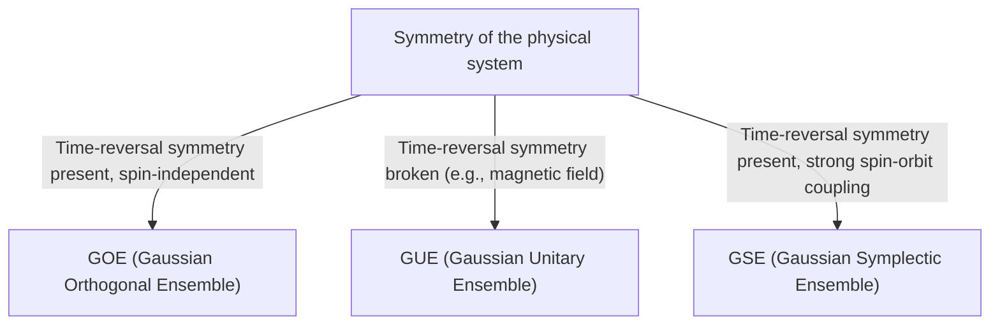

# Introduction: The Surprising Universality of Random Matrix Theory

The world may seem complex and unpredictable, but through the lens of mathematics, we sometimes find surprising commonalities across entirely different fields. "Random Matrix Theory (RMT)" is exactly one of those mathematical frameworks with such universality.

A random matrix is a matrix whose elements are given by random variables. At first glance, it is merely a random array of numbers, but as the size of the matrix approaches infinity, a surprisingly beautiful and universal law emerges in the distribution of its [eigenvalues](/p/eigenvalues-and-eigenvectors/). This law lies hidden behind entirely different systems, from the microscopic world of atomic nuclei, the mysteries of prime number distribution, and the price fluctuations in financial markets, to the learning dynamics of state-of-the-art deep learning models.

In this article, starting from the historical background of random matrix theory, we will explain its mathematical foundation such as the classification of ensembles (GOE/GUE/GSE), the mathematical proof of Wigner's semicircle law, and even its unexpected connection to the Riemann zeta function. In the latter half, we will delve deeply into modern applications, such as portfolio optimization in financial engineering and the weight initialization problem in AI and deep learning, accompanied by practical visualizations using Python code.

---

# 1. Born from Physics: Wigner and the Mystery of Heavy Nuclei

The roots of random matrix theory date back to nuclear physics in the 1950s. At the time, physicists were struggling to understand the energy levels (the possible energy values a quantum mechanical state can take) of heavy nuclei like uranium.

## Energy Levels of Uranium Nuclei

For light nuclei, energy levels can be accurately predicted by calculating the interactions between protons and neutrons according to the Schrödinger equation. However, for heavy nuclei where many nucleons interact complexly, like uranium (mass number 238), the degrees of freedom are too large, making rigorous calculations virtually impossible.

Looking at experimentally observed neutron scattering data, the resonance energy levels seemed to be arranged randomly. However, when examining the statistical distribution of the "spacing" between energy levels, a clear pattern was found. Adjacent energy levels had a property called "level repulsion," where they never get too close to each other.

## Wigner's Intuition and the Discovery of the Semicircle Law

In 1955, Eugene Wigner proposed a bold idea: instead of treating the Hamiltonian (the matrix representing energy) of this complex quantum system as a specific matrix with detailed physical structure, he modeled it as a "huge symmetric matrix whose elements take random values."

Surprisingly, the spacing distribution of the [eigenvalues](/p/eigenvalues-and-eigenvectors/) of this highly simplified random matrix perfectly matched the spacing distribution of the energy levels in actual uranium nuclei. Wigner further discovered that in the limit as the matrix size $N$ goes to infinity, the overall density distribution of [eigenvalues](/p/eigenvalues-and-eigenvectors/) forms a semicircle shape. This is the famous "Wigner's semicircle law."

---

# 2. Classification of Ensembles: GOE, GUE, GSE

Following Wigner's research, Freeman Dyson systematized the theory of random matrices and classified them into three universal classes (ensembles) based on the symmetries of the physical systems. These are known as "Dyson's threefold way."



## Gaussian Orthogonal Ensemble (GOE)

GOE is a set of real symmetric matrices whose elements consist of real numbers. Each off-diagonal element is independently drawn from a normal distribution with mean 0 and variance 1, while diagonal elements are drawn from a normal distribution with mean 0 and variance 2. GOE is used to model the Hamiltonian of quantum systems (e.g., systems of spinless particles) where there is no external magnetic field and time-reversal symmetry is preserved.

## Gaussian Unitary Ensemble (GUE)

GUE is a set of Hermitian matrices whose elements consist of complex numbers. The real and imaginary parts of the off-diagonal elements each follow independent normal distributions. It is applied to physical systems where time-reversal symmetry is broken, such as in the presence of an external magnetic field. It is this GUE that has a deep connection with the distribution of zeros of the Riemann zeta function, which will be discussed later.

## Gaussian Symplectic Ensemble (GSE)

GSE is a set of self-dual Hermitian matrices whose elements consist of quaternions. It describes systems where time-reversal symmetry is preserved, but the particles have half-integer spin and strong spin-orbit interactions.

---

# 3. Mathematical Abyss: Proof of Wigner's Semicircle Law

Let's overview the process of proving Wigner's semicircle law, the most fundamental result of random matrix theory, using the Method of Moments.

Consider an $N \times N$ real symmetric matrix $X$ whose elements $X_{ij}$ are mutually independent random variables with mean 0 and variance 1. We seek the limit ($N \to \infty$) of the [eigenvalue](/p/eigenvalues-and-eigenvectors/) distribution of the scaled matrix $W = \frac{1}{\sqrt{N}}X$.

## Approach via the Method of Moments

To analyze the empirical distribution function of the [eigenvalues](/p/eigenvalues-and-eigenvectors/), we calculate the $k$-th moment $m_k$ of the distribution. Since the trace (sum of diagonal elements) of a matrix equals the sum of its [eigenvalues](/p/eigenvalues-and-eigenvectors/), we evaluate:
$$ m_k = \lim_{N \to \infty} \frac{1}{N} \mathbb{E}[\text{Tr}(W^k)] $$

Expanding the trace gives:
$$ \text{Tr}(W^k) = \frac{1}{N^{k/2}} \sum_{i_1, i_2, \dots, i_k} X_{i_1 i_2} X_{i_2 i_3} \cdots X_{i_k i_1} $$
When taking the expected value, since the elements $X_{ij}$ are independent with mean 0, any expanded term where an element appears only once will have an expected value of 0. To have a non-zero contribution, each edge on the path $i_1 \to i_2 \to \dots \to i_k \to i_1$ must be traversed at least twice.

In the limit $N \to \infty$, the dominant contribution comes from paths of exactly $k$ steps that form a "tree" structure, exploring new vertices and returning exactly once along each traversed edge. This is possible only when $k$ is even ($k = 2m$), and odd moments become 0 in the limit.

## Connection Between Catalan Numbers and the Semicircle Law

The total number of such paths (Dyck paths) of length $2m$ is given by the "[Catalan numbers](/p/catalan-numbers/)" $C_m$, famous in combinatorics.
$$ C_m = \frac{1}{m+1} \binom{2m}{m} $$

Therefore, the moments of the limit distribution are:
$$ m_{2m} = C_m, \quad m_{2m+1} = 0 $$
The probability distribution having these moments is known to be the semicircle distribution supported on the interval $[-2, 2]$ (Wigner's semicircle law). Its probability density function is as follows:
$$ \rho(x) = \begin{cases} \frac{1}{2\pi} \sqrt{4 - x^2} & (-2 \le x \le 2) \\ 0 & (\text{otherwise}) \end{cases} $$

---

# 4. Unexpected Encounter with the Riemann Zeta Function

Random matrix theory, born to solve problems in physics, brought about a discovery of the century in the field of pure mathematics, especially number theory, in the 1970s.

## Montgomery-Odlyzko Conjecture

In 1972, number theorist Hugh Montgomery was studying the spacing distribution of the non-trivial zeros of the Riemann zeta function. According to the Riemann hypothesis, all these zeros lie on the "critical line" (the line with real part 1/2) in the complex plane. Montgomery calculated the pair correlation function of the zeros and derived that it equals $1 - \left(\frac{\sin(\pi x)}{\pi x}\right)^2$.

One day, during tea time at the Institute for Advanced Study in Princeton, Montgomery mentioned this result to physicist Freeman Dyson. Dyson was astounded. Why? Because the formula was exactly the same as the spacing distribution of the [eigenvalues](/p/eigenvalues-and-eigenvectors/) of GUE (Gaussian Unitary Ensemble) that Dyson himself had derived.

## The Intersection of Prime Numbers and Quantum Chaos

Later, mathematician Andrew Odlyzko calculated millions of zeros of the zeta function using a supercomputer and demonstrated that their spacing distribution matched the GUE predictions with astonishing accuracy.

This discovery is known as the "Montgomery-Odlyzko conjecture," suggesting a deep and universal connection between the distribution of prime numbers (the zeros of the zeta function are closely related to prime number distribution) and quantum chaotic systems (GUE). It was the moment when the mathematics describing the microscopic laws of the universe and the mathematics governing the building blocks of numbers (primes) intersected through the contact point of random matrices.

---

# 5. Applications to Financial Engineering: The Evolution of Portfolio Optimization

Random matrix theory has been applied as a powerful tool not only in physics and pure mathematics but also in the analysis of financial markets. It plays an especially important role in the optimization of asset management.

## Limitations of the Markowitz Model

In Harry Markowitz's mean-variance model, which is the foundation of modern portfolio theory, the optimal investment ratios are determined using the inverse of the covariance matrix of assets. However, this poses a major problem in practice.

When estimating the sample covariance matrix from the return data of $N$ assets over the past $T$ periods, if $N$ is large and $T$ is not sufficiently large (so $N/T$ is not close to 0), the sample covariance matrix contains a massive amount of statistical noise. When calculating the inverse of this noisy matrix, errors are amplified, resulting in the generation of unrealistic and extreme portfolios (e.g., instructing extreme short or long positions on certain assets).

## Noise Cleaning with Random Matrices

This is where random matrix theory comes into play. In 1999, Bouchaud et al. and Laloux et al. independently applied random matrix theory to the covariance matrices of financial markets. They compared the [eigenvalue](/p/eigenvalues-and-eigenvectors/) distribution of the covariance matrix obtained from purely random time-series data (Marchenko-Pastur distribution) with the [eigenvalue](/p/eigenvalues-and-eigenvectors/) distribution of the covariance matrix of actual market data.

As a result, they found that the vast majority (over 90%) of the [eigenvalues](/p/eigenvalues-and-eigenvectors/) of market data fall within the theoretical bounds predicted by random matrix theory. In other words, these are merely "noise." On the other hand, it was shown that only a few large [eigenvalues](/p/eigenvalues-and-eigenvectors/) that far exceed the bounds contain meaningful information reflecting the true correlation structure of the market (such as market factors and sector factors).

Based on this insight, methods have been developed to "clean" the covariance matrix by filtering the [eigenvalues](/p/eigenvalues-and-eigenvectors/) corresponding to noise (e.g., setting them to zero or replacing them with the average value). This drastically improves the performance and stability of portfolios, and is currently used as a standard technique in many quantitative funds.

---

# 6. Applications to Artificial Intelligence: Weights and Learning Dynamics in Deep Learning

In recent years, random matrix theory has also been in the spotlight for the theoretical analysis of AI and machine learning, particularly Deep Learning.

## The Initialization Problem of Neural Networks

When training massive neural networks, how to set the initial values of the network's weight matrices is an extremely important problem that determines the success or failure of the training. If the initialization is inappropriate, Gradient Vanishing or Gradient Exploding occurs, halting the learning process.

When initializing weight matrices with random values, it is exactly a random matrix. By applying random matrix theory, one can rigorously analyze the transition of the signal's variance as it passes through layers and the behavior of gradients during backpropagation. For example, analyzing the effect of non-linear activation functions on the spectrum ([eigenvalue](/p/eigenvalues-and-eigenvectors/) distribution) of random matrices provides theoretical justification for modern standard initialization methods like Xavier initialization and He initialization.

## Eigenvalue Distribution of the Hessian

Understanding the dynamics of the learning process essentially requires analyzing the Hessian matrix, which represents the curvature of the loss function. The Hessian of [LLMs](/p/large-language-models-llm-transformer-prompt-engineering/) ([Large Language Models](/p/large-language-models-llm-transformer-prompt-engineering/)) with tens of millions to hundreds of billions of parameters is a gigantic matrix, making it difficult to investigate its properties directly, but random matrix theory can be used to approximate and predict its [eigenvalue](/p/eigenvalues-and-eigenvectors/) distribution.

Studies have shown that the [eigenvalue](/p/eigenvalues-and-eigenvectors/) distribution of the Hessian in deep neural networks consists of a bulk (a large number of [eigenvalues](/p/eigenvalues-and-eigenvectors/) near zero) and a few large outliers. The bulk part can be modeled as a noisy random matrix (e.g., directions with little information), while the outliers indicate critical learning directions directly tied to the task. Understanding this spectral structure provides extremely valuable insights for improving the convergence of optimization algorithms (like SGD and Adam) and optimizing learning rate schedules.

---

# 7. Practice: Visualizing the Eigenvalue Distribution with Python

Finally, let's practically generate a GOE (Gaussian Orthogonal Ensemble) using Python and numerically verify that Wigner's semicircle law holds.

```python
import numpy as np
import matplotlib.pyplot as plt
from scipy.stats import semicircular

# Parameter settings
N = 1000  # Matrix size
num_matrices = 50  # Number of samples in the ensemble

eigenvalues = []

# Generate GOE matrices and calculate eigenvalues
for _ in range(num_matrices):
    # Generate an N x N matrix with elements ~ N(0, 1)
    X = np.random.randn(N, N)
    # Symmetrize to create a GOE matrix (note the variance scaling)
    A = (X + X.T) / np.sqrt(2)
    # Scale variance to 1/N
    W = A / np.sqrt(N)
    
    # Calculate eigenvalues (using eigh for real symmetric matrices)
    eigvals = np.linalg.eigh(W)[0]
    eigenvalues.extend(eigvals)

# Plot settings
plt.figure(figsize=(10, 6))

# Plot the histogram of eigenvalues
plt.hist(eigenvalues, bins=100, density=True, alpha=0.6, color='skyblue', edgecolor='black', label='Empirical Eigenvalues (GOE)')

# Plot the theoretical Wigner's semicircle law
x = np.linspace(-2.2, 2.2, 1000)
# Probability density function of the semicircle law with radius R=2
y = np.where(np.abs(x) <= 2, np.sqrt(4 - x**2) / (2 * np.pi), 0)
plt.plot(x, y, 'r-', lw=3, label="Wigner's Semicircle Law")

plt.title(f"Eigenvalue Distribution of GOE Matrices ($N={N}$)", fontsize=16)
plt.xlabel("Eigenvalue", fontsize=14)
plt.ylabel("Density", fontsize=14)
plt.legend(fontsize=12)
plt.grid(True, alpha=0.3)
plt.tight_layout()
plt.show()
```

When you run this code, you can confirm that the [eigenvalues](/p/eigenvalues-and-eigenvectors/) of the randomly generated matrices are distributed in a beautiful semicircle shape. The greatest appeal of random matrix theory is that, despite the elements of individual matrices being completely random, such an orderly law emerges as a whole.

---

# Conclusion

In this article, we followed the grand narrative of random matrix theory, starting from nuclear physics and extending to pure mathematics, financial engineering, and modern AI technologies. The fact that seemingly unrelated complex systems can communicate using the common language of "the [eigenvalues](/p/eigenvalues-and-eigenvectors/) of random matrices" under extreme conditions demonstrates the mysterious depth possessed by nature and mathematics.

In the modern era where data is exploding and models continue to grow enormously, random matrix theory is evolving from a mere subject of abstract mathematics into a powerful weapon for solving practical problems in data science and machine learning. This theory, which explores the universal truths hidden behind complex systems, will undoubtedly continue to be a light that deepens our understanding across various fields in the future.
