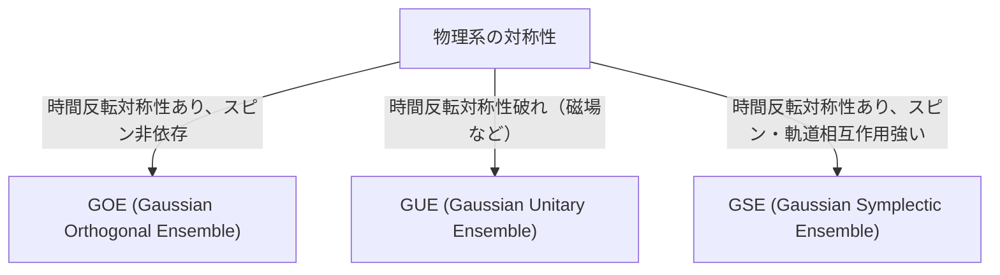

# Introduction: The Surprising Universality of Random Matrix Theory

The world often appears complex and unpredictable, but looking through the lens of mathematics, we sometimes find astonishing commonalities across completely different fields. "Random Matrix Theory" (RMT) is precisely one such mathematical framework with that kind of universality.

A random matrix is a matrix whose elements are given by random variables. At first glance, it may seem like just a random array of numbers, but as the size of the matrix approaches infinity, a surprisingly beautiful and universal law emerges in the distribution of its eigenvalues. This law lies hidden behind entirely different systems, from the microscopic world of atomic nuclei and the mystery of prime number distributions, to price fluctuations in financial markets and the learning dynamics of cutting-edge deep learning models.

In this article, starting from the historical background of random matrix theory, we will explain its mathematical foundations such as the classification of ensembles (GOE/GUE/GSE), the mathematical proof of Wigner's semicircle law, and even its unexpected connection to the Riemann zeta function. In the latter half, we will delve deeply into modern applications like portfolio optimization in financial engineering and the problem of weight initialization in AI and deep learning, accompanied by practical visualizations using Python code.

---

# 1. Birth from Physics: Wigner and the Mystery of Heavy Atomic Nuclei

The roots of random matrix theory trace back to nuclear physics in the 1950s. Physicists at the time were struggling to understand the energy levels (the energy values that quantum mechanical states can take) of heavy atomic nuclei like uranium.

## Energy Levels of Uranium Nuclei

For light atomic nuclei, energy levels can be accurately predicted by calculating the interactions between protons and neutrons according to the Schrödinger equation. However, for heavy atomic nuclei like uranium (e.g., mass number 238) where many nucleons interact complexly, the degrees of freedom are so large that exact calculations are practically impossible.

Looking at experimentally observed neutron scattering data, the resonance energy levels seemed to be ordered chaotically. However, when examining the statistical distribution of the "spacings" between energy levels, it became clear that there was a distinct pattern. Adjacent energy levels possessed a property called "level repulsion," meaning they never got too close to each other.

## Wigner's Intuition and the Discovery of the Semicircle Law

In 1955, Eugene Wigner proposed a bold idea: instead of treating the Hamiltonian (the matrix representing energy) of this complex quantum system as a specific matrix with detailed physical structure, he modeled it as a "giant symmetric matrix whose elements take random values."

Surprisingly, the spacing distribution of the eigenvalues of this highly simplified random matrix perfectly matched the spacing distribution of the actual energy levels of uranium nuclei. Wigner further discovered that in the limit as the matrix size $N$ goes to infinity, the overall density distribution of eigenvalues takes the shape of a semicircle. This is the famous "Wigner's semicircle law."

---

# 2. Classification of Ensembles: GOE, GUE, GSE

Building on Wigner's work, Freeman Dyson systematized the theory of random matrices and classified random matrices into three universal classes (ensembles) based on the symmetries of physical systems. These are known as "Dyson's threefold way."



## Gaussian Orthogonal Ensemble (GOE)

GOE is a set of real symmetric matrices whose elements are real numbers. Each off-diagonal element is chosen independently from a normal distribution with mean 0 and variance 1, while diagonal elements are chosen from a normal distribution with mean 0 and variance 2. GOE is used to model the Hamiltonians of quantum systems where there is no external magnetic field and time-reversal symmetry is preserved (e.g., systems of particles without spin).

## Gaussian Unitary Ensemble (GUE)

GUE is a set of Hermitian matrices whose elements are complex numbers. The real and imaginary parts of the off-diagonal elements each follow independent normal distributions. It is applied to physical systems where time-reversal symmetry is broken, such as in the presence of an external magnetic field. It is this GUE that has a deep connection with the distribution of zeros of the Riemann zeta function, which will be discussed later.

## Gaussian Symplectic Ensemble (GSE)

GSE is a set of self-dual Hermitian matrices whose elements are quaternions. It describes systems where time-reversal symmetry is preserved, but which consist of particles with half-integer spins and strong spin-orbit interactions.

---

# 3. Mathematical Abyss: Proof of Wigner's Semicircle Law

Let us outline the process of proving Wigner's semicircle law, the most fundamental result of random matrix theory, using the Method of Moments.

Consider an $N \times N$ real symmetric matrix $X$ whose elements $X_{ij}$ are mutually independent random variables with mean 0 and variance 1. We seek the limit ($N \to \infty$) of the eigenvalue distribution of the scaled matrix $W = \frac{1}{\sqrt{N}}X$.

## Approach via the Method of Moments

To analyze the empirical distribution function of the eigenvalues, we calculate the $k$-th moment $m_k$ of the distribution. Since the trace (sum of diagonal components) of a matrix is equal to the sum of its eigenvalues, we evaluate:
$$ m_k = \lim_{N \to \infty} \frac{1}{N} \mathbb{E}[\text{Tr}(W^k)] $$

Expanding the trace, we get:
$$ \text{Tr}(W^k) = \frac{1}{N^{k/2}} \sum_{i_1, i_2, \dots, i_k} X_{i_1 i_2} X_{i_2 i_3} \cdots X_{i_k i_1} $$

When taking the expectation value, since the elements $X_{ij}$ have mean 0 and are independent, any term in the expansion where the same element appears only once will have an expectation of 0. To have a non-zero contribution, each edge on the path $i_1 \to i_2 \to \dots \to i_k \to i_1$ must be traversed at least twice.

In the limit $N \to \infty$, the dominant contributions come from paths of exactly $k$ steps that form a "tree" structure, where they explore new vertices and return along the traversed edges exactly once. This is possible only when $k$ is even ($k = 2m$), and the odd moments become 0 in the limit.

## Connection Between Catalan Numbers and the Semicircle Law

The total number of such paths (Dyck paths) of length $2m$ is given by the "[Catalan numbers](/en/p/catalan-numbers/)" $C_m$, famous in combinatorics.
$$ C_m = \frac{1}{m+1} \binom{2m}{m} $$

Therefore, the moments of the limit distribution are:
$$ m_{2m} = C_m, \quad m_{2m+1} = 0 $$

It is known that the probability distribution with these moments is the semicircle distribution (Wigner's semicircle law) supported on the interval $[-2, 2]$. Its probability density function is as follows:
$$ \rho(x) = \begin{cases} \frac{1}{2\pi} \sqrt{4 - x^2} & (-2 \le x \le 2) \\ 0 & (\text{otherwise}) \end{cases} $$

---

# 4. An Unexpected Encounter with the Riemann Zeta Function

Random matrix theory, born to solve physics problems, brought about a discovery of the century in the field of pure mathematics, especially number theory, in the 1970s.

## The Montgomery-Odlyzko Conjecture

In 1972, number theorist Hugh Montgomery was studying the distribution of the spacings between the non-trivial zeros of the Riemann zeta function. According to the Riemann hypothesis, all these zeros lie on the "critical line" (the line with real part 1/2) in the complex plane. Montgomery calculated the pair correlation function of the zeros and derived that it becomes $1 - \left(\frac{\sin(\pi x)}{\pi x}\right)^2$.

One day at teatime at the Institute for Advanced Study in Princeton, Montgomery mentioned this result to physicist Freeman Dyson. Dyson was astounded. This was because the mathematical formula was exactly the same as the spacing distribution of the eigenvalues of the GUE (Gaussian Unitary Ensemble) that Dyson himself had derived.

## The Intersection of Prime Numbers and Quantum Chaos

Later, mathematician Andrew Odlyzko calculated millions of zeros of the zeta function using a supercomputer, and demonstrated that their spacing distribution matched the GUE prediction with astonishing precision.

This discovery, known as the "Montgomery-Odlyzko conjecture," suggests a deep and universal connection between the distribution of prime numbers (the zeros of the zeta function are closely related to the distribution of prime numbers) and quantum chaotic systems (GUE). It was the moment when the mathematics describing the microscopic laws of the universe and the mathematics governing prime numbers, the building blocks of numbers, intersected through the common point of random matrices.

---

# 5. Application to Financial Engineering: The Evolution of Portfolio Optimization

Random matrix theory is applied as a powerful tool in analyzing financial markets, going beyond physics and pure mathematics. It plays a particularly important role in optimizing asset management.

## Limitations of the Markowitz Model

In Harry Markowitz's mean-variance model, the foundation of modern portfolio theory, the optimal investment ratio is determined using the inverse matrix of the asset covariance matrix. However, there was a major problem in practice.

When estimating the sample covariance matrix from the historical return data of $N$ assets over $T$ periods, if $N$ is large and $T$ is not sufficiently large (i.e., $N/T$ is not close to 0), the sample covariance matrix contains a massive amount of statistical noise. When the inverse of this noisy matrix is calculated, the errors are amplified, producing unrealistic and extreme portfolios (instructing extreme shorts or longs on certain assets).

## Noise Cleaning via Random Matrices

Here, random matrix theory comes into play. In 1999, Bouchaud et al. and Laloux et al. independently applied random matrix theory to the covariance matrices of financial markets. They compared the eigenvalue distribution of the covariance matrix obtained from completely random time-series data (the Marchenko-Pastur distribution) with the eigenvalue distribution of the covariance matrix of actual market data.

As a result, they found that the vast majority (over 90%) of the eigenvalues in the market data fell within the theoretical bounds predicted by random matrix theory. In other words, these are merely "noise." On the other hand, it was shown that only a few large eigenvalues that significantly exceed the bounds carry meaningful information reflecting the true correlation structure of the market (market factors and sector factors).

Based on this insight, techniques were developed to "clean" the covariance matrix by filtering out the eigenvalues corresponding to noise (e.g., setting them to zero or replacing them with an average value). This dramatically improved the performance and stability of portfolios and is now used as a standard technique in many quantitative funds.

---

# 6. Application to Artificial Intelligence: Weights and Learning Dynamics in Deep Learning

In recent years, random matrix theory has also been in the spotlight for the theoretical analysis of AI and machine learning, particularly deep learning.

## The Initialization Problem of Neural Networks

When training massive neural networks, how to set the initial values of the network's weight matrices is an extremely important problem that determines the success or failure of learning. If initialization is inappropriate, Gradient Vanishing or Gradient Exploding occurs, and learning does not progress.

When initializing a weight matrix with random values, it is exactly a random matrix. By using random matrix theory, one can rigorously analyze the transition of signal variance as it passes through layers and the behavior of gradients in backpropagation. For example, by analyzing the impact of non-linear activation functions on the spectrum (eigenvalue distribution) of random matrices, the theoretical validity of modern standard initialization methods like Xavier initialization and He initialization has been corroborated.

## Eigenvalue Distribution of the Hessian

To understand the dynamics of the learning process, analyzing the Hessian matrix, which represents the curvature of the loss function, is essential. The Hessian of LLMs (Large Language Models) with tens of millions to hundreds of billions of parameters is a gigantic matrix, and it is difficult to directly investigate its properties, but its eigenvalue distribution can be approximated and predicted using random matrix theory.

Studies show that the eigenvalue distribution of the Hessian of a deep neural network consists of a bulk (a large number of eigenvalues near zero) and a small number of large outliers. The bulk part can be modeled as a noisy random matrix (e.g., directions with little information), while the outliers indicate important learning directions directly tied to the task. Understanding this spectral structure provides highly valuable insights for improving the convergence of optimization algorithms (like SGD, Adam) and optimizing learning rate schedules.

---

# 7. Practice: Visualizing Eigenvalue Distributions with Python

Finally, let's use Python to actually generate GOEs (Gaussian Orthogonal Ensembles) and numerically confirm that Wigner's semicircle law holds.

```python
import numpy as np
import matplotlib.pyplot as plt
from scipy.stats import semicircular

# パラメータ設定
N = 1000  # 行列のサイズ
num_matrices = 50  # アンサンブルのサンプル数

eigenvalues = []

# GOE行列の生成と固有値の計算
for _ in range(num_matrices):
    # 要素がN(0, 1)に従うN x N行列を生成
    X = np.random.randn(N, N)
    # 対称化してGOE行列を作成 (分散のスケーリングに注意)
    A = (X + X.T) / np.sqrt(2)
    # 分散を 1/N にスケーリング
    W = A / np.sqrt(N)
    
    # 固有値を計算（実対称行列なのでeighを使用）
    eigvals = np.linalg.eigh(W)[0]
    eigenvalues.extend(eigvals)

# プロットの設定
plt.figure(figsize=(10, 6))

# 固有値のヒストグラムをプロット
plt.hist(eigenvalues, bins=100, density=True, alpha=0.6, color='skyblue', edgecolor='black', label='Empirical Eigenvalues (GOE)')

# 理論的なウィグナーの半円則をプロット
x = np.linspace(-2.2, 2.2, 1000)
# 半径 R=2 の半円則の確率密度関数
y = np.where(np.abs(x) <= 2, np.sqrt(4 - x**2) / (2 * np.pi), 0)
plt.plot(x, y, 'r-', lw=3, label="Wigner's Semicircle Law")

plt.title(f"Eigenvalue Distribution of GOE Matrices ($N={N}$)", fontsize=16)
plt.xlabel("Eigenvalue", fontsize=14)
plt.ylabel("Density", fontsize=14)
plt.legend(fontsize=12)
plt.grid(True, alpha=0.3)
plt.tight_layout()
plt.show()
```

When you execute this code, you can confirm that the eigenvalues of the randomly generated matrices are distributed in a beautiful semicircular shape. Even though the elements of the individual matrices are completely random, the fact that such an orderly law emerges as a whole is the greatest charm of random matrix theory.

---

# Conclusion

In this article, we followed the epic story of random matrix theory, which began in nuclear physics and connects to pure mathematics, financial engineering, and modern AI technology. The fact that seemingly unrelated complex systems can converse in the common language of "eigenvalues of random matrices" in extreme states demonstrates the mysterious depth of nature and mathematics.

In the modern era, where data is exploding and models continue to grow larger, random matrix theory has evolved from a subject of mere abstract mathematics into a powerful weapon for practical problem solving in data science and machine learning. This theory, which explores the universal truths hidden behind complex systems, will continue to be a light that deepens our understanding across various fields in the future.
