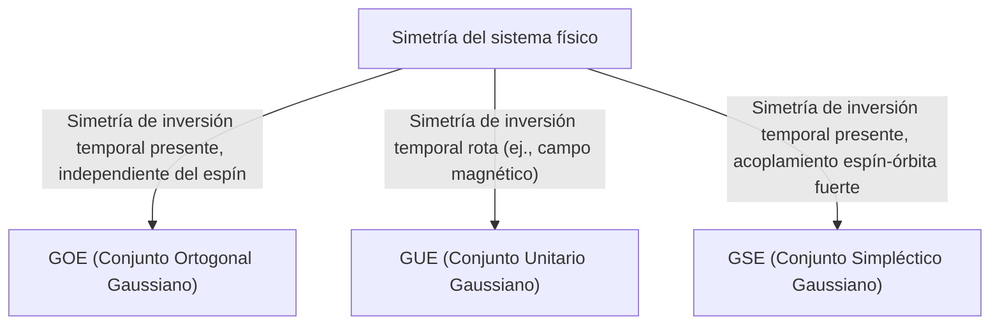

# Introducción: La Sorprendente Universalidad de la Teoría de Matrices Aleatorias

El mundo puede parecer complejo e impredecible, pero a través del lente de las matemáticas, a veces encontramos similitudes sorprendentes en campos completamente diferentes. La "Teoría de Matrices Aleatorias (RMT)" es precisamente uno de esos marcos matemáticos con tal universalidad.

Una matriz aleatoria es una matriz cuyos elementos están dados por variables aleatorias. A primera vista, es simplemente una matriz aleatoria de números, pero a medida que el tamaño de la matriz se acerca al infinito, surge una ley sorprendentemente hermosa y universal en la distribución de sus [valores propios (eigenvalues)](/p/eigenvalues-and-eigenvectors/). Esta ley se esconde detrás de sistemas completamente diferentes, desde el mundo microscópico de los núcleos atómicos, los misterios de la distribución de los números primos y las fluctuaciones de precios en los mercados financieros, hasta la dinámica de aprendizaje de los modelos de aprendizaje profundo de última generación.

En este artículo, comenzando por los antecedentes históricos de la teoría de matrices aleatorias, explicaremos su base matemática como la clasificación de los conjuntos (GOE/GUE/GSE), la demostración matemática de la ley del semicírculo de Wigner e incluso su inesperada conexión con la función zeta de Riemann. En la segunda mitad, profundizaremos en aplicaciones modernas, como la optimización de carteras en la ingeniería financiera y el problema de inicialización de pesos en la IA y el aprendizaje profundo, acompañados de visualizaciones prácticas utilizando código Python.

---

# 1. Nacida de la Física: Wigner y el Misterio de los Núcleos Pesados

Las raíces de la teoría de matrices aleatorias se remontan a la física nuclear en la década de 1950. En ese momento, los físicos luchaban por comprender los niveles de energía (los valores de energía posibles que puede tomar un estado mecánico cuántico) de núcleos pesados como el uranio.

## Niveles de Energía de los Núcleos de Uranio

Para los núcleos ligeros, los niveles de energía se pueden predecir con precisión calculando las interacciones entre protones y neutrones según la ecuación de Schrödinger. Sin embargo, para núcleos pesados donde muchos nucleones interactúan de manera compleja, como el uranio (número de masa 238), los grados de libertad son demasiado grandes, lo que hace que los cálculos rigurosos sean virtualmente imposibles.

Al observar los datos de dispersión de neutrones observados experimentalmente, los niveles de energía de resonancia parecían estar dispuestos al azar. Sin embargo, al examinar la distribución estadística del "espaciado" entre los niveles de energía, se encontró un patrón claro. Los niveles de energía adyacentes tenían una propiedad llamada "repulsión de niveles", en la que nunca se acercan demasiado entre sí.

## La Intuición de Wigner y el Descubrimiento de la Ley del Semicírculo

En 1955, Eugene Wigner propuso una idea audaz: en lugar de tratar el hamiltoniano (la matriz que representa la energía) de este complejo sistema cuántico como una matriz específica con una estructura física detallada, lo modeló como una "enorme matriz simétrica cuyos elementos toman valores aleatorios".

Sorprendentemente, la distribución del espaciado de los [valores propios](/p/eigenvalues-and-eigenvectors/) de esta matriz aleatoria altamente simplificada coincidía perfectamente con la distribución del espaciado de los niveles de energía en los núcleos de uranio reales. Wigner descubrió además que en el límite a medida que el tamaño de la matriz $N$ tiende al infinito, la distribución general de densidad de los [valores propios](/p/eigenvalues-and-eigenvectors/) forma un semicírculo. Esta es la famosa "ley del semicírculo de Wigner".

---

# 2. Clasificación de Conjuntos: GOE, GUE, GSE

Siguiendo la investigación de Wigner, Freeman Dyson sistematizó la teoría de matrices aleatorias y las clasificó en tres clases universales (conjuntos o *ensembles*) en función de las simetrías de los sistemas físicos. Estos se conocen como el "camino triple de Dyson".



## Conjunto Ortogonal Gaussiano (GOE)

El GOE es un conjunto de matrices simétricas reales cuyos elementos consisten en números reales. Cada elemento fuera de la diagonal se extrae independientemente de una distribución normal con media 0 y varianza 1, mientras que los elementos diagonales se extraen de una distribución normal con media 0 y varianza 2. El GOE se utiliza para modelar el hamiltoniano de sistemas cuánticos (por ejemplo, sistemas de partículas sin espín) donde no hay campo magnético externo y se conserva la simetría de inversión temporal.

## Conjunto Unitario Gaussiano (GUE)

El GUE es un conjunto de matrices hermíticas cuyos elementos consisten en números complejos. Las partes real e imaginaria de los elementos fuera de la diagonal siguen cada una distribuciones normales independientes. Se aplica a sistemas físicos en los que se rompe la simetría de inversión temporal, como en presencia de un campo magnético externo. Es precisamente este GUE el que tiene una profunda conexión con la distribución de los ceros de la función zeta de Riemann, que se discutirá más adelante.

## Conjunto Simpléctico Gaussiano (GSE)

El GSE es un conjunto de matrices hermíticas auto-duales cuyos elementos consisten en cuaterniones. Describe sistemas en los que se conserva la simetría de inversión temporal, pero las partículas tienen un espín semientero y fuertes interacciones espín-órbita.

---

# 3. Abismo Matemático: Demostración de la Ley del Semicírculo de Wigner

Repasemos el proceso de demostración de la ley del semicírculo de Wigner, el resultado más fundamental de la teoría de matrices aleatorias, utilizando el Método de los Momentos.

Consideremos una matriz simétrica real $X$ de $N \times N$ cuyos elementos $X_{ij}$ son variables aleatorias mutuamente independientes con media 0 y varianza 1. Buscamos el límite ($N \to \infty$) de la distribución de [valores propios](/p/eigenvalues-and-eigenvectors/) de la matriz escalada $W = \frac{1}{\sqrt{N}}X$.

## Enfoque mediante el Método de los Momentos

Para analizar la función de distribución empírica de los [valores propios](/p/eigenvalues-and-eigenvectors/), calculamos el $k$-ésimo momento $m_k$ de la distribución. Dado que la traza (suma de los elementos diagonales) de una matriz es igual a la suma de sus [valores propios](/p/eigenvalues-and-eigenvectors/), evaluamos:
$$ m_k = \lim_{N \to \infty} \frac{1}{N} \mathbb{E}[\text{Tr}(W^k)] $$

Expandiendo la traza obtenemos:
$$ \text{Tr}(W^k) = \frac{1}{N^{k/2}} \sum_{i_1, i_2, \dots, i_k} X_{i_1 i_2} X_{i_2 i_3} \cdots X_{i_k i_1} $$
Al tomar el valor esperado, dado que los elementos $X_{ij}$ son independientes con media 0, cualquier término expandido donde un elemento aparezca solo una vez tendrá un valor esperado de 0. Para tener una contribución distinta de cero, cada borde del camino $i_1 \to i_2 \to \dots \to i_k \to i_1$ debe recorrerse al menos dos veces.

En el límite $N \to \infty$, la contribución dominante proviene de caminos de exactamente $k$ pasos que forman una estructura de "árbol", explorando nuevos vértices y regresando exactamente una vez a lo largo de cada borde recorrido. Esto es posible solo cuando $k$ es par ($k = 2m$), y los momentos impares se vuelven 0 en el límite.

## Conexión entre los Números de Catalan y la Ley del Semicírculo

El número total de tales caminos (caminos de Dyck) de longitud $2m$ está dado por los "[números de Catalan](/p/catalan-numbers/)" $C_m$, famosos en combinatoria.
$$ C_m = \frac{1}{m+1} \binom{2m}{m} $$

Por lo tanto, los momentos de la distribución límite son:
$$ m_{2m} = C_m, \quad m_{2m+1} = 0 $$
Se sabe que la distribución de probabilidad que tiene estos momentos es la distribución semicircular con soporte en el intervalo $[-2, 2]$ (ley del semicírculo de Wigner). Su función de densidad de probabilidad es la siguiente:
$$ \rho(x) = \begin{cases} \frac{1}{2\pi} \sqrt{4 - x^2} & (-2 \le x \le 2) \\ 0 & (\text{en otro caso}) \end{cases} $$

---

# 4. Encuentro Inesperado con la Función Zeta de Riemann

La teoría de matrices aleatorias, nacida para resolver problemas en física, provocó un descubrimiento del siglo en el campo de las matemáticas puras, especialmente la teoría de números, en la década de 1970.

## Conjetura de Montgomery-Odlyzko

En 1972, el teórico de números Hugh Montgomery estaba estudiando la distribución del espaciado de los ceros no triviales de la función zeta de Riemann. Según la hipótesis de Riemann, todos estos ceros se encuentran en la "línea crítica" (la línea con parte real 1/2) en el plano complejo. Montgomery calculó la función de correlación de pares de los ceros y dedujo que es igual a $1 - \left(\frac{\sin(\pi x)}{\pi x}\right)^2$.

Un día, durante la hora del té en el Instituto de Estudios Avanzados de Princeton, Montgomery le mencionó este resultado al físico Freeman Dyson. Dyson se asombró. ¿Por qué? Porque la fórmula era exactamente la misma que la distribución de espaciado de los [valores propios](/p/eigenvalues-and-eigenvectors/) del GUE (Conjunto Unitario Gaussiano) que el propio Dyson había deducido.

## La Intersección de los Números Primos y el Caos Cuántico

Más tarde, el matemático Andrew Odlyzko calculó millones de ceros de la función zeta utilizando una supercomputadora y demostró que su distribución de espaciado coincidía con las predicciones del GUE con una precisión asombrosa.

Este descubrimiento se conoce como la "conjetura de Montgomery-Odlyzko", lo que sugiere una conexión profunda y universal entre la distribución de los números primos (los ceros de la función zeta están estrechamente relacionados con la distribución de los números primos) y los sistemas caóticos cuánticos (GUE). Fue el momento en el que las matemáticas que describen las leyes microscópicas del universo y las matemáticas que gobiernan los componentes básicos de los números (primos) se cruzaron a través del punto de contacto de las matrices aleatorias.

---

# 5. Aplicaciones en la Ingeniería Financiera: La Evolución de la Optimización de Carteras

La teoría de matrices aleatorias se ha aplicado como una poderosa herramienta no solo en física y matemáticas puras, sino también en el análisis de los mercados financieros. Desempeña un papel especialmente importante en la optimización de la gestión de activos.

## Limitaciones del Modelo de Markowitz

En el modelo de media-varianza de Harry Markowitz, que es la base de la teoría moderna de carteras, las proporciones de inversión óptimas se determinan utilizando la inversa de la matriz de covarianza de los activos. Sin embargo, esto plantea un gran problema en la práctica.

Al estimar la matriz de covarianza muestral a partir de los datos de rendimiento de $N$ activos durante los últimos $T$ períodos, si $N$ es grande y $T$ no es lo suficientemente grande (por lo que $N/T$ no se acerca a 0), la matriz de covarianza muestral contiene una cantidad masiva de ruido estadístico. Al calcular la inversa de esta matriz ruidosa, los errores se amplifican, lo que da como resultado la generación de carteras poco realistas y extremas (por ejemplo, instruyendo posiciones cortas o largas extremas en ciertos activos).

## Limpieza de Ruido con Matrices Aleatorias

Aquí es donde entra en juego la teoría de matrices aleatorias. En 1999, Bouchaud et al. y Laloux et al. aplicaron de forma independiente la teoría de matrices aleatorias a las matrices de covarianza de los mercados financieros. Compararon la distribución de los [valores propios](/p/eigenvalues-and-eigenvectors/) de la matriz de covarianza obtenida a partir de datos de series temporales puramente aleatorios (distribución de Marchenko-Pastur) con la distribución de los [valores propios](/p/eigenvalues-and-eigenvectors/) de la matriz de covarianza de los datos reales del mercado.

Como resultado, descubrieron que la gran mayoría (más del 90%) de los [valores propios](/p/eigenvalues-and-eigenvectors/) de los datos del mercado se encuentran dentro de los límites teóricos previstos por la teoría de matrices aleatorias. En otras palabras, son simplemente "ruido". Por otro lado, se demostró que solo unos pocos [valores propios](/p/eigenvalues-and-eigenvectors/) grandes que superan con creces los límites contienen información significativa que refleja la verdadera estructura de correlación del mercado (como factores de mercado y factores de sector).

Basado en este conocimiento, se han desarrollado métodos para "limpiar" la matriz de covarianza filtrando los [valores propios](/p/eigenvalues-and-eigenvectors/) correspondientes al ruido (por ejemplo, poniéndolos a cero o reemplazándolos por el valor medio). Esto mejora drásticamente el rendimiento y la estabilidad de las carteras, y actualmente se utiliza como una técnica estándar en muchos fondos cuantitativos.

---

# 6. Aplicaciones en Inteligencia Artificial: Pesos y Dinámica de Aprendizaje en el Aprendizaje Profundo

En los últimos años, la teoría de matrices aleatorias también ha sido el centro de atención para el análisis teórico de la IA y el aprendizaje automático, en particular el Aprendizaje Profundo (*Deep Learning*).

## El Problema de Inicialización de las Redes Neuronales

Al entrenar redes neuronales masivas, cómo establecer los valores iniciales de las matrices de pesos de la red es un problema extremadamente importante que determina el éxito o el fracaso del entrenamiento. Si la inicialización es inadecuada, se produce la desaparición del gradiente (*Gradient Vanishing*) o la explosión del gradiente (*Gradient Exploding*), deteniendo el proceso de aprendizaje.

Al inicializar matrices de pesos con valores aleatorios, se trata exactamente de una matriz aleatoria. Al aplicar la teoría de matrices aleatorias, se puede analizar rigurosamente la transición de la varianza de la señal a medida que pasa por las capas y el comportamiento de los gradientes durante la retropropagación (*backpropagation*). Por ejemplo, el análisis del efecto de las funciones de activación no lineales en el espectro (distribución de [valores propios](/p/eigenvalues-and-eigenvectors/)) de matrices aleatorias proporciona justificación teórica para los métodos de inicialización estándar modernos como la inicialización de Xavier y la inicialización de He.

## Distribución de Valores Propios del Hessiano

Comprender la dinámica del proceso de aprendizaje requiere esencialmente analizar la matriz hessiana, que representa la curvatura de la función de pérdida. El hessiano de los [LLM](/p/large-language-models-llm-transformer-prompt-engineering/) ([Modelos de Lenguaje Grande](/p/large-language-models-llm-transformer-prompt-engineering/)) con decenas de millones a cientos de miles de millones de parámetros es una matriz gigantesca, lo que dificulta investigar sus propiedades directamente, pero la teoría de matrices aleatorias se puede utilizar para aproximar y predecir su distribución de [valores propios](/p/eigenvalues-and-eigenvectors/).

Los estudios han demostrado que la distribución de [valores propios](/p/eigenvalues-and-eigenvectors/) del hessiano en redes neuronales profundas consta de un cuerpo principal (*bulk*) (una gran cantidad de [valores propios](/p/eigenvalues-and-eigenvectors/) cerca de cero) y unos pocos valores atípicos grandes (*outliers*). La parte del *bulk* se puede modelar como una matriz aleatoria ruidosa (por ejemplo, direcciones con poca información), mientras que los *outliers* indican direcciones de aprendizaje críticas vinculadas directamente a la tarea. Comprender esta estructura espectral proporciona conocimientos extremadamente valiosos para mejorar la convergencia de los algoritmos de optimización (como SGD y Adam) y optimizar los programas de tasas de aprendizaje.

---

# 7. Práctica: Visualización de la Distribución de Valores Propios con Python

Finalmente, generemos de manera práctica un GOE (Conjunto Ortogonal Gaussiano) usando Python y verifiquemos numéricamente que se cumple la ley del semicírculo de Wigner.

```python
import numpy as np
import matplotlib.pyplot as plt
from scipy.stats import semicircular

# Configuración de parámetros
N = 1000  # Tamaño de la matriz
num_matrices = 50  # Número de muestras en el conjunto

eigenvalues = []

# Generar matrices GOE y calcular los valores propios
for _ in range(num_matrices):
    # Generar una matriz N x N con elementos ~ N(0, 1)
    X = np.random.randn(N, N)
    # Simetrizar para crear una matriz GOE (nota el escalado de la varianza)
    A = (X + X.T) / np.sqrt(2)
    # Escalar la varianza a 1/N
    W = A / np.sqrt(N)
    
    # Calcular los valores propios (usando eigh para matrices simétricas reales)
    eigvals = np.linalg.eigh(W)[0]
    eigenvalues.extend(eigvals)

# Configuración del gráfico
plt.figure(figsize=(10, 6))

# Dibujar el histograma de los valores propios
plt.hist(eigenvalues, bins=100, density=True, alpha=0.6, color='skyblue', edgecolor='black', label='Empirical Eigenvalues (GOE)')

# Dibujar la ley teórica del semicírculo de Wigner
x = np.linspace(-2.2, 2.2, 1000)
# Función de densidad de probabilidad de la ley del semicírculo con radio R=2
y = np.where(np.abs(x) <= 2, np.sqrt(4 - x**2) / (2 * np.pi), 0)
plt.plot(x, y, 'r-', lw=3, label="Wigner's Semicircle Law")

plt.title(f"Eigenvalue Distribution of GOE Matrices ($N={N}$)", fontsize=16)
plt.xlabel("Eigenvalue", fontsize=14)
plt.ylabel("Density", fontsize=14)
plt.legend(fontsize=12)
plt.grid(True, alpha=0.3)
plt.tight_layout()
plt.show()
```

Cuando ejecutas este código, puedes confirmar que los [valores propios](/p/eigenvalues-and-eigenvectors/) de las matrices generadas aleatoriamente se distribuyen en una hermosa forma semicircular. El mayor atractivo de la teoría de matrices aleatorias es que, a pesar de que los elementos de las matrices individuales son completamente aleatorios, surge en su conjunto una ley tan ordenada.

---

# Conclusión

En este artículo, seguimos la gran narrativa de la teoría de matrices aleatorias, comenzando por la física nuclear y extendiéndose a las matemáticas puras, la ingeniería financiera y las tecnologías modernas de inteligencia artificial. El hecho de que sistemas complejos aparentemente no relacionados puedan comunicarse utilizando el lenguaje común de "los [valores propios](/p/eigenvalues-and-eigenvectors/) de matrices aleatorias" en condiciones extremas demuestra la misteriosa profundidad que poseen la naturaleza y las matemáticas.

En la era moderna, donde los datos están explotando y los modelos continúan creciendo enormemente, la teoría de matrices aleatorias está evolucionando de ser un mero tema de matemáticas abstractas a un arma poderosa para resolver problemas prácticos en la ciencia de datos y el aprendizaje automático. Esta teoría, que explora las verdades universales ocultas detrás de los sistemas complejos, sin duda seguirá siendo una luz que profundizará nuestra comprensión en varios campos en el futuro.
