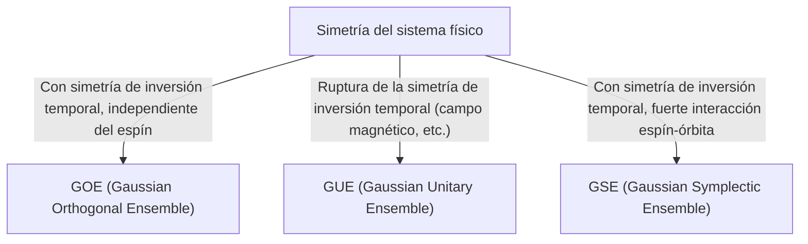

# Introducción: La sorprendente universalidad de la teoría de matrices aleatorias

El mundo parece complejo e impredecible, pero al mirarlo a través del lente de las matemáticas, a veces encontramos sorprendentes puntos en común en campos completamente diferentes. La "Teoría de Matrices Aleatorias (RMT, por sus siglas en inglés)" es precisamente uno de esos marcos matemáticos con tal universalidad.

Una matriz aleatoria es una matriz cuyos elementos están dados por variables aleatorias. A primera vista, es solo una disposición aleatoria de números, pero a medida que el tamaño de la matriz se acerca al infinito, surge una ley sorprendentemente hermosa y universal en la distribución de sus valores propios. Esta ley se esconde detrás de sistemas completamente diferentes, desde el mundo microscópico de los núcleos atómicos hasta el misterio de la distribución de los números primos, las fluctuaciones de precios en los mercados financieros y la dinámica de aprendizaje de los modelos de aprendizaje profundo más avanzados.

En este artículo, comenzaremos con los antecedentes históricos de la teoría de matrices aleatorias y explicaremos su base matemática, la clasificación de ensambles como GOE/GUE/GSE, la prueba matemática de la ley del semicírculo de Wigner, e incluso su inesperada conexión con la función zeta de Riemann. En la segunda mitad, profundizaremos en aplicaciones modernas como la optimización de carteras en ingeniería financiera y el problema de inicialización de pesos en IA y aprendizaje profundo, junto con visualizaciones prácticas usando código Python.

---

# 1. Nacimiento desde la física: Wigner y el misterio de los núcleos atómicos pesados

Las raíces de la teoría de matrices aleatorias se remontan a la física nuclear en la década de 1950. Los físicos de la época luchaban por comprender los niveles de energía (los valores de energía que pueden tomar los estados mecánico-cuánticos) de núcleos atómicos pesados como el uranio.

## Niveles de energía del núcleo de uranio

Para núcleos atómicos ligeros, los niveles de energía pueden predecirse con precisión calculando las interacciones entre protones y neutrones según la ecuación de Schrödinger. Sin embargo, en un núcleo pesado como el uranio (con un número másico como el 238), donde interactúan complejamente un gran número de nucleones, los grados de libertad son tan grandes que los cálculos exactos son prácticamente imposibles.

Al observar los datos de dispersión de neutrones experimentales, los niveles de energía de resonancia parecían estar dispuestos al azar. Sin embargo, al examinar la distribución estadística del "espaciamiento" (spacing) de los niveles de energía, se hizo evidente un patrón claro. Los niveles de energía adyacentes poseían una propiedad llamada "repulsión de niveles" (level repulsion), lo que significa que nunca se acercaban demasiado.

## La intuición de Wigner y el descubrimiento de la ley del semicírculo

En 1955, Eugene Wigner propuso una idea audaz: en lugar de tratar el hamiltoniano (una matriz que representa la energía) de este complejo sistema cuántico como una matriz específica con una estructura física detallada, lo modeló como una "matriz simétrica gigante cuyos elementos toman valores aleatorios".

Sorprendentemente, la distribución del espaciamiento de los valores propios de esta matriz aleatoria extremadamente simplificada coincidía perfectamente con la distribución del espaciamiento de los niveles de energía de un núcleo de uranio real. Wigner descubrió además que en el límite donde el tamaño de la matriz $N$ tiende a infinito, la distribución de densidad general de los valores propios adquiere la forma de un semicírculo. Esta es la famosa "ley del semicírculo de Wigner" (Wigner's semicircle law).

---

# 2. Clasificación de ensambles: GOE, GUE, GSE

Siguiendo el trabajo de Wigner, Freeman Dyson sistematizó la teoría de matrices aleatorias y clasificó las matrices aleatorias en tres clases universales (ensambles) basadas en las simetrías de los sistemas físicos. A estas se les conoce como el "camino triple de Dyson" (Dyson's threefold way).



## Ensamble Ortogonal Gaussiano (GOE)

El GOE es un conjunto de matrices simétricas reales compuestas por números reales. Cada elemento fuera de la diagonal se elige de forma independiente de una distribución normal con media 0 y varianza 1, y los elementos diagonales se eligen de una distribución normal con media 0 y varianza 2. El GOE se utiliza para modelar el hamiltoniano de un sistema cuántico sin un campo magnético externo donde se conserva la simetría de inversión temporal (por ejemplo, un sistema de partículas sin espín).

## Ensamble Unitario Gaussiano (GUE)

El GUE es un conjunto de matrices hermíticas compuestas por números complejos. Las partes real e imaginaria de los elementos no diagonales siguen distribuciones normales independientes. Se aplica a sistemas físicos donde la simetría de inversión temporal se rompe debido a la presencia de un campo magnético externo u otros factores. Es este GUE el que está profundamente relacionado con la distribución de los ceros de la función zeta de Riemann, que se discutirá más adelante.

## Ensamble Simpléctico Gaussiano (GSE)

El GSE es un conjunto de matrices hermíticas autoduales compuestas por cuaterniones. Describe un sistema en el que se conserva la simetría de inversión temporal, pero consiste en partículas con espín semientero y tiene una fuerte interacción espín-órbita.

---

# 3. Profundidad matemática: Prueba de la ley del semicírculo de Wigner

Resumiremos el proceso de probar la ley del semicírculo de Wigner, el resultado más básico de la teoría de matrices aleatorias, utilizando el método de momentos (Method of Moments).

Consideremos una matriz simétrica real de $N \times N$, $X$, donde los elementos $X_{ij}$ son variables aleatorias independientes entre sí, con media 0 y varianza 1. Buscamos el límite ($N \to \infty$) de la distribución de los valores propios de la matriz escalada $W = \frac{1}{\sqrt{N}}X$.

## Enfoque por el método de momentos

Para analizar la función de distribución empírica de los valores propios, calculamos el momento de orden $k$, $m_k$, de la distribución. Como la traza (suma de los elementos diagonales) de una matriz es igual a la suma de sus valores propios, evaluamos:
$$ m_k = \lim_{N \to \infty} \frac{1}{N} \mathbb{E}[\text{Tr}(W^k)] $$

Al expandir la traza, obtenemos:
$$ \text{Tr}(W^k) = \frac{1}{N^{k/2}} \sum_{i_1, i_2, \dots, i_k} X_{i_1 i_2} X_{i_2 i_3} \cdots X_{i_k i_1} $$
Al tomar el valor esperado, dado que los elementos $X_{ij}$ tienen media 0 y son independientes, cualquier término en la expansión en el que un mismo elemento aparezca solo una vez tendrá un valor esperado de 0. Para tener una contribución distinta de cero, cada arista en el camino $i_1 \to i_2 \to \dots \to i_k \to i_1$ debe ser recorrida al menos dos veces.

En el límite $N \to \infty$, la contribución principal proviene de un camino de exactamente $k$ pasos que forma una estructura de "árbol" (tree), explorando nuevos vértices y regresando exactamente una vez por cada arista cruzada. Esto solo es posible si $k$ es un número par ($k = 2m$), y los momentos impares se vuelven 0 en el límite.

## La conexión entre los números de Catalan y la ley del semicírculo

El número total de tales caminos (caminos de Dyck) de longitud $2m$ está dado por los famosos "[números de Catalan](/es/p/catalan-numbers/)" (Catalan numbers), $C_m$, en matemáticas combinatorias.
$$ C_m = \frac{1}{m+1} \binom{2m}{m} $$

Por lo tanto, los momentos de la distribución límite son:
$$ m_{2m} = C_m, \quad m_{2m+1} = 0 $$
Se sabe que la distribución de probabilidad con estos momentos es una distribución de semicírculo (ley del semicírculo de Wigner) apoyada en el intervalo $[-2, 2]$. Su función de densidad de probabilidad es la siguiente:
$$ \rho(x) = \begin{cases} \frac{1}{2\pi} \sqrt{4 - x^2} & (-2 \le x \le 2) \\ 0 & (\text{en caso contrario}) \end{cases} $$

---

# 4. Un encuentro inesperado con la función zeta de Riemann

La teoría de matrices aleatorias, que nació para resolver problemas de física, conduciría a un descubrimiento del siglo en el campo de las matemáticas puras, especialmente en la teoría de números, en la década de 1970.

## La conjetura de Montgomery-Odlyzko

En 1972, el teórico de números Hugh Montgomery estaba estudiando la distribución del espaciamiento de los ceros no triviales de la función zeta de Riemann. Según la hipótesis de Riemann, todos estos ceros se encuentran en la "línea crítica" (la recta con parte real 1/2) en el plano complejo. Montgomery calculó la función de correlación de pares de ceros y derivó que era $1 - \left(\frac{\sin(\pi x)}{\pi x}\right)^2$.

Un día, durante la hora del té en el Instituto de Estudios Avanzados de Princeton, Montgomery compartió este resultado con el físico Freeman Dyson. Dyson quedó asombrado. La razón era que esa fórmula era exactamente la misma que la distribución del espaciamiento de los valores propios del GUE (Ensamble Unitario Gaussiano) que el propio Dyson había derivado.

## La intersección de los números primos y el caos cuántico

Posteriormente, el matemático Andrew Odlyzko utilizó una supercomputadora para calcular millones de ceros de la función zeta, y demostró que la distribución de su espaciamiento coincidía con las predicciones del GUE con una precisión asombrosa.

Este descubrimiento se denomina "conjetura de Montgomery-Odlyzko" y sugiere que existe una profunda conexión universal entre la distribución de los números primos (los ceros de la función zeta están íntimamente relacionados con la distribución de los números primos) y los sistemas caóticos cuánticos (GUE). Fue el momento en que las matemáticas que describen las leyes microscópicas del universo y las matemáticas que gobiernan los componentes básicos de los números, los números primos, se cruzaron a través del punto de contacto que son las matrices aleatorias.

---

# 5. Aplicaciones en ingeniería financiera: La evolución de la optimización de carteras

La teoría de matrices aleatorias no se limita a la física y a las matemáticas puras, sino que también se aplica como una poderosa herramienta en el análisis de los mercados financieros. En particular, juega un papel importante en la optimización de la gestión de activos.

## Las limitaciones del modelo de Markowitz

En el modelo de media-varianza de Harry Markowitz, que es la base de la teoría moderna de carteras, la inversa de la matriz de covarianza de los activos se utiliza para determinar los ratios de inversión óptimos. Sin embargo, había un gran problema en la práctica.

Al estimar la matriz de covarianza muestral a partir de los datos históricos de los rendimientos de $N$ activos durante un período de $T$, si $N$ es grande y $T$ no es lo suficientemente grande (es decir, $N/T$ no está cerca de 0), la matriz de covarianza muestral contendrá una gran cantidad de ruido estadístico. Si calculamos la inversa de esta matriz con ruido, el error se amplifica, y se generan carteras poco realistas y extremas (que indican posiciones cortas o largas extremas en ciertos activos).

## Limpieza de ruido con matrices aleatorias

Aquí es donde entra en juego la teoría de matrices aleatorias. En 1999, Bouchaud et al. y Laloux et al. aplicaron independientemente la teoría de matrices aleatorias a la matriz de covarianza de los mercados financieros. Compararon la distribución de los valores propios de una matriz de covarianza obtenida a partir de datos de series temporales completamente aleatorias (distribución de Marchenko-Pastur) con la distribución de los valores propios de la matriz de covarianza de datos de mercado reales.

Como resultado, se descubrió que la mayoría de los valores propios de los datos de mercado (más del 90%) caen dentro de los límites teóricos predichos por la teoría de matrices aleatorias. Es decir, esto es simplemente "ruido". Por otro lado, se demostró que solo unos pocos valores propios grandes que superan ampliamente los límites contienen información significativa que refleja la verdadera estructura de correlación del mercado (factores de mercado o factores de sector).

Basándose en este conocimiento, se desarrollaron métodos para "limpiar" la matriz de covarianza filtrando los valores propios correspondientes al ruido (por ejemplo, ajustándolos a cero o reemplazándolos por su valor medio). Esto mejora drásticamente el rendimiento y la estabilidad de la cartera, y ahora se utiliza como técnica estándar en muchos fondos cuantitativos.

---

# 6. Aplicaciones en inteligencia artificial: Pesos y dinámica de aprendizaje en el aprendizaje profundo

En los últimos años, la teoría de matrices aleatorias ha ganado protagonismo en el análisis teórico de la IA y el aprendizaje automático, especialmente en el aprendizaje profundo (Deep Learning).

## El problema de inicialización de las redes neuronales

Al entrenar una red neuronal gigante, cómo establecer los valores iniciales de las matrices de pesos de la red es un problema crucial que determina el éxito o fracaso del entrenamiento. Si la inicialización es inapropiada, se producen problemas como la desaparición del gradiente (Gradient Vanishing) o la explosión del gradiente (Gradient Exploding), y el aprendizaje no progresa.

Cuando se inicializa una matriz de pesos con valores aleatorios, es precisamente una matriz aleatoria. Al utilizar la teoría de matrices aleatorias, se puede analizar rigurosamente la transición de la varianza de la señal a medida que pasa por las capas y el comportamiento de los gradientes en la retropropagación. Por ejemplo, analizando el impacto de las funciones de activación no lineales en el espectro (distribución de los valores propios) de una matriz aleatoria, se ha respaldado la justificación teórica de los métodos de inicialización estándar modernos como la inicialización de Xavier o de He.

## La distribución de los valores propios del Hessiano

Para comprender la dinámica del proceso de aprendizaje, es esencial analizar la matriz Hessiana, que representa la curvatura de la función de pérdida. El Hessiano de un LLM (modelo de lenguaje grande) con decenas a cientos de miles de millones de parámetros es una matriz gigantesca, y es difícil investigar directamente sus propiedades, pero la teoría de matrices aleatorias se puede utilizar para aproximar y predecir la distribución de sus valores propios.

Los estudios han demostrado que la distribución de los valores propios del Hessiano de las redes neuronales profundas consiste en un bulto masivo (bulk, una gran cantidad de valores propios cerca de cero) y un pequeño número de valores atípicos grandes (outliers). La porción del bulto se puede modelar como una matriz aleatoria con ruido (por ejemplo, direcciones con poca información), mientras que los valores atípicos indican direcciones de aprendizaje importantes directamente vinculadas a la tarea. Entender esta estructura espectral proporciona conocimientos invaluables para mejorar la convergencia de algoritmos de optimización (SGD, Adam, etc.) u optimizar el programa de la tasa de aprendizaje.

---

# 7. Práctica: Visualización de la distribución de los valores propios con Python

Finalmente, usemos Python para generar de hecho un GOE (Ensamble Ortogonal Gaussiano) y verificar numéricamente que se cumple la ley del semicírculo de Wigner.

```python
import numpy as np
import matplotlib.pyplot as plt
from scipy.stats import semicircular

# パラメータ設定
N = 1000  # 行列のサイズ
num_matrices = 50  # アンサンブルのサンプル数

eigenvalues = []

# GOE行列の生成と固有値の計算
for _ in range(num_matrices):
    # 要素がN(0, 1)に従うN x N行列を生成
    X = np.random.randn(N, N)
    # 対称化してGOE行列を作成 (分散のスケーリングに注意)
    A = (X + X.T) / np.sqrt(2)
    # 分散を 1/N にスケーリング
    W = A / np.sqrt(N)
    
    # 固有値を計算（実対称行列なのでeighを使用）
    eigvals = np.linalg.eigh(W)[0]
    eigenvalues.extend(eigvals)

# プロットの設定
plt.figure(figsize=(10, 6))

# 固有値のヒストグラムをプロット
plt.hist(eigenvalues, bins=100, density=True, alpha=0.6, color='skyblue', edgecolor='black', label='Empirical Eigenvalues (GOE)')

# 理論的なウィグナーの半円則をプロット
x = np.linspace(-2.2, 2.2, 1000)
# 半径 R=2 の半円則の確率密度関数
y = np.where(np.abs(x) <= 2, np.sqrt(4 - x**2) / (2 * np.pi), 0)
plt.plot(x, y, 'r-', lw=3, label="Wigner's Semicircle Law")

plt.title(f"Eigenvalue Distribution of GOE Matrices ($N={N}$)", fontsize=16)
plt.xlabel("Eigenvalue", fontsize=14)
plt.ylabel("Density", fontsize=14)
plt.legend(fontsize=12)
plt.grid(True, alpha=0.3)
plt.tight_layout()
plt.show()
```

Al ejecutar este código, se puede confirmar que los valores propios de la matriz generada aleatoriamente se distribuyen en la forma de un hermoso semicírculo. A pesar de que los elementos de cada matriz individual son completamente aleatorios, el mayor atractivo de la teoría de matrices aleatorias radica en el hecho de que en su conjunto surge una ley tan ordenada.

---

# Conclusión

En este artículo, hemos seguido la gran historia de la teoría de matrices aleatorias, que comenzó con la física nuclear y ha llevado a las matemáticas puras, la ingeniería financiera y las modernas tecnologías de inteligencia artificial. El hecho de que sistemas complejos aparentemente no relacionados puedan hablar entre sí en el límite utilizando un lenguaje común de "valores propios de matrices aleatorias" demuestra la profundidad misteriosa de la naturaleza y las matemáticas.

En la era moderna, donde los datos se están disparando y los modelos continúan creciendo, la teoría de matrices aleatorias ha evolucionado de ser un mero objeto de matemáticas abstractas a un arma poderosa para la resolución práctica de problemas en ciencia de datos y aprendizaje automático. Esta teoría, que explora verdades universales ocultas detrás de sistemas complejos, sin duda seguirá siendo una luz para profundizar nuestra comprensión en diversos campos.
