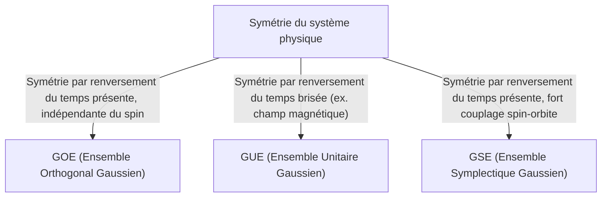

# Introduction : La Surprenante Universalité de la Théorie des Matrices Aléatoires

Le monde peut sembler complexe et imprévisible, mais à travers le prisme des mathématiques, nous trouvons parfois des similitudes surprenantes dans des domaines complètement différents. La « Théorie des Matrices Aléatoires (RMT) » est précisément l'un de ces cadres mathématiques dotés d'une telle universalité.

Une matrice aléatoire est une matrice dont les éléments sont donnés par des variables aléatoires. À première vue, il ne s'agit que d'un tableau de nombres aléatoires, mais lorsque la taille de la matrice s'approche de l'infini, une loi étonnamment belle et universelle émerge dans la distribution de ses [valeurs propres](/fr/p/eigenvalues-and-eigenvectors/). Cette loi se cache derrière des systèmes entièrement différents, du monde microscopique des noyaux atomiques, aux mystères de la distribution des nombres premiers, en passant par les fluctuations des prix sur les marchés financiers, jusqu'à la dynamique d'apprentissage des modèles d'apprentissage profond de pointe.

Dans cet article, en partant du contexte historique de la théorie des matrices aléatoires, nous expliquerons ses fondements mathématiques tels que la classification des ensembles (GOE/GUE/GSE), la preuve mathématique de la loi du demi-cercle de Wigner, et même son lien inattendu avec la fonction zêta de Riemann. Dans la seconde moitié, nous plongerons profondément dans des applications modernes, comme l'optimisation de portefeuille en ingénierie financière et le problème d'initialisation des poids dans l'IA et l'apprentissage profond, accompagnés de visualisations pratiques à l'aide de code Python.

---

# 1. Née de la Physique : Wigner et le Mystère des Noyaux Lourds

Les racines de la théorie des matrices aléatoires remontent à la physique nucléaire des années 1950. À l'époque, les physiciens s'efforçaient de comprendre les niveaux d'énergie (les valeurs d'énergie possibles qu'un état quantique peut prendre) des noyaux lourds comme l'uranium.

## Niveaux d'Énergie des Noyaux d'Uranium

Pour les noyaux légers, les niveaux d'énergie peuvent être prédits avec précision en calculant les interactions entre les protons et les neutrons selon l'équation de Schrödinger. Cependant, pour les noyaux lourds où de nombreux nucléons interagissent de manière complexe, comme l'uranium (nombre de masse 238), les degrés de liberté sont trop grands, ce qui rend les calculs rigoureux virtuellement impossibles.

En examinant les données de diffusion des neutrons observées expérimentalement, les niveaux d'énergie de résonance semblaient être disposés de manière aléatoire. Cependant, en examinant la distribution statistique de « l'espacement » entre les niveaux d'énergie, un modèle clair a été découvert. Les niveaux d'énergie adjacents présentaient une propriété appelée « répulsion des niveaux », où ils ne s'approchent jamais trop l'un de l'autre.

## L'Intuition de Wigner et la Découverte de la Loi du Demi-Cercle

En 1955, Eugene Wigner proposa une idée audacieuse : au lieu de traiter le hamiltonien (la matrice représentant l'énergie) de ce système quantique complexe comme une matrice spécifique avec une structure physique détaillée, il le modélisa comme une « immense matrice symétrique dont les éléments prennent des valeurs aléatoires ».

Étonnamment, la distribution de l'espacement des [valeurs propres](/fr/p/eigenvalues-and-eigenvectors/) de cette matrice aléatoire hautement simplifiée correspondait parfaitement à la distribution de l'espacement des niveaux d'énergie dans les véritables noyaux d'uranium. Wigner découvrit en outre qu'à la limite où la taille de la matrice $N$ tend vers l'infini, la distribution globale de la densité des [valeurs propres](/fr/p/eigenvalues-and-eigenvectors/) forme un demi-cercle. C'est la célèbre « loi du demi-cercle de Wigner ».

---

# 2. Classification des Ensembles : GOE, GUE, GSE

Suite aux recherches de Wigner, Freeman Dyson systématisa la théorie des matrices aléatoires et les classa en trois classes universelles (ensembles) basées sur les symétries des systèmes physiques. Celles-ci sont connues sous le nom de « voie triple de Dyson ».



## Ensemble Orthogonal Gaussien (GOE)

Le GOE est un ensemble de matrices symétriques réelles dont les éléments sont constitués de nombres réels. Chaque élément hors diagonale est tiré indépendamment d'une distribution normale de moyenne 0 et de variance 1, tandis que les éléments diagonaux sont tirés d'une distribution normale de moyenne 0 et de variance 2. Le GOE est utilisé pour modéliser le hamiltonien des systèmes quantiques (par exemple, les systèmes de particules sans spin) où il n'y a pas de champ magnétique externe et où la symétrie par renversement du temps est préservée.

## Ensemble Unitaire Gaussien (GUE)

Le GUE est un ensemble de matrices hermitiennes dont les éléments sont constitués de nombres complexes. Les parties réelle et imaginaire des éléments hors diagonale suivent chacune des distributions normales indépendantes. Il est appliqué aux systèmes physiques où la symétrie par renversement du temps est brisée, comme en présence d'un champ magnétique externe. C'est précisément ce GUE qui a un lien profond avec la distribution des zéros de la fonction zêta de Riemann, dont nous parlerons plus tard.

## Ensemble Symplectique Gaussien (GSE)

Le GSE est un ensemble de matrices hermitiennes auto-duales dont les éléments sont constitués de quaternions. Il décrit des systèmes où la symétrie par renversement du temps est préservée, mais où les particules ont un spin demi-entier et de fortes interactions spin-orbite.

---

# 3. Abîme Mathématique : Preuve de la Loi du Demi-Cercle de Wigner

Donnons un aperçu du processus de preuve de la loi du demi-cercle de Wigner, le résultat le plus fondamental de la théorie des matrices aléatoires, en utilisant la méthode des moments.

Considérons une matrice symétrique réelle $X$ de taille $N \times N$ dont les éléments $X_{ij}$ sont des variables aléatoires mutuellement indépendantes de moyenne 0 et de variance 1. Nous cherchons la limite ($N \to \infty$) de la distribution des [valeurs propres](/fr/p/eigenvalues-and-eigenvectors/) de la matrice mise à l'échelle $W = \frac{1}{\sqrt{N}}X$.

## Approche par la Méthode des Moments

Pour analyser la fonction de distribution empirique des [valeurs propres](/fr/p/eigenvalues-and-eigenvectors/), nous calculons le $k$-ième moment $m_k$ de la distribution. Puisque la trace (somme des éléments diagonaux) d'une matrice est égale à la somme de ses [valeurs propres](/fr/p/eigenvalues-and-eigenvectors/), nous évaluons :
$$ m_k = \lim_{N \to \infty} \frac{1}{N} \mathbb{E}[\text{Tr}(W^k)] $$

Le développement de la trace donne :
$$ \text{Tr}(W^k) = \frac{1}{N^{k/2}} \sum_{i_1, i_2, \dots, i_k} X_{i_1 i_2} X_{i_2 i_3} \cdots X_{i_k i_1} $$
En prenant l'espérance mathématique, puisque les éléments $X_{ij}$ sont indépendants de moyenne 0, tout terme développé où un élément n'apparaît qu'une fois aura une espérance de 0. Pour avoir une contribution non nulle, chaque arête sur le chemin $i_1 \to i_2 \to \dots \to i_k \to i_1$ doit être traversée au moins deux fois.

À la limite $N \to \infty$, la contribution dominante provient des chemins d'exactement $k$ pas qui forment une structure en « arbre », explorant de nouveaux sommets et revenant exactement une fois le long de chaque arête traversée. Cela n'est possible que lorsque $k$ est pair ($k = 2m$), et les moments impairs deviennent 0 à la limite.

## Lien Entre les Nombres de Catalan et la Loi du Demi-Cercle

Le nombre total de tels chemins (chemins de Dyck) de longueur $2m$ est donné par les « [nombres de Catalan](/fr/p/catalan-numbers/) » $C_m$, célèbres en combinatoire.
$$ C_m = \frac{1}{m+1} \binom{2m}{m} $$

Par conséquent, les moments de la distribution limite sont :
$$ m_{2m} = C_m, \quad m_{2m+1} = 0 $$
On sait que la distribution de probabilité ayant ces moments est la distribution en demi-cercle supportée sur l'intervalle $[-2, 2]$ (loi du demi-cercle de Wigner). Sa fonction de densité de probabilité est la suivante :
$$ \rho(x) = \begin{cases} \frac{1}{2\pi} \sqrt{4 - x^2} & (-2 \le x \le 2) \\ 0 & (\text{sinon}) \end{cases} $$

---

# 4. Rencontre Inattendue avec la Fonction Zêta de Riemann

La théorie des matrices aléatoires, née pour résoudre des problèmes de physique, a apporté une découverte du siècle dans le domaine des mathématiques pures, en particulier la théorie des nombres, dans les années 1970.

## Conjecture de Montgomery-Odlyzko

En 1972, le théoricien des nombres Hugh Montgomery étudiait la distribution de l'espacement des zéros non triviaux de la fonction zêta de Riemann. Selon l'hypothèse de Riemann, tous ces zéros se trouvent sur la « ligne critique » (la ligne dont la partie réelle est 1/2) dans le plan complexe. Montgomery a calculé la fonction de corrélation de paires des zéros et en a déduit qu'elle est égale à $1 - \left(\frac{\sin(\pi x)}{\pi x}\right)^2$.

Un jour, lors de l'heure du thé à l'Institute for Advanced Study de Princeton, Montgomery a mentionné ce résultat au physicien Freeman Dyson. Dyson fut stupéfait. Pourquoi ? Parce que la formule était exactement la même que la distribution de l'espacement des [valeurs propres](/fr/p/eigenvalues-and-eigenvectors/) du GUE (Ensemble Unitaire Gaussien) que Dyson lui-même avait dérivée.

## L'Intersection des Nombres Premiers et du Chaos Quantique

Plus tard, le mathématicien Andrew Odlyzko a calculé des millions de zéros de la fonction zêta à l'aide d'un superordinateur et a démontré que leur distribution de l'espacement correspondait aux prédictions du GUE avec une précision étonnante.

Cette découverte est connue sous le nom de « conjecture de Montgomery-Odlyzko », suggérant un lien profond et universel entre la distribution des nombres premiers (les zéros de la fonction zêta sont étroitement liés à la distribution des nombres premiers) et les systèmes chaotiques quantiques (GUE). Ce fut le moment où les mathématiques décrivant les lois microscopiques de l'univers et les mathématiques régissant les éléments de base des nombres (les nombres premiers) se sont croisées par le point de contact des matrices aléatoires.

---

# 5. Applications à l'Ingénierie Financière : L'Évolution de l'Optimisation de Portefeuille

La théorie des matrices aléatoires a été appliquée comme un outil puissant non seulement en physique et en mathématiques pures, mais aussi dans l'analyse des marchés financiers. Elle joue un rôle particulièrement important dans l'optimisation de la gestion d'actifs.

## Limites du Modèle de Markowitz

Dans le modèle moyenne-variance de Harry Markowitz, qui est le fondement de la théorie moderne de portefeuille, les ratios d'investissement optimaux sont déterminés en utilisant l'inverse de la matrice de covariance des actifs. Cependant, cela pose un problème majeur dans la pratique.

Lors de l'estimation de la matrice de covariance empirique à partir des données de rendement de $N$ actifs sur les $T$ périodes écoulées, si $N$ est grand et $T$ n'est pas suffisamment grand (donc $N/T$ n'est pas proche de 0), la matrice de covariance empirique contient une quantité massive de bruit statistique. Lors du calcul de l'inverse de cette matrice bruitée, les erreurs sont amplifiées, ce qui entraîne la génération de portefeuilles irréalistes et extrêmes (par exemple, ordonnant des positions courtes ou longues extrêmes sur certains actifs).

## Nettoyage du Bruit avec des Matrices Aléatoires

C'est là qu'intervient la théorie des matrices aléatoires. En 1999, Bouchaud et al. et Laloux et al. ont indépendamment appliqué la théorie des matrices aléatoires aux matrices de covariance des marchés financiers. Ils ont comparé la distribution des [valeurs propres](/fr/p/eigenvalues-and-eigenvectors/) de la matrice de covariance obtenue à partir de données de séries chronologiques purement aléatoires (distribution de Marchenko-Pastur) avec la distribution des [valeurs propres](/fr/p/eigenvalues-and-eigenvectors/) de la matrice de covariance des données de marché réelles.

En conséquence, ils ont constaté que la grande majorité (plus de 90 %) des [valeurs propres](/fr/p/eigenvalues-and-eigenvectors/) des données de marché se situent dans les limites théoriques prédites par la théorie des matrices aléatoires. En d'autres termes, ce ne sont que des « bruits ». D'autre part, il a été démontré que seules quelques grandes [valeurs propres](/fr/p/eigenvalues-and-eigenvectors/) qui dépassent largement les limites contiennent des informations significatives reflétant la véritable structure de corrélation du marché (telles que les facteurs de marché et les facteurs sectoriels).

Sur la base de ces connaissances, des méthodes ont été développées pour « nettoyer » la matrice de covariance en filtrant les [valeurs propres](/fr/p/eigenvalues-and-eigenvectors/) correspondant au bruit (par exemple, en les mettant à zéro ou en les remplaçant par la valeur moyenne). Cela améliore considérablement les performances et la stabilité des portefeuilles, et est actuellement utilisé comme technique standard dans de nombreux fonds quantitatifs.

---

# 6. Applications à l'Intelligence Artificielle : Poids et Dynamique d'Apprentissage dans l'Apprentissage Profond

Ces dernières années, la théorie des matrices aléatoires a également été sous les feux de la rampe pour l'analyse théorique de l'IA et de l'apprentissage automatique, en particulier l'Apprentissage Profond (Deep Learning).

## Le Problème d'Initialisation des Réseaux de Neurones

Lors de l'entraînement de réseaux de neurones massifs, la façon de définir les valeurs initiales des matrices de poids du réseau est un problème extrêmement important qui détermine le succès ou l'échec de l'entraînement. Si l'initialisation est inappropriée, il se produit une disparition du gradient (Gradient Vanishing) ou une explosion du gradient (Gradient Exploding), ce qui arrête le processus d'apprentissage.

Lors de l'initialisation des matrices de poids avec des valeurs aléatoires, il s'agit exactement d'une matrice aléatoire. En appliquant la théorie des matrices aléatoires, on peut analyser rigoureusement la transition de la variance du signal lorsqu'il traverse les couches et le comportement des gradients lors de la rétropropagation (backpropagation). Par exemple, l'analyse de l'effet des fonctions d'activation non linéaires sur le spectre (distribution des [valeurs propres](/fr/p/eigenvalues-and-eigenvectors/)) des matrices aléatoires fournit une justification théorique pour les méthodes d'initialisation standard modernes comme l'initialisation de Xavier et l'initialisation de He.

## Distribution des Valeurs Propres du Hessien

La compréhension de la dynamique du processus d'apprentissage nécessite essentiellement l'analyse de la matrice hessienne, qui représente la courbure de la fonction de perte. Le hessien des [LLM](/fr/p/large-language-models-llm-transformer-prompt-engineering/) ([Grands Modèles de Langage](/fr/p/large-language-models-llm-transformer-prompt-engineering/)) comportant des dizaines de millions à des centaines de milliards de paramètres est une matrice gigantesque, ce qui rend difficile l'étude directe de ses propriétés, mais la théorie des matrices aléatoires peut être utilisée pour approcher et prédire la distribution de ses [valeurs propres](/fr/p/eigenvalues-and-eigenvectors/).

Des études ont montré que la distribution des [valeurs propres](/fr/p/eigenvalues-and-eigenvectors/) du hessien dans les réseaux de neurones profonds se compose d'une masse (un grand nombre de [valeurs propres](/fr/p/eigenvalues-and-eigenvectors/) proches de zéro) et de quelques valeurs aberrantes importantes (outliers). La partie de masse peut être modélisée comme une matrice aléatoire bruitée (par exemple, des directions contenant peu d'informations), tandis que les valeurs aberrantes indiquent des directions d'apprentissage critiques directement liées à la tâche. La compréhension de cette structure spectrale fournit des informations extrêmement précieuses pour améliorer la convergence des algorithmes d'optimisation (comme SGD et Adam) et optimiser les planifications de taux d'apprentissage.

---

# 7. Pratique : Visualisation de la Distribution des Valeurs Propres avec Python

Enfin, générons de manière pratique un GOE (Ensemble Orthogonal Gaussien) en utilisant Python et vérifions numériquement que la loi du demi-cercle de Wigner est vérifiée.

```python
import numpy as np
import matplotlib.pyplot as plt
from scipy.stats import semicircular

# Paramètres
N = 1000  # Taille de la matrice
num_matrices = 50  # Nombre d'échantillons dans l'ensemble

eigenvalues = []

# Génération des matrices GOE et calcul des valeurs propres
for _ in range(num_matrices):
    # Générer une matrice N x N avec des éléments ~ N(0, 1)
    X = np.random.randn(N, N)
    # Symétriser pour créer une matrice GOE (notez l'échelle de la variance)
    A = (X + X.T) / np.sqrt(2)
    # Mettre à l'échelle la variance à 1/N
    W = A / np.sqrt(N)
    
    # Calculer les valeurs propres (utilisation de eigh pour les matrices symétriques réelles)
    eigvals = np.linalg.eigh(W)[0]
    eigenvalues.extend(eigvals)

# Paramètres d'affichage
plt.figure(figsize=(10, 6))

# Tracer l'histogramme des valeurs propres
plt.hist(eigenvalues, bins=100, density=True, alpha=0.6, color='skyblue', edgecolor='black', label='Empirical Eigenvalues (GOE)')

# Tracer la loi théorique du demi-cercle de Wigner
x = np.linspace(-2.2, 2.2, 1000)
# Fonction de densité de probabilité de la loi du demi-cercle avec rayon R=2
y = np.where(np.abs(x) <= 2, np.sqrt(4 - x**2) / (2 * np.pi), 0)
plt.plot(x, y, 'r-', lw=3, label="Wigner's Semicircle Law")

plt.title(f"Eigenvalue Distribution of GOE Matrices ($N={N}$)", fontsize=16)
plt.xlabel("Eigenvalue", fontsize=14)
plt.ylabel("Density", fontsize=14)
plt.legend(fontsize=12)
plt.grid(True, alpha=0.3)
plt.tight_layout()
plt.show()
```

Lorsque vous exécutez ce code, vous pouvez confirmer que les [valeurs propres](/fr/p/eigenvalues-and-eigenvectors/) des matrices générées aléatoirement sont distribuées sous la forme d'un magnifique demi-cercle. Le plus grand attrait de la théorie des matrices aléatoires est que, même si les éléments des matrices individuelles sont complètement aléatoires, une loi aussi ordonnée émerge dans son ensemble.

---

# Conclusion

Dans cet article, nous avons suivi le grand récit de la théorie des matrices aléatoires, en partant de la physique nucléaire pour s'étendre aux mathématiques pures, à l'ingénierie financière et aux technologies modernes de l'IA. Le fait que des systèmes complexes apparemment sans rapport puissent communiquer en utilisant le langage commun des « [valeurs propres](/fr/p/eigenvalues-and-eigenvectors/) des matrices aléatoires » dans des conditions extrêmes démontre la profondeur mystérieuse que possèdent la nature et les mathématiques.

À l'ère moderne, où les données explosent et les modèles continuent de croître énormément, la théorie des matrices aléatoires évolue d'un simple sujet de mathématiques abstraites à une arme puissante pour résoudre des problèmes pratiques dans la science des données et l'apprentissage automatique. Cette théorie, qui explore les vérités universelles cachées derrière les systèmes complexes, continuera sans aucun doute d'être une lumière qui approfondira notre compréhension dans divers domaines à l'avenir.
