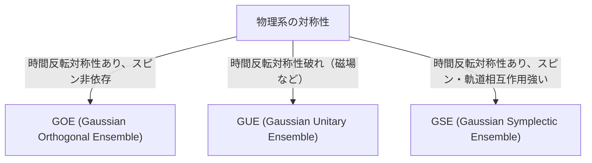

# Introduction : L'étonnante universalité de la théorie des matrices aléatoires

Le monde semble complexe et imprévisible, mais à travers le prisme des mathématiques, on peut parfois trouver des points communs surprenants dans des domaines complètement différents. La "Théorie des matrices aléatoires (Random Matrix Theory, RMT)" est précisément l'un de ces cadres mathématiques doté d'une telle universalité.

Une matrice aléatoire est une matrice dont les éléments sont donnés par des variables aléatoires. À première vue, il ne s'agit que d'un arrangement aléatoire de nombres, mais lorsque la taille de la matrice s'approche de l'infini, une loi étonnamment belle et universelle apparaît dans la distribution de ses valeurs propres. Cette loi se cache derrière des systèmes complètement différents, du monde microscopique des noyaux atomiques aux mystères de la distribution des nombres premiers, en passant par les fluctuations de prix sur les marchés financiers et la dynamique d'apprentissage des modèles d'apprentissage profond de pointe.

Dans cet article, nous commencerons par le contexte historique de la théorie des matrices aléatoires, et nous expliquerons ses fondements mathématiques tels que la classification des ensembles GOE/GUE/GSE, la preuve mathématique de la loi du demi-cercle de Wigner, et même son lien inattendu avec la fonction zêta de Riemann. Dans la seconde moitié, nous approfondirons les applications modernes telles que l'optimisation de portefeuille en ingénierie financière et le problème de l'initialisation des poids en IA/apprentissage profond, tout en intégrant des visualisations pratiques à l'aide de code Python.

---

# 1. Naissance à partir de la physique : Wigner et le mystère des noyaux lourds

Les racines de la théorie des matrices aléatoires remontent à la physique nucléaire des années 1950. À l'époque, les physiciens luttaient pour comprendre les niveaux d'énergie (les valeurs d'énergie possibles pour un état quantique) des noyaux lourds comme l'uranium.

## Niveaux d'énergie du noyau d'uranium

Pour les noyaux légers, les niveaux d'énergie peuvent être prédits avec précision en calculant l'interaction entre les protons et les neutrons selon l'équation de Schrödinger. Cependant, dans les noyaux lourds où de nombreux nucléons interagissent de manière complexe, comme l'uranium (nombre de masse 238, etc.), les degrés de liberté sont trop importants pour que des calculs stricts soient réalisables en pratique.

En observant les données de diffusion des neutrons obtenues expérimentalement, les niveaux d'énergie de résonance semblaient être disposés de manière désordonnée. Cependant, en examinant la distribution statistique de "l'espacement" (spacing) des niveaux d'énergie, il s'est avéré qu'il y avait un modèle clair. Les niveaux d'énergie adjacents possédaient une propriété appelée "répulsion de niveau" (level repulsion), où ils ne se rapprochent jamais trop.

## L'intuition de Wigner et la découverte de la loi du demi-cercle

En 1955, Eugene Wigner a proposé l'idée audacieuse de modéliser le hamiltonien (la matrice représentant l'énergie) de ce système quantique complexe non pas comme une matrice spécifique avec une structure physique détaillée, mais comme une "matrice symétrique géante dont les éléments prennent des valeurs aléatoires".

Étonnamment, la distribution des espacements des valeurs propres de cette matrice aléatoire extrêmement simplifiée correspondait parfaitement à la distribution des espacements des niveaux d'énergie des noyaux d'uranium réels. Wigner a également découvert que dans la limite où la taille de la matrice $N$ tend vers l'infini, la distribution globale de la densité des valeurs propres prend la forme d'un demi-cercle. C'est la célèbre "loi du demi-cercle de Wigner" (Wigner's semicircle law).

---

# 2. Classification des ensembles : GOE, GUE, GSE

Suite aux travaux de Wigner, Freeman Dyson a systématisé la théorie des matrices aléatoires et a classé les matrices aléatoires en trois classes universelles (ensembles) basées sur la symétrie du système physique. Celles-ci sont appelées la "triple voie de Dyson" (Dyson's threefold way).



## Ensemble orthogonal gaussien (GOE)

Le GOE est un ensemble de matrices symétriques réelles dont les éléments sont constitués de nombres réels. Chaque élément non diagonal est choisi indépendamment dans une distribution normale de moyenne 0 et de variance 1, et les éléments diagonaux sont choisis dans une distribution normale de moyenne 0 et de variance 2. Le GOE est utilisé pour modéliser le hamiltonien de systèmes quantiques (par exemple, des systèmes de particules sans spin) sans champ magnétique externe et où la symétrie d'inversion temporelle est préservée.

## Ensemble unitaire gaussien (GUE)

Le GUE est un ensemble de matrices hermitiennes dont les éléments sont constitués de nombres complexes. Les parties réelles et imaginaires des éléments non diagonaux suivent des distributions normales indépendantes. Il est appliqué aux systèmes physiques où la symétrie d'inversion temporelle est rompue, par exemple en raison de la présence d'un champ magnétique externe. C'est ce GUE qui a un lien profond avec la distribution des zéros de la fonction zêta de Riemann, décrite plus loin.

## Ensemble symplectique gaussien (GSE)

Le GSE est un ensemble de matrices hermitiennes autoduales dont les éléments sont constitués de quaternions. Bien que la symétrie d'inversion temporelle soit préservée, il décrit un système composé de particules à spin demi-entier et présentant une forte interaction spin-orbite.

---

# 3. L'abîme mathématique : Preuve de la loi du demi-cercle de Wigner

Nous allons donner un aperçu du processus de démonstration de la loi du demi-cercle de Wigner, le résultat le plus fondamental de la théorie des matrices aléatoires, en utilisant la méthode des moments (Method of Moments).

Considérons une matrice symétrique réelle $X$ de taille $N \times N$, dont les éléments $X_{ij}$ sont des variables aléatoires indépendantes avec une moyenne de 0 et une variance de 1. Nous cherchons la limite ($N \to \infty$) de la distribution des valeurs propres de la matrice mise à l'échelle $W = \frac{1}{\sqrt{N}}X$.

## Approche par la méthode des moments

Pour analyser la fonction de distribution empirique des valeurs propres, nous calculons le moment d'ordre $k$ de la distribution, $m_k$. Puisque la trace de la matrice (la somme des éléments diagonaux) est égale à la somme des valeurs propres, nous évaluons :
$$ m_k = \lim_{N \to \infty} \frac{1}{N} \mathbb{E}[\text{Tr}(W^k)] $$

En développant la trace, nous obtenons :
$$ \text{Tr}(W^k) = \frac{1}{N^{k/2}} \sum_{i_1, i_2, \dots, i_k} X_{i_1 i_2} X_{i_2 i_3} \cdots X_{i_k i_1} $$

Lors de la prise de l'espérance, puisque les éléments $X_{ij}$ ont une moyenne de 0 et sont indépendants, les termes du développement dans lesquels le même élément n'apparaît qu'une seule fois auront une espérance de 0. Pour avoir une contribution non nulle, chaque arête sur le chemin $i_1 \to i_2 \to \dots \to i_k \to i_1$ doit être traversée au moins deux fois.

Dans la limite $N \to \infty$, la contribution principale provient des chemins d'exactement $k$ pas qui forment une structure en "arbre" (tree), explorant de nouveaux sommets et retournant sur les arêtes traversées exactement une fois chacune. Cela n'est possible que si $k$ est pair ($k = 2m$), et les moments d'ordre impair deviennent 0 à la limite.

## Lien entre les nombres de Catalan et la loi du demi-cercle

Le nombre total de ces chemins (chemins de Dyck) de longueur $2m$ est donné par les célèbres "[nombres de Catalan](/fr/p/catalan-numbers/)" (Catalan numbers) $C_m$ en mathématiques combinatoires.
$$ C_m = \frac{1}{m+1} \binom{2m}{m} $$

Par conséquent, les moments de la distribution limite sont :
$$ m_{2m} = C_m, \quad m_{2m+1} = 0 $$

On sait que la distribution de probabilité ayant ces moments est une distribution en demi-cercle (la loi du demi-cercle de Wigner) avec un support sur l'intervalle $[-2, 2]$. Sa fonction de densité de probabilité est la suivante :
$$ \rho(x) = \begin{cases} \frac{1}{2\pi} \sqrt{4 - x^2} & (-2 \le x \le 2) \\ 0 & (\text{sinon}) \end{cases} $$

---

# 4. Rencontre inattendue avec la fonction zêta de Riemann

La théorie des matrices aléatoires, née pour résoudre des problèmes de physique, allait apporter une découverte majeure dans les années 1970 dans le domaine des mathématiques pures, en particulier la théorie des nombres.

## La conjecture de Montgomery-Odlyzko

En 1972, le théoricien des nombres Hugh Montgomery étudiait la distribution des espacements des zéros non triviaux de la fonction zêta de Riemann. Selon l'hypothèse de Riemann, tous ces zéros se trouvent sur la "ligne critique" (la ligne où la partie réelle est de 1/2) dans le plan complexe. Montgomery a calculé la fonction de corrélation des paires de zéros et en a déduit qu'elle valait $1 - \left(\frac{\sin(\pi x)}{\pi x}\right)^2$.

Un jour, lors d'une pause thé à l'Institute for Advanced Study de Princeton, Montgomery a fait part de ce résultat au physicien Freeman Dyson. Dyson fut stupéfait. En effet, cette formule était exactement la même que la distribution des espacements des valeurs propres du GUE (Gaussian Unitary Ensemble) que Dyson lui-même avait dérivée.

## L'intersection des nombres premiers et du chaos quantique

Par la suite, le mathématicien Andrew Odlyzko a utilisé un superordinateur pour calculer des millions de zéros de la fonction zêta, démontrant que leur distribution d'espacement correspondait aux prédictions du GUE avec une précision étonnante.

Cette découverte est appelée la "conjecture de Montgomery-Odlyzko" et suggère qu'il existe un lien universel profond entre la distribution des nombres premiers (les zéros de la fonction zêta sont étroitement liés à la distribution des nombres premiers) et les systèmes chaotiques quantiques (GUE). Ce fut le moment où les mathématiques décrivant les lois microscopiques de l'univers et les mathématiques régissant les blocs de construction des nombres, les nombres premiers, se sont croisées par le biais des matrices aléatoires.

---

# 5. Application à l'ingénierie financière : Évolution de l'optimisation de portefeuille

La théorie des matrices aléatoires n'est pas limitée à la physique et aux mathématiques pures, mais est également appliquée comme un outil puissant dans l'analyse des marchés financiers. Elle joue un rôle particulièrement important dans l'optimisation de la gestion d'actifs.

## Les limites du modèle de Markowitz

Dans le modèle moyenne-variance d'Harry Markowitz, fondement de la théorie moderne du portefeuille, le ratio d'investissement optimal est déterminé à l'aide de l'inverse de la matrice de covariance des actifs. Cependant, dans la pratique, il y avait un problème majeur.

Lors de l'estimation de la matrice de covariance de l'échantillon à partir des données de rendement de $N$ actifs sur les $T$ périodes passées, si $N$ est grand et $T$ n'est pas suffisant ($N/T$ n'est pas proche de 0), la matrice de covariance de l'échantillon contiendra une grande quantité de bruit statistique. Si l'on calcule l'inverse de cette matrice contenant du bruit, les erreurs sont amplifiées, générant des portefeuilles irréalistes et extrêmes (indiquant des positions courtes ou longues extrêmes pour certains actifs).

## Nettoyage du bruit par des matrices aléatoires

C'est là qu'intervient la théorie des matrices aléatoires. En 1999, Bouchaud et al. ainsi que Laloux et al. ont appliqué de manière indépendante la théorie des matrices aléatoires à la matrice de covariance des marchés financiers. Ils ont comparé la distribution des valeurs propres de la matrice de covariance obtenue à partir de données de séries chronologiques complètement aléatoires (distribution de Marchenko-Pastur) avec la distribution des valeurs propres de la matrice de covariance des données réelles du marché.

En conséquence, ils ont constaté que la grande majorité (plus de 90%) des valeurs propres des données de marché se situaient dans les limites théoriques prédites par la théorie des matrices aléatoires. En d'autres termes, il ne s'agit que de "bruit". D'autre part, il a été montré que seules quelques grandes valeurs propres dépassant largement la limite contenaient des informations significatives reflétant la véritable structure de corrélation du marché (facteurs de marché et facteurs sectoriels).

Sur la base de ces découvertes, des méthodes ont été développées pour "nettoyer" la matrice de covariance en filtrant les valeurs propres correspondant au bruit (par exemple, en les mettant à zéro ou en les remplaçant par la valeur moyenne). Cela a considérablement amélioré les performances et la stabilité des portefeuilles, et est maintenant utilisé comme une technique standard par de nombreux fonds quantitatifs.

---

# 6. Application à l'intelligence artificielle : Poids et dynamique d'apprentissage dans l'apprentissage profond

Ces dernières années, la théorie des matrices aléatoires a également été sous les feux de la rampe dans l'analyse théorique de l'IA et de l'apprentissage automatique, en particulier l'apprentissage profond (Deep Learning).

## Le problème de l'initialisation des réseaux de neurones

Lors de l'entraînement d'énormes réseaux de neurones, la façon de définir les valeurs initiales des matrices de poids du réseau est une question extrêmement importante qui détermine le succès ou l'échec de l'apprentissage. Si l'initialisation est inappropriée, des problèmes de disparition de gradient (Gradient Vanishing) ou d'explosion de gradient (Gradient Exploding) se produisent, et l'apprentissage ne progresse pas.

Lorsque la matrice de poids est initialisée avec des valeurs aléatoires, c'est précisément une matrice aléatoire. En utilisant la théorie des matrices aléatoires, il est possible d'analyser rigoureusement la transition de la variance du signal à chaque passage de couche et le comportement des gradients lors de la rétropropagation. Par exemple, en analysant l'effet des fonctions d'activation non linéaires sur le spectre (distribution des valeurs propres) de la matrice aléatoire, la justification théorique des méthodes d'initialisation standard modernes telles que l'initialisation de Xavier ou de He a été corroborée.

## Distribution des valeurs propres de la matrice Hessienne

Pour comprendre la dynamique du processus d'apprentissage, l'analyse de la matrice Hessienne, qui représente la courbure de la fonction de perte, est essentielle. La matrice Hessienne d'un grand modèle de langage (LLM) avec des dizaines de millions à des centaines de milliards de paramètres est une matrice géante, et il est difficile d'étudier directement ses propriétés, mais la théorie des matrices aléatoires peut être utilisée pour approximer et prédire la distribution de ses valeurs propres.

Des études ont montré que la distribution des valeurs propres de la matrice Hessienne dans les réseaux de neurones profonds se compose d'une masse (bulk, un grand nombre de valeurs propres proches de zéro) et d'un petit nombre de valeurs aberrantes (outliers) importantes. La partie masse peut être modélisée comme une matrice aléatoire contenant du bruit (par exemple, des directions avec peu d'informations), tandis que les valeurs aberrantes indiquent des directions d'apprentissage importantes directement liées à la tâche. La compréhension de cette structure spectrale fournit des informations extrêmement précieuses pour améliorer la convergence des algorithmes d'optimisation (SGD, Adam, etc.) et optimiser la planification du taux d'apprentissage.

---

# 7. Pratique : Visualisation de la distribution des valeurs propres en Python

Enfin, utilisons Python pour générer réellement le GOE (Gaussian Orthogonal Ensemble) et confirmons numériquement que la loi du demi-cercle de Wigner est vérifiée.

```python
import numpy as np
import matplotlib.pyplot as plt
from scipy.stats import semicircular

# パラメータ設定
N = 1000  # 行列のサイズ
num_matrices = 50  # アンサンブルのサンプル数

eigenvalues = []

# GOE行列の生成と固有値の計算
for _ in range(num_matrices):
    # 要素がN(0, 1)に従うN x N行列を生成
    X = np.random.randn(N, N)
    # 対称化してGOE行列を作成 (分散のスケーリングに注意)
    A = (X + X.T) / np.sqrt(2)
    # 分散を 1/N にスケーリング
    W = A / np.sqrt(N)
    
    # 固有値を計算（実対称行列なのでeighを使用）
    eigvals = np.linalg.eigh(W)[0]
    eigenvalues.extend(eigvals)

# プロットの設定
plt.figure(figsize=(10, 6))

# 固有値のヒストグラムをプロット
plt.hist(eigenvalues, bins=100, density=True, alpha=0.6, color='skyblue', edgecolor='black', label='Empirical Eigenvalues (GOE)')

# 理論的なウィグナーの半円則をプロット
x = np.linspace(-2.2, 2.2, 1000)
# 半径 R=2 の半円則の確率密度関数
y = np.where(np.abs(x) <= 2, np.sqrt(4 - x**2) / (2 * np.pi), 0)
plt.plot(x, y, 'r-', lw=3, label="Wigner's Semicircle Law")

plt.title(f"Eigenvalue Distribution of GOE Matrices ($N={N}$)", fontsize=16)
plt.xlabel("Eigenvalue", fontsize=14)
plt.ylabel("Density", fontsize=14)
plt.legend(fontsize=12)
plt.grid(True, alpha=0.3)
plt.tight_layout()
plt.show()
```

Lorsque vous exécutez ce code, vous pouvez voir que les valeurs propres des matrices générées aléatoirement sont réparties sous la forme d'un magnifique demi-cercle. Même si les éléments de chaque matrice sont complètement aléatoires, le fait qu'une telle loi régulière apparaisse dans l'ensemble est l'attrait majeur de la théorie des matrices aléatoires.

---

# Conclusion

Dans cet article, nous avons suivi l'histoire épique de la théorie des matrices aléatoires, de ses débuts en physique nucléaire jusqu'à ses liens avec les mathématiques pures, l'ingénierie financière et les technologies modernes de l'IA. Le fait que des systèmes complexes apparemment sans rapport puissent communiquer dans le langage commun des "valeurs propres des matrices aléatoires" dans des conditions extrêmes montre la profondeur mystérieuse de la nature et des mathématiques.

À l'ère moderne, où les données explosent et où les modèles continuent de croître de manière exponentielle, la théorie des matrices aléatoires évolue, passant d'un simple sujet de mathématiques abstraites à une arme puissante pour la résolution pratique de problèmes en science des données et en apprentissage automatique. Cette théorie qui explore les vérités universelles cachées derrière les systèmes complexes continuera sans aucun doute d'être une lumière pour approfondir notre compréhension dans divers domaines.
