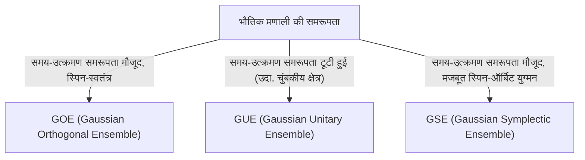

# परिचय: रैंडम मैट्रिक्स थ्योरी की आश्चर्यजनक सार्वभौमिकता

दुनिया जटिल और अप्रत्याशित लग सकती है, लेकिन गणित के लेंस के माध्यम से, हम कभी-कभी पूरी तरह से अलग-अलग क्षेत्रों में आश्चर्यजनक समानताएं पाते हैं। "रैंडम मैट्रिक्स थ्योरी (Random Matrix Theory, RMT)" बिल्कुल ऐसी ही सार्वभौमिकता वाले गणितीय ढांचे में से एक है।

एक रैंडम मैट्रिक्स एक ऐसा मैट्रिक्स है जिसके तत्व यादृच्छिक चर (random variables) द्वारा दिए जाते हैं। पहली नज़र में, यह केवल संख्याओं की एक यादृच्छिक सरणी है, लेकिन जैसे-जैसे मैट्रिक्स का आकार अनंत की ओर बढ़ता है, इसके [आइगेन मान (eigenvalues)](/hi/p/eigenvalues-and-eigenvectors/) के वितरण में आश्चर्यजनक रूप से सुंदर और सार्वभौमिक नियम उभरता है। यह नियम पूरी तरह से अलग-अलग प्रणालियों के पीछे छिपा है, परमाणु नाभिक की सूक्ष्म दुनिया से लेकर, अभाज्य संख्या वितरण के रहस्यों, और वित्तीय बाजारों में मूल्य में उतार-चढ़ाव, से लेकर अत्याधुनिक डीप लर्निंग मॉडल की सीखने की गतिशीलता तक।

इस लेख में, रैंडम मैट्रिक्स थ्योरी की ऐतिहासिक पृष्ठभूमि से शुरू करते हुए, हम इसके गणितीय आधार जैसे एन्सेम्बल (GOE/GUE/GSE) का वर्गीकरण, विग्नर के अर्धवृत्त नियम के गणितीय प्रमाण, और यहां तक कि रीमैन ज़ेटा फ़ंक्शन से इसके अप्रत्याशित संबंध की व्याख्या करेंगे। बाद के भाग में, हम आधुनिक अनुप्रयोगों में गहराई से उतरेंगे, जैसे वित्तीय इंजीनियरिंग में पोर्टफोलियो अनुकूलन और AI और डीप लर्निंग में वजन आरंभीकरण (weight initialization) की समस्या, साथ ही पायथन कोड का उपयोग करके व्यावहारिक विज़ुअलाइज़ेशन भी करेंगे।

---

# 1. भौतिकी से जन्म: विग्नर और भारी नाभिकों का रहस्य

रैंडम मैट्रिक्स थ्योरी की जड़ें 1950 के दशक में परमाणु भौतिकी से जुड़ी हैं। उस समय, भौतिक विज्ञानी यूरेनियम जैसे भारी नाभिकों के ऊर्जा स्तर (संभावित ऊर्जा मान जो एक क्वांटम यांत्रिक स्थिति ले सकती है) को समझने के लिए संघर्ष कर रहे थे।

## यूरेनियम नाभिकों के ऊर्जा स्तर

हल्के नाभिकों के लिए, श्रोडिंगर समीकरण के अनुसार प्रोटॉन और न्यूट्रॉन के बीच बातचीत की गणना करके ऊर्जा स्तरों की सटीक भविष्यवाणी की जा सकती है। हालांकि, भारी नाभिकों के लिए जहां कई न्यूक्लियॉन जटिल रूप से बातचीत करते हैं, जैसे यूरेनियम (द्रव्यमान संख्या 238), स्वतंत्रता की कोटि (degrees of freedom) बहुत बड़ी होती है, जिससे कठोर गणना लगभग असंभव हो जाती है।

प्रायोगिक रूप से देखे गए न्यूट्रॉन प्रकीर्णन (neutron scattering) डेटा को देखते हुए, अनुनाद (resonance) ऊर्जा स्तर बेतरतीब ढंग से व्यवस्थित लग रहे थे। हालाँकि, जब ऊर्जा स्तरों के बीच "अंतर (spacing)" के सांख्यिकीय वितरण की जाँच की गई, तो एक स्पष्ट पैटर्न पाया गया। आसन्न ऊर्जा स्तरों में एक गुण था जिसे "स्तर प्रतिकर्षण (level repulsion)" कहा जाता है, जहां वे कभी भी एक-दूसरे के बहुत करीब नहीं आते हैं।

## विग्नर का अंतर्ज्ञान और अर्धवृत्त नियम की खोज

1955 में, यूजीन विग्नर (Eugene Wigner) ने एक साहसिक विचार प्रस्तावित किया: इस जटिल क्वांटम प्रणाली के हैमिल्टनियन (ऊर्जा का प्रतिनिधित्व करने वाला मैट्रिक्स) को विस्तृत भौतिक संरचना वाले विशिष्ट मैट्रिक्स के रूप में मानने के बजाय, उन्होंने इसे "एक विशाल सममित मैट्रिक्स जिसके तत्व यादृच्छिक मान लेते हैं" के रूप में तैयार किया।

आश्चर्यजनक रूप से, इस अत्यधिक सरलीकृत रैंडम मैट्रिक्स के [आइगेन मान (eigenvalues)](/hi/p/eigenvalues-and-eigenvectors/) का रिक्ति वितरण वास्तविक यूरेनियम नाभिकों में ऊर्जा स्तरों के रिक्ति वितरण से पूरी तरह मेल खाता था। विग्नर ने आगे खोज की कि जैसे-जैसे मैट्रिक्स का आकार $N$ अनंत की ओर जाता है, [आइगेन मान](/hi/p/eigenvalues-and-eigenvectors/) का समग्र घनत्व वितरण एक अर्धवृत्त (semicircle) का आकार बनाता है। यह प्रसिद्ध "विग्नर का अर्धवृत्त नियम (Wigner's semicircle law)" है।

---

# 2. एन्सेम्बल का वर्गीकरण: GOE, GUE, GSE

विग्नर के शोध के बाद, फ्रीमैन डायसन ने रैंडम मैट्रिक्स के सिद्धांत को व्यवस्थित किया और भौतिक प्रणालियों की समरूपता के आधार पर उन्हें तीन सार्वभौमिक वर्गों (एन्सेम्बल) में वर्गीकृत किया। इन्हें "डायसन के थ्रीफोल्ड वे (Dyson's threefold way)" के रूप में जाना जाता है।



## गाऊसी ऑर्थोगोनल एन्सेम्बल (GOE)

GOE वास्तविक सममित मैट्रिक्स (real symmetric matrices) का एक सेट है जिसके तत्व वास्तविक संख्याओं से युक्त होते हैं। प्रत्येक गैर-विकर्ण तत्व को 0 के माध्य और 1 के प्रसरण (variance) के साथ सामान्य वितरण (normal distribution) से स्वतंत्र रूप से लिया जाता है, जबकि विकर्ण तत्वों को 0 के माध्य और 2 के प्रसरण के साथ सामान्य वितरण से लिया जाता है। GOE का उपयोग क्वांटम सिस्टम (उदा., बिना स्पिन वाले कणों के सिस्टम) के हैमिल्टनियन को मॉडल करने के लिए किया जाता है, जहाँ कोई बाहरी चुंबकीय क्षेत्र नहीं होता है और समय-उत्क्रमण समरूपता (time-reversal symmetry) संरक्षित होती है।

## गाऊसी यूनिटरी एन्सेम्बल (GUE)

GUE हर्मिटियन मैट्रिक्स का एक सेट है जिसके तत्व सम्मिश्र संख्याओं (complex numbers) से युक्त होते हैं। गैर-विकर्ण तत्वों के वास्तविक और काल्पनिक भाग प्रत्येक स्वतंत्र सामान्य वितरण का पालन करते हैं। यह उन भौतिक प्रणालियों पर लागू होता है जहाँ समय-उत्क्रमण समरूपता टूट जाती है, जैसे बाहरी चुंबकीय क्षेत्र की उपस्थिति में। यह GUE ही है जिसका रीमैन ज़ेटा फ़ंक्शन के शून्य के वितरण के साथ गहरा संबंध है, जिस पर बाद में चर्चा की जाएगी।

## गाऊसी सिम्पलेक्टिक एन्सेम्बल (GSE)

GSE स्व-द्वैत हर्मिटियन मैट्रिक्स (self-dual Hermitian matrices) का एक सेट है जिसके तत्व चतुर्भुज (quaternions) से बने होते हैं। यह उन प्रणालियों का वर्णन करता है जहाँ समय-उत्क्रमण समरूपता संरक्षित होती है, लेकिन कणों में आधा-पूर्णांक स्पिन (half-integer spin) और मजबूत स्पिन-ऑर्बिट इंटरैक्शन होता है।

---

# 3. गणितीय रसातल: विग्नर के अर्धवृत्त नियम का प्रमाण

आइए विग्नर के अर्धवृत्त नियम, जो रैंडम मैट्रिक्स थ्योरी का सबसे बुनियादी परिणाम है, को पलों की विधि (Method of Moments) का उपयोग करके सिद्ध करने की प्रक्रिया का अवलोकन करें।

एक $N \times N$ वास्तविक सममित मैट्रिक्स $X$ पर विचार करें जिसके तत्व $X_{ij}$ 0 के माध्य और 1 के प्रसरण के साथ परस्पर स्वतंत्र यादृच्छिक चर हैं। हम स्केल किए गए मैट्रिक्स $W = \frac{1}{\sqrt{N}}X$ के [आइगेन मान](/hi/p/eigenvalues-and-eigenvectors/) वितरण की सीमा ($N \to \infty$) खोजते हैं।

## पलों की विधि (Method of Moments) के माध्यम से दृष्टिकोण

[आइगेन मान](/hi/p/eigenvalues-and-eigenvectors/) के अनुभवजन्य वितरण फ़ंक्शन का विश्लेषण करने के लिए, हम वितरण के $k$-वें पल $m_k$ की गणना करते हैं। चूँकि एक मैट्रिक्स का ट्रेस (विकर्ण तत्वों का योग) उसके [आइगेन मान](/hi/p/eigenvalues-and-eigenvectors/) के योग के बराबर होता है, हम मूल्यांकन करते हैं:
$$ m_k = \lim_{N \to \infty} \frac{1}{N} \mathbb{E}[\text{Tr}(W^k)] $$

ट्रेस का विस्तार करने पर प्राप्त होता है:
$$ \text{Tr}(W^k) = \frac{1}{N^{k/2}} \sum_{i_1, i_2, \dots, i_k} X_{i_1 i_2} X_{i_2 i_3} \cdots X_{i_k i_1} $$
अपेक्षित मान (expected value) लेते समय, चूँकि तत्व $X_{ij}$ 0 के माध्य के साथ स्वतंत्र होते हैं, कोई भी विस्तारित शब्द जहाँ एक तत्व केवल एक बार प्रकट होता है, उसका अपेक्षित मान 0 होगा। गैर-शून्य योगदान देने के लिए, पथ $i_1 \to i_2 \to \dots \to i_k \to i_1$ पर प्रत्येक किनारे (edge) को कम से कम दो बार पार किया जाना चाहिए।

सीमा $N \to \infty$ में, प्रमुख योगदान ठीक $k$ चरणों के पथों से आता है जो एक "वृक्ष (tree)" संरचना बनाते हैं, नए शीर्षों की खोज करते हैं और प्रत्येक पार किए गए किनारे के साथ ठीक एक बार वापस लौटते हैं। यह तभी संभव है जब $k$ सम (even) हो ($k = 2m$), और विषम पलों की सीमा 0 हो जाती है।

## कैटलन संख्या और अर्धवृत्त नियम के बीच संबंध

लंबाई $2m$ के ऐसे पथों (डायक पथ) की कुल संख्या कॉम्बिनेटरिक्स में प्रसिद्ध "[कैटलन संख्या (Catalan numbers)](/hi/p/catalan-numbers/)" $C_m$ द्वारा दी गई है।
$$ C_m = \frac{1}{m+1} \binom{2m}{m} $$

इसलिए, सीमा वितरण के क्षण हैं:
$$ m_{2m} = C_m, \quad m_{2m+1} = 0 $$
इन पलों वाले संभाव्यता वितरण को अंतराल $[-2, 2]$ पर समर्थित अर्धवृत्त वितरण (विग्नर का अर्धवृत्त नियम) के रूप में जाना जाता है। इसका प्रायिकता घनत्व फलन (probability density function) इस प्रकार है:
$$ \rho(x) = \begin{cases} \frac{1}{2\pi} \sqrt{4 - x^2} & (-2 \le x \le 2) \\ 0 & (\text{अन्यथा}) \end{cases} $$

---

# 4. रीमैन ज़ेटा फ़ंक्शन के साथ अप्रत्याशित मुठभेड़

भौतिकी में समस्याओं को हल करने के लिए पैदा हुए रैंडम मैट्रिक्स थ्योरी ने 1970 के दशक में शुद्ध गणित, विशेष रूप से संख्या सिद्धांत के क्षेत्र में सदी की खोज की।

## मोंटगोमरी-ओड्लीज़को अनुमान

1972 में, संख्या सिद्धांतकार ह्यूग मोंटगोमरी (Hugh Montgomery) रीमैन ज़ेटा फ़ंक्शन के गैर-तुच्छ शून्यों के रिक्ति वितरण का अध्ययन कर रहे थे। रीमैन परिकल्पना के अनुसार, ये सभी शून्य जटिल विमान (complex plane) में "महत्वपूर्ण रेखा (critical line)" (1/2 के वास्तविक भाग वाली रेखा) पर स्थित हैं। मोंटगोमरी ने शून्यों के युग्म सहसंबंध फलन (pair correlation function) की गणना की और पाया कि यह $1 - \left(\frac{\sin(\pi x)}{\pi x}\right)^2$ के बराबर है।

एक दिन, प्रिंसटन में इंस्टीट्यूट फॉर एडवांस्ड स्टडी में चाय के समय, मोंटगोमरी ने भौतिक विज्ञानी फ्रीमैन डायसन को इस परिणाम का उल्लेख किया। डायसन चकित रह गए। क्यों? क्योंकि सूत्र बिल्कुल वैसा ही था जैसा GUE (गाऊसी यूनिटरी एन्सेम्बल) के [आइगेन मान](/hi/p/eigenvalues-and-eigenvectors/) का रिक्ति वितरण जिसे डायसन ने स्वयं प्राप्त किया था।

## अभाज्य संख्या और क्वांटम कैओस का चौराहा

बाद में, गणितज्ञ एंड्रयू ओड्लीज़को (Andrew Odlyzko) ने सुपरकंप्यूटर का उपयोग करके ज़ेटा फ़ंक्शन के लाखों शून्यों की गणना की और प्रदर्शित किया कि उनका रिक्ति वितरण आश्चर्यजनक सटीकता के साथ GUE भविष्यवाणियों से मेल खाता है।

इस खोज को "मोंटगोमरी-ओड्लीज़को अनुमान (Montgomery-Odlyzko conjecture)" के रूप में जाना जाता है, जो अभाज्य संख्याओं के वितरण (ज़ेटा फ़ंक्शन के शून्य अभाज्य संख्या वितरण से निकटता से संबंधित हैं) और क्वांटम अराजक प्रणालियों (GUE) के बीच एक गहरे और सार्वभौमिक संबंध का सुझाव देता है। यह वह क्षण था जब ब्रह्मांड के सूक्ष्म नियमों का वर्णन करने वाले गणित और संख्याओं (अभाज्य) के निर्माण खंडों को नियंत्रित करने वाले गणित ने रैंडम मैट्रिक्स के संपर्क बिंदु के माध्यम से एक-दूसरे को पार किया।

---

# 5. वित्तीय इंजीनियरिंग में अनुप्रयोग: पोर्टफोलियो अनुकूलन का विकास

रैंडम मैट्रिक्स थ्योरी को केवल भौतिकी और शुद्ध गणित में ही नहीं बल्कि वित्तीय बाजारों के विश्लेषण में भी एक शक्तिशाली उपकरण के रूप में लागू किया गया है। यह संपत्ति प्रबंधन (asset management) के अनुकूलन में विशेष रूप से महत्वपूर्ण भूमिका निभाता है।

## मार्कोविट्ज़ मॉडल की सीमाएं

हैरी मार्कोविट्ज़ (Harry Markowitz) के माध्य-प्रसरण मॉडल (mean-variance model) में, जो आधुनिक पोर्टफोलियो सिद्धांत की नींव है, परिसंपत्तियों के सहप्रसरण मैट्रिक्स (covariance matrix) के व्युत्क्रम (inverse) का उपयोग करके इष्टतम निवेश अनुपात निर्धारित किए जाते हैं। हालाँकि, यह व्यवहार में एक बड़ी समस्या पैदा करता है।

पिछले $T$ अवधि में $N$ परिसंपत्तियों के रिटर्न डेटा से नमूना सहप्रसरण मैट्रिक्स का अनुमान लगाते समय, यदि $N$ बड़ा है और $T$ पर्याप्त रूप से बड़ा नहीं है (इसलिए $N/T$ 0 के करीब नहीं है), तो नमूना सहप्रसरण मैट्रिक्स में भारी मात्रा में सांख्यिकीय शोर (statistical noise) होता है। जब इस शोर वाले मैट्रिक्स के व्युत्क्रम की गणना की जाती है, तो त्रुटियां बढ़ जाती हैं, जिसके परिणामस्वरूप अवास्तविक और चरम पोर्टफोलियो का निर्माण होता है (उदा., कुछ परिसंपत्तियों पर अत्यधिक शॉर्ट या लॉन्ग पोजीशन का निर्देश देना)।

## रैंडम मैट्रिक्स के साथ शोर की सफाई

यहीं पर रैंडम मैट्रिक्स थ्योरी खेल में आती है। 1999 में, बूचौड (Bouchaud) और अन्य तथा लालौक्स (Laloux) और अन्य ने स्वतंत्र रूप से वित्तीय बाजारों के सहप्रसरण मैट्रिक्स में रैंडम मैट्रिक्स थ्योरी लागू की। उन्होंने विशुद्ध रूप से यादृच्छिक समय-श्रृंखला डेटा (मार्चेंको-पाश्चर वितरण, Marchenko-Pastur distribution) से प्राप्त सहप्रसरण मैट्रिक्स के [आइगेन मान](/hi/p/eigenvalues-and-eigenvectors/) वितरण की तुलना वास्तविक बाजार डेटा के सहप्रसरण मैट्रिक्स के [आइगेन मान](/hi/p/eigenvalues-and-eigenvectors/) वितरण से की।

नतीजतन, उन्होंने पाया कि बाजार डेटा के अधिकांश (90% से अधिक) [आइगेन मान](/hi/p/eigenvalues-and-eigenvectors/) रैंडम मैट्रिक्स थ्योरी द्वारा भविष्यवाणी की गई सैद्धांतिक सीमाओं के भीतर आते हैं। दूसरे शब्दों में, ये केवल "शोर" हैं। दूसरी ओर, यह दिखाया गया कि सीमाओं से काफी अधिक होने वाले केवल कुछ बड़े [आइगेन मान](/hi/p/eigenvalues-and-eigenvectors/) सार्थक जानकारी रखते हैं जो बाजार की वास्तविक सहसंबंध संरचना (जैसे बाजार कारक और क्षेत्र कारक) को दर्शाते हैं।

इस अंतर्दृष्टि के आधार पर, शोर के अनुरूप [आइगेन मान](/hi/p/eigenvalues-and-eigenvectors/) को फ़िल्टर करके (उदा., उन्हें शून्य पर सेट करना या उन्हें औसत मान से बदलना) सहप्रसरण मैट्रिक्स को "साफ" करने के तरीके विकसित किए गए हैं। यह पोर्टफोलियो के प्रदर्शन और स्थिरता में काफी सुधार करता है, और वर्तमान में कई मात्रात्मक फंडों (quantitative funds) में मानक तकनीक के रूप में उपयोग किया जाता है।

---

# 6. आर्टिफिशियल इंटेलिजेंस में अनुप्रयोग: डीप लर्निंग में वजन और सीखने की गतिशीलता

हाल के वर्षों में, AI और मशीन लर्निंग, विशेष रूप से डीप लर्निंग के सैद्धांतिक विश्लेषण के लिए रैंडम मैट्रिक्स थ्योरी भी सुर्खियों में रही है।

## न्यूरल नेटवर्क की आरंभीकरण समस्या

बड़े पैमाने पर न्यूरल नेटवर्क को प्रशिक्षित करते समय, नेटवर्क के वजन मैट्रिक्स के प्रारंभिक मानों को कैसे सेट किया जाए, यह एक अत्यंत महत्वपूर्ण समस्या है जो प्रशिक्षण की सफलता या विफलता को निर्धारित करती है। यदि आरंभीकरण अनुचित है, तो ग्रैडिएंट गायब होना (Gradient Vanishing) या ग्रैडिएंट का फटना (Gradient Exploding) होता है, जिससे सीखने की प्रक्रिया रुक जाती है।

जब वजन मैट्रिक्स को यादृच्छिक मानों के साथ प्रारंभ किया जाता है, तो यह बिल्कुल एक रैंडम मैट्रिक्स होता है। रैंडम मैट्रिक्स थ्योरी को लागू करके, कोई भी व्यक्ति परतों से गुजरने पर सिग्नल के प्रसरण के संक्रमण और बैकप्रोपेगेशन के दौरान ग्रैडिएंट के व्यवहार का कठोरता से विश्लेषण कर सकता है। उदाहरण के लिए, रैंडम मैट्रिक्स के स्पेक्ट्रम ([आइगेन मान](/hi/p/eigenvalues-and-eigenvectors/) वितरण) पर गैर-रैखिक सक्रियण कार्यों के प्रभाव का विश्लेषण करने से जेवियर (Xavier) इनिशियलाइज़ेशन और हे (He) इनिशियलाइज़ेशन जैसे आधुनिक मानक आरंभीकरण विधियों के लिए सैद्धांतिक औचित्य मिलता है।

## हेसियन (Hessian) का आइगेन मान वितरण

सीखने की प्रक्रिया की गतिशीलता को समझने के लिए अनिवार्य रूप से हेसियन मैट्रिक्स का विश्लेषण करने की आवश्यकता होती है, जो हानि फलन (loss function) की वक्रता को दर्शाता है। करोड़ों से लेकर सैकड़ों अरबों मापदंडों वाले [LLMs](/hi/p/large-language-models-llm-transformer-prompt-engineering/) ([बड़े भाषा मॉडल](/hi/p/large-language-models-llm-transformer-prompt-engineering/)) का हेसियन एक विशाल मैट्रिक्स है, जिससे सीधे इसके गुणों की जांच करना मुश्किल हो जाता है, लेकिन रैंडम मैट्रिक्स थ्योरी का उपयोग इसके [आइगेन मान](/hi/p/eigenvalues-and-eigenvectors/) वितरण का अनुमान लगाने और भविष्यवाणी करने के लिए किया जा सकता है।

अध्ययनों से पता चला है कि डीप न्यूरल नेटवर्क में हेसियन का [आइगेन मान](/hi/p/eigenvalues-and-eigenvectors/) वितरण एक थोक (शून्य के करीब बड़ी संख्या में [आइगेन मान](/hi/p/eigenvalues-and-eigenvectors/)) और कुछ बड़े आउटलेर्स (outliers) से बना होता है। थोक भाग को एक शोर वाले रैंडम मैट्रिक्स (उदा., कम जानकारी वाले दिशाओं) के रूप में तैयार किया जा सकता है, जबकि आउटलेर्स कार्य से सीधे जुड़े महत्वपूर्ण सीखने के दिशाओं को इंगित करते हैं। इस वर्णक्रमीय संरचना को समझने से अनुकूलन एल्गोरिदम (जैसे SGD और Adam) के अभिसरण (convergence) में सुधार करने और सीखने की दर (learning rate) के कार्यक्रमों को अनुकूलित करने के लिए अत्यंत मूल्यवान अंतर्दृष्टि मिलती है।

---

# 7. अभ्यास: पायथन के साथ आइगेन मान वितरण की कल्पना करना

अंत में, आइए व्यावहारिक रूप से पायथन का उपयोग करके GOE (गाऊसी ऑर्थोगोनल एन्सेम्बल) उत्पन्न करें और संख्यात्मक रूप से सत्यापित करें कि विग्नर का अर्धवृत्त नियम लागू होता है।

```python
import numpy as np
import matplotlib.pyplot as plt
from scipy.stats import semicircular

# पैरामीटर सेटिंग्स
N = 1000  # मैट्रिक्स का आकार
num_matrices = 50  # एन्सेम्बल में नमूनों की संख्या

eigenvalues = []

# GOE मैट्रिक्स जनरेट करें और आइगेन मानों की गणना करें
for _ in range(num_matrices):
    # तत्वों के साथ N x N मैट्रिक्स जनरेट करें ~ N(0, 1)
    X = np.random.randn(N, N)
    # GOE मैट्रिक्स बनाने के लिए सममित करें (प्रसरण स्केलिंग पर ध्यान दें)
    A = (X + X.T) / np.sqrt(2)
    # प्रसरण को 1/N तक स्केल करें
    W = A / np.sqrt(N)
    
    # आइगेन मानों की गणना करें (वास्तविक सममित मैट्रिक्स के लिए eigh का उपयोग करके)
    eigvals = np.linalg.eigh(W)[0]
    eigenvalues.extend(eigvals)

# प्लॉट सेटिंग्स
plt.figure(figsize=(10, 6))

# आइगेन मानों का हिस्टोग्राम प्लॉट करें
plt.hist(eigenvalues, bins=100, density=True, alpha=0.6, color='skyblue', edgecolor='black', label='Empirical Eigenvalues (GOE)')

# सैद्धांतिक विग्नर के अर्धवृत्त नियम को प्लॉट करें
x = np.linspace(-2.2, 2.2, 1000)
# त्रिज्या R=2 के साथ अर्धवृत्त नियम का प्रायिकता घनत्व फलन
y = np.where(np.abs(x) <= 2, np.sqrt(4 - x**2) / (2 * np.pi), 0)
plt.plot(x, y, 'r-', lw=3, label="Wigner's Semicircle Law")

plt.title(f"Eigenvalue Distribution of GOE Matrices ($N={N}$)", fontsize=16)
plt.xlabel("Eigenvalue", fontsize=14)
plt.ylabel("Density", fontsize=14)
plt.legend(fontsize=12)
plt.grid(True, alpha=0.3)
plt.tight_layout()
plt.show()
```

जब आप यह कोड चलाते हैं, तो आप पुष्टि कर सकते हैं कि यादृच्छिक रूप से उत्पन्न मैट्रिक्स के [आइगेन मान](/hi/p/eigenvalues-and-eigenvectors/) एक सुंदर अर्धवृत्त आकार में वितरित किए जाते हैं। रैंडम मैट्रिक्स थ्योरी की सबसे बड़ी अपील यह है कि, व्यक्तिगत मैट्रिक्स के तत्व पूरी तरह से यादृच्छिक होने के बावजूद, समग्र रूप से एक ऐसा सुव्यवस्थित नियम उभरता है।

---

# निष्कर्ष

इस लेख में, हमने रैंडम मैट्रिक्स थ्योरी की भव्य कथा का अनुसरण किया, जो परमाणु भौतिकी से शुरू होकर शुद्ध गणित, वित्तीय इंजीनियरिंग और आधुनिक AI प्रौद्योगिकियों तक विस्तृत है। यह तथ्य कि असंबद्ध प्रतीत होने वाली जटिल प्रणालियाँ चरम स्थितियों में "रैंडम मैट्रिक्स के [आइगेन मान](/hi/p/eigenvalues-and-eigenvectors/)" की सामान्य भाषा का उपयोग करके संवाद कर सकती हैं, प्रकृति और गणित के रहस्यमय गहराई को प्रदर्शित करता है।

आधुनिक युग में जहां डेटा में विस्फोट हो रहा है और मॉडल काफी बड़े होते जा रहे हैं, रैंडम मैट्रिक्स थ्योरी अमूर्त गणित के एक मात्र विषय से विकसित होकर डेटा विज्ञान और मशीन लर्निंग में व्यावहारिक समस्याओं को हल करने के लिए एक शक्तिशाली हथियार बन रही है। यह सिद्धांत, जो जटिल प्रणालियों के पीछे छिपे सार्वभौमिक सत्य की पड़ताल करता है, निस्संदेह भविष्य में विभिन्न क्षेत्रों में हमारी समझ को गहरा करने वाला एक प्रकाश बना रहेगा।
