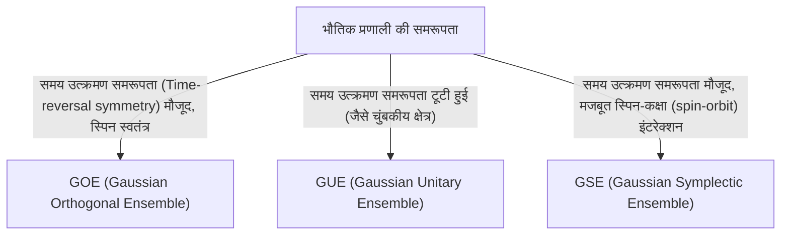

# परिचय: रैंडम मैट्रिक्स थ्योरी की आश्चर्यजनक सार्वभौमिकता (Universality)

दुनिया जटिल और अप्रत्याशित (unpredictable) लग सकती है, लेकिन गणित के लेंस के माध्यम से, कभी-कभी हमें पूरी तरह से अलग क्षेत्रों में आश्चर्यजनक समानताएं मिलती हैं। "रैंडम मैट्रिक्स थ्योरी (Random Matrix Theory, RMT)" एक ऐसा गणितीय ढांचा है जिसमें ठीक ऐसी ही सार्वभौमिकता होती है।

एक रैंडम मैट्रिक्स एक ऐसा मैट्रिक्स है जिसके तत्व यादृच्छिक चर (random variables) द्वारा दिए जाते हैं। पहली नज़र में, यह संख्याओं की एक यादृच्छिक सरणी (array) से ज्यादा कुछ नहीं लगता है, लेकिन जब मैट्रिक्स के आकार को अनंत (infinity) के करीब लाया जाता है, तो इसके आइगेनवैल्यू (eigenvalues) का वितरण एक आश्चर्यजनक रूप से सुंदर और सार्वभौमिक नियम दिखाता है। यह नियम सूक्ष्म परमाणु नाभिक (atomic nuclei) की दुनिया से लेकर अभाज्य संख्याओं के वितरण (prime number distribution) के रहस्य, वित्तीय बाजारों के मूल्य में उतार-चढ़ाव और अत्याधुनिक डीप लर्निंग (deep learning) मॉडल की सीखने की गतिशीलता (learning dynamics) तक पूरी तरह से अलग प्रणालियों के पीछे छिपा हुआ है।

इस लेख में, हम रैंडम मैट्रिक्स थ्योरी की ऐतिहासिक पृष्ठभूमि से शुरू करेंगे, इसके गणितीय आधार जैसे कि GOE/GUE/GSE एन्सेम्बल (ensembles) का वर्गीकरण, विग्नर (Wigner) के अर्धवृत्त नियम (semicircle law) का गणितीय प्रमाण और रीमैन ज़ेटा फ़ंक्शन (Riemann zeta function) के साथ इसके अप्रत्याशित संबंध की व्याख्या करेंगे। और दूसरे भाग में, हम आधुनिक अनुप्रयोगों जैसे कि वित्तीय इंजीनियरिंग में पोर्टफोलियो ऑप्टिमाइजेशन (portfolio optimization) और AI/डीप लर्निंग में वेट इनिशियलाइजेशन (weight initialization) समस्या के बारे में गहराई से जानेंगे, साथ ही पायथन (Python) कोड का उपयोग करके व्यावहारिक विज़ुअलाइज़ेशन (visualization) भी करेंगे।

---

# 1. भौतिकी से जन्म: विग्नर और भारी परमाणु नाभिक का रहस्य

रैंडम मैट्रिक्स थ्योरी की जड़ें 1950 के दशक के परमाणु भौतिकी (nuclear physics) में हैं। उस समय के भौतिक विज्ञानी यूरेनियम (uranium) जैसे भारी परमाणु नाभिकों के ऊर्जा स्तर (energy levels - क्वांटम मैकेनिकल अवस्थाओं के संभावित ऊर्जा मान) को समझने के लिए संघर्ष कर रहे थे।

## यूरेनियम परमाणु नाभिक के ऊर्जा स्तर

यदि यह एक हल्का परमाणु नाभिक है, तो ऊर्जा स्तरों की सटीक भविष्यवाणी श्रोडिंगर समीकरण (Schrödinger equation) के अनुसार प्रोटॉन और न्यूट्रॉन की परस्पर क्रिया (interaction) की गणना करके की जा सकती है। हालाँकि, यूरेनियम (जैसे द्रव्यमान संख्या 238) जैसे भारी परमाणु नाभिकों में जहाँ कई न्यूक्लियॉन (nucleons) जटिल रूप से परस्पर क्रिया करते हैं, स्वतंत्रता की कोटि (degrees of freedom) इतनी बड़ी होती है कि सख्त गणना व्यावहारिक रूप से असंभव है।

प्रयोगात्मक रूप से देखे गए न्यूट्रॉन प्रकीर्णन (neutron scattering) डेटा को देखते हुए, अनुनाद (resonance) के ऊर्जा स्तर बेतरतीब ढंग से व्यवस्थित लगते थे। हालांकि, जब ऊर्जा स्तरों के "अंतर (spacing)" के सांख्यिकीय वितरण की जांच की गई, तो यह स्पष्ट हो गया कि वहाँ एक स्पष्ट पैटर्न था। आसन्न ऊर्जा स्तरों में "स्तर प्रतिकर्षण (level repulsion)" की विशेषता थी, जिसका अर्थ है कि वे कभी भी एक-दूसरे के बहुत करीब नहीं आते हैं।

## विग्नर की अंतर्दृष्टि और अर्धवृत्त नियम की खोज

1955 में, यूजीन विग्नर (Eugene Wigner) ने इस जटिल क्वांटम प्रणाली के हैमिल्टनियन (Hamiltonian - ऊर्जा का प्रतिनिधित्व करने वाला मैट्रिक्स) को एक विस्तृत भौतिक संरचना के साथ एक विशिष्ट मैट्रिक्स के रूप में मानने के बजाय "एक विशाल सममित मैट्रिक्स (symmetric matrix) जिसके तत्व यादृच्छिक मान लेते हैं" के रूप में मॉडल करने का एक साहसिक विचार प्रस्तावित किया।

आश्चर्यजनक रूप से, इस अत्यधिक सरलीकृत रैंडम मैट्रिक्स के आइगेनवैल्यू का अंतराल वितरण (spacing distribution) वास्तविक यूरेनियम परमाणु नाभिक के ऊर्जा स्तरों के अंतराल वितरण से पूरी तरह मेल खाता था। विग्नर ने आगे पता लगाया कि अनंत की ओर जाने वाले मैट्रिक्स के आकार $N$ की सीमा (limit) में, आइगेनवैल्यू का समग्र घनत्व वितरण (density distribution) एक अर्धवृत्त (semicircle) का आकार लेता है। यह प्रसिद्ध "विग्नर का अर्धवृत्त नियम (Wigner's semicircle law)" है।

---

# 2. एन्सेम्बल का वर्गीकरण: GOE, GUE, GSE

विग्नर के काम का अनुसरण करते हुए, फ्रीमैन डायसन (Freeman Dyson) ने रैंडम मैट्रिक्स के सिद्धांत को व्यवस्थित किया और रैंडम मैट्रिसेस को भौतिक प्रणालियों की समरूपता (symmetry) के आधार पर तीन सार्वभौमिक वर्गों (एन्सेम्बल्स) में वर्गीकृत किया। इन्हें "डायसन का तीन-गुना तरीका (Dyson's threefold way)" कहा जाता है।



## गाऊसी ऑर्थोगोनल एन्सेम्बल (Gaussian Orthogonal Ensemble, GOE)

GOE वास्तविक संख्याओं (real numbers) से बने वास्तविक सममित मैट्रिसेस का एक समूह है। प्रत्येक ऑफ-डायगोनल तत्व (off-diagonal element) को स्वतंत्र रूप से 0 के माध्य (mean) और 1 के प्रसरण (variance) के साथ एक सामान्य वितरण (normal distribution) से चुना जाता है, और डायगोनल तत्वों (diagonal elements) को 0 के माध्य और 2 के प्रसरण के साथ एक सामान्य वितरण से चुना जाता है। GOE का उपयोग बाहरी चुंबकीय क्षेत्र (magnetic field) के बिना क्वांटम प्रणालियों (जैसे बिना स्पिन वाले कणों की प्रणाली) के हैमिल्टनियन को मॉडल करने के लिए किया जाता है जहां समय उत्क्रमण समरूपता (time-reversal symmetry) संरक्षित होती है।

## गाऊसी यूनिटरी एन्सेम्बल (Gaussian Unitary Ensemble, GUE)

GUE जटिल संख्याओं (complex numbers) से बने हर्मिटियन मैट्रिसेस (Hermitian matrices) का एक समूह है। ऑफ-डायगोनल तत्वों के वास्तविक और काल्पनिक भाग स्वतंत्र सामान्य वितरण का पालन करते हैं। यह उन भौतिक प्रणालियों पर लागू होता है जहां समय उत्क्रमण समरूपता टूट जाती है, जैसे बाहरी चुंबकीय क्षेत्र की उपस्थिति में। यह GUE है जिसका रीमैन ज़ेटा फ़ंक्शन के शून्य वितरण (zero distribution) के साथ गहरा संबंध है, जिसकी चर्चा बाद में की जाएगी।

## गाऊसी सिम्पलेक्टिक एन्सेम्बल (Gaussian Symplectic Ensemble, GSE)

GSE स्व-द्वैत हर्मिटियन मैट्रिसेस (self-dual Hermitian matrices) का एक समूह है जिसके तत्व क्वाटरनियंस (quaternions) से बने होते हैं। यह उन प्रणालियों का वर्णन करता है जहां समय उत्क्रमण समरूपता संरक्षित होती है, लेकिन कणों में आधा-पूर्णांक (half-integer) स्पिन होता है, और स्पिन-कक्षा (spin-orbit) परस्पर क्रिया मजबूत होती है।

---

# 3. गणितीय गहराई: विग्नर के अर्धवृत्त नियम का प्रमाण

हम रैंडम मैट्रिक्स थ्योरी के सबसे बुनियादी परिणाम, विग्नर के अर्धवृत्त नियम (Wigner's semicircle law) को मोमेंट्स की विधि (Method of Moments) का उपयोग करके साबित करने की प्रक्रिया का अवलोकन करेंगे।

एक $N \times N$ वास्तविक सममित मैट्रिक्स $X$ पर विचार करें, जिसके तत्व $X_{ij}$ परस्पर स्वतंत्र हैं और 0 के माध्य और 1 के प्रसरण (variance) के साथ यादृच्छिक चर हैं। हम स्केल किए गए मैट्रिक्स $W = \frac{1}{\sqrt{N}}X$ के आइगेनवैल्यू वितरण (eigenvalue distribution) की सीमा (limit) ($N \to \infty$) ज्ञात करेंगे।

## मोमेंट्स की विधि के माध्यम से दृष्टिकोण

आइगेनवैल्यू के अनुभवजन्य वितरण फ़ंक्शन (empirical distribution function) का विश्लेषण करने के लिए, हम वितरण के $k$-वें मोमेंट $m_k$ की गणना करते हैं। चूँकि किसी मैट्रिक्स का ट्रेस (विकर्ण (diagonal) तत्वों का योग) उसके आइगेनवैल्यू के योग के बराबर होता है, हम निम्नलिखित का मूल्यांकन करते हैं:
$$ m_k = \lim_{N \to \infty} \frac{1}{N} \mathbb{E}[\text{Tr}(W^k)] $$

ट्रेस का विस्तार करने पर, हमें प्राप्त होता है:
$$ \text{Tr}(W^k) = \frac{1}{N^{k/2}} \sum_{i_1, i_2, \dots, i_k} X_{i_1 i_2} X_{i_2 i_3} \cdots X_{i_k i_1} $$
अपेक्षित मान (expected value) लेते समय, चूंकि तत्व $X_{ij}$ का माध्य 0 होता है और वे स्वतंत्र होते हैं, इसलिए विस्तारित पदों में कोई भी पद जहां एक ही तत्व केवल एक बार प्रकट होता है, उसका अपेक्षित मान 0 होगा। गैर-शून्य (non-zero) योगदान देने के लिए, पथ (path) $i_1 \to i_2 \to \dots \to i_k \to i_1$ पर प्रत्येक किनारे (edge) को कम से कम दो बार पार किया जाना चाहिए।

सीमा $N \to \infty$ में मुख्य योगदान उन पथों से आता है जो ठीक $k$ चरणों के साथ एक "वृक्ष (tree)" संरचना बनाते हैं, जहां वे नए शीर्षों (vertices) की खोज करते हैं और यात्रा किए गए किनारों (edges) के माध्यम से ठीक एक बार वापस लौटते हैं। यह तभी संभव है जब $k$ एक सम संख्या (even number) हो ($k = 2m$), और विषम-क्रम (odd-order) मोमेंट्स सीमा में 0 हो जाते हैं।

## कैटलन नंबर और अर्धवृत्त नियम के बीच संबंध

लम्बाई $2m$ वाले ऐसे पथों (डिक पथ, Dyck paths) की कुल संख्या कॉम्बिनेटरियल गणित (combinatorial mathematics) के प्रसिद्ध "कैटलन संख्याओं (Catalan numbers)" $C_m$ द्वारा दी गई है।
$$ C_m = \frac{1}{m+1} \binom{2m}{m} $$

इसलिए, सीमित वितरण (limiting distribution) के मोमेंट्स हैं:
$$ m_{2m} = C_m, \quad m_{2m+1} = 0 $$
यह ज्ञात है कि इन मोमेंट्स के साथ संभाव्यता वितरण (probability distribution) अंतराल $[-2, 2]$ पर समर्थन के साथ अर्धवृत्त वितरण (semicircle distribution) (विग्नर का अर्धवृत्त नियम) है। इसका संभाव्यता घनत्व फलन (probability density function) इस प्रकार है:
$$ \rho(x) = \begin{cases} \frac{1}{2\pi} \sqrt{4 - x^2} & (-2 \le x \le 2) \\ 0 & (\text{otherwise}) \end{cases} $$

---

# 4. रीमैन ज़ेटा फ़ंक्शन के साथ अप्रत्याशित मुठभेड़

भौतिकी की समस्याओं को हल करने के लिए पैदा हुई रैंडम मैट्रिक्स थ्योरी ने 1970 के दशक में शुद्ध गणित, विशेष रूप से संख्या सिद्धांत (number theory) के क्षेत्र में सदी की सबसे बड़ी खोजों में से एक को जन्म दिया।

## मोंटगोमरी-ओडलीज़्को (Montgomery-Odlyzko) अनुमान

1972 में, संख्या सिद्धांतकार ह्यूग मोंटगोमरी (Hugh Montgomery) रीमैन ज़ेटा फ़ंक्शन (Riemann zeta function) के गैर-तुच्छ शून्यों (non-trivial zeros) के अंतराल वितरण (spacing distribution) का अध्ययन कर रहे थे। रीमैन परिकल्पना (Riemann hypothesis) के अनुसार, ये सभी शून्य जटिल विमान (complex plane) पर "महत्वपूर्ण रेखा (critical line)" (1/2 के वास्तविक भाग वाली रेखा) पर मौजूद हैं। मोंटगोमरी ने शून्यों के जोड़े (pairs) के सहसंबंध कार्य (correlation function) की गणना की और पाया कि यह $1 - \left(\frac{\sin(\pi x)}{\pi x}\right)^2$ है।

एक दिन, प्रिंसटन इंस्टीट्यूट फॉर एडवांस्ड स्टडी में चाय के समय, मोंटगोमरी ने भौतिक विज्ञानी फ्रीमैन डायसन के साथ इस परिणाम के बारे में बात की। डायसन चकित रह गए। क्योंकि वह गणितीय सूत्र ठीक वैसा ही था जैसा डायसन ने स्वयं GUE (Gaussian Unitary Ensemble) के आइगेनवैल्यू के अंतराल वितरण के लिए निकाला था।

## अभाज्य संख्याएँ (Prime Numbers) और क्वांटम कैओस (Quantum Chaos) का चौराहा

बाद में, गणितज्ञ एंड्रयू ओडलीज़्को (Andrew Odlyzko) ने सुपर कंप्यूटर का उपयोग करके ज़ेटा फ़ंक्शन के लाखों शून्यों की गणना की और प्रदर्शित किया कि उनके अंतराल का वितरण (spacing distribution) आश्चर्यजनक सटीकता के साथ GUE की भविष्यवाणियों से मेल खाता है।

इस खोज को "मोंटगोमरी-ओडलीज़्को अनुमान" कहा जाता है, और यह सुझाव देता है कि अभाज्य संख्याओं के वितरण (ज़ेटा फ़ंक्शन के शून्य सीधे अभाज्य संख्या वितरण से संबंधित हैं) और क्वांटम अराजक प्रणालियों (quantum chaotic systems, GUE) के बीच एक गहरा सार्वभौमिक संबंध है। यह वह क्षण था जब ब्रह्मांड के सूक्ष्म नियमों का वर्णन करने वाला गणित और अभाज्य संख्याओं नामक संख्याओं के निर्माण खंडों (building blocks) को नियंत्रित करने वाला गणित रैंडम मैट्रिसेस के संपर्क बिंदु के माध्यम से प्रतिच्छेद (intersect) कर रहे थे।

---

# 5. वित्तीय इंजीनियरिंग में अनुप्रयोग: पोर्टफोलियो ऑप्टिमाइजेशन का विकास

रैंडम मैट्रिक्स थ्योरी भौतिकी या शुद्ध गणित तक सीमित नहीं है, बल्कि वित्तीय बाजारों (financial markets) के विश्लेषण के लिए एक शक्तिशाली उपकरण के रूप में भी लागू की गई है। विशेष रूप से, यह परिसंपत्ति प्रबंधन (asset management) के अनुकूलन (optimization) में महत्वपूर्ण भूमिका निभाती है।

## मार्कोविट्ज़ (Markowitz) मॉडल की सीमाएँ

आधुनिक पोर्टफोलियो सिद्धांत की नींव, हैरी मार्कोविट्ज़ के माध्य-प्रसरण मॉडल (mean-variance model) में, इष्टतम (optimal) निवेश अनुपात (investment ratio) निर्धारित करने के लिए परिसंपत्तियों के सहप्रसरण मैट्रिक्स (covariance matrix) के व्युत्क्रम मैट्रिक्स (inverse matrix) का उपयोग किया जाता है। हालाँकि, व्यवहार में एक बड़ी समस्या थी।

जब $N$ परिसंपत्तियों के पिछले $T$ अवधि के रिटर्न (return) डेटा से नमूना सहप्रसरण मैट्रिक्स (sample covariance matrix) का अनुमान लगाया जाता है, यदि $N$ बड़ा है और $T$ पर्याप्त नहीं है (यानी $N/T$ 0 के करीब नहीं है), तो नमूना सहप्रसरण मैट्रिक्स में बड़ी मात्रा में सांख्यिकीय शोर (statistical noise) शामिल होता है। इस शोर वाले मैट्रिक्स के व्युत्क्रम (inverse) की गणना करने से त्रुटियां बढ़ जाती हैं और अवास्तविक और चरम पोर्टफोलियो (extreme portfolios) उत्पन्न होते हैं (जो कुछ परिसंपत्तियों में अत्यधिक शॉर्ट या लॉन्ग पोजीशन का निर्देश देते हैं)।

## रैंडम मैट्रिसेस के साथ नॉइज़ क्लीनिंग (Noise Cleaning)

यहीं पर रैंडम मैट्रिक्स थ्योरी आती है। 1999 में, Bouchaud और Laloux ने स्वतंत्र रूप से वित्तीय बाजारों के सहप्रसरण मैट्रिसेस में रैंडम मैट्रिक्स थ्योरी को लागू किया। उन्होंने पूरी तरह से यादृच्छिक समय श्रृंखला (time series) डेटा से प्राप्त सहप्रसरण मैट्रिक्स के आइगेनवैल्यू वितरण (मार्चेंको-पास्टुर वितरण, Marchenko-Pastur distribution) की तुलना वास्तविक बाज़ार डेटा के सहप्रसरण मैट्रिक्स के आइगेनवैल्यू वितरण से की।

परिणामस्वरूप, यह पाया गया कि बाजार डेटा के अधिकांश आइगेनवैल्यू (90% से अधिक) रैंडम मैट्रिक्स थ्योरी द्वारा अनुमानित सैद्धांतिक सीमाओं के भीतर आते हैं। इसका मतलब है कि वे केवल "शोर (noise)" हैं। दूसरी ओर, यह दिखाया गया था कि केवल कुछ बड़े आइगेनवैल्यू जो सीमा से काफी अधिक थे, उनमें अर्थपूर्ण जानकारी थी जो बाजार की वास्तविक सहसंबंध संरचना (correlation structure) (बाजार कारक या क्षेत्र कारक) को दर्शाती थी।

इस खोज के आधार पर, शोर के अनुरूप आइगेनवैल्यू को फ़िल्टर करके (उन्हें शून्य पर सेट करके या उन्हें औसत मान से बदलकर) सहप्रसरण मैट्रिक्स को "साफ (cleaning)" करने की एक विधि विकसित की गई। इसने पोर्टफोलियो के प्रदर्शन और स्थिरता में नाटकीय रूप से सुधार किया है, और अब यह कई क्वांट फंडों (quant funds) में एक मानक तकनीक के रूप में उपयोग किया जाता है।

---

# 6. आर्टिफिशियल इंटेलिजेंस में अनुप्रयोग: डीप लर्निंग में वजन (Weights) और सीखने की गतिशीलता

हाल के वर्षों में, रैंडम मैट्रिक्स थ्योरी ने AI/मशीन लर्निंग, विशेष रूप से डीप लर्निंग (Deep Learning) के सैद्धांतिक विश्लेषण में भी ध्यान आकर्षित किया है।

## न्यूरल नेटवर्क (Neural Network) की आरंभीकरण (Initialization) समस्या

एक विशाल न्यूरल नेटवर्क को प्रशिक्षित करते समय, नेटवर्क के वेट मैट्रिक्स (weight matrix) के प्रारंभिक मानों को कैसे सेट किया जाए, यह एक अत्यंत महत्वपूर्ण समस्या है जो प्रशिक्षण की सफलता या विफलता को निर्धारित करती है। यदि आरंभीकरण अनुचित है, तो ग्रेडिएंट वैनिशिंग (Gradient Vanishing) या ग्रेडिएंट एक्सप्लोडिंग (Gradient Exploding) होता है, और सीखने की प्रक्रिया आगे नहीं बढ़ती है।

जब वेट मैट्रिक्स को यादृच्छिक मानों (random values) के साथ आरंभ किया जाता है, तो यह बिल्कुल एक रैंडम मैट्रिक्स होता है। रैंडम मैट्रिक्स थ्योरी का उपयोग करके, कोई भी व्यक्ति परतों से गुजरने वाले संकेतों के प्रसरण (variance) के संक्रमण और बैकप्रोपैगेशन (backpropagation) में ग्रेडिएंट्स (gradients) के व्यवहार का कड़ाई से विश्लेषण कर सकता है। उदाहरण के लिए, नॉन-लीनियर एक्टिवेशन फंक्शन (non-linear activation function) रैंडम मैट्रिक्स के स्पेक्ट्रम (spectrum - आइगेनवैल्यू वितरण) को कैसे प्रभावित करता है, इसका विश्लेषण करके ज़ेवियर आरंभीकरण (Xavier initialization) और हे आरंभीकरण (He initialization) जैसे आधुनिक मानक आरंभीकरण विधियों के सैद्धांतिक औचित्य की पुष्टि की गई है।

## हेस्सियन (Hessian) का आइगेनवैल्यू वितरण

सीखने की प्रक्रिया की गतिशीलता (dynamics) को समझने के लिए, हेस्सियन मैट्रिक्स (Hessian matrix) का विश्लेषण करना आवश्यक है, जो नुकसान फ़ंक्शन (loss function) की वक्रता (curvature) को दर्शाता है। दसियों लाखों से लेकर सैकड़ों अरबों मापदंडों (parameters) वाले [LLM](/hi/p/large-language-models-llm-transformer-prompt-engineering/) (Large Language Model) का हेस्सियन एक विशाल मैट्रिक्स होता है, और इसके गुणों की सीधे जांच करना मुश्किल होता है, लेकिन रैंडम मैट्रिक्स थ्योरी का उपयोग करके इसके आइगेनवैल्यू वितरण का अनुमान और भविष्यवाणी की जा सकती है।

शोध से पता चलता है कि डीप न्यूरल नेटवर्क के हेस्सियन का आइगेनवैल्यू वितरण एक बल्क (bulk - शून्य के पास बड़ी संख्या में आइगेनवैल्यू) और कुछ बड़े आउटलेर्स (outliers) से बना होता है। बल्क भाग को शोर वाले रैंडम मैट्रिक्स (उदाहरण के लिए, कम जानकारी वाले दिशा-निर्देश) के रूप में मॉडल किया जा सकता है, जबकि आउटलेर्स कार्य (task) से सीधे जुड़ी महत्वपूर्ण सीखने की दिशाओं (learning directions) को दर्शाते हैं। इस वर्णक्रमीय संरचना (spectral structure) को समझने से ऑप्टिमाइजेशन एल्गोरिदम (SGD, Adam, आदि) के अभिसरण (convergence) में सुधार करने और सीखने की दर के शेड्यूल (learning rate schedule) को अनुकूलित करने में अत्यधिक उपयोगी जानकारी मिलती है।

---

# 7. अभ्यास: पायथन (Python) के साथ आइगेनवैल्यू वितरण का विज़ुअलाइज़ेशन

अंत में, आइए हम पायथन का उपयोग करके वास्तव में एक GOE (Gaussian Orthogonal Ensemble) उत्पन्न करें और संख्यात्मक रूप से पुष्टि करें कि विग्नर का अर्धवृत्त नियम (Wigner's semicircle law) लागू होता है।

```python
import numpy as np
import matplotlib.pyplot as plt
from scipy.stats import semicircular

# パラメータ設定
N = 1000  # 行列のサイズ
num_matrices = 50  # アンサンブルのサンプル数

eigenvalues = []

# GOE行列の生成と固有値の計算
for _ in range(num_matrices):
    # 要素がN(0, 1)に従うN x N行列を生成
    X = np.random.randn(N, N)
    # 対称化してGOE行列を作成 (分散のスケーリングに注意)
    A = (X + X.T) / np.sqrt(2)
    # 分散を 1/N にスケーリング
    W = A / np.sqrt(N)
    
    # 固有値を計算（実対称行列なのでeighを使用）
    eigvals = np.linalg.eigh(W)[0]
    eigenvalues.extend(eigvals)

# プロットの設定
plt.figure(figsize=(10, 6))

# 固有値のヒストグラムをプロット
plt.hist(eigenvalues, bins=100, density=True, alpha=0.6, color='skyblue', edgecolor='black', label='Empirical Eigenvalues (GOE)')

# 理論的なウィグナーの半円則をプロット
x = np.linspace(-2.2, 2.2, 1000)
# 半径 R=2 の半円則の確率密度関数
y = np.where(np.abs(x) <= 2, np.sqrt(4 - x**2) / (2 * np.pi), 0)
plt.plot(x, y, 'r-', lw=3, label="Wigner's Semicircle Law")

plt.title(f"Eigenvalue Distribution of GOE Matrices ($N={N}$)", fontsize=16)
plt.xlabel("Eigenvalue", fontsize=14)
plt.ylabel("Density", fontsize=14)
plt.legend(fontsize=12)
plt.grid(True, alpha=0.3)
plt.tight_layout()
plt.show()
```

जब आप इस कोड को चलाते हैं, तो आप देख सकते हैं कि बेतरतीब ढंग से उत्पन्न मैट्रिसेस के आइगेनवैल्यू एक सुंदर अर्धवृत्ताकार (semicircle) आकार में वितरित होते हैं। इस तथ्य के बावजूद कि व्यक्तिगत मैट्रिसेस के तत्व पूरी तरह से यादृच्छिक (random) हैं, ऐसे नियमित नियमों का समग्र रूप से उभरना रैंडम मैट्रिक्स थ्योरी का सबसे बड़ा आकर्षण है।

---

# निष्कर्ष

इस लेख में, हमने रैंडम मैट्रिक्स थ्योरी की भव्य कहानी का अनुसरण किया, जो परमाणु भौतिकी (nuclear physics) से शुरू हुई और शुद्ध गणित, वित्तीय इंजीनियरिंग और आधुनिक एआई तकनीक तक फैली। तथ्य यह है कि प्रतीत होने वाली असंबंधित जटिल प्रणालियां चरम स्थितियों में "रैंडम मैट्रिसेस के आइगेनवैल्यू" की आम भाषा में एक-दूसरे के साथ संवाद कर सकती हैं, यह प्राकृतिक दुनिया और गणित की रहस्यमय गहराई को दर्शाता है।

आज के युग में, जहां डेटा विस्फोटक रूप से बढ़ रहा है और मॉडल विशाल होते जा रहे हैं, रैंडम मैट्रिक्स थ्योरी अमूर्त गणित के केवल एक विषय से विकसित होकर डेटा विज्ञान और मशीन लर्निंग में व्यावहारिक समस्याओं को हल करने के लिए एक शक्तिशाली हथियार बन गई है। जटिल प्रणालियों (complex systems) के पीछे छिपे सार्वभौमिक सत्य (universal truths) की खोज करने वाला यह सिद्धांत, निश्चित रूप से भविष्य में विभिन्न क्षेत्रों में हमारी समझ को गहरा करने के लिए मार्गदर्शक प्रकाश बना रहेगा।
