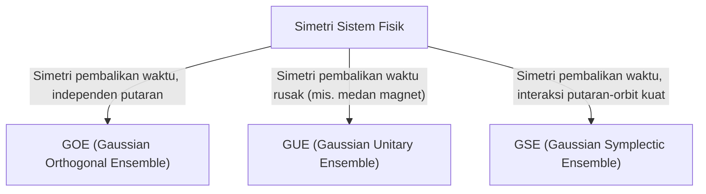

# Pengantar: Universalitas Teori Matriks Acak yang Mengejutkan

Dunia ini tampak kompleks dan tak terduga, tetapi melalui lensa matematika, kita kadang menemukan kesamaan yang mengejutkan di bidang yang sama sekali berbeda. "Teori Matriks Acak (Random Matrix Theory, RMT)" adalah salah satu kerangka matematika yang memiliki universalitas seperti itu.

Matriks acak adalah matriks yang elemen-elemennya berupa variabel acak. Sekilas mungkin hanya terlihat seperti susunan angka yang acak, namun saat ukuran matriks mendekati tak terhingga, distribusi [nilai eigen](/p/eigenvalues-and-eigenvectors/)-nya menunjukkan pola yang luar biasa indah dan universal. Hukum ini tersembunyi di balik sistem yang sama sekali berbeda, mulai dari dunia mikroskopis nukleus atom, misteri distribusi bilangan prima, fluktuasi harga di pasar keuangan, hingga dinamika pembelajaran model deep learning mutakhir.

Artikel ini membahas latar belakang sejarah Teori Matriks Acak, klasifikasi ansambel seperti GOE/GUE/GSE yang menjadi dasar matematikanya, bukti matematis Hukum Setengah Lingkaran Wigner, dan hubungan tak terduganya dengan fungsi Zeta Riemann. Di paruh kedua, kita akan menggali lebih dalam aplikasi modern seperti optimasi portofolio dalam rekayasa keuangan dan masalah inisialisasi bobot dalam AI/deep learning, disertai visualisasi praktis menggunakan kode Python.

---

# 1. Kelahiran dari Fisika: Wigner dan Misteri Nukleus Berat

Akar Teori Matriks Acak bermula dari fisika nuklir pada tahun 1950-an. Saat itu, para fisikawan berjuang keras memahami tingkat energi (nilai energi yang mungkin dari keadaan mekanika kuantum) nukleus berat seperti uranium.

## Tingkat Energi Nukleus Uranium

Untuk nukleus ringan, interaksi antara proton dan neutron dapat dihitung sesuai Persamaan Schrödinger untuk memprediksi tingkat energi secara akurat. Namun, untuk nukleus berat seperti uranium (nomor massa 238) di mana banyak nukleon berinteraksi secara kompleks, perhitungan presisi secara praktis tidak mungkin karena derajat kebebasannya terlalu besar.

Melihat data hamburan neutron yang diamati secara eksperimental, tingkat energi resonansi tampak tersusun secara acak. Namun, saat menyelidiki distribusi statistik dari "jarak (spacing)" antar tingkat energi, ditemukan pola yang jelas. Tingkat energi yang berdekatan memiliki sifat "penolakan tingkat (level repulsion)" yang memastikan mereka tidak pernah terlalu dekat.

## Intuisi Wigner dan Penemuan Hukum Setengah Lingkaran

Pada tahun 1955, Eugene Wigner mengusulkan ide berani untuk memodelkan Hamiltonian (matriks yang mewakili energi) dari sistem kuantum kompleks ini bukan sebagai matriks spesifik dengan struktur fisik rinci, melainkan sebagai "matriks simetris raksasa dengan elemen acak".

Hebatnya, distribusi jarak [nilai eigen](/p/eigenvalues-and-eigenvectors/) dari matriks acak yang sangat disederhanakan ini sangat cocok dengan distribusi jarak tingkat energi sebenarnya dari nukleus uranium. Wigner lebih lanjut menemukan bahwa dalam batas saat ukuran matriks $N$ menuju tak terhingga, kepadatan distribusi keseluruhan [nilai eigen](/p/eigenvalues-and-eigenvectors/) membentuk setengah lingkaran. Ini adalah "Hukum Setengah Lingkaran Wigner (Wigner's semicircle law)" yang terkenal.

---

# 2. Klasifikasi Ansambel: GOE, GUE, GSE

Menindaklanjuti penelitian Wigner, Freeman Dyson mensistematiskan teori matriks acak dan mengklasifikasikan matriks acak ke dalam 3 kelas universal (ansambel) berdasarkan simetri sistem fisiknya. Ini dikenal sebagai "Jalan Tiga Lapis Dyson (Dyson's threefold way)".



## Ansambel Ortogonal Gaussian (GOE)

GOE adalah himpunan matriks simetris nyata yang elemen-elemennya berupa bilangan real. Setiap elemen non-diagonal dipilih secara independen dari distribusi normal dengan rata-rata 0 dan varians 1, dan elemen diagonal dipilih dari distribusi normal dengan rata-rata 0 dan varians 2. GOE memodelkan Hamiltonian sistem kuantum (misalnya partikel tanpa spin) tanpa medan magnet eksternal dan yang simetri pembalikan waktunya dipertahankan.

## Ansambel Kesatuan Gaussian (GUE)

GUE adalah himpunan matriks Hermitian yang elemen-elemennya berupa bilangan kompleks. Bagian riil dan imajiner elemen non-diagonal mengikuti distribusi normal independen. Ini berlaku pada sistem fisik di mana simetri pembalikan waktu rusak karena medan magnet eksternal. GUE ini memiliki kaitan mendalam dengan distribusi nol fungsi Zeta Riemann yang dibahas nanti.

## Ansambel Simplektik Gaussian (GSE)

GSE adalah himpunan matriks Hermitian dual-mandiri yang elemen-elemennya terdiri dari kuaternion. Ini mendeskripsikan sistem partikel dengan putaran setengah bilangan bulat dan interaksi putaran-orbit yang kuat, dengan simetri pembalikan waktu yang tetap dipertahankan.

---

# 3. Kedalaman Matematis: Bukti Hukum Setengah Lingkaran Wigner

Kami akan meninjau proses membuktikan hukum setengah lingkaran Wigner menggunakan Metode Momen (Method of Moments).

Pertimbangkan matriks simetris riil $X$ berukuran $N \times N$, di mana elemen $X_{ij}$ saling independen, dengan rata-rata 0 dan varians 1. Kita mencari limit (saat $N \to \infty$) distribusi [nilai eigen](/p/eigenvalues-and-eigenvectors/) dari matriks yang diskalakan $W = \frac{1}{\sqrt{N}}X$.

## Pendekatan dengan Metode Momen

Untuk menganalisis fungsi distribusi empiris [nilai eigen](/p/eigenvalues-and-eigenvectors/), kita hitung momen ke-$k$ dari distribusi, $m_k$. Karena jejak (trace, atau jumlah elemen diagonal) dari matriks sama dengan jumlah [nilai eigen](/p/eigenvalues-and-eigenvectors/),
$$ m_k = \lim_{N \to \infty} \frac{1}{N} \mathbb{E}[\text{Tr}(W^k)] $$
kita mengevaluasinya.

Mengekspansi jejak menghasilkan:
$$ \text{Tr}(W^k) = \frac{1}{N^{k/2}} \sum_{i_1, i_2, \dots, i_k} X_{i_1 i_2} X_{i_2 i_3} \cdots X_{i_k i_1} $$
Saat mengambil nilai harapan, karena elemen $X_{ij}$ independen dengan rata-rata 0, bagian dengan elemen yang sama hanya muncul sekali akan memiliki nilai harapan 0. Agar berkontribusi non-nol, setiap tepi pada jalur $i_1 \to i_2 \to \dots \to i_k \to i_1$ harus dilewati minimal dua kali.

Kontribusi dominan saat limit $N \to \infty$ adalah jalur sepanjang tepat $k$ langkah, menjelajahi simpul baru lalu kembali persis satu kali melalui tepi yang dilewati, membentuk struktur "pohon (tree)". Ini hanya mungkin jika $k$ genap ($k = 2m$), dan momen ganjil menjadi 0 di batas.

## Hubungan antara Bilangan Catalan dan Hukum Setengah Lingkaran

Jumlah jalur seperti ini (Jalur Dyck) dengan panjang $2m$ diberikan oleh "[Bilangan Catalan](/p/catalan-numbers/)" $C_m$, yang terkenal dalam matematika kombinatorik.
$$ C_m = \frac{1}{m+1} \binom{2m}{m} $$

Sehingga, momen distribusi limit adalah:
$$ m_{2m} = C_m, \quad m_{2m+1} = 0 $$
Distribusi probabilitas dengan momen ini diketahui sebagai distribusi setengah lingkaran (Hukum Setengah Lingkaran Wigner) yang berpusat pada interval $[-2, 2]$. Fungsi kepadatan probabilitasnya adalah:
$$ \rho(x) = \begin{cases} \frac{1}{2\pi} \sqrt{4 - x^2} & (-2 \le x \le 2) \\ 0 & (\text{other}) \end{cases} $$

---

# 4. Pertemuan Tak Terduga dengan Fungsi Zeta Riemann

Teori matriks acak yang lahir dari pemecahan masalah fisika mengarah pada penemuan luar biasa dalam matematika murni (terutama teori bilangan) pada tahun 1970-an.

## Konjektur Montgomery-Odlyzko

Pada tahun 1972, ahli teori bilangan Hugh Montgomery meneliti distribusi jarak dari nol non-trivial fungsi Zeta Riemann. Menurut Hipotesis Riemann, semua nol ini terletak di "garis kritis (garis dengan bagian riil 1/2)" di bidang kompleks. Montgomery menghitung fungsi korelasi pasangan nol dan mendapatkan $1 - \left(\frac{\sin(\pi x)}{\pi x}\right)^2$.

Suatu hari, Montgomery memberi tahu ahli fisika Freeman Dyson tentang hasil ini di waktu minum teh di Institute for Advanced Study, Princeton. Dyson terkejut. Karena rumus tersebut persis sama dengan distribusi jarak [nilai eigen](/p/eigenvalues-and-eigenvectors/) GUE yang diturunkannya.

## Persimpangan antara Bilangan Prima dan Kekacauan Kuantum

Kemudian, ahli matematika Andrew Odlyzko menghitung jutaan nol dari fungsi Zeta menggunakan superkomputer dan membuktikan bahwa distribusi jarak mereka cocok dengan prediksi GUE dengan presisi mengejutkan.

Penemuan ini disebut "Konjektur Montgomery-Odlyzko", yang menunjukkan hubungan universal mendalam antara distribusi bilangan prima (nol Zeta berhubungan erat dengan distribusi bilangan prima) dan sistem kuantum kacau (GUE). Ini adalah momen persimpangan di mana matematika yang menggambarkan hukum mikroskopis alam semesta dan yang mengatur bilangan prima bertemu melalui matriks acak.

---

# 5. Aplikasi dalam Rekayasa Keuangan: Evolusi Optimasi Portofolio

Teori matriks acak juga diaplikasikan secara kuat untuk analisis pasar keuangan. Teori ini sangat penting dalam optimasi manajemen aset.

## Keterbatasan Model Markowitz

Dalam model mean-variance Harry Markowitz, dasar teori portofolio modern, rasio investasi optimal ditentukan menggunakan invers matriks kovarians aset. Namun dalam praktiknya, terdapat masalah besar.

Saat memperkirakan matriks kovarians dari return historis periode $T$ pada $N$ aset, jika $N$ besar dan $T$ tidak cukup (sehingga rasio $N/T$ tidak mendekati 0), matriks akan dipenuhi noise statistik. Menghitung invers matriks dengan noise ini akan memperkuat kesalahan, menghasilkan portofolio ekstrem (misal melakukan *short* atau *long* ekstrem pada aset tertentu) yang tak realistis.

## Membersihkan Noise dengan Matriks Acak

Di sinilah Teori Matriks Acak berperan. Pada 1999, Bouchaud dkk dan Laloux dkk secara independen menerapkan RMT pada matriks kovarians pasar keuangan. Mereka membandingkan distribusi [nilai eigen](/p/eigenvalues-and-eigenvectors/) matriks kovarians dari deret waktu acak (Distribusi Marchenko-Pastur) dengan distribusi [nilai eigen](/p/eigenvalues-and-eigenvectors/) dari data pasar nyata.

Hasilnya, mayoritas (lebih dari 90%) [nilai eigen](/p/eigenvalues-and-eigenvectors/) data pasar berada dalam batas teoretis yang diprediksi oleh RMT. Ini berarti mereka hanyalah "noise". Di sisi lain, beberapa [nilai eigen](/p/eigenvalues-and-eigenvectors/) besar di luar batas inilah yang menyimpan informasi bermakna mengenai struktur korelasi pasar yang sebenarnya (faktor pasar dan faktor sektor).

Berdasarkan ini, teknik "pembersihan (cleaning)" matriks kovarians dikembangkan dengan memfilter [nilai eigen](/p/eigenvalues-and-eigenvectors/) yang merupakan noise. Ini secara dramatis meningkatkan kinerja dan stabilitas portofolio, menjadikannya teknik standar di reksa dana kuantitatif.

---

# 6. Aplikasi di Kecerdasan Buatan (AI): Bobot dan Dinamika Pembelajaran di Deep Learning

Dalam beberapa tahun terakhir, RMT juga menonjol dalam analisis teoretis Machine Learning, khususnya Deep Learning.

## Masalah Inisialisasi Jaringan Saraf

Saat melatih jaringan saraf raksasa, menginisialisasi matriks bobot sangat krusial. Inisialisasi yang tidak tepat akan menyebabkan lenyapnya gradien (Gradient Vanishing) atau meledaknya gradien (Gradient Exploding), sehingga pembelajaran terhenti.

Saat menginisialisasi dengan nilai acak, matriks bobot pada dasarnya adalah matriks acak. RMT memungkinkan analisis yang ketat tentang transisi varians sinyal melalui lapisan demi lapisan dan perilaku gradien pada propagasi mundur. Analisis pengaruh fungsi aktivasi non-linier terhadap spektrum matriks (distribusi [nilai eigen](/p/eigenvalues-and-eigenvectors/)) memberikan justifikasi teoretis untuk metode modern seperti Inisialisasi Xavier dan He.

## Distribusi Nilai Eigen Hessian

Untuk memahami dinamika proses pembelajaran, analisis matriks Hessian yang mewakili kelengkungan fungsi kerugian (loss function) amat diperlukan. Pada model raksasa dengan miliaran parameter seperti [LLM](/p/large-language-models-llm-transformer-prompt-engineering/), Hessian adalah matriks raksasa yang sulit diteliti langsung, tetapi RMT memampukan prediksi distribusinya.

Studi menunjukkan bahwa distribusi [nilai eigen](/p/eigenvalues-and-eigenvectors/) Hessian deep neural network terdiri dari sebuah kelompok besar (bulk) di sekitar nol dan sedikit pencilan besar (outliers). Bulk merepresentasikan arah dengan sedikit informasi yang termodelkan sebagai matriks acak ber-noise, sedangkan outliers mewakili arah kritis yang relevan dengan tugas. Pemahaman ini sangat membantu meningkatkan konvergensi algoritma pengoptimal (seperti SGD dan Adam).

---

# 7. Praktek: Visualisasi Distribusi Nilai Eigen dengan Python

Terakhir, mari gunakan Python untuk menghasilkan GOE (Ansambel Ortogonal Gaussian) dan mengkonfirmasi secara numerik keberlakuan Hukum Setengah Lingkaran Wigner.

```python
import numpy as np
import matplotlib.pyplot as plt
from scipy.stats import semicircular

# Pengaturan parameter
N = 1000  # Ukuran matriks
num_matrices = 50  # Jumlah matriks dalam ansambel

eigenvalues = []

# Menghasilkan matriks GOE dan menghitung nilai eigen
for _ in range(num_matrices):
    # Menghasilkan elemen matriks N x N yang berdistribusi N(0, 1)
    X = np.random.randn(N, N)
    # Simetrisasi matriks (perhatikan skala varians)
    A = (X + X.T) / np.sqrt(2)
    # Menskalakan varians menjadi 1/N
    W = A / np.sqrt(N)
    
    # Menghitung nilai eigen (gunakan eigh untuk matriks simetris riil)
    eigvals = np.linalg.eigh(W)[0]
    eigenvalues.extend(eigvals)

# Pengaturan plot
plt.figure(figsize=(10, 6))

# Memplot histogram nilai eigen
plt.hist(eigenvalues, bins=100, density=True, alpha=0.6, color='skyblue', edgecolor='black', label='Empirical Eigenvalues (GOE)')

# Memplot hukum setengah lingkaran teoretis Wigner
x = np.linspace(-2.2, 2.2, 1000)
# Fungsi kepadatan probabilitas dengan jari-jari R=2
y = np.where(np.abs(x) <= 2, np.sqrt(4 - x**2) / (2 * np.pi), 0)
plt.plot(x, y, 'r-', lw=3, label="Wigner's Semicircle Law")

plt.title(f"Eigenvalue Distribution of GOE Matrices ($N={N}$)", fontsize=16)
plt.xlabel("Eigenvalue", fontsize=14)
plt.ylabel("Density", fontsize=14)
plt.legend(fontsize=12)
plt.grid(True, alpha=0.3)
plt.tight_layout()
plt.show()
```

Saat menjalankan kode ini, Anda akan melihat bahwa [nilai eigen](/p/eigenvalues-and-eigenvectors/) dari matriks yang di-generate secara acak akan mendistribusikan pola setengah lingkaran yang indah. Pesona terbesar dari RMT adalah fenomena bahwa meskipun elemen individunya acak, matriks secara keseluruhan membentuk suatu hukum keteraturan yang jelas.

---

# Penutup

Dalam artikel ini, kita melacak kisah epik Teori Matriks Acak sejak dari fisika nuklir, ke matematika murni, rekayasa keuangan, hingga mencapai puncaknya pada penerapan dalam AI modern. Fakta bahwa sistem rumit dan tampak tak berkaitan ini secara limit dapat diartikan dalam bahasa universal melalui "[nilai eigen](/p/eigenvalues-and-eigenvectors/) matriks acak", menunjukkan betapa dalamnya teka-teki alam dan matematika.

Dalam era di mana data terus melimpah dan model menjadi kian besar, Teori Matriks Acak telah berevolusi dari sebatas abstraksi matematis murni menjadi alat ampuh dalam ilmu data (data science) dan pemecahan masalah empiris dalam Machine Learning. Teori ini akan senantiasa memberi cahaya yang menyingkap tabir bagi pemahaman kita akan sistem kompleks universal di lintas keilmuan.
