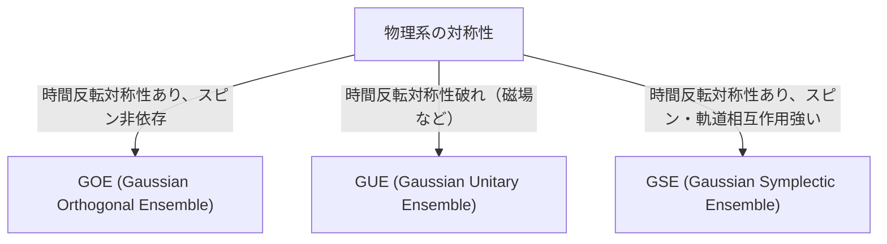

# Pengantar: Universalitas yang Mengejutkan dari Teori Matriks Acak

Dunia ini tampak kompleks dan tak terduga, tetapi ketika dilihat melalui lensa matematika, terkadang kita dapat menemukan kesamaan yang mengejutkan di berbagai bidang yang sama sekali berbeda. "Teori Matriks Acak" (Random Matrix Theory, RMT) adalah salah satu kerangka matematika yang memiliki universalitas seperti itu.

Matriks acak adalah matriks yang elemen-elemennya diberikan oleh variabel acak. Pada pandangan pertama, itu tampak hanya sekadar susunan angka acak, tetapi ketika ukuran matriks didekati ke tak terhingga, distribusi dari nilai eigen (eigenvalues) menunjukkan pola yang sangat indah dan universal. Hukum ini bersembunyi di balik sistem yang sangat berbeda, dari dunia mikrokosmos inti atom, misteri distribusi bilangan prima, fluktuasi harga pasar keuangan, hingga dinamika pembelajaran model pembelajaran mendalam (deep learning) termutakhir.

Dalam artikel ini, kita akan memulai dari latar belakang sejarah teori matriks acak, klasifikasi ansambel seperti GOE/GUE/GSE yang merupakan dasar matematikanya, bukti matematis dari Hukum Setengah Lingkaran Wigner, dan juga hubungannya yang tak terduga dengan fungsi zeta Riemann. Kemudian, pada bagian akhir, kita akan membahas secara mendalam aplikasi modern dari teori ini dalam optimalisasi portofolio pada rekayasa keuangan dan masalah inisialisasi bobot (weight initialization) pada AI dan deep learning, dengan dibantu visualisasi praktis menggunakan kode Python.

---

# 1. Kelahiran dari Ilmu Fisika: Wigner dan Misteri Inti Atom Berat

Akar dari teori matriks acak berawal dari fisika nuklir pada tahun 1950-an. Para fisikawan pada masa itu berjuang keras untuk memahami tingkat energi (nilai energi yang dapat diambil dari status kuantum mekanis) pada inti atom yang berat seperti uranium.

## Tingkat Energi Inti Atom Uranium

Untuk inti atom ringan, kita dapat memprediksi tingkat energi secara akurat dengan menghitung interaksi antara proton dan neutron sesuai dengan persamaan Schrödinger. Namun, pada inti atom berat seperti uranium (dengan nomor massa 238, dll.) di mana sejumlah besar nukleon berinteraksi secara kompleks, terdapat tingkat kebebasan yang terlalu besar sehingga perhitungan yang tepat hampir tidak mungkin dilakukan.

Ketika melihat data penyebaran neutron yang diamati secara eksperimental, tingkat energi resonansinya tampak tersusun secara tidak teratur. Namun, ketika distribusi statistik dari "jarak" (spacing) antara tingkat energi diperiksa, ditemukan pola yang jelas. Tingkat energi yang berdekatan memiliki sifat yang disebut "penolakan tingkat" (level repulsion), yaitu tidak pernah saling mendekati terlalu dekat.

## Intuisi Wigner dan Penemuan Hukum Setengah Lingkaran

Pada tahun 1955, Eugene Wigner mengajukan ide berani untuk memodelkan Hamiltonian (matriks yang mewakili energi) dari sistem kuantum kompleks ini bukan sebagai matriks spesifik yang memiliki struktur fisik detail, melainkan sebagai "matriks simetris raksasa dengan elemen-elemen yang memiliki nilai acak".

Menariknya, distribusi jarak nilai eigen dari matriks acak yang sangat disederhanakan ini sesuai dengan sangat baik dengan distribusi jarak tingkat energi yang sebenarnya dari inti atom uranium. Wigner selanjutnya menemukan bahwa, dalam batas ketika ukuran matriks $N$ mendekati tak terhingga, kepadatan distribusi keseluruhan dari nilai eigen akan mengambil bentuk setengah lingkaran. Ini adalah "Hukum Setengah Lingkaran Wigner" (Wigner's semicircle law) yang terkenal.

---

# 2. Klasifikasi Ansambel: GOE, GUE, GSE

Menyusul penelitian Wigner, Freeman Dyson mensistematisasi teori matriks acak dan mengklasifikasikan matriks acak menjadi tiga kelas universal (ansambel) berdasarkan simetri yang dimiliki sistem fisiknya. Ini disebut "Jalan Tiga Lapis Dyson" (Dyson's threefold way).



## Gaussian Orthogonal Ensemble (GOE)

GOE adalah himpunan matriks simetris nyata (real symmetric matrix) yang elemen-elemennya terdiri dari bilangan real. Masing-masing elemen di luar diagonal dipilih secara independen dari distribusi normal dengan rata-rata 0 dan varians 1, sementara elemen diagonal dipilih dari distribusi normal dengan rata-rata 0 dan varians 2. GOE digunakan untuk memodelkan Hamiltonian dari sistem kuantum yang tidak memiliki medan magnet eksternal dan simetri pembalikan waktu dipertahankan (contohnya, sistem partikel tanpa spin).

## Gaussian Unitary Ensemble (GUE)

GUE adalah himpunan matriks Hermitian yang elemen-elemennya terdiri dari bilangan kompleks. Bagian riil dan imajiner dari elemen di luar diagonal masing-masing mengikuti distribusi normal yang independen. Ini diaplikasikan pada sistem fisik di mana simetri pembalikan waktu dilanggar, seperti karena adanya medan magnet eksternal. GUE inilah yang memiliki kaitan erat dengan distribusi titik nol fungsi zeta Riemann, yang akan dijelaskan di bawah ini.

## Gaussian Symplectic Ensemble (GSE)

GSE adalah himpunan matriks Hermitian swadual (self-dual) yang elemen-elemennya terdiri dari kuaternion (quaternion). Meskipun simetri pembalikan waktu dipertahankan, ansambel ini menjelaskan sistem yang terdiri dari partikel-partikel dengan spin setengah bulat yang memiliki interaksi spin-orbit yang kuat.

---

# 3. Jurang Matematika Dalam: Bukti dari Hukum Setengah Lingkaran Wigner

Mari kita tinjau secara garis besar proses pembuktian dari Hukum Setengah Lingkaran Wigner, yang merupakan hasil paling dasar dari teori matriks acak, menggunakan Metode Momen (Method of Moments).

Pertimbangkan matriks simetris riil $X$ dengan ukuran $N \times N$, di mana elemen-elemennya $X_{ij}$ adalah variabel acak saling independen dengan rata-rata 0 dan varians 1. Kita akan mencari limit ($N \to \infty$) dari distribusi nilai eigen untuk matriks yang diskalakan, $W = \frac{1}{\sqrt{N}}X$.

## Pendekatan Melalui Metode Momen

Untuk menganalisis fungsi distribusi empiris dari nilai eigen, kita menghitung momen ke-$k$ dari distribusi, $m_k$. Karena jejak (trace, yaitu jumlah dari komponen diagonal) dari suatu matriks sama dengan jumlah nilai eigennya,
$$ m_k = \lim_{N \to \infty} \frac{1}{N} \mathbb{E}[\text{Tr}(W^k)] $$
akan kita evaluasi.

Jika trace diekspansikan,
$$ \text{Tr}(W^k) = \frac{1}{N^{k/2}} \sum_{i_1, i_2, \dots, i_k} X_{i_1 i_2} X_{i_2 i_3} \cdots X_{i_k i_1} $$
Ketika mengambil nilai harapan (expected value), karena elemen $X_{ij}$ memiliki rata-rata 0 dan saling independen, maka untuk suku-suku yang diekspansi di mana elemen yang sama hanya muncul satu kali, nilai harapannya adalah 0. Agar dapat memiliki kontribusi yang tidak nol, setiap sisi (edge) pada jalur (path) $i_1 \to i_2 \to \dots \to i_k \to i_1$ harus dilalui setidaknya dua kali.

Kontribusi utama dalam limit $N \to \infty$ berasal dari jalur tepat $k$ langkah yang membentuk struktur "pohon" (tree), di mana ia mengeksplorasi titik (vertex) baru dan kembali melalui sisi yang telah dilewati tepat satu kali lagi. Ini hanya mungkin terjadi jika $k$ adalah bilangan genap ($k = 2m$), dan momen berorde ganjil menjadi 0 pada limit tersebut.

## Hubungan Antara Bilangan Catalan dan Hukum Setengah Lingkaran

Jumlah dari lintasan semacam ini (lintasan Dyck) dengan panjang $2m$ diberikan oleh "[Bilangan Catalan](/id/p/catalan-numbers/)" (Catalan numbers) $C_m$, yang terkenal dalam kombinatorika matematika.
$$ C_m = \frac{1}{m+1} \binom{2m}{m} $$

Oleh karena itu, momen dari distribusi limit adalah,
$$ m_{2m} = C_m, \quad m_{2m+1} = 0 $$
Distribusi probabilitas dengan momen-momen ini diketahui merupakan distribusi setengah lingkaran (Hukum Setengah Lingkaran Wigner) yang memiliki dukungan (support) pada interval $[-2, 2]$. Fungsi kepadatan probabilitasnya (probability density function) adalah sebagai berikut:
$$ \rho(x) = \begin{cases} \frac{1}{2\pi} \sqrt{4 - x^2} & (-2 \le x \le 2) \\ 0 & (\text{otherwise}) \end{cases} $$

---

# 4. Pertemuan Tak Terduga dengan Fungsi Zeta Riemann

Teori matriks acak, yang awalnya diciptakan untuk memecahkan masalah dalam bidang fisika, menghasilkan penemuan bersejarah dalam matematika murni, khususnya dalam teori bilangan, pada tahun 1970-an.

## Konjektur Montgomery-Odlyzko

Pada tahun 1972, seorang pakar teori bilangan, Hugh Montgomery, sedang mempelajari tentang distribusi jarak nol nontrivial (non-trivial zeros) dari fungsi zeta Riemann. Menurut Hipotesis Riemann, seluruh nol dari fungsi ini berada pada "garis kritis" (garis lurus dengan bagian riil 1/2) di dalam bidang kompleks. Montgomery menghitung fungsi korelasi dari pasangan nol dan menyimpulkan bahwa hasilnya menjadi $1 - \left(\frac{\sin(\pi x)}{\pi x}\right)^2$.

Suatu hari, saat waktu minum teh di Institute for Advanced Study di Princeton, Montgomery menceritakan hasil ini kepada fisikawan Freeman Dyson. Dyson sangat terkejut. Karena rumus ini tepat sama persis dengan yang disimpulkan oleh Dyson sendiri mengenai distribusi jarak dari nilai eigen pada GUE (Gaussian Unitary Ensemble).

## Persimpangan Bilangan Prima dan Chaos Kuantum

Kemudian, matematikawan Andrew Odlyzko menghitung jutaan nol dari fungsi zeta menggunakan superkomputer dan membuktikan bahwa distribusi jarak ini secara luar biasa selaras dengan prediksi dari GUE.

Penemuan ini disebut dengan "Konjektur Montgomery-Odlyzko" dan ini menunjukkan bahwa ada hubungan universal yang mendalam antara distribusi bilangan prima (nol dari fungsi zeta terkait erat dengan distribusi bilangan prima) dan sistem chaos kuantum (GUE). Ini adalah momen di mana matematika yang menjelaskan hukum makrokosmos bersimpangan dengan matematika yang mengatur blok pembangun angka, yaitu bilangan prima, melalui titik temu matriks acak.

---

# 5. Aplikasi dalam Rekayasa Keuangan: Evolusi Optimalisasi Portofolio

Teori matriks acak tidak hanya terbatas pada fisika atau matematika murni, tetapi juga diaplikasikan sebagai alat yang sangat berguna untuk analisis pasar keuangan. Khususnya, teori ini memainkan peran krusial dalam mengoptimalkan pengelolaan aset.

## Keterbatasan Model Markowitz

Dalam model mean-variance Harry Markowitz, yang menjadi fondasi teori portofolio modern, rasio investasi yang optimal ditentukan dengan menggunakan invers dari matriks kovariansi aset. Namun, ada masalah besar dalam praktik aktualnya.

Ketika mengestimasi matriks kovariansi sampel dari data tingkat pengembalian (return) masa lalu periode $T$ dari $N$ aset, jika $N$ besar dan $T$ tidak cukup memadai (tidak bisa dikatakan $N/T$ mendekati 0), matriks kovariansi sampel akan menyertakan sejumlah besar "noise" statistik. Ketika kebalikan (invers) dari matriks yang mengandung noise ini dihitung, kesalahannya akan diperkuat, yang mengakibatkan terciptanya portofolio ekstrem yang tidak realistis (seperti menginstruksikan posisi short atau long yang ekstrem pada aset-aset tertentu).

## Pembersihan Noise dengan Matriks Acak

Di sinilah teori matriks acak muncul. Pada tahun 1999, Bouchaud dkk. dan Laloux dkk. secara independen menerapkan teori matriks acak pada matriks kovariansi pasar keuangan. Mereka membandingkan distribusi nilai eigen dari matriks kovariansi yang didapatkan dari deret waktu data yang sepenuhnya acak (Distribusi Marchenko-Pastur) dengan distribusi nilai eigen dari matriks kovariansi data pasar sebenarnya.

Hasilnya, terlihat bahwa sebagian besar dari nilai eigen data pasar (lebih dari 90%) ada di dalam batas teori yang diprediksi oleh teori matriks acak. Dengan kata lain, ini hanyalah sekadar "noise". Di sisi lain, hanya sedikit nilai eigen yang cukup besar yang melampaui batasan ini secara signifikan, yang memiliki informasi berarti yang mencerminkan struktur korelasi pasar yang sebenarnya (faktor pasar atau faktor sektor).

Berdasarkan pengetahuan ini, metode dikembangkan untuk memfilter (misalnya dengan menjadikannya nol atau menggantinya dengan nilai rata-rata) nilai eigen yang sesuai dengan noise untuk "membersihkan" matriks kovariansi. Hal ini secara dramatis meningkatkan kinerja dan stabilitas portofolio, dan sekarang ini digunakan sebagai teknik standar oleh banyak quant fund.

---

# 6. Aplikasi pada Kecerdasan Buatan (AI): Bobot dan Dinamika Pembelajaran di Deep Learning

Di tahun-tahun belakangan ini, teori matriks acak mulai banyak menjadi sorotan untuk analisis teoretis AI dan pembelajaran mesin (Machine Learning), dan khususnya lagi untuk Deep Learning.

## Masalah Inisialisasi dalam Jaringan Saraf Tiruan

Saat melatih sebuah jaringan saraf tiruan (neural network) berukuran besar, cara menentukan nilai awal untuk matriks bobot jaringan memainkan peranan yang sangat penting yang bisa memisahkan sukses-tidaknya pembelajaran. Jika inisialisasi tidak tepat, maka dapat terjadi hilangnya gradien (gradient vanishing) ataupun ledakan gradien (gradient exploding), dan pembelajaran tidak akan maju.

Ketika menginisialisasi matriks bobot dengan nilai-nilai acak, hal ini sejatinya adalah matriks acak. Dengan menggunakan teori matriks acak, seseorang dapat menganalisis varian dari sinyal yang ditransmisikan melalui berbagai lapisan dengan presisi tinggi, dan juga menganalisis perilaku dari gradien dalam perambatan balik (backpropagation). Sebagai contoh, dalam menganalisis bagaimana fungsi aktivasi non-linier berdampak pada spektrum (distribusi nilai eigen) matriks acak. Hal ini memberikan dasar teoretis yang kuat untuk metode inisialisasi standar modern seperti Inisialisasi Xavier maupun Inisialisasi He.

## Distribusi Nilai Eigen dari Hessian

Untuk memahami dinamika dari proses pembelajaran, analisis pada kurvatur fungsi rugi (loss function) yang direpresentasikan oleh Matriks Hessian sangatlah penting. Matriks Hessian pada model bahasa berskala besar (LLMs) dengan jutaan bahkan ratusan miliar parameter adalah matriks dengan ukuran raksasa di mana sifatnya sangat sulit untuk diinvestigasi secara langsung; tetapi, dengan menggunakan teori matriks acak, kita dapat memperkirakan/memprediksi distribusi nilai eigennya.

Riset menunjukkan bahwa distribusi nilai eigen Hessian buat model jaringan saraf mendalam terdiri atas kumpulan bulk (sejumlah besar nilai eigen yang sangat mendekati nol) dan sejumlah kecil pencilan besar (outliers). Bagian bulk ini dapat dimodelkan sebagai matriks acak berisikan noise (sebagai contoh, pada arah dengan informasi yang sangat minim), sementara outlier bertindak mewakili arah-arah krusial penting dalam proses belajar yang terhubung ke dalam tugas pembelajarannya. Lewat pemahaman perihal struktur spektrum ini, peningkatan di seputar algoritma untuk mengoptimasi (misal SGD, Adam, dsb.) dan pengaturan jadwal learning rate optimal bisa dikembangkan, menghasilkan pengetahuan yang luar biasa relevan.

---

# 7. Praktik: Visualisasi Distribusi Nilai Eigen dengan Python

Sebagai akhir dari pembahasan, mari kita coba secara aktual menggunakan Python untuk membuat model GOE (Gaussian Orthogonal Ensemble) dan mengonfirmasi secara numerik bahwa hukum setengah lingkaran Wigner memang berlaku.

```python
import numpy as np
import matplotlib.pyplot as plt
from scipy.stats import semicircular

# パラメータ設定
N = 1000  # 行列のサイズ
num_matrices = 50  # アンサンブルのサンプル数

eigenvalues = []

# GOE行列の生成と固有値の計算
for _ in range(num_matrices):
    # 要素がN(0, 1)に従うN x N行列を生成
    X = np.random.randn(N, N)
    # 対称化してGOE行列を作成 (分散のスケーリングに注意)
    A = (X + X.T) / np.sqrt(2)
    # 分散を 1/N にスケーリング
    W = A / np.sqrt(N)
    
    # 固有値を計算（実対称行列なのでeighを使用）
    eigvals = np.linalg.eigh(W)[0]
    eigenvalues.extend(eigvals)

# プロットの設定
plt.figure(figsize=(10, 6))

# 固有値のヒストグラムをプロット
plt.hist(eigenvalues, bins=100, density=True, alpha=0.6, color='skyblue', edgecolor='black', label='Empirical Eigenvalues (GOE)')

# 理論的なウィグナーの半円則をプロット
x = np.linspace(-2.2, 2.2, 1000)
# 半径 R=2 の半円則の確率密度関数
y = np.where(np.abs(x) <= 2, np.sqrt(4 - x**2) / (2 * np.pi), 0)
plt.plot(x, y, 'r-', lw=3, label="Wigner's Semicircle Law")

plt.title(f"Eigenvalue Distribution of GOE Matrices ($N={N}$)", fontsize=16)
plt.xlabel("Eigenvalue", fontsize=14)
plt.ylabel("Density", fontsize=14)
plt.legend(fontsize=12)
plt.grid(True, alpha=0.3)
plt.tight_layout()
plt.show()
```

Ketika Anda mengeksekusi kode ini, Anda dapat mengonfirmasi bahwa nilai eigen dari matriks yang dibangkitkan secara acak akan mendistribusikan diri mereka ke dalam bentuk setengah lingkaran yang indah. Fakta bahwa meskipun masing-masing elemen matriks benar-benar merupakan besaran acak, aturan seperti itu muncul secara keseluruhan merupakan daya tarik terbesar yang ditawarkan oleh teori matriks acak.

---

# Penutup

Dalam artikel ini, kita telah mengeksplorasi cerita epik di mana teori matriks acak yang dimulai pada bidang fisika nuklir, terhubung hingga matematika murni, lalu kepada finansial enjinering, hingga bersambung pula sampai teknologi AI di era modern. Kenyataan bahwa beberapa sistem-sistem pelik dan rumit ini pada mulanya kelihatan tak saling berkaitan, tapi jika ada di level paling ekstrem, mereka sesungguhnya dapat dihubungkan pada sebuah dialog dalam menggunakan konsep bahasa universal perihal "nilai eigen dari bentuk matriks acak", sebuah kejadian memukau di mana hal-hal ini memperlihatkan kedalaman magis antara ruang alam semesta dengan dunia numerik dari matematika.

Pada zaman mutakhir ini di mana sumber daya jumlah data pun membesar sangat luar biasa meledak dan diiringi model yang tumbuh membengkak sangat gigantik, teori matriks acak tersebut justru kini bertumbuh lebih dari sekadar hanya ilmu abstrak bidang matematika dan berevolusi secara konkret bertransisi mewujud sebuah persenjataan ampuh untuk menindak ragam perkara penyelesaian secara praktik baik pada Ilmu Sains Data serta Machine Learning (Pembelajaran Mesin). Upaya pencarian menuju pada kebenaran universal pada sesuatu yang menyelimuti dunia sistem yang kompleks dengan teori ini akan senantiasa berubah menjelma jadi berkas sinar pencerah yang membawa ilmu penegasan perihal kedalaman pemahaman wawasan kita dari beragam macam sektor lapangan secara meluas di waktu yang akan mendatang.
