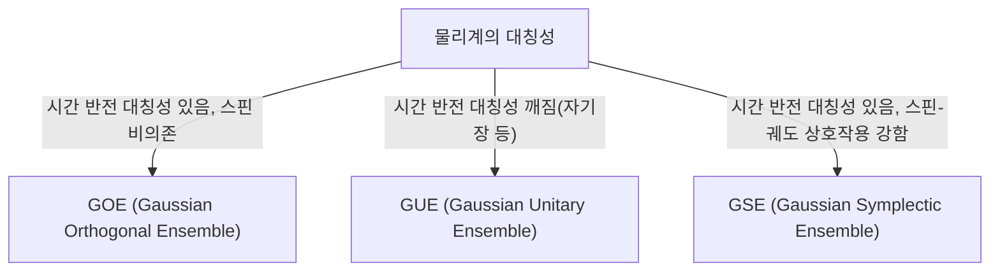

# 들어가며: 랜덤 행렬 이론의 놀라운 보편성

세상은 복잡하고 예측 불가능해 보이지만, 수학의 렌즈를 통해 보면 전혀 다른 분야에서 놀라운 공통점을 발견할 때가 있습니다. '랜덤 행렬 이론(Random Matrix Theory, RMT)'은 바로 그러한 보편성을 가진 수학적 틀 중 하나입니다.

랜덤 행렬이란 요소가 확률 변수로 주어지는 행렬을 말합니다. 언뜻 보면 단순한 숫자의 무작위 배열에 불과하지만, 행렬의 크기를 무한대에 가깝게 하면 그 [고윳값](/p/eigenvalues-and-eigenvectors/) 분포에는 놀랍도록 아름답고 보편적인 법칙이 나타납니다. 이 법칙은 미시적인 원자핵의 세계부터 소수 분포의 수수께끼, 금융 시장의 가격 변동, 그리고 최첨단 딥러닝 모델의 학습 동학에 이르기까지 전혀 다른 시스템의 이면에 숨어 있습니다.

본 기사에서는 랜덤 행렬 이론의 역사적 배경부터 시작하여 수학적 기초인 GOE/GUE/GSE와 같은 앙상블 분류, 위그너의 반원 법칙 수식 증명, 나아가 리만 제타 함수와의 예기치 않은 연관성을 해설합니다. 그리고 후반부에서는 금융 공학에서의 포트폴리오 최적화나 AI 및 딥러닝에서의 가중치 초기화 문제와 같은 현대적 응용에 대해 Python 코드를 이용한 실용적인 시각화와 함께 깊이 있게 파헤쳐 봅니다.

---

# 1. 물리학에서의 탄생: 위그너와 무거운 원자핵의 수수께끼

랜덤 행렬 이론의 뿌리는 1950년대 원자핵 물리학으로 거슬러 올라갑니다. 당시 물리학자들은 우라늄과 같이 무거운 원자핵의 에너지 준위(양자 역학적 상태가 가질 수 있는 에너지 값)를 이해하려고 고군분투하고 있었습니다.

## 우라늄 원자핵의 에너지 준위

가벼운 원자핵이라면 양성자와 중성자의 상호 작용을 슈뢰딩거 방정식에 따라 계산함으로써 에너지 준위를 정확하게 예측할 수 있습니다. 그러나 우라늄(질량수 238 등)과 같이 다수의 핵자가 복잡하게 상호 작용하는 무거운 원자핵에서는 자유도가 너무 커서 엄밀한 계산이 사실상 불가능합니다.

실험적으로 관측된 중성자 산란 데이터를 보면 공명 에너지 준위는 무질서하게 나열되어 있는 것처럼 보였습니다. 그러나 에너지 준위의 '간격(spacing)' 통계 분포를 조사하자 거기에 명확한 패턴이 있음이 판명되었습니다. 인접한 에너지 준위는 결코 너무 가까워지지 않는 '준위 반발(level repulsion)'이라는 성질을 가지고 있었던 것입니다.

## 위그너의 직관과 반원 법칙의 발견

1955년 유진 위그너(Eugene Wigner)는 이 복잡한 양자계의 해밀토니안(에너지를 나타내는 행렬)을 상세한 물리적 구조를 가진 특정 행렬로 다루는 대신, '요소가 무작위 값을 취하는 거대한 대칭 행렬'로 모델링한다는 대담한 아이디어를 제안했습니다.

놀랍게도 이 극도로 단순화된 랜덤 행렬의 [고윳값](/p/eigenvalues-and-eigenvectors/) 간격 분포는 실제 우라늄 원자핵의 에너지 준위 간격 분포와 멋지게 일치했습니다. 위그너는 나아가 행렬의 크기 $N$이 무한대를 향해 가는 극한에서 [고윳값](/p/eigenvalues-and-eigenvectors/)의 전체적인 밀도 분포가 반원 형태가 된다는 것을 발견했습니다. 이것이 유명한 '위그너의 반원 법칙(Wigner's semicircle law)'입니다.

---

# 2. 앙상블 분류: GOE, GUE, GSE

위그너의 연구에 이어 프리먼 다이슨(Freeman Dyson)은 랜덤 행렬 이론을 체계화하고 물리계가 가진 대칭성에 기초하여 랜덤 행렬을 3개의 보편적 클래스(앙상블)로 분류했습니다. 이는 '다이슨의 3중 길(Dyson's threefold way)'이라고 불립니다.



## 가우시안 직교 앙상블 (GOE)

GOE는 요소가 실수로 구성되는 실수 대칭 행렬의 집합입니다. 각 비대각 요소는 평균 0, 분산 1의 정규분포에서 독립적으로 선택되며, 대각 요소는 평균 0, 분산 2의 정규분포에서 선택됩니다. GOE는 외부 자기장이 없고 시간 반전 대칭성이 보존되는 양자계(예를 들어 스핀이 없는 입자계)의 해밀토니안을 모델링하는 데 사용됩니다.

## 가우시안 유니터리 앙상블 (GUE)

GUE는 요소가 복소수로 구성되는 에르미트 행렬의 집합입니다. 비대각 요소의 실수부와 허수부가 각각 독립적인 정규분포를 따릅니다. 외부 자기장이 존재하는 등 시간 반전 대칭성이 깨져 있는 물리계에 적용됩니다. 후술할 리만 제타 함수의 영점 분포와 깊은 관련을 갖는 것은 이 GUE입니다.

## 가우시안 심플렉틱 앙상블 (GSE)

GSE는 요소가 사원수(쿼터니언)로 구성되는 자기 쌍대 에르미트 행렬의 집합입니다. 시간 반전 대칭성은 보존되지만 스핀이 반정수인 입자로 이루어지며 스핀 궤도 상호작용이 강한 계를 기술합니다.

---

# 3. 수학적 심연: 위그너 반원 법칙 증명

랜덤 행렬 이론의 가장 기본적인 결과인 위그너의 반원 법칙을 모멘트 방법(Method of Moments)을 이용하여 증명하는 과정을 개관합니다.

요소 $X_{ij}$가 서로 독립이고 평균 0, 분산 1인 확률 변수인 $N \times N$ 크기의 실수 대칭 행렬 $X$를 고려합니다. 스케일링된 행렬 $W = \frac{1}{\sqrt{N}}X$의 [고윳값](/p/eigenvalues-and-eigenvectors/) 분포 극한($N \to \infty$)을 구합니다.

## 모멘트법을 통한 접근

[고윳값](/p/eigenvalues-and-eigenvectors/)의 경험 분포 함수를 해석하기 위해 분포의 $k$차 모멘트 $m_k$를 계산합니다. 행렬의 트레이스(대각 성분의 합)는 [고윳값](/p/eigenvalues-and-eigenvectors/)의 합과 같으므로,
$$ m_k = \lim_{N \to \infty} \frac{1}{N} \mathbb{E}[\text{Tr}(W^k)] $$
를 평가합니다.

트레이스를 전개하면,
$$ \text{Tr}(W^k) = \frac{1}{N^{k/2}} \sum_{i_1, i_2, \dots, i_k} X_{i_1 i_2} X_{i_2 i_3} \cdots X_{i_k i_1} $$
이 됩니다. 기댓값을 취할 때 요소 $X_{ij}$는 평균 0이고 독립이므로, 전개된 항 중에서 같은 요소가 1번만 나타나는 것은 기댓값이 0이 됩니다. 0이 아닌 기여를 가지려면 경로 $i_1 \to i_2 \to \dots \to i_k \to i_1$ 상의 각 간선이 적어도 2번씩 통과되어야 합니다.

극한 $N \to \infty$에서 주요한 기여가 되는 것은 정확히 $k$걸음 경로로, 새로운 정점을 탐색하면서 지나간 간선을 정확히 1번씩 되돌아오는 '트리(tree)' 구조를 이루는 경로입니다. 이것이 가능한 것은 $k$가 짝수인 경우($k = 2m$)뿐이며, 홀수차 모멘트는 극한에서 0이 됩니다.

## 카탈랑 수와 반원 법칙의 결합

길이 $2m$의 이러한 경로(디크 경로)의 총 수는 조합 수학에서 유명한 '[카탈랑 수](/p/catalan-numbers/)(Catalan numbers)' $C_m$으로 주어집니다.
$$ C_m = \frac{1}{m+1} \binom{2m}{m} $$

따라서 극한 분포의 모멘트는,
$$ m_{2m} = C_m, \quad m_{2m+1} = 0 $$
이 됩니다. 이 모멘트를 갖는 확률 분포는 구간 $[-2, 2]$에 지지선을 갖는 반원 분포(위그너의 반원 법칙)로 알려져 있습니다. 그 확률 밀도 함수는 다음과 같습니다.
$$ \rho(x) = \begin{cases} \frac{1}{2\pi} \sqrt{4 - x^2} & (-2 \le x \le 2) \\ 0 & (\text{otherwise}) \end{cases} $$

---

# 4. 리만 제타 함수와의 예기치 않은 조우

물리학의 문제를 풀기 위해 탄생한 랜덤 행렬 이론은 1970년대에 순수 수학, 특히 정수론 분야에서 세기의 대발견을 가져오게 됩니다.

## 몽고메리-오들리츠코 추측

1972년 정수론 학자인 휴 몽고메리(Hugh Montgomery)는 리만 제타 함수의 자명하지 않은 영점의 간격 분포에 대해 연구하고 있었습니다. 리만 가설에 따르면 이 영점들은 모두 복소 평면상의 '임계선(실수부가 1/2인 직선)' 위에 존재합니다. 몽고메리는 영점 쌍의 상관 함수를 계산하여 그것이 $1 - \left(\frac{\sin(\pi x)}{\pi x}\right)^2$이 됨을 도출했습니다.

어느 날 프린스턴 고등연구소의 티타임에서 몽고메리는 이 결과를 물리학자인 프리먼 다이슨에게 이야기했습니다. 다이슨은 경악했습니다. 왜냐하면 그 수식은 다이슨 자신이 도출했던 GUE(가우시안 유니터리 앙상블)의 [고윳값](/p/eigenvalues-and-eigenvectors/) 간격 분포와 완전히 같았기 때문입니다.

## 소수와 양자 카오스의 교차점

그 후 수학자 앤드류 오들리츠코(Andrew Odlyzko)가 슈퍼컴퓨터를 이용해 제타 함수의 영점을 수백만 개 계산하고, 그 간격 분포가 GUE의 예측과 놀라운 정확도로 일치함을 실증했습니다.

이 발견은 '몽고메리-오들리츠코 추측'이라 불리며, 소수의 분포(제타 함수의 영점은 소수 분포와 밀접하게 관련되어 있습니다)와 양자 카오스 계(GUE) 사이에 깊고 보편적인 연관성이 있음을 시사합니다. 우주의 미시적 법칙을 기술하는 수학과 소수라는 수의 구성 요소를 지배하는 수학이 랜덤 행렬이라는 접점을 통해 교차한 순간이었습니다.

---

# 5. 금융 공학 응용: 포트폴리오 최적화의 진화

랜덤 행렬 이론은 물리학이나 순수 수학에 머물지 않고 금융 시장 분석에도 강력한 도구로 응용되고 있습니다. 특히 자산 운용 최적화에서 중요한 역할을 합니다.

## 마코위츠 모델의 한계

현대 포트폴리오 이론의 기초인 해리 마코위츠(Harry Markowitz)의 평균-분산 모델에서는 자산의 공분산 행렬의 역행렬을 이용해 최적의 투자 비율을 결정합니다. 그러나 실무에서는 큰 문제가 있었습니다.

$N$개 자산의 과거 $T$ 기간 수익률 데이터로부터 표본 공분산 행렬을 추정할 때 $N$이 크고 $T$가 충분하지 않은($N/T$가 0에 가깝다고 할 수 없는) 경우, 표본 공분산 행렬에는 다량의 통계적 노이즈가 포함됩니다. 이 노이즈를 포함한 행렬의 역행렬을 계산하면 오차가 증폭되어 비현실적이고 극단적인 포트폴리오(일부 자산에 극단적인 숏이나 롱을 지시하는)가 생성되어 버리는 것입니다.

## 랜덤 행렬에 의한 노이즈 클리닝

여기서 랜덤 행렬 이론이 등장합니다. 1999년 Bouchaud 등과 Laloux 등은 독립적으로 금융 시장의 공분산 행렬에 랜덤 행렬 이론을 적용했습니다. 그들은 완전히 무작위적인 시계열 데이터에서 얻어지는 공분산 행렬의 [고윳값](/p/eigenvalues-and-eigenvectors/) 분포(마르첸코-파스퇴르 분포)와 실제 시장 데이터의 공분산 행렬 [고윳값](/p/eigenvalues-and-eigenvectors/) 분포를 비교했습니다.

그 결과 시장 데이터 [고윳값](/p/eigenvalues-and-eigenvectors/)의 대부분(90% 이상)은 랜덤 행렬 이론이 예측하는 이론적 경계 내에 들어간다는 것을 알 수 있었습니다. 즉 이것들은 단순한 '노이즈'입니다. 한편 경계를 크게 넘는 소수의 큰 [고윳값](/p/eigenvalues-and-eigenvectors/)만이 시장의 진정한 상관 구조(시장 팩터나 섹터 팩터)를 반영한 의미 있는 정보를 가지고 있음이 나타났습니다.

이 지식에 기초하여 노이즈에 해당하는 [고윳값](/p/eigenvalues-and-eigenvectors/)을 필터링(0으로 만들거나 평균값으로 대체하는 등)하여 공분산 행렬을 '클리닝'하는 기법이 개발되었습니다. 이로써 포트폴리오의 성능과 안정성이 획기적으로 향상되었으며, 현재는 많은 퀀트 펀드에서 표준 기술로 사용되고 있습니다.

---

# 6. 인공지능 응용: 딥러닝에서의 가중치와 학습 동학

최근 랜덤 행렬 이론은 AI/기계 학습, 특히 딥러닝(Deep Learning)의 이론적 해석에서도 각광을 받고 있습니다.

## 신경망의 초기화 문제

거대한 신경망을 학습시킬 때 네트워크 가중치 행렬의 초기값을 어떻게 설정할 것인가는 학습의 성패를 가르는 극히 중요한 문제입니다. 초기화가 부적절하면 기울기 소실(Gradient Vanishing)이나 기울기 폭발(Gradient Exploding)이 발생하여 학습이 진행되지 않습니다.

가중치 행렬을 무작위 값으로 초기화할 때 그것은 바로 랜덤 행렬입니다. 랜덤 행렬 이론을 이용하면 계층을 통과할 때마다 신호 분산의 추이나 역전파 시 기울기의 움직임을 엄밀하게 해석할 수 있습니다. 예를 들어 비선형 활성화 함수가 랜덤 행렬의 스펙트럼([고윳값](/p/eigenvalues-and-eigenvectors/) 분포)에 미치는 영향을 분석함으로써 Xavier 초기화나 He 초기화와 같은 현대의 표준적 초기화 기법의 이론적 정당성이 뒷받침되고 있습니다.

## 헤시안(Hessian)의 고윳값 분포

학습 프로세스의 역학을 이해하는 데 손실 함수의 곡률을 나타내는 헤시안 행렬 해석은 필수적입니다. 수천만에서 수천억 개의 파라미터를 가진 [LLM](/p/large-language-models-llm-transformer-prompt-engineering/)(대규모 언어 모델)의 헤시안은 거대한 행렬이며 그 성질을 직접 조사하기는 어렵지만, 랜덤 행렬 이론을 사용하면 그 [고윳값](/p/eigenvalues-and-eigenvectors/) 분포를 근사·예측할 수 있습니다.

연구에 따르면 심층 신경망 헤시안의 [고윳값](/p/eigenvalues-and-eigenvectors/) 분포는 벌크(대량의 0 부근 [고윳값](/p/eigenvalues-and-eigenvectors/))와 소수의 큰 이상치(아웃라이어)로 구성된다는 것을 알 수 있습니다. 벌크 부분은 노이즈를 포함한 랜덤 행렬(예를 들어 정보가 적은 방향)로 모델링할 수 있으며, 아웃라이어는 작업과 직결되는 중요한 학습 방향을 나타냅니다. 이 스펙트럼 구조의 이해는 최적화 알고리즘(SGD, Adam 등)의 수렴성을 개선하거나 학습률 스케줄을 최적화하는 데 매우 유용한 지식을 제공합니다.

---

# 7. 실천: Python을 이용한 고윳값 분포 시각화

마지막으로 Python을 이용해 실제로 GOE(가우시안 직교 앙상블)를 생성하고 위그너의 반원 법칙이 성립함을 수치적으로 확인해 봅시다.

```python
import numpy as np
import matplotlib.pyplot as plt
from scipy.stats import semicircular

# 파라미터 설정
N = 1000  # 행렬 크기
num_matrices = 50  # 앙상블 샘플 수

eigenvalues = []

# GOE 행렬 생성 및 고윳값 계산
for _ in range(num_matrices):
    # 요소가 N(0, 1)을 따르는 N x N 행렬 생성
    X = np.random.randn(N, N)
    # 대칭화하여 GOE 행렬 생성 (분산 스케일링 주의)
    A = (X + X.T) / np.sqrt(2)
    # 분산을 1/N로 스케일링
    W = A / np.sqrt(N)
    
    # 고윳값 계산(실수 대칭 행렬이므로 eigh 사용)
    eigvals = np.linalg.eigh(W)[0]
    eigenvalues.extend(eigvals)

# 플롯 설정
plt.figure(figsize=(10, 6))

# 고윳값 히스토그램 플롯
plt.hist(eigenvalues, bins=100, density=True, alpha=0.6, color='skyblue', edgecolor='black', label='Empirical Eigenvalues (GOE)')

# 이론적인 위그너의 반원 법칙 플롯
x = np.linspace(-2.2, 2.2, 1000)
# 반지름 R=2의 반원 법칙 확률 밀도 함수
y = np.where(np.abs(x) <= 2, np.sqrt(4 - x**2) / (2 * np.pi), 0)
plt.plot(x, y, 'r-', lw=3, label="Wigner's Semicircle Law")

plt.title(f"Eigenvalue Distribution of GOE Matrices ($N={N}$)", fontsize=16)
plt.xlabel("Eigenvalue", fontsize=14)
plt.ylabel("Density", fontsize=14)
plt.legend(fontsize=12)
plt.grid(True, alpha=0.3)
plt.tight_layout()
plt.show()
```

이 코드를 실행하면 무작위로 생성된 행렬의 [고윳값](/p/eigenvalues-and-eigenvectors/)이 아름다운 반원 형태로 분포하는 것을 확인할 수 있습니다. 개별 행렬의 요소는 완전히 무작위임에도 불구하고 전체적으로 이러한 규칙적인 법칙이 나타난다는 것이 랜덤 행렬 이론의 가장 큰 매력입니다.

---

# 맺음말

본 기사에서는 원자핵 물리학에서 시작된 랜덤 행렬 이론이 순수 수학, 금융 공학, 그리고 현대의 AI 기술로 이어지는 장대한 이야기를 따라갔습니다. 겉보기에 무관해 보이는 복잡한 시스템들이 극한 상태에서는 '랜덤 행렬의 [고윳값](/p/eigenvalues-and-eigenvectors/)'이라는 공통 언어로 이야기할 수 있다는 사실은 자연계와 수학이 가진 신비로운 깊이를 보여줍니다.

데이터가 폭발적으로 증가하고 모델이 계속 거대해지는 현대에 랜덤 행렬 이론은 단순한 추상 수학의 대상에서 데이터 과학이나 기계 학습의 실천적인 문제 해결을 위한 강력한 무기로 진화하고 있습니다. 복잡계 이면에 숨어 있는 보편적 진리를 탐구하는 이 이론은 앞으로도 다양한 분야에서 우리의 이해를 깊게 하는 빛이 될 것입니다.
