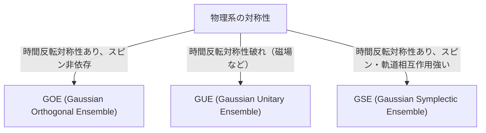

# はじめに：ランダム行列理論の驚くべき普遍性

世界は複雑で予測不可能に見えますが、数学のレンズを通すと、全く異なる分野に驚くべき共通点が見つかることがあります。「ランダム行列理論（Random Matrix Theory, RMT）」は、まさにそのような普遍性を持つ数学的枠組みの一つです。

ランダム行列とは、要素が確率変数で与えられる行列のことです。一見すると単なる数字のランダムな配列に過ぎませんが、行列のサイズを無限大に近づけると、その[固有値](/p/eigenvalues-and-eigenvectors/)の分布には驚くほど美しく、そして普遍的な法則が現れます。この法則は、ミクロな原子核の世界から、素数分布の謎、金融市場の価格変動、そして最先端の深層学習モデルの学習動学に至るまで、全く異なるシステムの背後に潜んでいるのです。

本記事では、ランダム行列理論の歴史的な背景から始まり、その数学的な基礎であるGOE/GUE/GSEといったアンサンブルの分類、ウィグナーの半円則の数式証明、さらにはリーマンゼータ関数との予期せぬ繋がりを解説します。そして後半では、金融工学におけるポートフォリオ最適化や、AI・深層学習における重みの初期化問題といった現代的な応用について、Pythonのコードを用いた実践的な可視化を交えながら深く掘り下げていきます。

---

# 1. 物理学からの誕生：ウィグナーと重原子核の謎

ランダム行列理論のルーツは、1950年代の原子核物理学に遡ります。当時の物理学者たちは、ウランのような重い原子核のエネルギー準位（量子力学的な状態がとり得るエネルギーの値）を理解しようと悪戦苦闘していました。

## ウラン原子核のエネルギー準位

軽い原子核であれば、陽子と中性子の相互作用をシュレーディンガー方程式に従って計算することで、エネルギー準位を正確に予測できます。しかし、ウラン（質量数238など）のように多数の核子が複雑に相互作用する重い原子核では、自由度が大きすぎて厳密な計算は事実上不可能です。

実験的に観測された中性子散乱のデータを見ると、共鳴のエネルギー準位は無秩序に並んでいるように見えました。しかし、エネルギー準位の「間隔（spacing）」の統計分布を調べると、そこに明確なパターンがあることが判明しました。隣り合うエネルギー準位は、決して近づきすぎない「準位反発（level repulsion）」という性質を持っていたのです。

## ウィグナーの直感と半円則の発見

1955年、ユージン・ウィグナー（Eugene Wigner）は、この複雑な量子系のハミルトニアン（エネルギーを表す行列）を、詳細な物理的構造を持つ特定の行列として扱うのではなく、「要素がランダムな値をとる巨大な対称行列」としてモデル化するという大胆なアイデアを提案しました。

驚くべきことに、この極めて単純化されたランダム行列の[固有値](/p/eigenvalues-and-eigenvectors/)の間隔分布は、実際のウラン原子核のエネルギー準位の間隔分布と見事に一致しました。ウィグナーはさらに、行列のサイズ $N$ が無限大に向かう極限において、[固有値](/p/eigenvalues-and-eigenvectors/)の全体的な密度分布が半円の形になることを発見しました。これが有名な「ウィグナーの半円則（Wigner's semicircle law）」です。

---

# 2. アンサンブルの分類：GOE、GUE、GSE

ウィグナーの研究を受けて、フリーマン・ダイソン（Freeman Dyson）はランダム行列の理論を体系化し、物理系の持つ対称性に基づいてランダム行列を3つの普遍的なクラス（アンサンブル）に分類しました。これらは「ダイソンの3重道（Dyson's threefold way）」と呼ばれています。



## ガウシアン直交アンサンブル (GOE)

GOEは、要素が実数で構成される実対称行列の集合です。各非対角要素は平均0、分散1の正規分布から独立に選ばれ、対角要素は平均0、分散2の正規分布から選ばれます。GOEは、外部磁場がなく、時間反転対称性が保たれている量子系（例えば、スピンを持たない粒子の系）のハミルトニアンをモデル化するために使用されます。

## ガウシアンユニタリアンサンブル (GUE)

GUEは、要素が複素数で構成されるエルミート行列の集合です。非対角要素の実部と虚部がそれぞれ独立な正規分布に従います。外部磁場が存在するなどして時間反転対称性が破れている物理系に適用されます。後述するリーマンゼータ関数の零点分布と深い関わりを持つのは、このGUEです。

## ガウシアンシンプレクティックアンサンブル (GSE)

GSEは、要素が四元数（クォータニオン）で構成される自己双対エルミート行列の集合です。時間反転対称性は保たれているものの、スピンが半整数の粒子からなり、スピン軌道相互作用が強い系を記述します。

---

# 3. 数学的深淵：ウィグナーの半円則の証明

ランダム行列理論の最も基本的な結果であるウィグナーの半円則を、モーメント法（Method of Moments）を用いて証明する過程を概観します。

要素 $X_{ij}$ が互いに独立で、平均0、分散1の確率変数である $N \times N$ の実対称行列 $X$ を考えます。スケーリングされた行列 $W = \frac{1}{\sqrt{N}}X$ の[固有値](/p/eigenvalues-and-eigenvectors/)分布の極限（$N \to \infty$）を求めます。

## モーメント法によるアプローチ

[固有値](/p/eigenvalues-and-eigenvectors/)の経験分布関数を解析するために、分布の $k$ 次モーメント $m_k$ を計算します。行列のトレース（対角成分の和）は[固有値](/p/eigenvalues-and-eigenvectors/)の和に等しいため、
$$ m_k = \lim_{N \to \infty} \frac{1}{N} \mathbb{E}[\text{Tr}(W^k)] $$
を評価します。

トレースを展開すると、
$$ \text{Tr}(W^k) = \frac{1}{N^{k/2}} \sum_{i_1, i_2, \dots, i_k} X_{i_1 i_2} X_{i_2 i_3} \cdots X_{i_k i_1} $$
となります。期待値をとる際、要素 $X_{ij}$ は平均0かつ独立であるため、展開された項の中で同じ要素が1回しか現れないものは期待値が0になります。ゼロにならない寄与を持つためには、パス $i_1 \to i_2 \to \dots \to i_k \to i_1$ 上の各エッジが少なくとも2回ずつ通られなければなりません。

極限 $N \to \infty$ において主要な寄与となるのは、ちょうど $k$ 歩のパスで、新しい頂点を探索しつつ、通ったエッジを正確に1回ずつ戻る「木（tree）」構造をなすパスです。これが可能なのは $k$ が偶数の場合（$k = 2m$）のみであり、奇数次モーメントは極限で0になります。

## カタラン数と半円則の結びつき

長さ $2m$ のこのような経路（ディックパス）の総数は、組合せ数学で有名な「[カタラン数](/p/catalan-numbers/)（Catalan numbers）」$C_m$ で与えられます。
$$ C_m = \frac{1}{m+1} \binom{2m}{m} $$

したがって、極限分布のモーメントは、
$$ m_{2m} = C_m, \quad m_{2m+1} = 0 $$
となります。このモーメントを持つ確率分布は、区間 $[-2, 2]$ にサポートを持つ半円分布（ウィグナーの半円則）であることが知られています。その確率密度関数は以下の通りです。
$$ \rho(x) = \begin{cases} \frac{1}{2\pi} \sqrt{4 - x^2} & (-2 \le x \le 2) \\ 0 & (\text{otherwise}) \end{cases} $$

---

# 4. リーマンゼータ関数との予期せぬ邂逅

物理学の問題を解くために生まれたランダム行列理論は、1970年代に純粋数学、特に数論の分野において、世紀の大発見をもたらすことになります。

## モンゴメリー・オドリツコ予想

1972年、数論学者のヒュー・モンゴメリー（Hugh Montgomery）は、リーマンゼータ関数の非自明な零点の間隔分布について研究していました。リーマン予想によれば、これらの零点はすべて複素平面上の「臨界線（実部が1/2の直線）」上に存在します。モンゴメリーは、零点の対の相関関数を計算し、それが $1 - \left(\frac{\sin(\pi x)}{\pi x}\right)^2$ になることを導き出しました。

ある日、プリンストン高等研究所のティータイムで、モンゴメリーはこの結果を物理学者のフリーマン・ダイソンに話しました。ダイソンは驚愕しました。なぜなら、その数式は、ダイソン自身が導き出していたGUE（ガウシアンユニタリアンサンブル）の[固有値](/p/eigenvalues-and-eigenvectors/)の間隔分布と全く同じだったからです。

## 素数と量子カオスの交差点

その後、数学者のアンドリュー・オドリツコ（Andrew Odlyzko）がスーパーコンピュータを用いてゼータ関数の零点を数百万個計算し、その間隔分布がGUEの予測と驚くべき精度で一致することを実証しました。

この発見は「モンゴメリー・オドリツコ予想」と呼ばれ、素数の分布（ゼータ関数の零点は素数分布と密接に関連しています）と量子カオス系（GUE）の間に、深い普遍的な繋がりがあることを示唆しています。宇宙のミクロな法則を記述する数学と、素数という数の構成要素を支配する数学が、ランダム行列という接点を通じて交わった瞬間でした。

---

# 5. 金融工学への応用：ポートフォリオ最適化の進化

ランダム行列理論は、物理学や純粋数学にとどまらず、金融市場の分析にも強力なツールとして応用されています。特に、資産運用の最適化において重要な役割を果たしています。

## マルコヴィッツ・モデルの限界

現代ポートフォリオ理論の基礎であるハリー・マルコヴィッツ（Harry Markowitz）の平均・分散モデルでは、資産の共分散行列の逆行列を用いて最適な投資比率を決定します。しかし、実務では大きな問題がありました。

$N$ 個の資産の過去 $T$ 期間の収益率データから標本共分散行列を推定する際、$N$ が大きく $T$ が十分でない（$N/T$ が0に近いとは言えない）場合、標本共分散行列には大量の統計的ノイズが含まれます。このノイズを含んだ行列の逆行列を計算すると、誤差が増幅され、非現実的で極端なポートフォリオ（一部の資産に極端なショートやロングを指示する）が生成されてしまうのです。

## ランダム行列によるノイズクリーニング

ここでランダム行列理論が登場します。1999年、BouchaudらとLalouxらは独立に、金融市場の共分散行列にランダム行列理論を適用しました。彼らは、完全にランダムな時系列データから得られる共分散行列の[固有値](/p/eigenvalues-and-eigenvectors/)分布（マルチェンコ・パストゥール分布、Marchenko-Pastur distribution）と、実際の市場データの共分散行列の[固有値](/p/eigenvalues-and-eigenvectors/)分布を比較しました。

その結果、市場データの[固有値](/p/eigenvalues-and-eigenvectors/)の大部分（90%以上）は、ランダム行列理論が予測する理論的な境界内に収まっていることがわかりました。つまり、これらは単なる「ノイズ」です。一方で、境界を大きく超える少数の大きな[固有値](/p/eigenvalues-and-eigenvectors/)だけが、市場の真の相関構造（マーケットファクターやセクターファクター）を反映した意味のある情報を持っていることが示されました。

この知見に基づき、ノイズに対応する[固有値](/p/eigenvalues-and-eigenvectors/)をフィルタリング（ゼロにする、または平均値で置き換えるなど）して共分散行列を「クリーニング」する手法が開発されました。これにより、ポートフォリオのパフォーマンスと安定性が劇的に向上し、現在では多くのクオンツ・ファンドで標準的な技術として用いられています。

---

# 6. 人工知能への応用：深層学習における重みと学習動学

近年、ランダム行列理論はAI・機械学習、特に深層学習（Deep Learning）の理論的解析においても脚光を浴びています。

## ニューラルネットワークの初期化問題

巨大なニューラルネットワークを学習させる際、ネットワークの重み行列の初期値をどのように設定するかは、学習の成否を分ける極めて重要な問題です。初期化が不適切だと、勾配消失（Gradient Vanishing）や勾配爆発（Gradient Exploding）が発生し、学習が進みません。

重み行列をランダムな値で初期化するとき、それはまさにランダム行列です。ランダム行列理論を用いることで、層を通過するごとの信号の分散の推移や、逆伝播における勾配の振る舞いを厳密に解析できます。例えば、非線形活性化関数がランダム行列のスペクトル（[固有値](/p/eigenvalues-and-eigenvectors/)分布）に与える影響を分析することで、Xavier初期化やHe初期化といった現代の標準的な初期化手法の理論的な正当性が裏付けられています。

## ヘッシアン（Hessian）の固有値分布

学習プロセスのダイナミクスを理解する上で、損失関数の曲率を表すヘッシアン行列の解析が不可欠です。数千万から数千億のパラメータを持つ[LLM](/p/large-language-models-llm-transformer-prompt-engineering/)（[大規模言語モデル](/p/large-language-models-llm-transformer-prompt-engineering/)）のヘッシアンは巨大な行列であり、その性質を直接調べることは困難ですが、ランダム行列理論を用いることでその[固有値](/p/eigenvalues-and-eigenvectors/)分布を近似・予測できます。

研究によると、ディープニューラルネットワークのヘッシアンの[固有値](/p/eigenvalues-and-eigenvectors/)分布は、バルク（大量のゼロ付近の[固有値](/p/eigenvalues-and-eigenvectors/)）と、少数の大きな外れ値（アウトライヤー）から構成されることがわかっています。バルク部分は、ノイズを含んだランダム行列（例えば、情報の少ない方向）としてモデル化でき、アウトライヤーはタスクに直結する重要な学習方向を示します。このスペクトル構造の理解は、最適化アルゴリズム（SGD、Adamなど）の収束性を改善したり、学習率のスケジュールを最適化する上で極めて有益な知見を提供しています。

---

# 7. 実践：Pythonによる固有値分布の可視化

最後に、Pythonを用いて実際にGOE（ガウシアン直交アンサンブル）を生成し、ウィグナーの半円則が成り立つことを数値的に確認してみましょう。

```python
import numpy as np
import matplotlib.pyplot as plt
from scipy.stats import semicircular

# パラメータ設定
N = 1000  # 行列のサイズ
num_matrices = 50  # アンサンブルのサンプル数

eigenvalues = []

# GOE行列の生成と固有値の計算
for _ in range(num_matrices):
    # 要素がN(0, 1)に従うN x N行列を生成
    X = np.random.randn(N, N)
    # 対称化してGOE行列を作成 (分散のスケーリングに注意)
    A = (X + X.T) / np.sqrt(2)
    # 分散を 1/N にスケーリング
    W = A / np.sqrt(N)
    
    # 固有値を計算（実対称行列なのでeighを使用）
    eigvals = np.linalg.eigh(W)[0]
    eigenvalues.extend(eigvals)

# プロットの設定
plt.figure(figsize=(10, 6))

# 固有値のヒストグラムをプロット
plt.hist(eigenvalues, bins=100, density=True, alpha=0.6, color='skyblue', edgecolor='black', label='Empirical Eigenvalues (GOE)')

# 理論的なウィグナーの半円則をプロット
x = np.linspace(-2.2, 2.2, 1000)
# 半径 R=2 の半円則の確率密度関数
y = np.where(np.abs(x) <= 2, np.sqrt(4 - x**2) / (2 * np.pi), 0)
plt.plot(x, y, 'r-', lw=3, label="Wigner's Semicircle Law")

plt.title(f"Eigenvalue Distribution of GOE Matrices ($N={N}$)", fontsize=16)
plt.xlabel("Eigenvalue", fontsize=14)
plt.ylabel("Density", fontsize=14)
plt.legend(fontsize=12)
plt.grid(True, alpha=0.3)
plt.tight_layout()
plt.show()
```

このコードを実行すると、ランダムに生成された行列の[固有値](/p/eigenvalues-and-eigenvectors/)が、美しい半円の形に分布していることが確認できます。個々の行列の要素は完全にランダムであるにもかかわらず、全体としてこのような規則正しい法則が現れることこそが、ランダム行列理論の最大の魅力です。

---

# おわりに

本記事では、原子核物理学から始まったランダム行列理論が、純粋数学、金融工学、そして現代のAI技術にまで繋がる壮大な物語を追いました。一見無関係に見える複雑なシステムたちが、極限状態においては「ランダム行列の[固有値](/p/eigenvalues-and-eigenvectors/)」という共通の言語で語り合うことができるという事実は、自然界と数学の持つ神秘的な深さを示しています。

データが爆発的に増加し、モデルが巨大化し続ける現代において、ランダム行列理論は単なる抽象数学の対象から、データサイエンスや機械学習の実践的な問題解決のための強力な武器へと進化しています。複雑系の背後に潜む普遍的な真理を探求するこの理論は、今後も様々な分野で私たちの理解を深める光となることでしょう。
