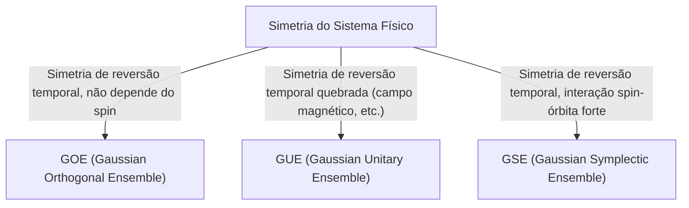

# Introdução: A Surpreendente Universalidade da Teoria das Matrizes Aleatórias

O mundo parece complexo e imprevisível, mas através da lente da matemática, podemos, por vezes, encontrar pontos em comum surpreendentes em campos completamente diferentes. A "Teoria das Matrizes Aleatórias (Random Matrix Theory, RMT)" é precisamente um desses quadros matemáticos que possuem tal universalidade.

Uma matriz aleatória é uma matriz cujos elementos são dados por variáveis aleatórias. À primeira vista, pode parecer ser apenas um arranjo aleatório de números, mas conforme o tamanho da matriz se aproxima do infinito, a distribuição de seus [autovalores](/p/eigenvalues-and-eigenvectors/) revela leis de uma beleza surpreendente e universais. Essas leis estão ocultas por trás de sistemas completamente distintos, desde o mundo microscópico dos núcleos atômicos e o mistério da distribuição dos números primos, até as flutuações de preços nos mercados financeiros e a dinâmica de aprendizagem dos modelos de aprendizado profundo (deep learning) mais avançados.

Neste artigo, começaremos pelo contexto histórico da Teoria das Matrizes Aleatórias, explicaremos a classificação dos ensembles como GOE/GUE/GSE, que formam sua base matemática, e a prova matemática da Lei do Semicírculo de Wigner, além da ligação inesperada com a função Zeta de Riemann. Na segunda metade, vamos aprofundar nas aplicações modernas, como a otimização de portfólios em engenharia financeira e problemas de inicialização de pesos em IA e deep learning, com visualizações práticas em código Python.

---

# 1. O Nascimento na Física: Wigner e o Mistério dos Núcleos Pesados

As raízes da Teoria das Matrizes Aleatórias remontam à física nuclear dos anos 1950. Naquela época, os físicos lutavam para compreender os níveis de energia (valores de energia que os estados mecânicos quânticos podem assumir) de núcleos atômicos pesados como o urânio.

## Níveis de Energia do Núcleo de Urânio

Para núcleos mais leves, os níveis de energia podem ser previstos com precisão calculando a interação de prótons e nêutrons de acordo com a equação de Schrödinger. No entanto, para núcleos pesados, como o urânio (número de massa 238), em que muitos núcleons interagem de maneira complexa, os graus de liberdade são tão grandes que cálculos rigorosos são virtualmente impossíveis.

Observando dados experimentais de espalhamento de nêutrons, os níveis de energia ressonante pareciam estar alinhados de forma caótica. Mas quando a distribuição estatística do "espaçamento (spacing)" dos níveis de energia foi investigada, descobriu-se um padrão claro. Níveis de energia adjacentes exibiam uma propriedade chamada "repulsão de nível (level repulsion)", significando que nunca ficavam muito próximos uns dos outros.

## A Intuição de Wigner e a Descoberta da Lei do Semicírculo

Em 1955, Eugene Wigner propôs a ideia ousada de modelar o Hamiltoniano (a matriz que representa a energia) deste sistema quântico complexo não como uma matriz específica com estruturas físicas detalhadas, mas como uma "matriz simétrica gigante cujos elementos assumem valores aleatórios".

Surpreendentemente, a distribuição do espaçamento dos [autovalores](/p/eigenvalues-and-eigenvectors/) desta matriz aleatória extremamente simplificada combinou perfeitamente com a distribuição do espaçamento dos níveis de energia do próprio núcleo de urânio. Wigner descobriu ainda que no limite, quando o tamanho da matriz $N$ vai para o infinito, a distribuição de densidade global dos [autovalores](/p/eigenvalues-and-eigenvectors/) forma um semicírculo. Esta é a famosa "Lei do Semicírculo de Wigner (Wigner's semicircle law)".

---

# 2. Classificação de Ensembles: GOE, GUE, GSE

Seguindo o trabalho de Wigner, Freeman Dyson sistematizou a teoria de matrizes aleatórias e classificou-as em 3 classes universais (ensembles) baseadas nas simetrias dos sistemas físicos. Estas são conhecidas como "O Caminho Triplo de Dyson (Dyson's threefold way)".



## Ensemble Ortogonal Gaussiano (GOE)

GOE é um conjunto de matrizes reais simétricas compostas por números reais. Cada elemento não diagonal é retirado independentemente de uma distribuição normal com média 0 e variância 1, e os elementos da diagonal de uma distribuição normal com média 0 e variância 2. O GOE é usado para modelar o Hamiltoniano de sistemas quânticos onde não há campo magnético externo e a simetria de reversão temporal é preservada (por exemplo, sistemas de partículas sem spin).

## Ensemble Unitário Gaussiano (GUE)

GUE é um conjunto de matrizes Hermitianas cujos elementos são números complexos. As partes real e imaginária dos elementos não diagonais seguem distribuições normais independentes. Aplica-se a sistemas físicos onde a simetria de reversão temporal está quebrada, como na presença de campos magnéticos externos. É este GUE que tem uma profunda conexão com a distribuição dos zeros da Função Zeta de Riemann discutida mais tarde.

## Ensemble Simplético Gaussiano (GSE)

GSE é um conjunto de matrizes Hermitianas auto-duais cujos elementos são quatérnions. Ele descreve sistemas com interações spin-órbita fortes, compostos de partículas com spin semi-inteiro, mas onde a simetria de reversão temporal é preservada.

---

# 3. Abismo Matemático: Prova da Lei do Semicírculo de Wigner

Esboçaremos o processo de provar a Lei do Semicírculo de Wigner, o resultado mais básico da Teoria das Matrizes Aleatórias, utilizando o Método dos Momentos (Method of Moments).

Considere uma matriz simétrica real $X$ de $N \times N$, onde cada elemento $X_{ij}$ é uma variável aleatória independente com média 0 e variância 1. Queremos encontrar o limite da distribuição dos [autovalores](/p/eigenvalues-and-eigenvectors/) da matriz redimensionada $W = \frac{1}{\sqrt{N}}X$ quando $N \to \infty$.

## A Abordagem Pelo Método dos Momentos

Para analisar a função de distribuição empírica dos [autovalores](/p/eigenvalues-and-eigenvectors/), calculamos o $k$-ésimo momento da distribuição, $m_k$. Como o traço (soma dos componentes diagonais) de uma matriz é igual à soma dos [autovalores](/p/eigenvalues-and-eigenvectors/),
$$ m_k = \lim_{N \to \infty} \frac{1}{N} \mathbb{E}[\text{Tr}(W^k)] $$
é avaliado.

Ao expandir o traço:
$$ \text{Tr}(W^k) = \frac{1}{N^{k/2}} \sum_{i_1, i_2, \dots, i_k} X_{i_1 i_2} X_{i_2 i_3} \cdots X_{i_k i_1} $$
Ao calcular o valor esperado, uma vez que os elementos $X_{ij}$ são independentes com média 0, os termos expandidos que contêm o mesmo elemento aparecendo apenas uma vez terão valor esperado 0. Para uma contribuição não nula, cada aresta no caminho $i_1 \to i_2 \to \dots \to i_k \to i_1$ deve ser percorrida pelo menos duas vezes.

No limite $N \to \infty$, a contribuição principal vem dos caminhos de exatamente $k$ passos que formam uma estrutura em "árvore (tree)", explorando novos vértices e refazendo cada aresta exatamente uma vez. Isto só é possível se $k$ for par ($k = 2m$); logo, os momentos de ordem ímpar são 0 no limite.

## Números de Catalan e A Lei do Semicírculo

O número total de tais caminhos (Caminhos de Dyck) de comprimento $2m$ é dado pelos famosos "[Números de Catalan](/p/catalan-numbers/)" $C_m$ da matemática combinatória.
$$ C_m = \frac{1}{m+1} \binom{2m}{m} $$

Portanto, os momentos da distribuição limite são:
$$ m_{2m} = C_m, \quad m_{2m+1} = 0 $$
Sabe-se que a distribuição de probabilidade com estes momentos é a distribuição do semicírculo com suporte no intervalo $[-2, 2]$ (a Lei do Semicírculo de Wigner). Sua função de densidade de probabilidade é dada por:
$$ \rho(x) = \begin{cases} \frac{1}{2\pi} \sqrt{4 - x^2} & (-2 \le x \le 2) \\ 0 & (\text{caso contrário}) \end{cases} $$

---

# 4. Encontro Inesperado com a Função Zeta de Riemann

A Teoria das Matrizes Aleatórias, criada para resolver problemas de física, levaria a uma das maiores descobertas do século na matemática pura, especificamente na teoria dos números, na década de 1970.

## A Conjectura de Montgomery-Odlyzko

Em 1972, o teórico dos números Hugh Montgomery estava pesquisando a distribuição dos espaçamentos entre os zeros não triviais da Função Zeta de Riemann. De acordo com a Hipótese de Riemann, todos esses zeros residem na "linha crítica (a reta no plano complexo onde a parte real é 1/2)". Montgomery calculou a função de correlação de pares de zeros e deduziu que ela era dada por $1 - \left(\frac{\sin(\pi x)}{\pi x}\right)^2$.

Um dia, no chá da tarde do Instituto de Estudos Avançados de Princeton, Montgomery discutiu este resultado com o físico Freeman Dyson. Dyson ficou atônito. Aquela fórmula matemática era idêntica à distribuição dos espaçamentos dos [autovalores](/p/eigenvalues-and-eigenvectors/) do GUE (Gaussian Unitary Ensemble) que o próprio Dyson havia derivado.

## Interseção de Números Primos e Caos Quântico

Mais tarde, o matemático Andrew Odlyzko usou supercomputadores para calcular milhões de zeros da função zeta e demonstrou que a distribuição de seus espaçamentos combinava perfeitamente com a previsão do GUE, com uma precisão espantosa.

Essa descoberta é chamada de "Conjectura de Montgomery-Odlyzko" e sugere que existe uma ligação profunda e universal entre a distribuição dos números primos (já que os zeros da função zeta estão intimamente relacionados a eles) e sistemas de caos quântico (GUE). Foi o momento em que a matemática que descreve as leis microscópicas do universo e a matemática que governa os blocos de construção dos números se cruzaram através das matrizes aleatórias.

---

# 5. Aplicações na Engenharia Financeira: Evolução na Otimização de Portfólios

A teoria das matrizes aleatórias também provou ser uma ferramenta poderosa muito além da física e da matemática pura, aplicando-se na análise de mercados financeiros. Em particular, ela tem um papel muito importante na otimização da alocação de ativos.

## Limitações do Modelo de Markowitz

No modelo de média-variância de Harry Markowitz, a fundação da moderna teoria de portfólios, as razões ideais de investimento são determinadas usando o inverso da matriz de covariância dos ativos. No entanto, havia grandes problemas na prática.

Ao estimar a matriz de covariância de amostras a partir de dados de retornos para $N$ ativos em um passado de período $T$, se $N$ for grande e $T$ não for suficientemente amplo (ou seja, se $N/T$ não for próximo de 0), a matriz de covariância conterá uma enorme quantidade de ruído estatístico. Ao calcular a inversa de uma matriz que inclui esse ruído, os erros são amplificados, gerando portfólios extremos e irreais (recomendando investimentos maciços de posições compradas ou vendidas em certos ativos).

## Limpeza de Ruído com Matrizes Aleatórias

Aqui é onde a Teoria das Matrizes Aleatórias entra em ação. Em 1999, Bouchaud e colegas e Laloux e colegas aplicaram independentemente a teoria das matrizes aleatórias em matrizes de covariância de mercados financeiros. Eles compararam a distribuição dos [autovalores](/p/eigenvalues-and-eigenvectors/) derivada de séries temporais completamente aleatórias (a distribuição de Marchenko-Pastur) com a distribuição de [autovalores](/p/eigenvalues-and-eigenvectors/) da matriz de covariância dos dados reais do mercado.

O resultado mostrou que a vasta maioria dos [autovalores](/p/eigenvalues-and-eigenvectors/) do mercado (mais de 90%) caía dentro das fronteiras teóricas previstas pela Teoria das Matrizes Aleatórias. Isso significa que eles são puramente "ruído". Por outro lado, revelou-se que apenas alguns poucos grandes [autovalores](/p/eigenvalues-and-eigenvectors/) muito além dos limites possuíam informações significativas que refletiam a verdadeira estrutura de correlações do mercado (fatores de mercado e setores).

Com base nessa descoberta, foram desenvolvidos métodos para "limpar" a matriz de covariância filtrando (zerando ou substituindo por média) os [autovalores](/p/eigenvalues-and-eigenvectors/) que correspondiam a ruído. Essa inovação aprimorou o desempenho e a estabilidade dos portfólios de forma dramática, sendo agora uma técnica padrão usada por muitos fundos quantitativos.

---

# 6. Aplicações na Inteligência Artificial: Pesos e Dinâmicas de Aprendizagem em Deep Learning

Recentemente, a Teoria das Matrizes Aleatórias também ganhou muito destaque em análises teóricas no campo de Inteligência Artificial e Aprendizado de Máquina, especialmente no Aprendizado Profundo (Deep Learning).

## Problemas na Inicialização de Redes Neurais

Ao treinar redes neurais gigantes, configurar os valores iniciais da matriz de pesos é uma decisão vital que determina o sucesso do aprendizado. Inicializações inadequadas levam a gradientes que desaparecem (Gradient Vanishing) ou explodem (Gradient Exploding), paralisando o progresso da rede.

Ao inicializar as matrizes de pesos com valores aleatórios, obtemos essencialmente matrizes aleatórias. Usando RMT, pesquisadores podem analisar rigorosamente como a variância do sinal muda ao longo das camadas ou o comportamento dos gradientes durante a retropropagação (backpropagation). Por exemplo, ao analisar o impacto das funções de ativação não lineares no espectro da matriz aleatória (distribuição de [autovalores](/p/eigenvalues-and-eigenvectors/)), fornece-se validação teórica rigorosa para práticas modernas convencionais como a inicialização de Xavier e de He.

## A Distribuição de Autovalores do Hessiano

Compreender a curvatura da função de perda (representada pela matriz Hessiana) é essencial na pesquisa sobre a dinâmica dos processos de aprendizagem. Para grandes modelos, como [LLM](/p/large-language-models-llm-transformer-prompt-engineering/)s com dezenas de milhões a bilhões de parâmetros, calcular o Hessiano diretamente é quase impossível. No entanto, sua distribuição de [autovalores](/p/eigenvalues-and-eigenvectors/) pode ser aproximada e prevista usando a RMT.

Estudos constataram que a distribuição de [autovalores](/p/eigenvalues-and-eigenvectors/) do Hessiano no Deep Learning é composta por uma massa "volumosa" (inúmeros [autovalores](/p/eigenvalues-and-eigenvectors/) espalhados próximos a zero) e um número seleto de grandes valores anômalos (outliers). A parte da massa volumosa pode ser caracterizada como uma matriz aleatória cheia de ruídos indicando direções não-informacionais, enquanto os valores anômalos destacam as dimensões cruciais do aprendizado. Entender essa estrutura espectral provê grandes indícios em como aprimorar algoritmos otimizadores (como SGD, Adam) ou modelar esquemas otimizados de aprendizado.

---

# 7. Prática: Visualização da Distribuição de Autovalores em Python

Finalmente, vamos usar a linguagem Python para construir uma representação de um GOE (Ensemble Ortogonal Gaussiano) real para verificar numericamente a Lei do Semicírculo de Wigner.

```python
import numpy as np
import matplotlib.pyplot as plt
from scipy.stats import semicircular

# Configuração de parâmetros
N = 1000  # Tamanho da matriz
num_matrices = 50  # Tamanho de amostras do ensemble

eigenvalues = []

# Geração das matrizes GOE e cálculo dos autovalores
for _ in range(num_matrices):
    # Gerando matriz N x N com distribuição N(0, 1)
    X = np.random.randn(N, N)
    # Criando matriz GOE por simetrização (note o dimensionamento da variância)
    A = (X + X.T) / np.sqrt(2)
    # Variância escalada em 1/N
    W = A / np.sqrt(N)
    
    # Calculando os autovalores (usar eigh para matriz simétrica real)
    eigvals = np.linalg.eigh(W)[0]
    eigenvalues.extend(eigvals)

# Configuração do gráfico
plt.figure(figsize=(10, 6))

# Plotando histograma de autovalores
plt.hist(eigenvalues, bins=100, density=True, alpha=0.6, color='skyblue', edgecolor='black', label='Empirical Eigenvalues (GOE)')

# Curva da Lei do Semicírculo de Wigner teórica
x = np.linspace(-2.2, 2.2, 1000)
# Densidade de Probabilidade com raio R=2
y = np.where(np.abs(x) <= 2, np.sqrt(4 - x**2) / (2 * np.pi), 0)
plt.plot(x, y, 'r-', lw=3, label="Wigner's Semicircle Law")

plt.title(f"Eigenvalue Distribution of GOE Matrices ($N={N}$)", fontsize=16)
plt.xlabel("Eigenvalue", fontsize=14)
plt.ylabel("Density", fontsize=14)
plt.legend(fontsize=12)
plt.grid(True, alpha=0.3)
plt.tight_layout()
plt.show()
```

Ao executar este código, poderá confirmar que os [autovalores](/p/eigenvalues-and-eigenvectors/) gerados assumirão magicamente o formato de um semicírculo simétrico. Muito embora os elementos unitários das matrizes sejam genuinamente gerados de forma aleatória, ao olhar em grande escala o aparecimento de uma ordem elegante é certamente a maior fascinância da Teoria das Matrizes Aleatórias.

---

# Conclusão

Ao longo deste texto, traçamos a extraordinária história que parte do nascimento da Teoria das Matrizes Aleatórias nas instalações de pesquisas de físicas nucleares subatômicas, transita pela matemática pura, engrenagens do campo de investimentos financeiros, terminando como um instrumento proeminente nas tecnologias de Inteligência Artificial contemporânea. Esses processos formidáveis confirmam que, embora isolados na superfície, sistemas caóticos complexos conversam num limite idêntico pela linguagem comum de "[autovalores](/p/eigenvalues-and-eigenvectors/) aleatórios" desvendando maravilhas das lógicas inescrutáveis dos mundos matemáticos.

Com o advento contínuo dos bancos de dados gigantescos e na era da expansão maciça do Deep Learning, a Teoria das Matrizes Aleatórias migrou do nicho matemático purista passando a ser uma das ferramentas pragmáticas das ciências algorítmicas no cerne do campo de aprendizado de máquinas. Pesquisar nas tramas complexas as leis matemáticas contidas neste princípio universal vai, muito em breve, iluminar ainda mais nossa compressão das matrizes que controlam incontáveis realidades em inúmeros seguimentos de nossas vidas.
