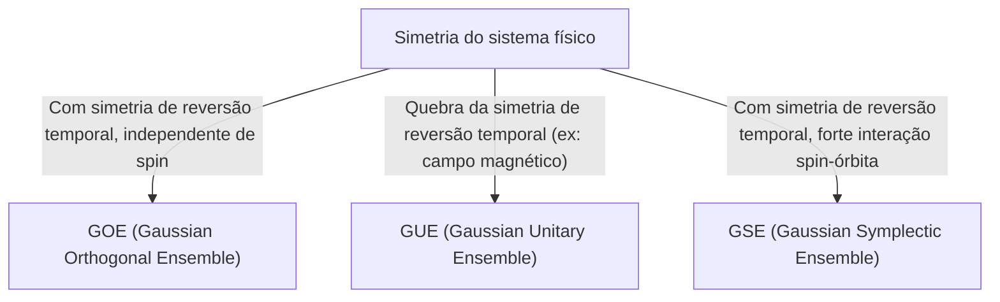

# Introdução: A Surpreendente Universalidade da Teoria das Matrizes Aleatórias

O mundo parece complexo e imprevisível, mas através das lentes da matemática, frequentemente encontramos semelhanças surpreendentes em campos completamente diferentes. A "Teoria das Matrizes Aleatórias" (Random Matrix Theory, RMT) é justamente uma dessas estruturas matemáticas com essa universalidade.

Uma matriz aleatória é uma matriz cujos elementos são dados por variáveis aleatórias. À primeira vista, pode parecer apenas um arranjo aleatório de números, mas quando o tamanho da matriz se aproxima do infinito, uma lei surpreendentemente bela e universal emerge na distribuição dos seus autovalores. Essa lei está oculta por trás de sistemas completamente diferentes, desde o mundo microscópico dos núcleos atômicos e o mistério da distribuição dos números primos, até as flutuações de preços nos mercados financeiros e a dinâmica de aprendizado nos mais avançados modelos de deep learning.

Neste artigo, começaremos pelo contexto histórico da teoria das matrizes aleatórias, explicando sua base matemática por meio da classificação de ensembles como GOE/GUE/GSE, a prova matemática da lei do semicírculo de Wigner, e até mesmo sua inesperada conexão com a função zeta de Riemann. Na segunda metade, exploraremos profundamente aplicações modernas como a otimização de portfólios em engenharia financeira e o problema da inicialização de pesos em IA e deep learning, acompanados de visualizações práticas usando código Python.

---

# 1. O Nascimento na Física: Wigner e o Mistério dos Núcleos Atômicos Pesados

As raízes da teoria das matrizes aleatórias remontam à física nuclear na década de 1950. Naquela época, os físicos lutavam para entender os níveis de energia (os valores de energia que um estado quântico pode assumir) de núcleos atômicos pesados, como o urânio.

## Níveis de Energia do Núcleo de Urânio

Para núcleos atômicos leves, os níveis de energia podem ser previstos com precisão calculando as interações entre prótons e nêutrons de acordo com a equação de Schrödinger. No entanto, em núcleos pesados como o urânio (número de massa 238, etc.), onde muitos núcleons interagem de forma complexa, há tantos graus de liberdade que um cálculo exato é virtualmente impossível.

Ao observar dados experimentais de espalhamento de nêutrons, os níveis de energia de ressonância pareciam estar arranjados de forma caótica. No entanto, ao examinar a distribuição estatística do "espaçamento" (spacing) dos níveis de energia, revelou-se um padrão claro. Níveis de energia adjacentes nunca se aproximavam demais, uma propriedade conhecida como "repulsão de níveis" (level repulsion).

## A Intuição de Wigner e a Descoberta da Lei do Semicírculo

Em 1955, Eugene Wigner propôs uma ideia audaciosa: em vez de tratar o hamiltoniano (a matriz que representa a energia) desse sistema quântico complexo como uma matriz específica com estrutura física detalhada, ele o modelou como uma "matriz simétrica gigante cujos elementos assumem valores aleatórios".

Surpreendentemente, a distribuição do espaçamento dos autovalores dessa matriz aleatória extremamente simplificada correspondia perfeitamente à distribuição do espaçamento dos níveis de energia dos núcleos de urânio reais. Wigner descobriu ainda que, no limite em que o tamanho da matriz $N$ tende ao infinito, a distribuição geral de densidade dos autovalores assume a forma de um semicírculo. Essa é a famosa "lei do semicírculo de Wigner" (Wigner's semicircle law).

---

# 2. Classificação de Ensembles: GOE, GUE, GSE

Seguindo a pesquisa de Wigner, Freeman Dyson sistematizou a teoria das matrizes aleatórias e classificou as matrizes aleatórias em três classes universais (ensembles) com base nas simetrias dos sistemas físicos. Estas são conhecidas como o "caminho triplo de Dyson" (Dyson's threefold way).



## Ensemble Ortogonal Gaussiano (GOE)

O GOE é um conjunto de matrizes simétricas reais cujos elementos são números reais. Cada elemento fora da diagonal é escolhido de forma independente de uma distribuição normal com média 0 e variância 1, e os elementos da diagonal são escolhidos de uma distribuição normal com média 0 e variância 2. O GOE é usado para modelar o hamiltoniano de sistemas quânticos onde não há campo magnético externo e a simetria de reversão temporal é preservada (por exemplo, um sistema de partículas sem spin).

## Ensemble Unitário Gaussiano (GUE)

O GUE é um conjunto de matrizes hermitianas cujos elementos são números complexos. As partes real e imaginária dos elementos fora da diagonal seguem distribuições normais independentes. Aplica-se a sistemas físicos onde a simetria de reversão temporal é quebrada devido à presença de um campo magnético externo. É este GUE que tem uma profunda conexão com a distribuição dos zeros da função zeta de Riemann, a qual discutiremos mais adiante.

## Ensemble Simplético Gaussiano (GSE)

O GSE é um conjunto de matrizes hermitianas autodual cujos elementos são quatérnios (quaternions). Ele descreve sistemas onde a simetria de reversão temporal é preservada, mas consiste de partículas com spin semi-inteiro e forte interação spin-órbita.

---

# 3. O Abismo Matemático: Prova da Lei do Semicírculo de Wigner

Aqui, daremos uma visão geral do processo de prova da lei do semicírculo de Wigner, que é o resultado mais fundamental da teoria das matrizes aleatórias, utilizando o Método dos Momentos (Method of Moments).

Considere uma matriz simétrica real $X$ de tamanho $N \times N$, cujos elementos $X_{ij}$ são variáveis aleatórias mutuamente independentes com média 0 e variância 1. Procuramos o limite da distribuição dos autovalores ($N \to \infty$) da matriz escalada $W = \frac{1}{\sqrt{N}}X$.

## Abordagem pelo Método dos Momentos

Para analisar a função de distribuição empírica dos autovalores, calculamos o momento de ordem $k$, $m_k$, da distribuição. Como o traço da matriz (a soma dos elementos da diagonal) é igual à soma dos autovalores, avaliamos:
$$ m_k = \lim_{N \to \infty} \frac{1}{N} \mathbb{E}[\text{Tr}(W^k)] $$

Expandindo o traço, obtemos:
$$ \text{Tr}(W^k) = \frac{1}{N^{k/2}} \sum_{i_1, i_2, \dots, i_k} X_{i_1 i_2} X_{i_2 i_3} \cdots X_{i_k i_1} $$
Ao calcular o valor esperado, já que os elementos $X_{ij}$ têm média 0 e são independentes, os termos expandidos nos quais o mesmo elemento aparece apenas uma vez terão valor esperado 0. Para ter uma contribuição não nula, cada aresta no caminho $i_1 \to i_2 \to \dots \to i_k \to i_1$ deve ser percorrida pelo menos duas vezes.

No limite $N \to \infty$, a contribuição principal vem dos caminhos de exatamente $k$ passos que formam uma estrutura de "árvore" (tree), onde se exploram novos vértices e se retorna retrocedendo exatamente uma vez sobre as arestas percorridas. Isso só é possível se $k$ for par ($k = 2m$), e os momentos de ordem ímpar se tornam 0 no limite.

## A Conexão entre os Números de Catalan e a Lei do Semicírculo

O número total de tais caminhos de comprimento $2m$ (caminhos de Dyck) é dado pelos famosos "[Números de Catalan](/pt/p/catalan-numbers/)" (Catalan numbers), $C_m$, da análise combinatória.
$$ C_m = \frac{1}{m+1} \binom{2m}{m} $$

Portanto, os momentos da distribuição limite são:
$$ m_{2m} = C_m, \quad m_{2m+1} = 0 $$
Sabe-se que a distribuição de probabilidade com esses momentos é a distribuição do semicírculo com suporte no intervalo $[-2, 2]$ (a lei do semicírculo de Wigner). Sua função de densidade de probabilidade é dada por:
$$ \rho(x) = \begin{cases} \frac{1}{2\pi} \sqrt{4 - x^2} & (-2 \le x \le 2) \\ 0 & (\text{caso contrário}) \end{cases} $$

---

# 4. Um Encontro Inesperado com a Função Zeta de Riemann

A teoria das matrizes aleatórias, nascida para resolver problemas da física, traria grandes descobertas no campo da matemática pura, particularmente na teoria dos números, na década de 1970.

## A Conjectura de Montgomery-Odlyzko

Em 1972, o teórico dos números Hugh Montgomery estudava a distribuição dos espaçamentos entre os zeros não triviais da função zeta de Riemann. De acordo com a Hipótese de Riemann, todos esses zeros residem na "linha crítica" (a reta com parte real igual a 1/2) no plano complexo. Montgomery calculou a função de correlação de pares dos zeros e derivou que ela era $1 - \left(\frac{\sin(\pi x)}{\pi x}\right)^2$.

Um dia, na hora do chá do Instituto de Estudos Avançados de Princeton, Montgomery mencionou esse resultado ao físico Freeman Dyson. Dyson ficou pasmo. A razão é que essa fórmula matemática era exatamente a mesma distribuição dos espaçamentos dos autovalores do GUE (Ensemble Unitário Gaussiano) que o próprio Dyson havia derivado.

## O Cruzamento entre Números Primos e Caos Quântico

Mais tarde, o matemático Andrew Odlyzko usou um supercomputador para calcular milhões de zeros da função zeta e demonstrou que a distribuição de seus espaçamentos correspondia às previsões do GUE com incrível precisão.

Essa descoberta, chamada de "Conjectura de Montgomery-Odlyzko", sugere que existe uma conexão universal profunda entre a distribuição dos números primos (os zeros da função zeta estão intimamente relacionados à distribuição dos números primos) e sistemas de caos quântico (GUE). Foi o momento em que a matemática que descreve as leis microscópicas do universo e a matemática que governa os números primos, os blocos construtores dos números, se cruzaram através do elo comum das matrizes aleatórias.

---

# 5. Aplicações em Engenharia Financeira: A Evolução da Otimização de Portfólios

A teoria das matrizes aleatórias não se limita à física e matemática pura, sendo também aplicada como uma ferramenta poderosa na análise de mercados financeiros. Em particular, ela desempenha um papel importante na otimização da gestão de ativos.

## As Limitações do Modelo de Markowitz

No modelo de média-variância de Harry Markowitz, a base da Teoria Moderna de Portfólios, a matriz inversa da matriz de covariância dos ativos é usada para determinar a proporção ótima de investimento. No entanto, na prática, isso apresentava um grande problema.

Ao estimar a matriz de covariância amostral a partir de dados de retornos passados de $N$ ativos em $T$ períodos, quando $N$ é grande e $T$ não é suficiente (não se pode dizer que $N/T$ esteja perto de 0), a matriz de covariância amostral contém uma enorme quantidade de ruído estatístico. Quando a inversa dessa matriz ruidosa é calculada, os erros são amplificados, gerando portfólios extremos e irrealistas (que instruem posições compradas ou vendidas extremas para alguns ativos).

## Limpeza de Ruído por Matrizes Aleatórias

É aqui que a teoria das matrizes aleatórias entra em cena. Em 1999, Bouchaud e colegas, e Laloux e colegas, aplicaram independentemente a teoria das matrizes aleatórias à matriz de covariância de mercados financeiros. Eles compararam a distribuição dos autovalores da matriz de covariância obtida de dados de séries temporais completamente aleatórios (distribuição de Marchenko-Pastur) com a distribuição dos autovalores da matriz de covariância dos dados reais de mercado.

Como resultado, eles descobriram que a vasta maioria (mais de 90%) dos autovalores dos dados de mercado encontrava-se dentro dos limites teóricos previstos pela teoria das matrizes aleatórias. Ou seja, estes eram mero "ruído". Por outro lado, apenas um pequeno número de grandes autovalores, que excediam significativamente os limites, mostrou conter informações significativas que refletiam a verdadeira estrutura de correlação (fatores de mercado e fatores de setor) do mercado.

Com base nesse conhecimento, foi desenvolvido um método para "limpar" a matriz de covariância filtrando (zerando ou substituindo pelo valor médio, etc.) os autovalores correspondentes ao ruído. Isso melhorou drasticamente o desempenho e a estabilidade dos portfólios, e agora é uma técnica padrão usada por muitos fundos quantitativos.

---

# 6. Aplicações em Inteligência Artificial: Pesos e Dinâmica de Aprendizado em Deep Learning

Nos últimos anos, a teoria das matrizes aleatórias também ganhou destaque na análise teórica da IA e do aprendizado de máquina, especialmente em deep learning.

## O Problema da Inicialização em Redes Neurais

Ao treinar enormes redes neurais, o modo como definimos os valores iniciais da matriz de pesos da rede é um problema crucial que pode determinar o sucesso ou fracasso do aprendizado. Se a inicialização for inadequada, pode ocorrer o desaparecimento de gradiente (Gradient Vanishing) ou a explosão de gradiente (Gradient Exploding), impedindo o progresso do aprendizado.

Quando inicializamos uma matriz de pesos com valores aleatórios, ela é precisamente uma matriz aleatória. Usando a teoria das matrizes aleatórias, é possível analisar rigorosamente a transição da variância do sinal ao passar pelas camadas e o comportamento do gradiente na retropropagação (backpropagation). Por exemplo, ao analisar o impacto das funções de ativação não lineares no espectro (distribuição de autovalores) da matriz aleatória, verificou-se a justificativa teórica para os métodos de inicialização modernos padrão, como a inicialização de Xavier e a inicialização de He.

## A Distribuição de Autovalores do Hessiano

Para entender a dinâmica do processo de aprendizado, a análise da matriz Hessiana, que representa a curvatura da função de perda, é essencial. O Hessiano de um LLM (Large Language Model) com dezenas de milhões a centenas de bilhões de parâmetros é uma matriz gigantesca e analisar suas propriedades diretamente é difícil. Mas usando a teoria das matrizes aleatórias, sua distribuição de autovalores pode ser aproximada e prevista.

Estudos mostraram que a distribuição de autovalores do Hessiano em redes neurais profundas consiste em um "bulk" (um grande número de autovalores próximos de zero) e um pequeno número de outliers grandes. A parte do "bulk" pode ser modelada como uma matriz aleatória com ruído (por exemplo, direções com pouca informação), enquanto os outliers indicam importantes direções de aprendizado diretamente ligadas à tarefa. Compreender essa estrutura espectral fornece insights inestimáveis para melhorar a convergência de algoritmos de otimização (SGD, Adam, etc.) e otimizar cronogramas de taxa de aprendizado.

---

# 7. Prática: Visualização da Distribuição de Autovalores em Python

Por fim, vamos usar Python para realmente gerar matrizes do GOE (Ensemble Ortogonal Gaussiano) e confirmar numericamente que a lei do semicírculo de Wigner é válida.

```python
import numpy as np
import matplotlib.pyplot as plt
from scipy.stats import semicircular

# Parâmetros
N = 1000  # Tamanho da matriz
num_matrices = 50  # Número de amostras no ensemble

eigenvalues = []

# Geração de matrizes GOE e cálculo dos autovalores
for _ in range(num_matrices):
    # Gera matriz N x N cujos elementos seguem N(0, 1)
    X = np.random.randn(N, N)
    # Simetriza para criar a matriz GOE (cuidado com o escalonamento da variância)
    A = (X + X.T) / np.sqrt(2)
    # Escala a variância para 1/N
    W = A / np.sqrt(N)
    
    # Calcula os autovalores (usa eigh pois é uma matriz simétrica real)
    eigvals = np.linalg.eigh(W)[0]
    eigenvalues.extend(eigvals)

# Configurações do plot
plt.figure(figsize=(10, 6))

# Plota o histograma dos autovalores
plt.hist(eigenvalues, bins=100, density=True, alpha=0.6, color='skyblue', edgecolor='black', label='Autovalores Empíricos (GOE)')

# Plota a teórica lei do semicírculo de Wigner
x = np.linspace(-2.2, 2.2, 1000)
# Função de densidade de probabilidade para a lei do semicírculo com raio R=2
y = np.where(np.abs(x) <= 2, np.sqrt(4 - x**2) / (2 * np.pi), 0)
plt.plot(x, y, 'r-', lw=3, label="Lei do Semicírculo de Wigner")

plt.title(f"Distribuição de Autovalores de Matrizes GOE ($N={N}$)", fontsize=16)
plt.xlabel("Autovalor", fontsize=14)
plt.ylabel("Densidade", fontsize=14)
plt.legend(fontsize=12)
plt.grid(True, alpha=0.3)
plt.tight_layout()
plt.show()
```

Ao executar este código, você poderá confirmar que os autovalores das matrizes geradas aleatoriamente estão distribuídos em uma bela forma de semicírculo. Apesar dos elementos individuais de cada matriz serem completamente aleatórios, o fato de que uma lei tão regular emerge de forma global é o maior charme da teoria das matrizes aleatórias.

---

# Conclusão

Neste artigo, traçamos a grandiosa história da teoria das matrizes aleatórias, que começou na física nuclear e se estende até a matemática pura, a engenharia financeira e a tecnologia moderna de IA. O fato de que sistemas complexos, que parecem não ter relação à primeira vista, possam conversar através da linguagem comum dos "autovalores de matrizes aleatórias" sob condições extremas demonstra a profunda e misteriosa conexão entre a natureza e a matemática.

Em nossa era moderna, onde os dados continuam a crescer de forma explosiva e os modelos se tornam gigantescos, a teoria das matrizes aleatórias evoluiu de um mero objeto da matemática abstrata para uma arma poderosa para a resolução prática de problemas em ciência de dados e aprendizado de máquina. Esta teoria, que explora verdades universais ocultas por trás de sistemas complexos, sem dúvida continuará sendo um farol que aprofundará a nossa compreensão em diversas áreas no futuro.
